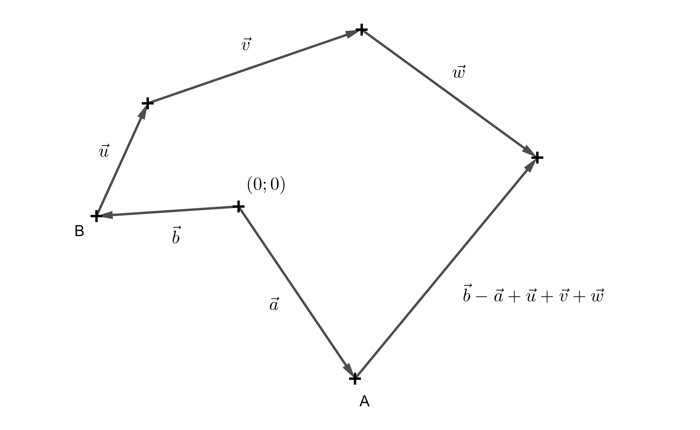
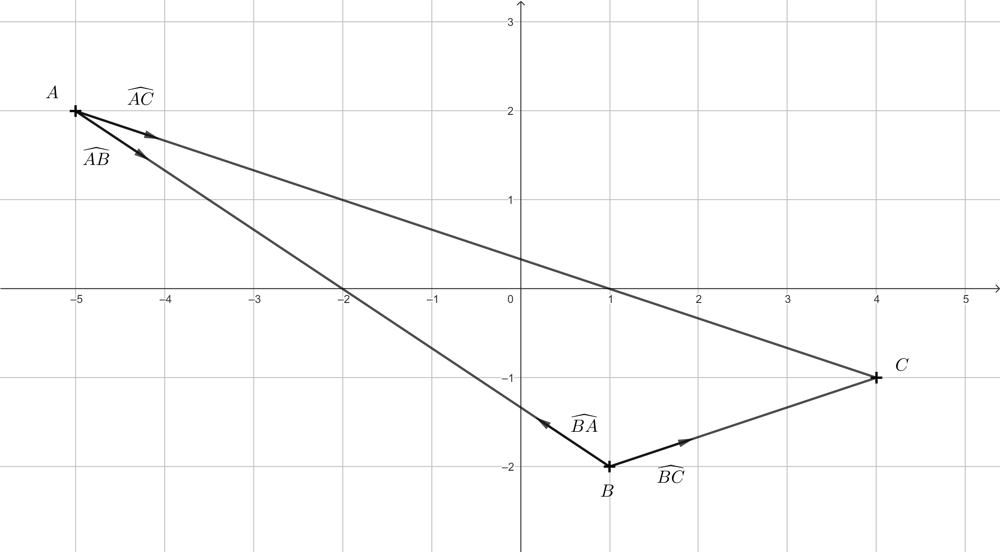
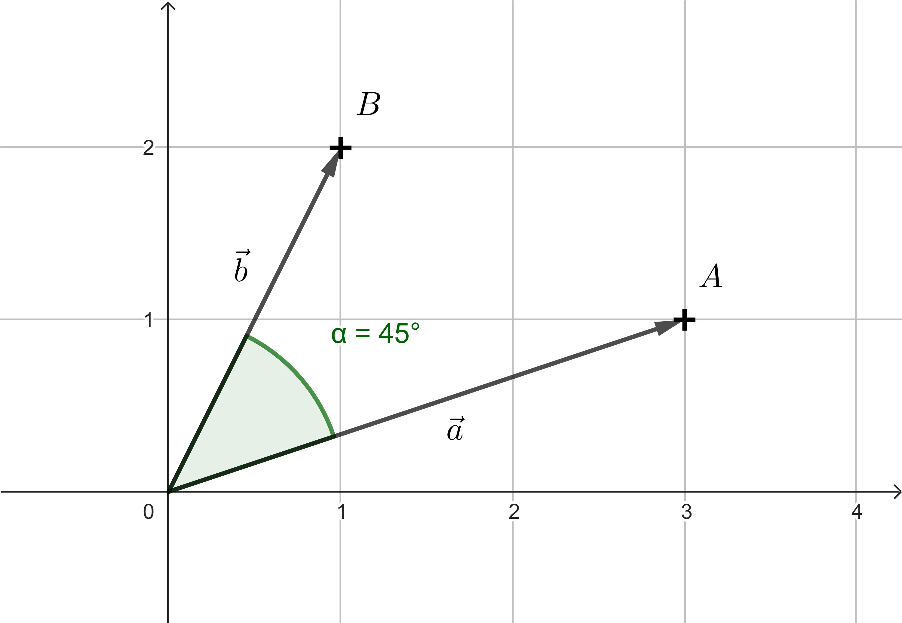
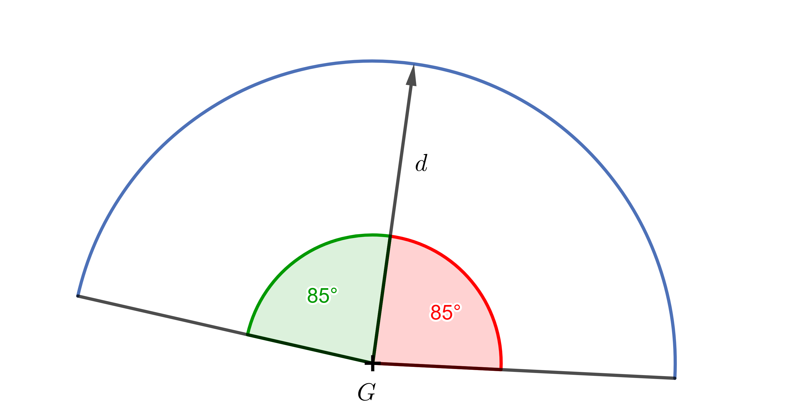

---
keywords:
- vektory
- skalárny súčin
is_finished: True
---

# Vektory

Vektory predstavujú dôležitý pojem nielen v matematike, ale aj vo fyzike či informatike.
V matematike sa nimi zaoberá lineárna algebra.

Normálne možno vektor definovať ako prvok vektorového priestoru, čo je abstraktná algebraická štruktúra so zavedenými operáciami sčítania vektorov a násobenia vektora skalárom. Typickým príkladom takéhoto priestoru je množina všetkých usporiadaných $n$-tíc reálnych čísel, teda napríklad dvojíc alebo trojíc, s príslušnými operáciami.

Na strednej škole sa však vektor často predstavuje názorne ako množina všetkých orientovaných úsečiek s rovnakou veľkosťou (dĺžkou) a rovnakým smerom.

Vo fyzike majú vektory zásadný význam pri popise veľkosti a smeru rôznych veličín, napríklad rýchlosti, zrýchlenia, síl pôsobiacich na teleso alebo elektromagnetických polí.

V informatike sa pod pojmom vektor spravidla rozumie usporiadaný zoznam prvkov (nielen čísel), pričom tento dátový typ sa používa ako efektívny spôsob ukladania a spracovávania údajov, napríklad v aplikáciách strojového učenia.

Existuje však odvetvie informatiky, kde sa vektory uplatňujú v rovnakom význame, ako ho poznáme zo stredoškolskej matematiky alebo fyziky – je ním prostredie počítačových hier.

Schopnosť pracovať s vektormi patrí k najzákladnejším predpokladom programátora hier.

V závislosti od toho, či ide o 2D alebo 3D hru, majú vektory dve alebo tri súradnice. Uplatňujú sa pri reprezentácii geometrických vlastností objektov v hernom svete.

Zjednodušene sa preto obmedzíme na dvojrozmerný priestor, teda rovinu, a budeme pracovať v kartézskej súradnicovej sústave.

*Poznámka:* Takých základných stavebných kameňov je potrebných samozrejme oveľa viac. Okrem príslušného programovacieho nástroja je potrebné poznať aj matice transformácií, ako je posunutie, otočenie a podobne.

V nasledujúcich cvičeniach sa však sústredíme výhradne na operácie s vektormi.

## Body a smerové vektory

V nasledujúcich príkladoch budeme rozlišovať zadanie bodov (v hranatých zátvorkách) a vektorov (v okrúhlych zátvorkách).
Súčasne však budeme mať na pamäti, že bod $A = [a_1;a_2]$ môžeme interpretovať aj ako koncový bod vektora $\overrightarrow{a} = (a_1;a_2)$, ktorý má za počiatočný bod počiatok súradnicovej sústavy.

Bod je teda určený svojimi súradnicami, avšak na rozdiel od vektora ho neurčuje veľkosť (dĺžka) a smer. Bod $[0,0]$ alebo vektor $(0, 0)$ budeme chápať ako stred herného sveta. 

Častým prípadom využitia vektorov je výpočet takého vektora, ktorý vyjadruje vzťah jedného objektu voči druhému.
Uvažujme body $A = [a_1;a_2]$ a $B = [b_1;b_2]$. 
Vektor $\overrightarrow{u}=\overrightarrow{AB}= (b_1-a_1; b_2-a_2)$ obvykle nazývame smerový vektor.  
Ak budú body $A$ a $B$ v hre reprezentovať postavy, tak vektor $\overrightarrow{AB}$ určuje smer a jeho veľkosť potom vzdialenosť, ktorú postava $A$ musí prejsť, aby sa dostala k postave $B$.

> **Úloha 1.** V dvojrozmernej hre máme programátora, ktorý ovláda postavu $A$ a hráča, ktorý ovláda postavu $B$.
Na začiatku sa obe postavy nachádzajú na rôznych miestach, pričom sú pre jednoduchosť reprezentované bodmi $A$ a $B$.
> Postava $B$ sa následne pohybuje po dráhe určenou postupným posunutím v smeroch vektorov $\overrightarrow{u}$, $\overrightarrow{v}$ a $\overrightarrow{w}$. 
> Úlohou je vyjadriť vektor, ktorý musí programátor určiť na to, aby postava $A$ mohla zasiahnuť postavu $B$.

\iffalse

*Riešenie.* Je zrejmé, že postava $B$ prešla celkovú trasu $\overrightarrow{u}+\overrightarrow{v}+\overrightarrow{w}$. 
Postavy $A$ a $B$ sa však na začiatku nachádzali na rôznych miestach. Preto je potrebné určiť vektor s počiatočným bodom v bode $A$ a koncovým bodom v bode $B$, teda smerový vektor $\overrightarrow{AB}$.
Vieme, že bod $A$ môžeme chápať ako koncový bod vektora $\vec{a}$ a bod $B$ ako koncový bod vektora $\vec{b}$.
Potom platí: $\overrightarrow{AB} = \overrightarrow{b}-\overrightarrow{a}$ (Keďže bod a vektor majú rovnaké súradnice, často sa používa aj zápis $\overrightarrow{AB} = B-A$). 
Hľadaný vektor, ktorý určuje výstrel postavy $A$ na postavu $B$, je teda: $\overrightarrow{b}-\overrightarrow{a}+\overrightarrow{u}+\overrightarrow{v}+\overrightarrow{w}$.

 

\fi

Pri každej postave v hernom svete sa využíva aj vektor vo význame usporiadaného zoznamu položiek.
Jednou z položiek môže byť napríklad meno postavy, jej úloha či poloha.
Ďalšou vlastnosťou každej postavy v hernom svete je smer, ktorým je natočená.
Na určenie tohto smeru sa používa takzvaný normalizovaný smerový vektor,
teda smerový vektor s dĺžkou $1$. 

Normalizované smerové vektory sa zároveň využívajú na uchovávanie informácie o tom,
akým smerom sa nachádzajú ostatné postavy alebo objekty.
*Poznámka*: Dôvod, prečo sa v hernom svete používajú práve normalizované verzie smerových vektorov, si vysvetlíme neskôr.

> **Úloha 2.** Majme postavy $A = [-5;2]$, $B = [1;-2]$, $C = [4;-1]$.
> Určite normalizované smerové vektory postáv $A$ a $B$ smerom k ostatným postavám.
> Nakreslite zodpovedajúci obrázok.

\iffalse

*Riešenie.* Pre smerový vektor $\overrightarrow{AB}$ platí $\overrightarrow{AB}= (1-(-5); -2-2) = (6;-4)$. 
Ak ho chceme normalizovať, stačí ho vydeliť jeho dĺžkou 
$\left | \overrightarrow{AB} \right | = \sqrt{6^2+(-2)^2} = \sqrt{52}.$
Normalizovaný vektor k vektoru $\overrightarrow{AB}$ označíme $\widehat{AB}$ a platí

$$
\widehat{AB} = \frac{\overrightarrow{AB}}{\left | \overrightarrow{AB} \right | } = \frac{(6;-4)}{\sqrt{52}} = \left(\frac{3}{\sqrt{13}};-\frac{2}{\sqrt{13}}\right).
$$

Podobne:

$$
\widehat{AC} = \frac{\overrightarrow{AC}}{\left | \overrightarrow{AC} \right | } = \frac{(9;-3)}{\sqrt{90}} = \left(\frac{3}{\sqrt{10}};-\frac{1}{\sqrt{10}}\right), 
$$

$$\widehat{BC} = \frac{\overrightarrow{BC}}{\left | \overrightarrow{BC} \right | } = \frac{(3;1)}{\sqrt{10}} = \left(\frac{3}{\sqrt{10}};\frac{1}{\sqrt{10}}\right),$$

$$\widehat{BA} = \frac{\overrightarrow{BA}}{\left | \overrightarrow{BA} \right | } = \frac{(-6;4)}{\sqrt{52}} = \left(-\frac{3}{\sqrt{13}};\frac{2}{\sqrt{13}}\right).$$

Vektor $\widehat{BA}$ sme nemuseli počítať, keďže má rovnakú veľkosť ako $\widehat{AB}$ ale opačný smer. Súradnice takýchto vektorov sa teda líšia iba znamienkom.

 

\fi

> **Úloha 3.** Majme polohu postavy $A = [a_1;a_2]$ a postavy $B = [b_1;b_2]$ ktoré sa nachádzajú na rôznych miestach. Určte:
> a) normalizovaný smerový vektor $\widehat{BA}$, 
> b) kde sa bude postava $A$ nachádzať potom, čo prejde tri jednotkové dĺžky smerom k postave $A$?

\iffalse

*Riešenie.* a) To, čo sme počítali v predchádzajúcom príklade s konkrétnymi súradnicami, teraz zapíšeme všeobecne. Teda
$$\widehat{BA} = \frac{\overrightarrow{BA}}{\left| \overrightarrow{BA} \right| } = 
\frac{(a_1-b_1;a_2-b_2)}{\sqrt{(a_1-b_1)^2+(a_2-b_2)^2}}.$$

b) Z predchádzajúceho máme vypočítaný smerový vektor jednotkovej dĺžky. Teraz stačí vynásobiť ho tromi a pripočítať k polohe postavy $B$. Dostaneme

$$B+3\cdot\widehat{BA} = [b_1;b_2] +3\frac{(a_1-b_1;a_2-b_2)}{\sqrt{(a_1-b_1)^2+(a_2-b_2)^2}}.$$

\fi

## Skalárny súčin a jeho použitie 

Výsledkom skalárneho súčinu dvoch vektorov je skalár, teda reálne číslo.
V programovaní hier má dôležité miesto skalárny súčin normalizovaných vektorov.

> **Úloha 4.** Určte skalárne súčiny normalizovaných smerových vektorov z riešenia Úlohy 2.

\iffalse

*Riešenie.* 

$$
\widehat{AB} \cdot \widehat{AC} = \left(\frac{3}{\sqrt{13}};-\frac{2}{\sqrt{13}}\right) \cdot \left(\frac{3}{\sqrt{10}};-\frac{1}{\sqrt{10}}\right) = 
\frac{9}{\sqrt{130}}+\frac{2}{\sqrt{130}} = \frac{11}{\sqrt{130}}
\dot=0{,}96
$$

$$
\widehat{BA} \cdot \widehat{BC} = \left(-\frac{3}{\sqrt{13}};\frac{2}{\sqrt{13}}\right) \cdot \left(\frac{3}{\sqrt{10}};\frac{1}{\sqrt{10}}\right) = 
-\frac{9}{\sqrt{130}}+\frac{2}{\sqrt{130}} = -\frac{7}{\sqrt{130}}
\dot= -0{,}054
$$

Skalárny súčin dvoch normalizovaných vektorov je veľmi užitočný,
pretože určuje, do akej miery dva vektory smerujú rovnakým alebo podobným smerom!
Hodnota skalárneho súčinu v tomto prípade môže nadobúdať hodnoty v intervale $-1$ až $1$, 
pričom $1$ znamená, že oba vektory smerujú presne rovnakým smerom, 
a $-1$, že smerujú opačným smerom a hodnota blízka $0$ vyjadruje, že zvierajú uhol blízky pravému uhlu.
Dôvodom tohto intervalu $-1$ až $1$ je, že ide o funkčné hodnoty funkcie kosínus.
Pre skalárny súčin dvoch vektorov $\vec{p}$, $\vec{q}$, totiž platí vzťah

$$
\vec{p} \cdot \vec{q}=\left | \vec{p} \right |\left | \vec{q} \right |\cos\alpha,  
$$

kde $\alpha$ je uhol, ktorý vektory $\vec{p}$ a $\vec{q}$ zvierajú.  

\fi

> **Úloha 5.** Pozorovateľ v počiatku súradnicovej sústavy sa pozerá na objekt $A=[3;1]$,
> Určte uhol $\alpha$ o ktorý sa musí otočiť,
aby smer jeho pohľadu mieril priamo na objekt $B=[1;2]$.

\iffalse

*Riešenie.* Body $A$ a $B$ budeme opäť brať ako koncové body vektorov $a=(3;1)$ a $b=(1;2)$.
Zo vzťahu, ktorý platí pre skalárny súčin dvoch vektorov, vyjadríme $\cos\alpha$:

$$ \cos\alpha =\frac{\vec{a} \cdot \vec{b}}{\left | \vec{a} \right |\left | \vec{b} \right |}\,. $$

Po dosadení dostávame: 

$$ \cos\alpha = \frac{(3;1) \cdot (1;2)}{\sqrt{3^2+1^2} \cdot \sqrt{1^2+2^2}} = \frac{3 \cdot 1 + 1 \cdot 2}{\sqrt{10} \cdot \sqrt{5}} = \frac{5}{\sqrt{50}} =\sqrt{\frac{25}{50}} = \frac{1}{\sqrt{2}}.$$

Vieme, že $\frac{1}{\sqrt{2}}=\frac{\sqrt{2}}{2}$ je základná hodnota goniometrickej funkcie, teda $\alpha=45^{\circ}$, resp. hodnotu uhla $\alpha$ môžeme vypočítať aj ako  $\arccos \frac{1}{\sqrt{2}}$. Pozorovateľ sa teda musí otočiť o uhol $45^{\circ}$.

 

\fi

Ak by boli v zadaní úlohy uvedené normalizované smerové vektory,
ich skalárny súčin by sa rovnal priamo $\cos\alpha$.

$$ \cos\alpha =\frac{\vec{a}}{\left | \vec{a} \right |} \cdot \frac{\vec{b}}{\left | \vec{b} \right |} = \hat{a} \cdot \hat{b}$$

Toto je dôvod, prečo sa smery pohľadov postáv a smerové vektory medzi postavami zapisujú v zoznamoch položiek v normalizovanom tvare.
Skalárny súčin môžeme s výhodou použiť aj na riešenie nasledujúceho problému.
Predstavme si, že vytvárame hru, v ktorej sa hráč snaží skryť pred strážami.
Bude nás teda zaujímať, či strážnik vidí alebo nevidí jednotlivých hráčov.
Pre väčšiu realistickosť chceme, aby mal strážnik zorné pole, v ktorom danú postavu vidí.
U človeka sa udáva veľkosť zorného uhla pre videnie oboma očami približne $180^{\circ}$. 
To by bolo pre nášho strážnika priveľa, takže povedzme, že chceme, aby jeho zorný uhol bol napríklad $170^{\circ}$. 

> **Úloha 6.** Zorný uhol strážnika $G$ je $170^{\circ}$, Aké hodnoty budú nadobúdať skalárne súčiny medzi jeho smerom pohľadu $\vec{d}$ a normalizovanými smerovými vektormi k objektom, ktoré strážnik vidí?

\iffalse

*Riešenie.* Od smeru pohľadu strážnika k hraniciam zorného poľa (smerom doprava aj doľava) máme $85^{\circ}$. Stačí teda vypočítať $\cos 85^{\circ} \dot= 0,087$. Skalárne súčiny medzi smerom pohľadu strážnika a normalizovanými smerovými vektormi k objektom, ktoré vidí, budú nadobúdať hodnoty medzi $0,087$ a $1$.

 

Do zoznamu položiek prislúchajúcich strážnikovi teda k smeru pohľadu pridáme interval,
ktorý bude určovať jeho zorné pole. Pomocou neho potom môžeme kontrolovať,
či strážnik hráča vidí alebo nevidí.
Pre jednoduchosť predchádzajúci výsledok zaokrúhlime na jedno desatinné miesto
a zorné pole strážnika teda obmedzíme hodnotou $0,1$. 

\fi

> **Úloha 7.** Určte, či strážnik, umiestnený v počiatku súradnicovej sústavy, vidí hráča $A=[3;-2]$,
> ak smer pohľadu strážnika je $\left(\frac{1}{\sqrt{5}};\frac{2}{\sqrt{5}}\right)$
> a hranica pre obmedzenie zorného poľa je daná hodnotou $0,1$.

\iffalse

*Riešenie.* Smer pohľadu strážnika je už normalizovaný vektor. Stačí teda znormalizovať smerový vektor od strážnika k hráčovi $A$. Keďže strážnik je v počiatku súradnicovej sústavy, stačí normalizovať vektor $\vec{a}=(3;-2)$. Platí 

$$\hat{a}=\frac{\left(3;-2\right)}{3^2+(-2)^2} = \frac{\left(3;-2\right)}{15} = \left(\frac{3}{15};\frac{-2}{15}\right).$$  

Potom už môžeme vypočítať príslušný skalárny súčin týchto normalizovaných vektorov, teda:

$$\left(\frac{1}{\sqrt{5}};\frac{2}{\sqrt{5}}\right) \cdot \left(\frac{3}{\sqrt{15}};\frac{-2}{\sqrt{15}}\right) = \frac{3}{\sqrt{75}} - \frac{4}{\sqrt{75}} = -\frac{1}{\sqrt{75}} \dot= -0,12.$$ 

Výsledok nie je v rozmedzí od $0,1$ do $1$, strážnik teda hráča $A$ nevidí. Z výsledku je navyše jasné, že medzi vektormi je väčší ako pravý uhol.
Môžete sa zamyslieť, v čom sa situácia z predchádzajúceho príkladu zmení, ak strážnik nie je v počiatku súradnicovej sústavy.

\fi
