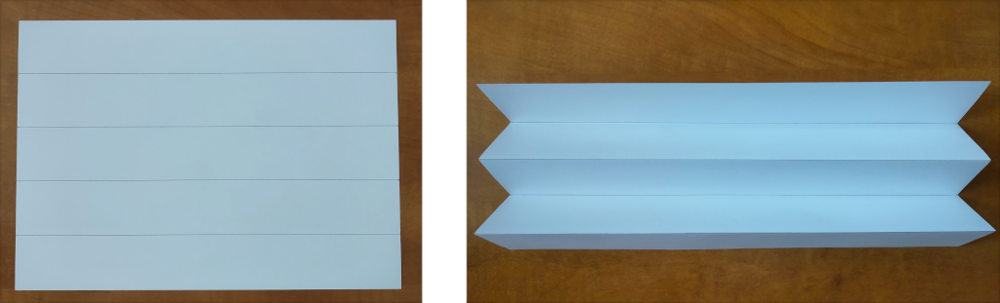
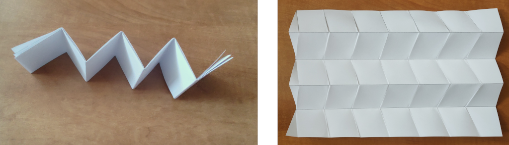
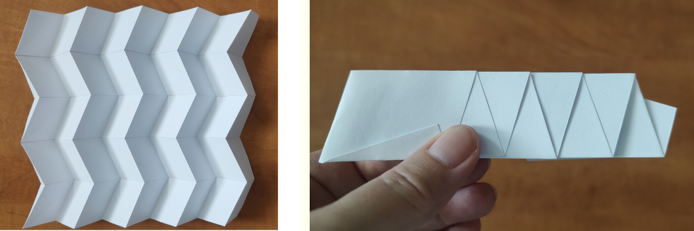
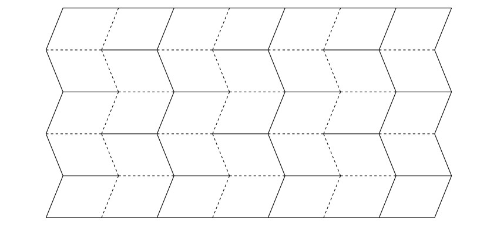
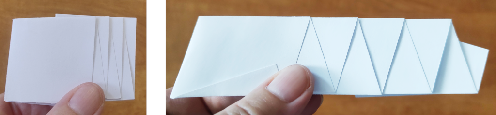
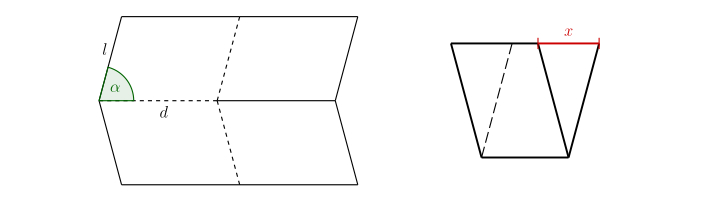

---
keywords:
- goniometrie
- origami
- skládání papíru
- Miura-ori
- Miura fold
- trigonometrické funkce
is_finished: true
difficulty: 1
time: 15
---

# Miura-ori

Miura-ori (Miura fold) je jeden z nejznámějších způsobů skládání papíru v origami. 
Když slyšíme slovo origami, představíme si asi nejdříve papírovou skládanku ve tvaru zvířete nebo lodičky. 
Tyto jednoduché tvary často slouží jako první krok do fascinujícího světa skládání papíru. 
Existují ale i gami, které zaberou několik hodin či dokonce dní pečlivé práce.

Fascinující je ale skutečnost, že princip skládání, jak ho známe z origami, se objevuje i v přírodě kolem nás i v nás samotných. 
Rozvíjející se poupě květu, jemně se rozbalující křídla hmyzu ukrytá pod pevnými krovkami, 
složitá struktura lidské DNA, nebo stěny tlustého střeva, to vše využívá principy podobné těm, které najdeme v origami. 
Schopnost materiálů a struktur „skládat se“ a „rozkládat se“ podle potřeby je jedním ze základních stavebních prvků života.

V posledních letech zažilo origami skutečný rozmach, 
a to nejen jako koníček pro milovníky papíru, ale i v mnoha uměleckých a vědních oborech. 
Ovlivnilo architekty, designéry nábytku, umělce a vědce. 
Origami se tak proměnilo z pouhého umění skládání papíru v nástroj, který pomáhá formovat budoucnost.
 
## Origami ve vědě
 
Jedna z oblastí, kde origami našlo uplatnění, je vesmírný program. 
Při přepravě rozměrných objektů ve vesmíru je třeba, 
aby se daly složit do menších rozměrů. 
Jeden z takovýchto objektů je tzv. starshade, obří štít určený k blokování světla hvězd. 
Astronomové ho potřebují k pozorování planet, které se nacházejí v blízkosti zářivých hvězd, 
protože jas těchto hvězd pozorování znemožňuje.

Výhodné je také použití origami v robotice. 
Roboti, jejichž konstrukce je založená na origami, mají potenciál být rychlejší, 
levnější a snadněji vyrobitelní než roboti vytvoření pomocí tradičních výrobních postupů. 
 
Vznikají nové druhy materiálů používající origami struktury. 
Vzory těchto origami jsou často založeny na periodickém dělení roviny. 
Na ten nejznámější vzor a způsob skládání papíru se zaměříme v následujících úlohách.

## Použití Miura-ori a technika skládání

Tuto techniku skládání vynalezl japonský astrofyzik Koryo Miura. 
Po otevření struktury se zdá, že je rovnoměrně rozdělena na řady rovnoběžníků.

U tohoto konkrétního vzoru existuje jeden jednoduchý způsob, jak jej otevřít nebo zavřít. 
Zatáhnete za jeden roh a origami se otevře s minimálním úsilím. 
Miura zamýšlel tento způsob skládání pro solární panely 
a v roce 1995 byl solární panel s touto konstrukcí rozložen na japonské družici Space Flyer Unit. 
Od té doby našla tato technika skládání mnoho dalších aplikací,
využívají ji například některé cestovní solární panely,
nebo skládací neprůstřelné štíty pro policejní složky. 
Tímto způsobem se také například v Japonsku skládají mapy, 
aby nedocházelo k obvyklému opotřebení v rozích. 

Vzor je také využíván v materiálovém inženýrství jako vnitřní část sendvičové struktury.
Pokud je vyroben z kevlarové papírenské konstrukce, vláknité desky nebo plastové fólie 
a vložen mezi dva krycí listy, vznikne lehká konstrukce, která je velmi pevná a stabilní.

Zkusme si tento vzor složit. 
Začít můžeme třeba s obvyklým formátem papíru $A4$, 
který má rozměr $210\,\text{mm}$ x $297\,\text{mm}$. 
Pro plynulé rozevírání a zavírání vzoru je vhodné rozdělit strany na lichý počet dílků. 
Začneme tím že kratší rozměry formátu $A4$ rozdělíme na 5 stejně velkých dílků, 
jeden dílek tedy bude mít délku $42\,\text{mm}$. Body ležící naproti sobě spojíme 
a papír v těchto spojnicích poskládáme do tvaru harmoniky.

Jednu z delších hran nyní rozdělíme na 7 dílků. 
Libovolným bodem dělení povedeme úsečku, která svírá jiný než pravý úhel s delší hranou.
Ostatními body dělení vedeme rovnoběžky s touto úsečkou.

V těchto vzájemně rovnoběžných úsečkách harmoniku přehneme. 
Nyní máme všechny potřebné sklady výsledného vzoru, 
některé jsou ale ohnuté jiným směrem, než potřebujeme. 

Harmoniku rozložíme a přeskládáme tak, 
aby se z jednotlivých lomených čar staly hřebeny a údolí a to střídavým způsobem.

Sklady vzoru Miura-ori se v origami naznačují tak, jak na následujícím obrázku, 
tedy hřebeny plně, údolí čárkovaně.

 

> **Úloha 1.** Na obrázku níže jsou dvě varianty,
> jak může výsledný vzor ve složeném tvaru vypadat
> (při stéjném výchozím formátu papíru a stejném počtu dílků dělení).
> Na jakých parametrech závisí výsledná délka?

\iffalse

*Řešení.* Jednoduchým porovnáním vzorů je zřejmé, 
že délka výsledného vzoru je závislá na úhlu,
pod kterým jsme vedli úsečky svírající jiný než pravý úhel s delší hranou. 
Mělo by to být zřejmé, protože to je jediné, v čem se vzory odlišují. 
Označme tento ostrý úhel $\alpha$. 
Platí, že čím ostřejší je úhel $\alpha$, tím větší je délka složeného vzoru. 
Čím blíže je tento úhel velikosti $90^\circ$, tím je složený vzor kratší.

\fi

Zatím jsme porovnávali dva různé výsledky při obdobném dělení. 
Jak přesně ale závisí délka složeného vzoru na úhlu $\alpha$ 
a na dalších parametrech?
Při dalším zkoumání této závislosti je dobré zaměřit se na základní část vzoru. 

> **Úloha 2.** Na následujícím obrázku je základní část vzoru Miura-ori v rozloženém a složeném tvaru.
> Jak přesně závisí vyznačená délka $x$ na velikosti úhlu $\alpha$ a na délkách $d$, $l$?

\iffalse

*Řešení.* Je důležité označit parametry v obrázku na vhodných místech.  

 

Pro $\cos\alpha$ pak máme

$$ \cos\alpha = \frac{\frac{x}{2}}{d} = \frac{x}{2d},$$

odkud jednoduše vyjádříme 

$$ x = 2d \cdot \cos\alpha.$$

Délka $x$ tedy vůbec není závislá na $l$, ale pouze na úhlu $\alpha$ a délce $d$.

\fi

## Literatura a odkazy

* https://www.youtube.com/watch?v=uFyJykl1O0k
* https://www.youtube.com/watch?v=ZVYz7g-qLjs
* https://laughingsquid.com/millidelta-small-origami-inspired-robot/
* https://www.jpl.nasa.gov/news/solar-power-origami-style
* https://en.wikipedia.org/wiki/File:NASA_Starshade_animation.webm
