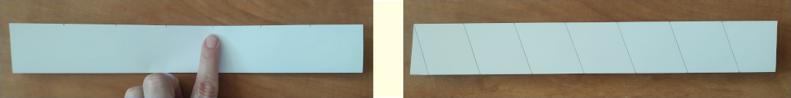
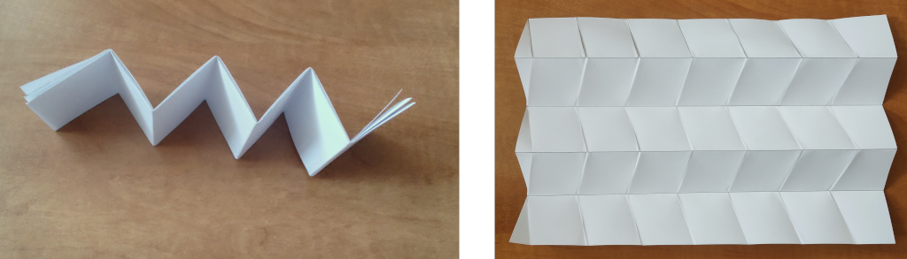
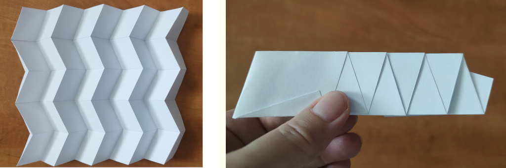

# Miura-Ori

Miura-ori (Miura fold) is one of the most famous ways of folding paper in origami.
When we hear the word origami, we probably first imagine a paper model in the shape of an animal or a boat.
These simple shapes often serve as the first step into the fascinating world of paper folding.
But there are also origami pieces that take several hours or even days of skilful work.

What is fascinating is that the principle of folding, as we know it from origami, is also found in nature around us and within ourselves. 
A flower's bud gradually opening up, the gently unfolding wings of insects hidden beneath elytra (hardened forewings),
the complex structure of human DNA, or the walls of the large intestine, all use principles similar to those found in origami.
The ability of materials and structures to “fold” and “unfold” as needed is one of the basic building blocks of life.

In recent years, origami has experienced a real boom,
not only as a hobby for paper lovers, but also in many artistic and scientific fields.
It has influenced architects, furniture designers, artists and scientists.
Origami has thus transformed from a mere paper-folding art into a tool that helps shape the future.

## Origami in Science

One of the areas where origami has found application is the space program. 
When transporting large objects into space, they need to be foldable into smaller sizes.
One such object is the starshade — a giant shield designed to block out the light of a star.
Astronomers use it to observe planets located near bright stars, whose glare would otherwise make observation impossible.
 
Using origami in robotics is also advantageous.
Robots designed using origami have the potential to be faster, cheaper 
and easier to manufacture than robots created using traditional techniques.
 
New types of material incorporating origami structures are emerging.
The patterns of these origami structures are often based on the periodic division of a plane.
In the following exercises, we will examine the most well-known pattern and method of paper folding.

## The Usage of Miura-Ori and Its Folding Technique

This folding technique was invented by Japanese astrophysicist Koryo Miura.
When opened, the structure appears as if it is periodically divided into rows of parallelograms.

This particular pattern can be opened or closed in one simple way.
Simply pull on one corner to unfold the origami with minimal effort.
Miura designed this folding method for solar panels.
In 1995, a solar panel featuring this design was deployed on the Japanese Space Flyer Unit satellite.
Since then, this folding technique has found many other applications, 
including portable solar panels and foldable bulletproof shields for police forces.
In Japan, maps are also folded this way to avoid wear and tear on the corners.

The pattern is also used in materials engineering as the inner part of a sandwich structure. 
When made of Kevlar paper, fiberboard, or plastic film, and sandwiched between two cover sheets, 
it creates a lightweight structure that is very strong and stable.

Let's try to fold this pattern.
We can start with a standard sheet of $A4$ paper,
which has dimensions $210\,\text{mm}$ x $297\,\text{mm}$.
For smooth opening and closing of the pattern, it is advisable to divide the sides into an odd number of sections.
We start by dividing the shorter side of the $A4$ sheet into 5 equal sections, so that each section is $42\,\text{mm}$ long.
Then we connect opposite points and fold the paper along these lines in an accordion pattern.

Now divide one of the longer edges into 7 equal parts.
Through any division point, draw a line that forms a non-right angle with the longer edge.
Through the other division points, draw parallels to this line.

We fold the accordion in these mutually parallel lines.
At this point, all the necessary creases for the final pattern are in place — but 
some of them are folded in the wrong direction.

We unfold and rearrange the accordion so that the individual crease lines become alternating ridges and valleys.

The folds of the Miura-ori pattern are indicated in origami as in the following image, i.e. ridges are solid, valleys are dashed.

> **Exercise 1.** The figure below shows two versions of what the final pattern can look like when folded
> (using the same initial paper size and number of divisions).
> Which parameters influence the resulting length?

\iffalse

*Solution.* It is clear from a simple comparison of the patterns that
that the length of the resulting pattern depends on the angle
at which the lines form a non-right angle with the longer side.
This is obvious because it is the only factor that makes the patterns different.
Let us denote this acute angle by $\alpha$.
It holds that if you make the angle $\alpha$ more acute, the length of the folded pattern will increase.
The closer this angle is to $90^\circ$, the shorter the folded pattern.

\fi

So far we have compared two different results based on similar divisions.
But how exactly does the length of the folded pattern depend on the angle $\alpha$
and other parameters?
To investigate this relationship more closely, it is a good idea to focus on the fundamental part of the pattern. 

> **Exercise 2.** The following figure shows the basic part of the Miura-ori pattern in unfolded and folded form.
> How exactly does the marked length $x$ depend on the size of the angle $\alpha$ and the lengths $d$, $l$?

\iffalse

*Solution.* It is important to mark the parameters in the image in appropriate places.

 

For $\cos\alpha$ we then have

$$ \cos\alpha = \frac{\frac{x}{2}}{d} = \frac{x}{2d},$$

from which we simply express

$$ x = 2d \cdot \cos\alpha.$$

The length $x$ therefore does not depend on $l$ at all, but only on the angle $\alpha$ and the length $d$.

\fi

## Literature and references

* https://www.youtube.com/watch?v=uFyJykl1O0k
* https://www.youtube.com/watch?v=ZVYz7g-qLjs
* https://laughingsquid.com/millidelta-small-origami-inspired-robot/
* https://www.jpl.nasa.gov/news/solar-power-origami-style
* https://en.wikipedia.org/wiki/File:NASA_Starshade_animation.webm

