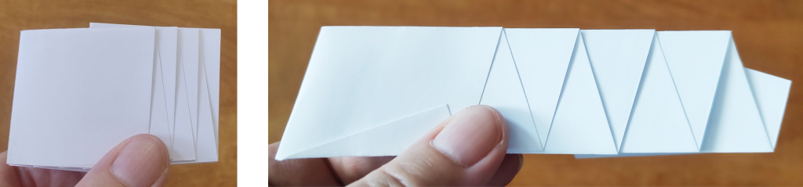
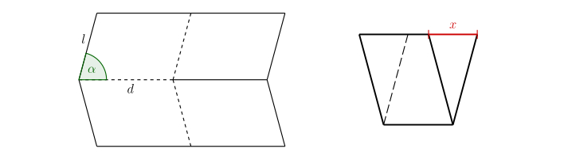

# Miura-ori (Pliegue de mapa de Miura)

Miura-ori (Pliegue de mapa de Miura) es uno de los métodos más famosos de plegado de papel en origami. 
Cuando oímos la palabra origami, probablemente lo primero que pensamos es en un rompecabezas de papel con forma de animal o de barco. 
Estas formas sencillas suelen servir como primer paso en el fascinante mundo del plegado de papel. 
Pero también hay papiroflexia que requiere horas o incluso días de cuidadoso trabajo.

Pero lo fascinante es que el principio del plegado, tal como lo conocemos por el origami, también se encuentra en la naturaleza que nos rodea y en nosotros mismos. 
El capullo desplegado de una flor, las alas suavemente desplegadas de un insecto oculto bajo densos entramados, 
la intrincada estructura del ADN humano, o las paredes del intestino grueso, todos utilizan principios similares a los del origami. 
La capacidad de los materiales y las estructuras para "plegarse" y "desplegarse" según las necesidades es uno de los componentes básicos de la vida.

En los últimos años, el origami ha experimentado un verdadero auge, 
no sólo como pasatiempo para los amantes del papel, sino también en muchos campos artísticos y científicos. 
Ha influido en arquitectos, diseñadores de muebles, artistas y científicos. 
De este modo, el origami ha pasado de ser un mero arte de doblar papel a una herramienta que ayuda a forjar el futuro.
 
## El origami en la ciencia
 
Una de las áreas donde el origami ha encontrado aplicación es en el programa espacial. 
Para transportar grandes objetos al espacio es necesario 
poder plegarlos en tamaños más pequeños. 
Uno de estos objetos es el llamado starshade, un escudo gigante diseñado para bloquear la luz de las estrellas. 
Los astrónomos lo necesitan para observar planetas que están cerca de estrellas brillantes, 
porque el brillo de estas estrellas hace imposible la observación.

El uso del origami en robótica también es ventajoso. 
Los robots cuyo diseño se basa en el origami tienen el potencial de ser más rápidos, 
más baratos y fáciles de fabricar que los robots creados con técnicas de fabricación tradicionales. 
 
Están surgiendo nuevos tipos de materiales que utilizan estructuras de origami. 
Los patrones de estos origamis suelen basarse en la división periódica del plano. 
En los siguientes problemas veremos el patrón y el método de plegado de papel más conocidos.

## Uso del Miura-ori y técnica de plegado

Esta técnica de plegado fue inventada por el astrofísico japonés Koryo Miura. 
Cuando la estructura se abre, parece estar dividida uniformemente en filas de paralelogramos.

Para este patrón en particular, hay una forma sencilla de abrirlo o cerrarlo. 
Se tira de una esquina y el origami se abre con el mínimo esfuerzo. 
Miura ideó este método de plegado para paneles solares 
y en 1995 se desplegó un panel solar con este diseño en el satélite japonés Space Flyer Unit. 
Desde entonces, esta técnica de plegado ha encontrado muchas otras aplicaciones,
utilizada por algunos paneles solares para viajes,
y el plegado de escudos antibalas para las fuerzas policiales, por ejemplo. 
En Japón, por ejemplo, los mapas también se doblan así, 
para evitar el desgaste habitual en las esquinas. 

El patrón también se utiliza en ingeniería de materiales como parte interior de una estructura de sándwich.
Si se fabrica con papel Kevlar, cartón de fibra o película de plástico 
y se intercala entre dos láminas de cubierta, se crea una estructura ligera muy resistente y estable.

Intentemos armar este patrón. 
Por ejemplo, podemos empezar con el tamaño de papel habitual $A4$, 
que es de $210\,\text{mm}$ x $297\,\text{mm}$. 
Para que el patrón se abra y cierre con suavidad, es aconsejable dividir las páginas en un número impar de piezas. 
Empezaremos dividiendo las dimensiones más cortas de $A4$ en 5 partes de igual tamaño, 
por lo que una parte tendrá $42\,\text{mm}$. de largo. Unimos los puntos opuestos 
y doblamos el papel en forma de acordeón.

Ahora divide una de las aristas más largas en 7 partes. 
A través de cualquier punto de división, trazaremos una línea que no sea perpendicular a la arista más larga.
Los otros puntos de división serán paralelos a esta línea.

Dobla el acordeón en estas líneas paralelas entre sí. 
Ahora tenemos todos los pliegues necesarios del patrón resultante, 
pero algunos están doblados en una dirección diferente a la que necesitamos. 

Extiende y coloca el acordeón de modo que, 
las líneas discontinuas se conviertan en crestas y valles de forma alterna.

Los pliegues del patrón Miura-ori se indican en origami como en la siguiente figura, 
es decir, las crestas en su totalidad, los valles en líneas discontinuas.

 

> **Tarea 1.** La siguiente imagen muestra dos variaciones de
> cómo podría ser el patrón resultante en forma plegada
> (con el mismo tamaño de papel inicial y el mismo número de piezas de subdivisión).
> ¿De qué parámetros depende la longitud resultante?

*Solución.* Por una simple comparación de los patrones, está claro 
que la longitud del patrón resultante depende del ángulo
en el que hemos dibujado los segmentos que forman un ángulo no recto con un borde más largo. 
Esto debería ser obvio, ya que es la única forma en que los patrones difieren. 
Vamos a nombrar este ángulo agudo como $\alpha$. 
Es cierto que cuanto más agudo sea el ángulo $\alpha$, mayor será la longitud del patrón plegado. 
Cuanto más se acerque este ángulo a $90^\circ$, más corto será el patrón plegado.

\iffalse

Hasta ahora, hemos comparado dos resultados diferentes con una división similar. 
Pero, ¿cómo depende exactamente la longitud del patrón plegado del ángulo $\alpha$ 
y de otros parámetros?
Para seguir investigando esta dependencia, conviene centrarse en la parte fundamental del patrón. 

\fi

> **Tarea 2.** La siguiente imagen muestra la parte básica del patrón Miura-ori en forma desplegada y plegada.
> ¿Cómo depende exactamente la longitud marcada $x$ del tamaño del ángulo $\alpha$ y de las longitudes $d$, $l$?

\iffalse

*Solución.* Es importante marcar los parámetros de la figura en los lugares adecuados.  

 

Para $\cos\alpha$ entonces tenemos

$$ \cos\alpha = \frac{\frac{x}{2}}{d} = \frac{x}{2d},$$

donde expresamos simplemente 

$$ x = 2d \cdot \cos\alpha.$$

Así, la longitud $x$ no depende en absoluto de $l$, sino sólo del ángulo $\alpha$ y de la longitud $d$.

\fi

## Bibliografía y referencias

* https://www.youtube.com/watch?v=uFyJykl1O0k
* https://www.youtube.com/watch?v=ZVYz7g-qLjs
* https://laughingsquid.com/millidelta-small-origami-inspired-robot/
* https://www.jpl.nasa.gov/news/solar-power-origami-style
* https://en.wikipedia.org/wiki/File:NASA_Starshade_animation.webm

