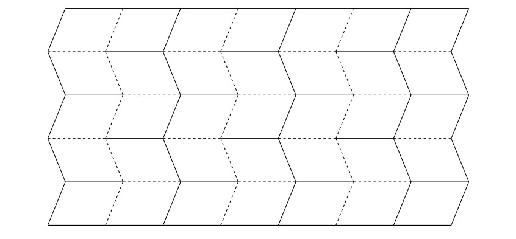

---
keywords:
- origami
- paper folding
- Miura-ori
- Miura fold
- trigonometric functions
is_finished: False
---

### Instructions for translators

1. Open this file on GitHub server. If you see `https://um.mendelu.cz/...` in
   URL, click `View on GitHub` to open this file on github.com.
1. If you see this file on GitHub server, you can edit the content of the file.
   Open the file in an editor. You can use simple editor (pres `e` on GitHub).
   However, an advanced VS Code editor (press `.` on GitHub) is better, since it
   provides preview how the Markdown code renders. Alternatively press pencil
   for simple editor or press triangle next to the pencil to get access to VS
   Code described as `github.dev`. 
1. Fix the keywords in the preamble.
1. Depending on which language version you want to use as a source for your
   translation, delete either English or Czech version below.
1. Translate to your language. Keep Markdown marking and math notation. If you
   use a tool to get first version of the translation, make sure that the markup
   is preserved. 
1. In VS Code you can open the preview in another window by pressing `Ctrl+V`
   and `K`. Keep the preview open as you work, or close using a mouse.
1. Instead of saving, you have to commit and push the changes to the repository.
   Fill the Message under `Source control` (describe your changes, such as
   "Polish translation started") and then press Commit&Push.
1. Make sure that your changes appear in the commit history. In rare cases
   (if you work with simultaneously with someone else) you have to download
   /Pull/ and merge his and yours changes. Usualy Sync (Pull & Push) should
   work.
1. When you finish the translation, change `is_finished: False` in header to `is_finished: True`.

### Instrukce pro překladatele

1. Otevřete tento soubor na serveru GitHub. Pokud máte soubor otevřen na `https://um.mendelu.cz/...`, otevřete jej na serveru github.com.
1. Pokud tento soubor vidíte na serveru GitHub, můžete obsah souboru upravit.
   Otevřete soubor v editoru. Můžete použít jednoduchý editor (stiskněte `e` na GitHubu).
   Lepší je však pokročilý editor VS Code (stikněte `.` na GitHubu), protože poskytuje náhled, jak se kód Markdown interpretuje. Případně stiskněte tužku
   pro jednoduchý editor nebo stiskněte trojúhelníček vedle tužky, abyste získali přístup k editoru VS
   Code popsaný jako `github.dev`. 
1. Opravte klíčová slova v preambuli.
1. V závislosti na tom, kterou jazykovou verzi chcete použít jako zdrojový kód pro svůj
   překladu, odstraňte níže uvedenou anglickou nebo českou verzi.
1. Přeložte do svého jazyka. Ponechte značení Markdown a matematický zápis. Pokud
   použijete nástroj typu DeepL pro získání první verze překladu, ujistěte se, že zápis matematických výrazů
   byl zachován. 
1. Ve VS Code můžete náhled otevřít v jiném okně stisknutím `Ctrl+V`.
   a `K`. Během práce nechte náhled otevřený nebo jej zavřete pomocí myši.
1. Místo uložení musíte změny zaregistrovat a odeslat do úložiště.
   Vyplňte zprávu v poli `Zpráva` (popište své změny, např.
   "Zahájen překlad do polštiny") a poté stiskněte tlačítko Commit&Push.
1. Ujistěte se, že se vaše změny objeví v historii revizí. Ve výjimečných případech
   (pokud pracujete současně s někým jiným) musíte stáhnout
   /Pull/ a sloučit jeho a vaše změny. Obvykle by synchronizace (Pull & Push) měla
   fungovat.
1. Po dokončení překladu změňte `is_finished: False` v záhlaví na `is_finished: True`.

---
---

### Czech source

# Miura-ori

Miura-ori (Miura fold) je jeden z nejznámějších způsobů skládání papíru v origami. 
Když slyšíme slovo origami, představíme si asi nejdříve papírovou skládanku ve tvaru zvířete nebo lodičky. 
Tyto jednoduché tvary často slouží jako první krok do fascinujícího světa skládání papíru. 
Existují ale i gami, které zaberou několik hodin či dokonce dní pečlivé práce.

Fascinující je ale skutečnost, že princip skládání, jak ho známe z origami, se objevuje i v přírodě kolem nás i v nás samotných. 
Rozvíjející se poupě květu, jemně se rozbalující křídla hmyzu ukrytá pod pevnými krovkami, 
složitá struktura lidské DNA, nebo stěny tlustého střeva, to vše využívá principy podobné těm, které najdeme v origami. 
Schopnost materiálů a struktur „skládat se“ a „rozkládat se“ podle potřeby je jedním ze základních stavebních prvků života.

V posledních letech zažilo origami skutečný rozmach, 
a to nejen jako koníček pro milovníky papíru, ale i v mnoha uměleckých a vědních oborech. 
Ovlivnilo architekty, designéry nábytku, umělce a vědce. 
Origami se tak proměnilo z pouhého umění skládání papíru v nástroj, který pomáhá formovat budoucnost.
 
## Origami ve vědě
 
Jedna z oblastí, kde origami našlo uplatnění, je vesmírný program. 
Při přepravě rozměrných objektů ve vesmíru je třeba, 
aby se daly složit do menších rozměrů. 
Jeden z takovýchto objektů je tzv. starshade, obří štít určený k blokování světla hvězd. 
Astronomové ho potřebují k pozorování planet, které se nacházejí v blízkosti zářivých hvězd, 
protože jas těchto hvězd pozorování znemožňuje.

Výhodné je také použití origami v robotice. 
Roboti, jejichž konstrukce je založená na origami, mají potenciál být rychlejší, 
levnější a snadněji vyrobitelní než roboti vytvoření pomocí tradičních výrobních postupů. 
 
Vznikají nové druhy materiálů používající origami struktury. 
Vzory těchto origami jsou často založeny na periodickém dělení roviny. 
Na ten nejznámější vzor a způsob skládání papíru se zaměříme v následujících úlohách.

## Použití Miura-ori a technika skládání

Tuto techniku skládání vynalezl japonský astrofyzik Koryo Miura. 
Po otevření struktury se zdá, že je rovnoměrně rozdělena na řady rovnoběžníků.

U tohoto konkrétního vzoru existuje jeden jednoduchý způsob, jak jej otevřít nebo zavřít. 
Zatáhnete za jeden roh a origami se otevře s minimálním úsilím. 
Miura zamýšlel tento způsob skládání pro solární panely 
a v roce 1995 byl solární panel s touto konstrukcí rozložen na japonské družici Space Flyer Unit. 
Od té doby našla tato technika skládání mnoho dalších aplikací,
využívají ji například některé cestovní solární panely,
nebo skládací neprůstřelné štíty pro policejní složky. 
Tímto způsobem se také například v Japonsku skládají mapy, 
aby nedocházelo k obvyklému opotřebení v rozích. 

Vzor je také využíván v materiálovém inženýrství jako vnitřní část sendvičové struktury.
Pokud je vyroben z kevlarové papírenské konstrukce, vláknité desky nebo plastové fólie 
a vložen mezi dva krycí listy, vznikne lehká konstrukce, která je velmi pevná a stabilní.

Zkusme si tento vzor složit. 
Začít můžeme třeba s obvyklým formátem papíru $A4$, 
který má rozměr $210\,\text{mm}$ x $297\,\text{mm}$. 
Pro plynulé rozevírání a zavírání vzoru je vhodné rozdělit strany na lichý počet dílků. 
Začneme tím že kratší rozměry formátu $A4$ rozdělíme na 5 stejně velkých dílků, 
jeden dílek tedy bude mít délku $42\,\text{mm}$. Body ležící naproti sobě spojíme 
a papír v těchto spojnicích poskládáme do tvaru harmoniky.

Jednu z delších hran nyní rozdělíme na 7 dílků. 
Libovolným bodem dělení povedeme úsečku, která svírá jiný než pravý úhel s delší hranou.
Ostatními body dělení vedeme rovnoběžky s touto úsečkou.

V těchto vzájemně rovnoběžných úsečkách harmoniku přehneme. 
Nyní máme všechny potřebné sklady výsledného vzoru, 
některé jsou ale ohnuté jiným směrem, než potřebujeme. 

Harmoniku rozložíme a přeskládáme tak, 
aby se z jednotlivých lomených čar staly hřebeny a údolí a to střídavým způsobem.

Sklady vzoru Miura-ori se v origami naznačují tak, jak na následujícím obrázku, 
tedy hřebeny plně, údolí čárkovaně.

 

> **Úloha 1.** Na obrázku níže jsou dvě varianty,
> jak může výsledný vzor ve složeném tvaru vypadat
> (při stéjném výchozím formátu papíru a stejném počtu dílků dělení).
> Na jakých parametrech závisí výsledná délka?

\iffalse

*Řešení.* Jednoduchým porovnáním vzorů je zřejmé, 
že délka výsledného vzoru je závislá na úhlu,
pod kterým jsme vedli úsečky svírající jiný než pravý úhel s delší hranou. 
Mělo by to být zřejmé, protože to je jediné, v čem se vzory odlišují. 
Označme tento ostrý úhel $\alpha$. 
Platí, že čím ostřejší je úhel $\alpha$, tím větší je délka složeného vzoru. 
Čím blíže je tento úhel velikosti $90^\circ$, tím je složený vzor kratší.

\fi

Zatím jsme porovnávali dva různé výsledky při obdobném dělení. 
Jak přesně ale závisí délka složeného vzoru na úhlu $\alpha$ 
a na dalších parametrech?
Při dalším zkoumání této závislosti je dobré zaměřit se na základní část vzoru. 

> **Úloha 2.** Na následujícím obrázku je základní část vzoru Miura-ori v rozloženém a složeném tvaru.
> Jak přesně závisí vyznačená délka $x$ na velikosti úhlu $\alpha$ a na délkách $d$, $l$?

\iffalse

*Řešení.* Je důležité označit parametry v obrázku na vhodných místech.  

 

Pro $\cos\alpha$ pak máme

$$ \cos\alpha = \frac{\frac{x}{2}}{d} = \frac{x}{2d},$$

odkud jednoduše vyjádříme 

$$ x = 2d \cdot \cos\alpha.$$

Délka $x$ tedy vůbec není závislá na $l$, ale pouze na úhlu $\alpha$ a délce $d$.

\fi

## Literatura a odkazy

* https://www.youtube.com/watch?v=uFyJykl1O0k
* https://www.youtube.com/watch?v=ZVYz7g-qLjs
* https://laughingsquid.com/millidelta-small-origami-inspired-robot/
* https://www.jpl.nasa.gov/news/solar-power-origami-style
* https://en.wikipedia.org/wiki/File:NASA_Starshade_animation.webm

---
---

### English source

# Miura-Ori

Miura-ori (Miura fold) is one of the most famous ways of folding paper in origami.
When we hear the word origami, we probably first imagine a paper model in the shape of an animal or a boat.
These simple shapes often serve as the first step into the fascinating world of paper folding.
But there are also origami pieces that take several hours or even days of skilful work.

What is fascinating is that the principle of folding, as we know it from origami, is also found in nature around us and within ourselves. 
A flower's bud gradually opening up, the gently unfolding wings of insects hidden beneath elytra (hardened forewings),
the complex structure of human DNA, or the walls of the large intestine, all use principles similar to those found in origami.
The ability of materials and structures to “fold” and “unfold” as needed is one of the basic building blocks of life.

In recent years, origami has experienced a real boom,
not only as a hobby for paper lovers, but also in many artistic and scientific fields.
It has influenced architects, furniture designers, artists and scientists.
Origami has thus transformed from a mere paper-folding art into a tool that helps shape the future.

## Origami in Science

One of the areas where origami has found application is the space program. 
When transporting large objects into space, they need to be foldable into smaller sizes.
One such object is the starshade — a giant shield designed to block out the light of a star.
Astronomers use it to observe planets located near bright stars, whose glare would otherwise make observation impossible.
 
Using origami in robotics is also advantageous.
Robots designed using origami have the potential to be faster, cheaper 
and easier to manufacture than robots created using traditional techniques.
 
New types of material incorporating origami structures are emerging.
The patterns of these origami structures are often based on the periodic division of a plane.
In the following exercises, we will examine the most well-known pattern and method of paper folding.

## The Usage of Miura-Ori and Its Folding Technique

This folding technique was invented by Japanese astrophysicist Koryo Miura.
When opened, the structure appears as if it is periodically divided into rows of parallelograms.

This particular pattern can be opened or closed in one simple way.
Simply pull on one corner to unfold the origami with minimal effort.
Miura designed this folding method for solar panels.
In 1995, a solar panel featuring this design was deployed on the Japanese Space Flyer Unit satellite.
Since then, this folding technique has found many other applications, 
including portable solar panels and foldable bulletproof shields for police forces.
In Japan, maps are also folded this way to avoid wear and tear on the corners.

The pattern is also used in materials engineering as the inner part of a sandwich structure. 
When made of Kevlar paper, fiberboard, or plastic film, and sandwiched between two cover sheets, 
it creates a lightweight structure that is very strong and stable.

Let's try to fold this pattern.
We can start with a standard sheet of $A4$ paper,
which has dimensions $210\,\text{mm}$ x $297\,\text{mm}$.
For smooth opening and closing of the pattern, it is advisable to divide the sides into an odd number of sections.
We start by dividing the shorter side of the $A4$ sheet into 5 equal sections, so that each section is $42\,\text{mm}$ long.
Then we connect opposite points and fold the paper along these lines in an accordion pattern.

Now divide one of the longer edges into 7 equal parts.
Through any division point, draw a line that forms a non-right angle with the longer edge.
Through the other division points, draw parallels to this line.

We fold the accordion in these mutually parallel lines.
At this point, all the necessary creases for the final pattern are in place — but 
some of them are folded in the wrong direction.

We unfold and rearrange the accordion so that the individual crease lines become alternating ridges and valleys.

The folds of the Miura-ori pattern are indicated in origami as in the following image, i.e. ridges are solid, valleys are dashed.

> **Exercise 1.** The figure below shows two versions of what the final pattern can look like when folded
> (using the same initial paper size and number of divisions).
> Which parameters influence the resulting length?

\iffalse

*Solution.* It is clear from a simple comparison of the patterns that
that the length of the resulting pattern depends on the angle
at which the lines form a non-right angle with the longer side.
This is obvious because it is the only factor that makes the patterns different.
Let us denote this acute angle by $\alpha$.
It holds that if you make the angle $\alpha$ more acute, the length of the folded pattern will increase.
The closer this angle is to $90^\circ$, the shorter the folded pattern.

\fi

So far we have compared two different results based on similar divisions.
But how exactly does the length of the folded pattern depend on the angle $\alpha$
and other parameters?
To investigate this relationship more closely, it is a good idea to focus on the fundamental part of the pattern. 

> **Exercise 2.** The following figure shows the basic part of the Miura-ori pattern in unfolded and folded form.
> How exactly does the marked length $x$ depend on the size of the angle $\alpha$ and the lengths $d$, $l$?

\iffalse

*Solution.* It is important to mark the parameters in the image in appropriate places.

 

For $\cos\alpha$ we then have

$$ \cos\alpha = \frac{\frac{x}{2}}{d} = \frac{x}{2d},$$

from which we simply express

$$ x = 2d \cdot \cos\alpha.$$

The length $x$ therefore does not depend on $l$ at all, but only on the angle $\alpha$ and the length $d$.

\fi

## Literature and references

* https://www.youtube.com/watch?v=uFyJykl1O0k
* https://www.youtube.com/watch?v=ZVYz7g-qLjs
* https://laughingsquid.com/millidelta-small-origami-inspired-robot/
* https://www.jpl.nasa.gov/news/solar-power-origami-style
* https://en.wikipedia.org/wiki/File:NASA_Starshade_animation.webm
