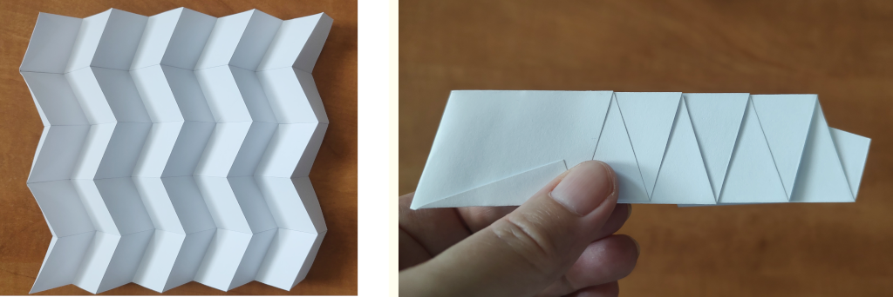
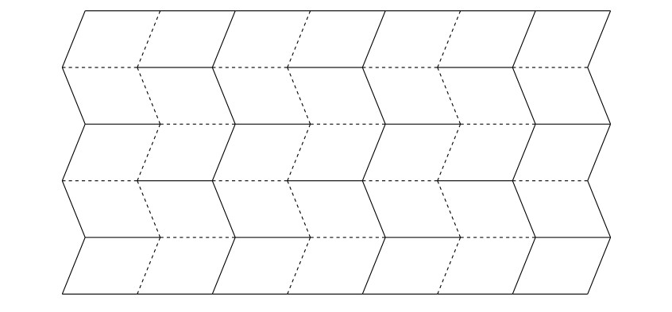

---
keywords:
- origami
- skladanie papiera
- Miura skladanie
- Miura fold
- trigonometrické funkcie
is_finished: True
---

# Miura skladanie

Miura skladanie (Miura fold) je jedným z najznámejších spôsobov skladania papiera v origami.
Keď počujeme slovo origami, predstavíme si asi najskôr papierovú skladačku v tvare zvieraťa alebo lodičky.
Tieto jednoduché tvary často slúžia ako prvý krok do fascinujúceho sveta skladania papiera.
Existujú ale aj origami, ktoré zaberú niekoľko hodín či dokonca dní starostlivej práce.
Fascinujúca je ale skutočnosť, že princíp skladania, ako ho poznáme z origami, sa objavuje aj v prírode okolo nás i v nás samotných.
Rozvíjajúci sa pupeň kvetu, jemne sa rozbaľujúce krídla hmyzu ukryté pod pevnými krytkami,
zložitá štruktúra ľudskej DNA, alebo steny hrubého čreva, to všetko využíva princípy podobné tým, ktoré nájdeme v origami.
Schopnosť materiálov a štruktúr „skladať sa" a „rozkládať sa" podľa potreby je jedným zo základných stavebných prvkov života.
V posledných rokoch zažilo origami skutočný rozmach,
a to nielen ako koníček pre milovníkov papiera, ale aj v mnohých umeleckých a vedeckých odboroch.
Ovplyvnilo architektov, dizajnérov nábytku, umelcov a vedcov.
Origami sa tak premenilo z obyčajného umenia skladania papiera na nástroj, ktorý pomáha formovať budúcnosť.
 
## Origami vo vede

Jedna z oblastí, kde origami našlo uplatnenie, je vesmírny program.
Pri preprave rozmerných objektov vo vesmíre je potrebné,
aby sa dali zložiť do menších rozmerov.
Jeden z takýchto objektov je tzv. starshade, obrovský štít určený na blokovanie svetla hviezd.
Astronómovia ho potrebujú na pozorovanie planét, ktoré sa nachádzajú v blízkosti žiarivých hviezd,
pretože jas týchto hviezd pozorovanie znemožňuje.
Výhodné je aj použitie origami v robotike.
Roboti, ktorých konštrukcia je založená na origami, majú potenciál byť rýchlejšie,
lacnejšie a ľahšie vyrobiteľné než roboti vytvorené pomocou tradičných výrobných postupov.
Vznikajú nové druhy materiálov používajúce origami štruktúry.
Vzory týchto origami sú často založené na periodickom delení roviny.
Na ten najznámejší vzor a způsob skladania papiera sa zameríme v nasledujúcich úlohách.

## Použitie Miura skladania a jeho technika

Túto techniku skladania vynašiel japonský astrofyzik Koryo Miura.
Po otvorení štruktúry sa zdá, že je rovnomerne rozdelená na rady rovnobežníkov.
U tohto konkrétneho vzoru existuje jeden jednoduchý spôsob, ako ho otvoriť alebo zavrieť.
Potiahnete za jeden roh a origami sa otvorí s minimálnym úsilím.
Miura zamýšľal tento spôsob skladania pre solárne panely
a v roku 1995 bol solárny panel s touto konštrukciou rozložený na japonskej družici Space Flyer Unit.
Od tej doby našla táto technika skladania mnoho ďalších aplikácií,
využívajú ju napríklad niektoré cestovné solárne panely,
alebo skladacie nepriestrelné štíty pre policajné zložky.
Týmto spôsobom sa tiež napríklad v Japonsku skladajú mapy,
aby nedochádzalo k obvyklému opotrebeniu v rohoch.
Vzor je tiež využívaný v materiálovom inžinierstve ako vnútorná časť sendvičovej štruktúry.
Ak je vyrobený z kevlarovej papierenskej konštrukcie, vláknitej dosky alebo plastovej fólie
a vložený medzi dva krycie listy, vznikne ľahká konštrukcia, ktorá je veľmi pevná a stabilná.

Skúsme si tento vzor zložiť.
Začať môžeme trebárs s obvyklým formátom papiera $A4$, 
ktorý má rozmer $210\,\text{mm}$ x $297\,\text{mm}$. 
Pre plynulé roztváranie a zatvaranie vzoru je vhodné rozdeliť strany na nepárny počet dielikov.
Začneme tým, že kratšie rozmery formátu $A4$ rozdelíme na 5 rovnako veľkých dielikov,
jeden dielik teda bude mať dĺžku $42\,\text{mm}$.Body ležiace oproti sebe spojíme
a papier v týchto spojniciach poskladáme do tvaru harmoniky.

Dlhšiu hranu rozdelíme na sedem rovnakých úsekov.
Z jedného z bodov tohto delenia vedieme úsečku, ktorá s dlhšou hranou zviera uhol odlišný od pravého.
Z ostatných bodov delenia následne zhotovíme priamky rovnobežné s touto úsečkou.

Harmoniku teraz prehneme pozdĺž týchto navzájom rovnobežných úsečiek.
Týmto spôsobom získame všetky potrebné sklady výsledného vzoru, hoci niektoré sú zatiaľ ohnuté opačným smerom, než požadujeme.

Harmoniku rozložíme a znovu poskladáme tak, aby sa z jednotlivých lomených čiar stali striedavo vrcholy (hrebene) a prehĺbeniny (údolia).

Vzor Miura sa v origami znázorňuje tak, že línie pre hrebene sú zakreslené plnou čiarou, zatiaľ čo línie pre údolia sú vyznačené čiarkovane.

 

> **Úloha 1.** Na obrázku nižšie vidíme dve možnosti, ako môže výsledný vzor v zloženom tvare vyzerať (pri rovnakom počiatočnom formáte papiera a rovnakom počte dielikov delenia). Na ktorých parametroch závisí výsledná dĺžka skladaného útvaru?

\iffalse

*Riešenie.* Pri jednoduchom porovnaní jednotlivých vzorov vidíme, že výsledná dĺžka závisí od uhla, pod ktorým boli vedené úsečky zvierajúce iný než pravý uhol s dlhšou hranou. Je to logické, keďže práve tento uhol predstavuje jediný rozdiel medzi oboma vzormi.
Označme tento ostrý uhol ako $\alpha$. 
Platí, že čím je uhol $\alpha$ menší (ostrejší), tým väčšia je celková dĺžka poskladaného vzoru. Naopak, čím viac sa hodnota uhla $\alpha$ blíži k $90^\circ$, tým je zložený vzor kratší.

\fi

Doteraz sme porovnávali iba dva výsledné vzory pri rovnakom type delenia. Ako však presne závisí dĺžka zloženého vzoru od uhla $\alpha$ a prípadne aj od ďalších parametrov? Pri podrobnejšom skúmaní tejto závislosti je vhodné sústrediť sa na základný prvok vzoru.

> **Úloha 2.** Na nasledujúcom obrázku je zobrazený základný prvok vzoru Miura v rozloženom aj v zloženom tvare.
> Ako presne závisí vyznačená dĺžka $x$ od veľkosti uhla $\alpha$ a od dĺžok $d$ a $l$?

\iffalse

*Riešenie.* Je dôležité označiť parametre v obrázku na vhodných miestach.

 

Pre $\cos\alpha$ potom máme

$$ \cos\alpha = \frac{\frac{x}{2}}{d} = \frac{x}{2d},$$

odkiaľ jednoducho vyjadríme

$$ x = 2d \cdot \cos\alpha.$$

Dĺžka $x$ teda vôbec nie je závislá na $l$, ale len na uhle $\alpha$ a dĺžke $d$.

\fi

## Literatúra a odkazy

* https://www.youtube.com/watch?v=uFyJykl1O0k
* https://www.youtube.com/watch?v=ZVYz7g-qLjs
* https://laughingsquid.com/millidelta-small-origami-inspired-robot/
* https://www.jpl.nasa.gov/news/solar-power-origami-style
* https://en.wikipedia.org/wiki/File:NASA_Starshade_animation.webm
