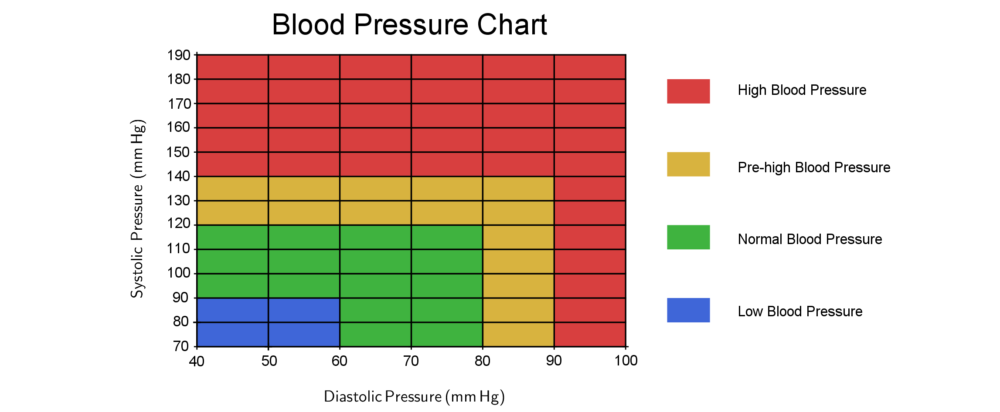

---
keywords:
- trigonometry
- trigonometric functions
- sine
- cosine
- approximation
- blood pressure
is_finished: true
---

# Blood Pressure

## Trigonometric Functions and Periodic Phenomena

The basic trigonometric functions sine and cosine are often used to model light, sound, and electromagnetic waves.
They are also used to approximate [^1] other periodic phenomena, such as tides or blood pressure.

Understanding these functions (and their individual components) allows us to effectively predict and analyze periodic phenomena and their properties.
For example, we can calculate the height of ocean waves or the timing of high tide. In the following text, we will focus on functions that approximate blood pressure.

## Basic Information About Blood Pressure

The heart works as a pump that pushes oxygenated blood through the blood vessels throughout the body to provide it with the oxygen and nutrients it needs.
Blood pressure is the pressure that blood exerts on the walls of the blood vessels it flows through.
This pressure varies in different parts of the circulatory system. Typically, when we talk about blood pressure, we mean arterial blood pressure—the pressure in the large arteries.
If your blood pressure is too high, it puts strain on your arteries (and heart), which can lead to a heart attack or stroke.

High blood pressure, also known as hypertension, is something you usually don't feel or notice. It often doesn’t produce clear signs or warnings.
The only way to know your blood pressure is to have it measured.
The first measuring devices determined blood pressure based on the height of a column of mercury, which is why the values are still given in millimeters of mercury.
Blood pressure is written as a ratio of two numbers. For example, if your reading is $120/80\,\text{mm}\,Hg$, your blood pressure is said to be $120$ over $80$.  

The higher number indicates systolic blood pressure. 
This is the maximum pressure reached when your heart contracts and pushes blood into the circulatory system.
The lower number is called the diastolic blood pressure, which is the minimum pressure reached when the heart muscle relaxes between beats.

The blood pressure chart below shows the ranges of high, low, and healthy blood pressure.  

## Approximation of the Blood Pressure Function

During heart contractions, blood pressure rises and falls in a repeating cycle.
The duration of one heartbeat corresponds to the period of the function that represents blood pressure.
Each period of the blood pressure function matches one heartbeat (it tells us how long it takes for a full heartbeat cycle to occur).
In addition, we know that the local maximum of the function represents the systolic blood pressure value, while the local minimum corresponds to the diastolic pressure.
We can approximate the blood pressure function using a sine or cosine function.
Recall that the general form of the sine function is

$$
f\left(x\right) = a\cdot\sin\left(bx + c\right) +d,
$$

where $a$ represents the amplitude, which determines how far the sine wave moves above or below its average position.
The value of $b$ affects the period of the function (the period is given by $\frac{2\pi}{|b|}$.).
The term $c$ determines the shift in the direction of the $x$-axis and $d$ the shift in the direction of the $y$-axis.  

> **Exercise 1.** Compare the following two functions $$P_1(t)=25\cdot\sin\left(\frac{7\pi}{3}t\right)+105,\quad P_2(t)=30\cdot\cos\left(2\pi t\right)+125,$$
> which approximate the blood pressure of two different individuals. These functions depend on the variable $t$, which represents time in seconds.
> For each function, find the period of the function (the duration of one heartbeat)
> and determine the heart rate (the number of heartbeats per minute).

\iffalse

*Solution.* The period $p_1$ of the function $P_1$ can be calculated as
$$
p_1=\frac{2\pi}{\frac{7\pi}{3}}=\frac{6}{7}\,\text{seconds}.
$$ 
Since the duration of one heartbeat is $\frac{6}{7}$ seconds, the heart rate $f_1$ is
$$
f_1=\frac{60}{\frac{6}{7}}=70\,\text{beats per minute}.
$$  
Similarly, for the function $P_2$ the period is
$$
p_2=\frac{2\pi}{2\pi}=1\,\text{second}.
$$ 
The heart rate is therefore $f_2=60$ beats per minute.
 
\fi

> **Exercise 2.** Draw the graphs of the functions from the first exercise. If you can, use appropriate software (for example GeoGebra) to plot the graphs.
> Using the blood pressure table, determine whether each individual has normal, high, or low blood pressure.

\iffalse

*Solution.*  
To plot the graph of the function, we let the $x$-axis represent time $t$ in seconds. 
The $y$-axis represents the blood pressure $P$ in millimeters of mercury. The units on the axes should be chosen to make the graph clear and easy to interpret.
For example, a good choice is that one unit on the $x$-axis corresponds to one hundred units on the $y$-axis. 
In the graph shown in the example, the ratio of units on the axes is $1:125$. The function 
$$
P_1=25\cdot\sin\left(\frac{7\pi}{3}t\right)+105
$$ 
oscillates around the value $105$, and its amplitude is $25$. 
So the local maximum values of the function (systolic pressure) are: $105+25=130$,
and the local minimum values (diastolic pressure) are: $105-25=80$.

The function
$$
P_2=30\cdot\cos\left(2\pi t\right)+125
$$
oscillates around the value $125$, with an amplitude of $30$.
Its local maximum values are: ​​$125+30=155$ (systolic pressure),
and its local minimum values are: ​​$125-30=95$ (diastolic pressure).

The function $P_1$ corresponds to a blood pressure of approximately $130$ over $80$. 
According to the chart in the introduction, it corresponds to the limit values ​​between normal and high blood pressure
(in some countries it is considered normal pressure, in some countries it is already the lower limit of high blood pressure).
The function $P_2$ corresponds to the pressure $155$ over $95$, which is clearly in the high blood pressure range.

\fi

Visualizing such graphs helps us understand changes in blood pressure and other periodic phenomena,
which is necessary both in mathematics and in real-world applications.

High blood pressure is a dangerous condition and a major risk factor for heart disease and stroke.
A healthy lifestyle—for example, eating plenty of fruits and vegetables, limiting sodium intake, and engaging in physical activity—can help prevent high blood pressure.
A high value from a single measurement does not necessarily mean that you have high blood pressure,
because blood pressure can be affected by many factors throughout the day, such as temperature, time of your last meal, or stress.

By plotting the functions $P_1$ and $P_2$, we can immediately see the differences between them.
But sometimes, two functions that look different at first glance may actually produce the same graph.
For instance, would you be able to tell right away that the following two functions have identical graphs?
$$
y=\sin\frac{3x}{5},\qquad y=\cos\left(\frac{3x}{5}-\frac{\pi}{2}\right)
$$
These two functions have the same graph and the period of both functions is
$$
\frac{2\pi}{\frac{3}{5}}=\frac{10\pi}{3}.
$$

But be careful: the graph of the function $y=\cos\left(\frac{3x}{5}-\frac{\pi}{2}\right)$ is not shifted by $\frac{\pi}{2}$ to the right compared to the graph of
$y=\cos\frac{3x}{5}$, even though it might seem so from the expression. Instead, it is shifted by a quarter of the function's period.
We can see this if we rewrite the formula:
$$
y=\cos\left(\frac{3x}{5}-\frac{\pi}{2}\right)=\cos\left(\frac{3}{5}\left(x-\frac{5\pi}{6}\right)\right)
$$

To compare such functions, it’s often useful to transform one function into the form of the other.
That’s exactly what we’ll explore in the next exercise.

> **Exercise 3.** Rewrite the function $P_1$ from Exercise 1.
> using a cosine function instead of a sine function.

\iffalse

*Solution.* For the basic functions $\sin x$ and $\cos x$, we have the identity:
$$
\sin x=\cos\left(x-\frac{\pi}{2}\right),
$$
where $\frac{\pi}{2}$ is a quarter of the period.
The period of the function $P_1$ is $p_1=\frac{6}{7}$, a quarter of this period is
$$
\frac{p_1}{4}=\frac{6}{28}=\frac{3}{14}.
$$
Using this, we can write:
$$
\sin\left(\frac{7\pi}{3}t\right)=\cos\left(\frac{7\pi}{3}\left(t-\frac{3}{14}\right)\right)
$$
and the function $P_1$ can be expressed as:
$$
P_1=25\cdot\cos\left(\frac{7\pi}{3}t-\frac{1}{2}\pi\right)+105.
$$

\fi

In the previous exercise, we could have also gone the other way and expressed the function $P_2$ using a sine function instead of a cosine.

> **Exercise 4.** Find a function that approximates the blood pressure of a healthy person at rest.
> Their heart rate is $50$ beats per minute. Their maximum blood pressure is $110\,\text{mm}\,\text{Hg}$ and the minimum is $70\,\text{mm}\,\text{Hg}$.

\iffalse

*Solution.* To approximate the blood pressure function, we will use a sine function (a solution using cosine would be similar).

The amplitude of the function is $\frac{110-70}{2}=20$ and the function oscillates around the midpoint value $\frac{110+70}{2}=90$.

The period of the function is
$$
p=\frac{60}{50}=\frac{6}{5},
$$
which means one heartbeat lasts $1{.}2$ seconds.
Using the formula for the period $p$:
$$
p=\frac{2\pi}{b} = 1{.}2
$$
we find: $b= \frac{5}{3}\pi$.

The value of $c$ can be chosen freely, the simplest is to choose $c = 0$.
Substituting the above values ​​into the general form of the function we get
$$
P(t) = 20\cdot\sin\left(\frac{5\pi}{3}t\right)+90.
$$

This function approximately models the blood pressure of a person with the specified values ​​as a function of time (in seconds).

\fi

## Auscultation Technique for Measuring Blood Pressure

To conclude, let us briefly explain how blood pressure is measured in real life. One of the accurate methods is the so-called auscultation technique.
This method uses a sphygmomanometer, consisting of a rubber cuff, an inflatable bladder, a manometer (mechanical pressure gauge), and a stethoscope.

The rubber cuff is placed roughly midway up the upper arm. The pressure in the cuff is increased to a value higher than the pressure in the artery, 
thereby artificially blocking the blood flow. By gradually and slowly reducing the pressure in the cuff, blood flow is restored at a certain point.

At first, the high pressure in the cuff causes the artery to become deformed, which makes the initial blood flow turbulent.
The pressure at which heartbeats first become audible through the stethoscope corresponds to the systolic blood pressure.

The sounds are audible as long as the pressure in the cuff is sufficient to deform the artery and thus maintain turbulent flow.
Once the pressure in the cuff drops so low that it is no longer sufficient to deform the artery,
the original blood flow is restored and the sounds disappear.
The pressure at which the sounds are last heard corresponds to the diastolic blood pressure.
 
### Refinement

It is worth noting that more realistic models of blood pressure functions are more complex. They require the use of sums of trigonometric functions with different periods.

The following figure shows a specific example of such a sum and the corresponding graph.
The figure also shows how blood pressure is measured. The cuff deflation rate is approximately constant.
The pressure in the cuff therefore decreases at a constant rate (approximately) and is represented in the figure by a straight line.

Refining a blood pressure function using sums of sines and cosines is related to Fourier’s theorem, 
which states that any continuous periodic function can be expressed as an infinite sum of sine and cosine functions—each with a specific amplitude and period.

This result was discovered in 1822 by the French mathematician Joseph Fourier as part of the solution to the heat conduction equation.
It is a key concept in analyzing and understanding all kinds of periodic phenomena.
Fourier’s theorem is a foundation of modern signal processing.

[^1]: Approximation means an approximate but faithful expression of a number or function, but also of a physical law or natural phenomenon.

## Literature

* https://www.vaia.com/en-us/textbooks/math/calculus-an-applied-approach-8-edition/chapter-8/problem-72-health-the-function-p100-20-cos-5-pi-t-3-approxim/
* https://www.vaia.com/en-us/textbooks/math/precalculus-9-edition/chapter-4/problem-90-the-function-p100-20-cos-frac5-pi-t3-approximates/#short-answer
* https://www.bloodpressureuk.org/your-blood-pressure/understanding-your-blood-pressure/what-do-the-numbers-mean/
 

  

 
