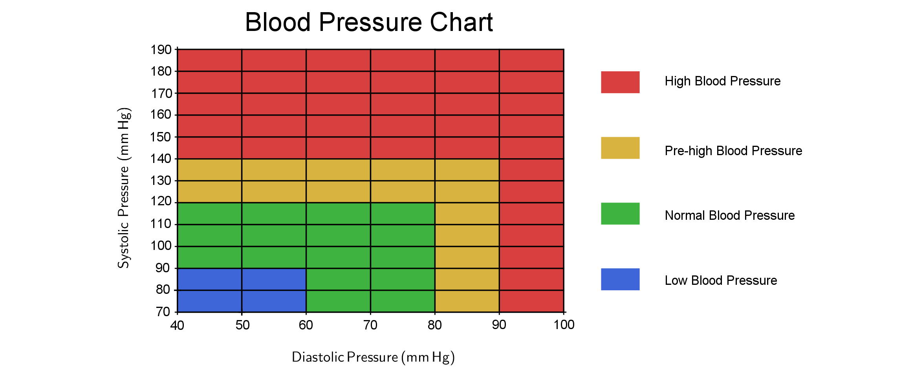
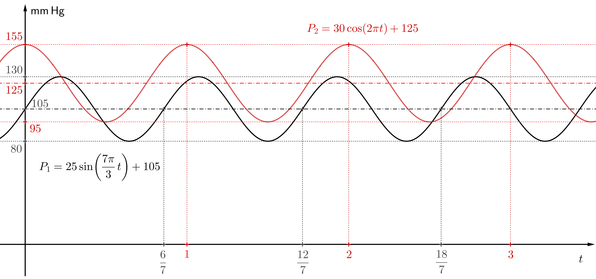

---
keywords:
- funciones trigonométricas
- seno, coseno
- aproximación, presión arterial
is_finished: True
---

# Presión arterial 

## Funciones trigonométricas y fenómenos periódicos 

Las funciones trigonométricas básicas seno y coseno se utilizan a menudo para modelar la luz, el sonido y las ondas electromagnéticas. 
También pueden utilizarse para aproximar [^1] otros fenómenos periódicos, como las mareas y la presión arterial.  

Comprender estas funciones (y sus partes individuales) nos permite predecir y analizar eficazmente los fenómenos periódicos y sus propiedades. 
Por ejemplo, podemos calcular la altura de las olas en el océano o la hora de la pleamar. En el siguiente texto, nos centraremos en las funciones que aproximan la presión arterial.
  

## Información básica sobre la presión arterial 

El corazón actúa como una bomba que impulsa la sangre oxigenada a través de los vasos sanguíneos de todo el cuerpo para proporcionarle el oxígeno y los nutrientes que necesita. 
La presión arterial es la presión que la sangre ejerce sobre las paredes de los vasos sanguíneos por los que fluye. 
Esta presión varía en las diferentes partes del torrente sanguíneo. La presión arterial, comúnmente conocida como presión arterial, es la presión de la sangre en las arterias principales. 
Si la presión arterial es demasiado alta, sobrecarga las arterias (y el corazón), lo que puede provocar un ataque cardíaco o un derrame cerebral.  

La presión arterial alta, también conocida como hipertensión, es algo que generalmente no se siente ni se nota. No suele causar signos ni síntomas evidentes. 
La única manera de saber cuál es su presión arterial es midiéndola. 
El primer tensiómetro medía la presión arterial basándose en la altura de la columna de mercurio, por lo que todavía se mide en milímetros de mercurio.
Se expresa como la razón de dos números. Por ejemplo, si tu lectura es de $120/80\,\text{mm}\,Hg$, tu presión arterial se denomina $120$ sobre $80$.  

El número más alto corresponde a la presión arterial sistólica. 
Esta es la presión arterial más alta que alcanza cuando el corazón late e impulsa la sangre hacia el sistema circulatorio. 
El número más bajo se denomina presión arterial diastólica y es el nivel más bajo 
que alcanza cuando el músculo cardíaco se relaja entre latidos. 
  

La siguiente tabla de presión arterial muestra los rangos de presión arterial alta, baja y saludable.   

## Aproximación de la función de la presión arterial  

Durante las contracciones cardíacas, la presión arterial aumenta y disminuye cíclicamente.
La duración de un latido corresponde al período de la función que representa la presión arterial.
Cada período de la función de medición de la presión arterial corresponde a un latido (lo que indica cuánto tarda en completarse un ciclo de latidos). 
Además, sabemos que el máximo local de la función será el valor de la presión arterial sistólica y el mínimo local será el valor de la presión diastólica.
Podemos sustituir aproximadamente la función de la presión arterial por la función seno o coseno. 
Recordemos que la prescripción general de la función seno es 

$$
f\left(x\right) = a\cdot\sin\left(bx + c\right) +d,
$$

donde $a$ representa la amplitud, 
que determina cuán alto o bajo se mueve la sinusoide desde su posición central. 
El valor $b$ afecta el período de la función (el período es igual a $\frac{2\pi}{|b|}$.). 
El término $c$ determina el desplazamiento en la dirección del eje $x$ y $d$ el desplazamiento en la dirección del eje $y$.   

> **Tarea 1.** Compara las siguientes dos funciones $$P_1(t)=25\cdot\sin\left(\frac{7\pi}{3}t\right)+105,\quad P_2(t)=30\cdot\cos\left(2\pi t\right)+125,$$
> que aproximan la presión arterial de dos personas diferentes. Estas funciones dependen de la variable $t$, que representa el tiempo en segundos.
> Para cada función, calcula su periodo (la duración de un latido)
> y determina su frecuencia cardíaca (el número de latidos por minuto).

\iffalse

*Solución.* El periodo $p_1$ de la función $P_1$ se puede calcular como 
$$
p_1=\frac{2\pi}{\frac{7\pi}{3}}=\frac{6}{7}\,\text{segundos}.
$$ 
Dado que la duración de un latido es de $\frac{6}{7}$ segundos, la frecuencia cardíaca $f_1$ será 
$$
f_1=\frac{60}{\frac{6}{7}}=70\,\text{latidos por minuto}.
$$  
De manera similar, el periodo de la función $P_2$ será 
$$
p_2=\frac{2\pi}{2\pi}=1\,\text{segundo}.
$$ 
Por lo tanto, la frecuencia cardíaca es $f_2=60$ latidos por minuto.
 
\fi

> **Tarea 2.** Dibuje gráficas de las funciones de la primera tarea. Si es posible, utilice un programa adecuado para dibujar gráficos (por ejemplo, GeoGebra).
> Use la tabla de presión arterial para determinar cómo se encuentra la presión arterial de las personas en cuestión.

\iffalse

*Solución.*  Para representar la gráfica de la función, el eje $x$ representará el tiempo $t$ en segundos. 
El eje $y$ representará la presión arterial $P$ en milímetros de mercurio. Elegiremos las unidades en los ejes para que la gráfica se vea clara.
Una opción adecuada es, por ejemplo, que una unidad en el eje $x$ corresponda a cien unidades en el eje $y$. En la solución de la figura 
la razón de unidades en los ejes se elige como $1:125$. La función 
$$
P_1=25\cdot\sin\left(\frac{7\pi}{3}t\right)+105
$$ 
oscila alrededor del valor $105$, la amplitud es igual a $25$. 
Por lo tanto, los máximos locales de la función tendrán los valores funcionales $105+25=130$ (presión sistólica). 
Los mínimos locales de la función tendrán los valores funcionales $105-25=80$ (presión diastólica).

La función 
$$
P_2=30\cdot\cos\left(2\pi t\right)+125
$$ 
oscila alrededor del valor $125$, con una amplitud de $30$. 
Por lo tanto, los máximos locales de la función tendrán los valores funcionales $125+30=155$ (presión sistólica). 
Los mínimos locales de la función tendrán los valores funcionales $125-30=95$ (presión diastólica).

La función $P_1$ es aproximadamente una función de la presión $130$ sobre $80$, según la tabla de la introducción, corresponde a los valores límite entre la presión normal y la presión alta 
(en algunos países se considera presión normal, en otros ya es el límite inferior de la presión arterial alta). 
La función $P_2$ corresponde a la presión $155$ sobre $95$, esta presión es alta. 

La visualización de estos gráficos ayuda a comprender los cambios en la presión arterial y otros fenómenos periódicos, 
lo que es esencial tanto en estudios matemáticos como en aplicaciones prácticas. 

La presión arterial alta es una afección peligrosa y un factor de riesgo importante de enfermedades cardíacas y accidentes cerebrovasculares. 
Un estilo de vida saludable, como una dieta rica en frutas y verduras y baja en sodio, y la actividad física, 
pueden ayudar a prevenir la presión arterial alta. 
Un resultado alto en una sola medición no significa necesariamente que tenga presión arterial alta, 
ya que muchos factores pueden afectar la presión arterial a lo largo del día, como la temperatura, la última vez que comió o el estrés. 

Al dibujar la gráfica de las funciones $P_1$ a $P_2$ podemos ver a simple vista sus diferencias. 
Sin embargo, a veces, dos funciones dadas a simple vista con reglas diferentes pueden tener la misma gráfica. 
Por ejemplo, ¿reconocerías a simple vista que este es el caso de las siguientes dos funciones? 
$$
y=\sin\frac{3x}{5},\qquad y=\cos\left(\frac{3x}{5}-\frac{\pi}{2}\right)
$$ 
Estas funciones tienen la misma gráfica y el tamaño de su período es 
$$
\frac{2\pi}{\frac{3}{5}}=\frac{10\pi}{3}.
$$

Pero cuidado, la gráfica de la función $y=\cos\left(\frac{3x}{5}-\frac{\pi}{2}\right)$ no se desplaza en la dirección del eje 
$y=\cos\frac{3x}{5}$ en comparación con la gráfica de la función $x$ en $\frac{\pi}{2}$, 
como podría parecer a primera vista por la fórmula de la función, sino en un cuarto del periodo de esta función. 
Podemos comprobarlo si ajustamos la fórmula adecuadamente:
$$
y=\cos\left(\frac{3x}{5}-\frac{\pi}{2}\right)=\cos\left(\frac{3}{5}\left(x-\frac{5\pi}{6}\right)\right)
$$

Así que, para comparar dos funciones de este tipo, sería mejor, 
convertir una en la otra. 
De esto se trata la siguiente tarea.

\fi

> **Tarea 3.** Expresa la función $P_1$ de la Tarea 1. 
> utilizando la función coseno en lugar de la función seno. 

\iffalse

*Solución.*  Para las funciones $\sin x$ y $\cos x$ en su forma básica 
$$
\sin x=\cos\left(x-\frac{\pi}{2}\right),
$$ 
donde $\frac{\pi}{2}$ es un cuarto del periodo.
El periodo de la función $P_1$ es $p_1=\frac{6}{7}$, el cuarto del periodo es 
$$
\frac{p_1}{4}=\frac{6}{28}=\frac{3}{14}.
$$
Por lo tanto, 
$$
\sin\left(\frac{7\pi}{3}t\right)=\cos\left(\frac{7\pi}{3}\left(t-\frac{3}{14}\right)\right)
$$
y la función $P_1$ se puede expresar de la siguiente manera
$$
P_1=25\cdot\cos\left(\frac{7\pi}{3}t-\frac{1}{2}\pi\right)+105.
$$ 

En la tarea anterior, también podríamos intercambiar las funciones y expresar la función $P_2$ usando la función seno.

\fi

> **Tarea 4.** Halla la fórmula de una función que aproxime la presión arterial de una persona sana en reposo.
> Su frecuencia cardíaca es de $50$ latidos por minuto. La presión arterial máxima es de $110\,\text{mm}\,\text{Hg}$ y la mínima de $70\,\text{mm}\,\text{Hg}$. 

\iffalse

*Solución.*  Para aproximar la función de la presión arterial, utilizaremos, por ejemplo, la función seno (la solución para la función coseno sería similar). 

La amplitud de la función es $\frac{110-70}{2}=20$ y la función oscila alrededor del valor $\frac{110+70}{2}=90$. 

El periodo de la función es 
$$
p=\frac{60}{50}=\frac{6}{5},
$$ 
es decir, un latido dura $1{,}2$ segundos. 
De la relación 
$$
p=\frac{2\pi}{b} = 1{,}2
$$
para el periodo $p$ de la función, obtenemos $b= \frac{5}{3}\pi$. 

El valor de $c$ se puede elegir arbitrariamente; lo más sencillo es elegir $c = 0.$ 
Sustituyendo los valores anteriores en la forma general de la función, obtenemos 
$$
P(t) = 20\cdot\sin\left(\frac{5\pi}{3}t\right)+90.
$$ 

Esta función modela aproximadamente la presión arterial de una persona con los valores especificados en función del tiempo (en segundos). 

\fi

## Técnica de auscultación para medir la presión arterial 

Finalmente, expliquemos cómo se mide realmente la presión arterial. Uno de los métodos más precisos es la llamada técnica de auscultación. 
Este método utiliza un tonómetro, compuesto por un manguito de goma, una bolsa inflable, un manómetro (un medidor de presión mecánico) y un estetoscopio. 

El manguito de goma del tonómetro se coloca aproximadamente a la mitad del brazo. La presión en el manguito aumenta hasta superar la presión arterial. 
Esto convierte al manguito en un obstáculo artificial para el flujo sanguíneo. 
Al reducir gradualmente la presión en el manguito, el flujo sanguíneo se restablece en un punto determinado. 

Sin embargo, la presión en el manguito provoca inicialmente una deformación de la arteria, lo que hace que el flujo de sangre penetrante sea turbulento. 
El valor de presión a partir del cual se empiezan a oír los ruidos cardíacos en el estetoscopio corresponde a la presión arterial sistólica.

Los sonidos son audibles mientras la presión en el manguito sea suficiente para deformar la arteria y, por lo tanto, mantener un flujo turbulento. 
Una vez que la presión en el manguito disminuye tanto que ya no es suficiente para deformar la arteria, 
se restablece el flujo sanguíneo original y los sonidos dejan de ser audibles. 
La presión en el último sonido audible corresponde a la presión arterial diastólica. 
 
### Aclaración 

Cabe añadir que una expresión más realista de la función de la presión arterial es más exigente 
y requiere sumas de funciones trigonométricas con diferentes períodos. 

La siguiente figura muestra un ejemplo específico de dicha suma y el gráfico correspondiente. 
Al mismo tiempo, la figura muestra una medición de la presión arterial. La velocidad de desinflado del brazalete es aproximadamente constante. 
Por lo tanto, la presión en el brazalete disminuye a una velocidad constante (de nuevo aproximadamente) y se representa en la figura mediante una línea recta.

 
El refinamiento de la función de la presión arterial mediante sumas de senos y cosenos ya está relacionado con el llamado teorema de Fourier, 
que establece que una función periódica continua puede expresarse como la suma de un número infinito de funciones seno y coseno, 
donde cada uno de estos términos tiene una amplitud y un período determinados. 

Este resultado fue obtenido en 1822 por el matemático francés Joseph Fourier como parte de la solución de la ecuación de conducción del calor.
Este es un concepto clave para el análisis y la comprensión de cualquier fenómeno periódico. 
El teorema de Fourier es la base del procesamiento de señales. 

[^1]: Aproximación significa una expresión aproximada pero fiel de un número o función, pero también de una ley física o fenómeno natural.
 
## Bibliografía

* https://www.vaia.com/en-us/textbooks/math/calculus-an-applied-approach-8-edition/chapter-8/problem-72-health-the-function-p100-20-cos-5-pi-t-3-approxim/
* https://www.vaia.com/en-us/textbooks/math/precalculus-9-edition/chapter-4/problem-90-the-function-p100-20-cos-frac5-pi-t3-approximates/#short-answer
* https://www.bloodpressureuk.org/your-blood-pressure/understanding-your-blood-pressure/what-do-the-numbers-mean/
 

  

 

