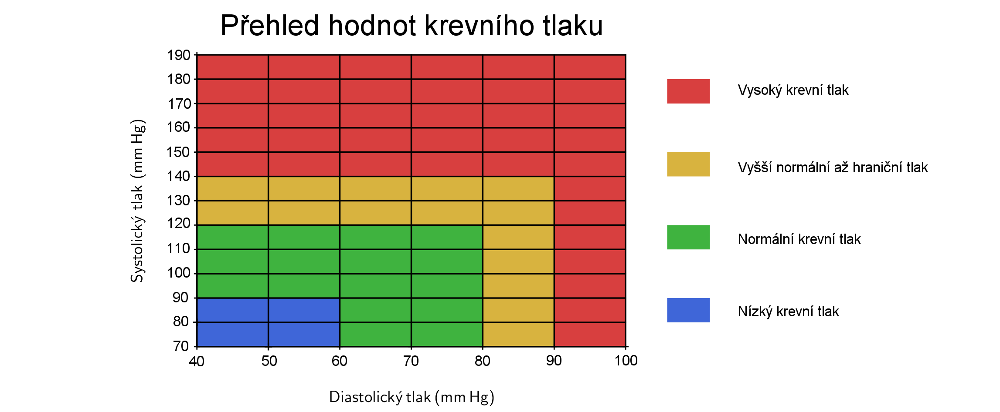

---
keywords:
- the first keyword
- another keyword
is_finished: False
---

### Instructions for translators

1. Open this file on GitHub server. If you see `https://um.mendelu.cz/...` in
   URL, click `View on GitHub` to open this file on github.com.
1. If you see this file on GitHub server, you can edit the content of the file.
   Open the file in an editor. You can use simple editor (pres `e` on GitHub).
   However, an advanced VS Code editor (press `.` on GitHub) is better, since it
   provides preview how the Markdown code renders. Alternatively press pencil
   for simple editor or press triangle next to the pencil to get access to VS
   Code described as `github.dev`. 
1. Fix the keywords in the preamble.
1. Depending on which language version you want to use as a source for your
   translation, delete either English or Czech version below.
1. Translate to your language. Keep Markdown marking and math notation. If you
   use a tool to get first version of the translation, make sure that the markup
   is preserved. 
1. In VS Code you can open the preview in another window by pressing `Ctrl+V`
   and `K`. Keep the preview open as you work, or close using a mouse.
1. Instead of saving, you have to commit and push the changes to the repository.
   Fill the Message under `Source control` (describe your changes, such as
   "Polish translation started") and then press Commit&Push.
1. Make sure that your changes appear in the commit history. In rare cases
   (if you work with simultaneously with someone else) you have to download
   /Pull/ and merge his and yours changes. Usualy Sync (Pull & Push) should
   work.
1. When you finish the translation, change `is_finished: False` in header to `is_finished: True`.

### Instrukce pro překladatele

1. Otevřete tento soubor na serveru GitHub. Pokud máte soubor otevřen na `https://um.mendelu.cz/...`, otevřete jej na serveru github.com.
1. Pokud tento soubor vidíte na serveru GitHub, můžete obsah souboru upravit.
   Otevřete soubor v editoru. Můžete použít jednoduchý editor (stiskněte `e` na GitHubu).
   Lepší je však pokročilý editor VS Code (stikněte `.` na GitHubu), protože poskytuje náhled, jak se kód Markdown interpretuje. Případně stiskněte tužku
   pro jednoduchý editor nebo stiskněte trojúhelníček vedle tužky, abyste získali přístup k editoru VS
   Code popsaný jako `github.dev`. 
1. Opravte klíčová slova v preambuli.
1. V závislosti na tom, kterou jazykovou verzi chcete použít jako zdrojový kód pro svůj
   překladu, odstraňte níže uvedenou anglickou nebo českou verzi.
1. Přeložte do svého jazyka. Ponechte značení Markdown a matematický zápis. Pokud
   použijete nástroj typu DeepL pro získání první verze překladu, ujistěte se, že zápis matematických výrazů
   byl zachován. 
1. Ve VS Code můžete náhled otevřít v jiném okně stisknutím `Ctrl+V`.
   a `K`. Během práce nechte náhled otevřený nebo jej zavřete pomocí myši.
1. Místo uložení musíte změny zaregistrovat a odeslat do úložiště.
   Vyplňte zprávu v poli `Zpráva` (popište své změny, např.
   "Zahájen překlad do polštiny") a poté stiskněte tlačítko Commit&Push.
1. Ujistěte se, že se vaše změny objeví v historii revizí. Ve výjimečných případech
   (pokud pracujete současně s někým jiným) musíte stáhnout
   /Pull/ a sloučit jeho a vaše změny. Obvykle by synchronizace (Pull & Push) měla
   fungovat.
1. Po dokončení překladu změňte `is_finished: False` v záhlaví na `is_finished: True`.

---
---

### Czech source

# Krevní tlak 

## Goniometrické funkce a periodické jevy 

Základní goniometrické funkce sinus a kosinus se často používají k modelování světelných, zvukových a elektromagnetických vln. 
Lze je také použít k aproximaci [^1] dalších periodických jevů, jako je například příliv a odliv nebo krevní tlak.  

Pochopení těchto funkcí (a jejich jednotlivých částí) nám umožňuje efektivně předpovídat a analyzovat periodické jevy a jejich vlastnosti. 
Můžeme například vypočítat výšku vln v oceánu, nebo čas přílivu. V následujícím textu se zaměříme na funkce aproximující krevní tlak.  

## Základní informace o krevním tlaku 

Srdce funguje jako pumpa, která pohání okysličenou krev do cév celého těla, aby mu dodalo potřebný kyslík a živiny. 
Krevní tlak je tlak, kterým působí krev na stěnu cévy, kterou protéká. 
Tento tlak je různý v různých částech krevního řečiště. Běžně se tlakem krve míní arteriální (tepenný) krevní tlak, tedy tlak krve ve velkých tepnách. 
Pokud je váš krevní tlak příliš vysoký, zatěžuje vaše tepny (a srdce), což může vést k infarktu myokardu či cévní mozkové příhodě.  

Vysoký krevní tlak, odborně hypertenzi, obvykle necítíte ani nepozorujete. Nemá tendenci vyvolávat zjevné příznaky nebo symptomy. 
Jediný způsob, jak zjistit, jaký je váš krevní tlak, je nechat si ho změřit. 
První měřicí přístroj určoval krevní tlak podle výšky rtuťového sloupce, proto se jeho hodnota dodnes udává v milimetrech rtuti.
Zapisuje se jako podíl dvou čísel. Pokud je vaše hodnota například $120/80\,\text{mm}\,Hg$, váš krevní tlak je takzvaně $120$ na $80$.  

Vyšší číslo udává systolický krevní tlak. 
Jedná se o nejvyšší hodnotu, které krevní tlak dosáhne, když vaše srdce bije a vytlačuje krev do cévního systému. 
Nižší číslo se nazývá diastolický krevní tlak a je to naopak nejnižší úroveň, 
které tlak dosahuje ve chvíli když se srdeční sval mezi jednotlivými údery uvolní.  

Níže uvedená tabulka krevního tlaku ukazuje rozmezí vysokého, nízkého a zdravého krevního tlaku.   

## Aproximace funkce krevního tlaku  

Při stazích srdce se krevní tlak cyklicky zvyšuje a snižuje.
Délka trvání jednoho srdečního tepu tedy odpovídá periodě funkce, která znázorňuje krevní tlak.
Každá perioda funkce měření krevního tlaku odpovídá jednomu srdečnímu tepu (udává, jak dlouho trvá, než se dokončí cyklus srdečního tepu). 
Navíc víme, že lokálním maximem funkce bude hodnota systolického krevního tlaku a lokálním minimem hodnota diastolického tlaku.
Funkci krevního tlaku můžeme přibližně nahradit funkcí sinus nebo kosinus. 
Připomeňme, že obecný předpis funkce sinus je 

$$
f\left(x\right) = a\cdot\sin\left(bx + c\right) +d,
$$

kde $a$ představuje amplitudu, 
která určuje, jak vysoko nebo nízko se sinusoida pohybuje od své střední polohy. 
Hodnota $b$ ovlivňuje periodu funkce (platí že perioda je rovna $\frac{2\pi}{|b|}$.). 
Člen $c$ určuje posun ve směru osy $x$ a $d$ posun ve směru osy $y$.   

> **Úloha 1.** Porovnejte následující dvě funkce $$P_1(t)=25\cdot\sin\left(\frac{7\pi}{3}t\right)+105,\quad P_2(t)=30\cdot\cos\left(2\pi t\right)+125,$$
> které aproximují krevní tlak dvou různých lidí. Tyto funkce závisí na proměnné $t$, která představuje čas v sekundách.
> Pro každou funkci najděte periodu funkce (délku jednoho srdečního tepu)
> a určete jejich tepovou frekvenci (počet úderů srdce za minutu).

\iffalse

*Řešení.* Periodu $p_1$ funkce $P_1$ můžeme vypočítat jako 
$$p_1=\frac{2\pi}{\frac{7\pi}{3}}=\frac{6}{7}\,\text{sekundy}.$$ 
Jelikož doba trvání jednoho srdečního tepu je $\frac{6}{7}$ sekundy, tepová frekvence $f_1$ bude 
$$
f_1=\frac{60}{\frac{6}{7}}=70\,\text{úderů za minutu}.
$$  
Obdobně pro funkci $P_2$ bude perioda 
$$
p_2=\frac{2\pi}{2\pi}=1\,\text{sekunda}.
$$ 
Tepová frekvence je tedy $f_2=60$ úderů za minutu.
 
\fi

> **Úloha 2.** Nakreslete grafy funkcí ze zadání první úlohy. Pokud máte možnost, použijte k vykreslení grafů vhodný software (například program GeoGebra).
> Pomocí tabulky krevního tlaku určete, jak jsou na tom příslušní lidé s krevním tlakem.

\iffalse

*Řešení.*  Pro vykreslení grafu funkce bude osa $x$ představovat čas $t$ v sekundách. 
Osa $y$ bude představovat krevní tlak $P$ v milimetrech rtuti. Jednotky na osách zvolíme tak, aby graf vypadal přehledně.
Vhodná volba je například, že jedné jednotce na ose $x$ odpovídá sto jednotek na ose $y$. V řešení na obrázku je zvolen 
poměr jednotek na osách $1:125$. Funkce 
$$
P_1=25\cdot\sin\left(\frac{7\pi}{3}t\right)+105
$$ 
osciluje kolem hodnoty $105$, amplituda je rovna $25$. 
Lokální maxima funkce budou mít tedy funkční hodnoty $105+25=130$ (systolický tlak). 
Lokální minima funkce budou mít funkční hodnoty $105-25=80$ (diastolický tlak).

Funkce 
$$
P_2=30\cdot\cos\left(2\pi t\right)+125
$$ 
osciluje kolem hodnoty $125$, amplituda je rovna $30$. 
Lokální maxima funkce budou mít tedy funkční hodnoty $125+30=155$ (systolický tlak). 
Lokální minima funkce budou mít funkční hodnoty $125-30=95$ (diastolický tlak).

Funkce $P_1$ je přibližně funkcí tlaku $130$ na $80$, podle tabulky z úvodu odpovídá mezním hodnotám mezi normálním a vysokým tlakem 
(v některých zemích se bere jako normální tlak, v některých zemích je to už spodní hranice vysokého krevního tlaku). 
Funkce $P_2$ odpovídá tlaku $155$ na $95$, tento tlak je vysoký. 

\fi

Vizualizace takových grafů pomáhá porozumět změnám krevního tlaku a pochopit další periodické jevy, 
což je nezbytné jak v matematických studiích, tak v praktických aplikacích. 

Vysoký krevní tlak je nebezpečný stav a hlavní rizikový faktor srdečních onemocnění a mrtvice. 
Zdravý životní styl, například strava s vysokým obsahem ovoce a zeleniny a nízkým obsahem sodíku a také fyzická aktivita, 
může pomoci vysokému krevnímu tlaku předcházet. 
Vysoká hodnota z jediného měření nemusí nutně znamenat, že máte vysoký krevní tlak, 
protože na krevní tlak může mít během dne vliv mnoho faktorů, například teplota, doba posledního jídla nebo stres. 

Díky tomu, že jsme si funkce $P_1$ a $P_2$ vykreslili, vidíme na první pohled, jaké jsou mezi nimi rozdíly. 
Někdy mohou mít ale dvě funkce dané na první pohled různými předpisy ten samý graf. 
Poznali byste například na první pohled, že tomu je tak u následujících dvou funkcí? 
$$
y=\sin\frac{3x}{5},\qquad y=\cos\left(\frac{3x}{5}-\frac{\pi}{2}\right)
$$ 
Tyto funkce mají stejný graf a velikost jejich periody je 
$$
\frac{2\pi}{\frac{3}{5}}=\frac{10\pi}{3}.
$$

Ale pozor, graf funkce $y=\cos\left(\frac{3x}{5}-\frac{\pi}{2}\right)$ není oproti grafu funkce 
$y=\cos\frac{3x}{5}$ posunutý ve směru osy $x$ o $\frac{\pi}{2}$, 
jak by se z předpisu funkce na první pohled mohlo zdát, ale o čtvrtinu periody této funkce. 
To můžeme vidět, pokud si předpis vhodně upravíme:
$$
y=\cos\left(\frac{3x}{5}-\frac{\pi}{2}\right)=\cos\left(\frac{3}{5}\left(x-\frac{5\pi}{6}\right)\right)
$$

Pro porovnání dvou takovýchto funkcí by tedy bylo lepší, 
kdybychom mohli jednu převést na druhou. 
Tímto se právě bude zabývat následující úloha.

> **Úloha 3.** Vyjádřete funkci $P_1$ z Úlohy 1. 
> pomocí funkce kosinus místo funkce sinus. 

\iffalse

*Řešení.*  Pro funkce $\sin x$ a $\cos x$ v základním tvaru platí 
$$
\sin x=\cos\left(x-\frac{\pi}{2}\right),
$$ 
kde $\frac{\pi}{2}$ je čtvrtina periody.
Perioda funkce $P_1$ je $p_1=\frac{6}{7}$, čtvrtina periody je 
$$
\frac{p_1}{4}=\frac{6}{28}=\frac{3}{14}.
$$
Platí tedy 
$$
\sin\left(\frac{7\pi}{3}t\right)=\cos\left(\frac{7\pi}{3}\left(t-\frac{3}{14}\right)\right)
$$
a funkci $P_1$ můžeme vyjádřit následovně
$$
P_1=25\cdot\cos\left(\frac{7\pi}{3}t-\frac{1}{2}\pi\right)+105.
$$ 

\fi

V předchozí úloze bychom mohli funkce také zaměnit a vyjadřovat funkci $P_2$ pomocí funkce sinus.

> **Úloha 4.** Najděte předpis funkce, která aproximuje funkci krevního tlaku zdravého člověka v klidu.
> Jeho srdeční frekvence je $50$ tepů za minutu. Maximální krevní tlak je $110\,\text{mm}\,\text{Hg}$ a minimální $70\,\text{mm}\,\text{Hg}$. 

\iffalse

*Řešení.*  K aproximaci funkce krevního tlaku použijeme například funkci sinus (řešení pro funkci kosinus by bylo obdobné). 

Amplituda funkce je $\frac{110-70}{2}=20$ a funkce osciluje kolem hodnoty $\frac{110+70}{2}=90$. 

Perioda funkce je 
$$
p=\frac{60}{50}=\frac{6}{5},
$$ 
tj. jeden srdeční tep trvá $1{,}2$ sekundy. 
Ze vztahu 
$$
p=\frac{2\pi}{b} = 1{,}2
$$
pro periodu $p$ funkce dostáváme $b= \frac{5}{3}\pi$. 

Hodnotu $c$ můžeme zvolit libovolně, nejjednodušší je zvolit $c = 0.$ 
Dosazením výše uvedených hodnot do obecného tvaru funkce dostáváme 
$$
P(t) = 20\cdot\sin\left(\frac{5\pi}{3}t\right)+90.
$$ 

Tato funkce přibližně modeluje krevní tlak osoby se zadanými hodnotami jako funkci času (v sekundách). 

\fi

## Auskultační technika měření krevního tlaku 

Na závěr ještě uveďme, jak se v realitě tlak opravdu měří. Jedna z přesných metod je tzv. auskultační technika. 
Při této metoda se používá tonometr, skládající se z gumové manžety, nafukovacího vaku a manometru (mechnické měřidlo tlaku), a fonendoskop. 

Gumovou manžeta tonometru se nasadí zhruba na polovinu paže. Tlak v manžetě se zvýší tak, aby převyšoval tlak v tepně. 
Tím se z manžety stane uměle vytvořená překážka krevnímu průtoku. 
Postupným pomalým snižováním tlaku v manžetě dojde v určitém okamžiku k obnovení průtoku krve. 

Tlak v manžetě však na počátku způsobí deformaci tepny, díky níž je proudění pronikající krve turbulentní. 
Hodnota tlaku, při níž začínají být ve fonendoskopu slyšitelné srdeční ozvy, odpovídá hodnotě systolického krevního tlaku.

Ozvy jsou slyšitelné do té doby, dokud tlak v manžetě postačuje k deformaci tepny a tím k udržení turbulentního proudění. 
Jakmile tlak v manžetě poklesne natolik, že již nestačí tepnu deformovat, 
obnoví se původní proudění krve a ozvy přestanou být slyšitelné. 
Tlak při poslední slyšitelné ozvě odpovídá hodnotě diastolického krevního tlaku. 
 
### Zpřesnění 

Zbývá dodat, že realističtější vyjádření funkce krevního tlaku je náročnější 
a vyžaduje součty goniometrických funkcí s různými periodami. 

Na následujícím obrázku vidíme konkrétní příklad takového součtu a příslušný graf. 
Současně je na obrázku znázorněno měření krevního tlaku. Rychlost vypouštění manžety je přibližně konstantní. 
Tlak v manžetě tedy klesá konstantní rychlostí (opět přibližně) a na obrázku je znázorněn přímkou.

 
Zpřesňování průběhu funkce krevního tlaku pomocí součtů sinů a kosinů už souvisí s tzv. Fourierovou větou, 
která říká, že spojitou periodickou funkci lze vyjádřit jako součet nekonečného počtu funkcí sinus a kosinus, 
přičemž každý z těchto členů má určitou amplitudu a periodu. 

Tento výsledek získal v roce 1822 francouzský matematik Joseph Fourier jako součást řešení rovnice vedení tepla.
Jedná se o klíčový koncept pro analýzu a pochopení jakýchkoli periodických jevů. 
Fourierova věta je základem zpracování signálů. 

[^1]: Aproximace znamená přibližné, ale věrné vyjádření  čísla nebo funkce, ale také fyzikálního zákona či přírodního jevu.
 
## Literatura

* https://www.vaia.com/en-us/textbooks/math/calculus-an-applied-approach-8-edition/chapter-8/problem-72-health-the-function-p100-20-cos-5-pi-t-3-approxim/
* https://www.vaia.com/en-us/textbooks/math/precalculus-9-edition/chapter-4/problem-90-the-function-p100-20-cos-frac5-pi-t3-approximates/#short-answer
* https://www.bloodpressureuk.org/your-blood-pressure/understanding-your-blood-pressure/what-do-the-numbers-mean/
 

  

 

---
---

### English source

Not available on July 10. If you want to start from English
translation, wait until it appears on <https://um.mendelu.cz/math4u/site/> anc copy the English text by hand.
