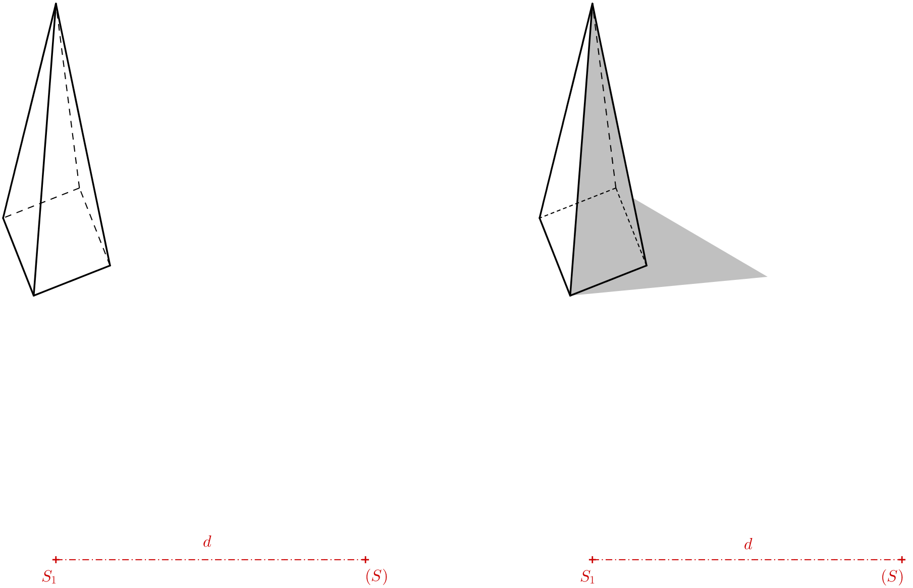

---
keywords:
- geometrie v prostoru
- anamorfózy
- tělesa
- promítání
- středové promítání
- perspektiva
is_finished: true
difficulty: 3
time: 45
---

# Anamorfózy

## Anamorfózy ve výtvarném umění 

Anamorfóza je druh vizuálního triku či umění, při němž část roviny nebo prostoru viděná z určitého úhlu odhaluje skrytý obraz. 
Anamorfóza závisí na tom, zda pozorovatel najde správné místo, odkud se dívat. Tento druh umění má dlouhou a bohatou historii. 
Jedním z nejznámějších obrazů využívajících anamorfózy jsou Velvyslanci (1533) německého malíře Hanse Holbeina mladšího (1497 – 1543). 

V dolní části obrazu je namalován jistý podivný protáhlý objekt. 
O co se jedná je možné rozeznat pouze pokud se postavíte ke zdi u pravého rámu obrazu a zadíváte se tím směrem. 
Pokud najdete správnou pozici odkud se dívat, uvidíte, že jde o lebku. 

Anamorfní umění může využívat také odrazy obrazů nebo soch ve válci[^1]. 

Ke konci 20. století zažilo anamorfní umění velké oživení ve fotografii, kresbě a velkoplošných instalacích. 
Někteří umělci tvoří anamorfní obrazy z předmětů denní potřeby jako elektronika, nebo obuv a ponožky[^2]. 
S anamorfózami se můžeme potkat i v rámci street artu. 
Často jde o kresby na chodníku, silnici či na zdi, které náhodného kolemjdoucího překvapí a na okamžik zarazí. 
Může jít třeba o kresbu, která vypadá jako díra v zemi, do které hrozí pád, nohy vykukující ze zdi či kanálu a podobně.
Anamorfózy založené na středovém promítání jsou přesvědčivější, pokud je sledujeme jedním okem nebo přes objektiv. 
Pokud je ale střed promítání dostatečně daleko od pozorovaného objektu, je dobře vystínován nebo jeho okolí nějak podporuje dojem prostoru,
je iluze přesvědčivější.

## Praktické využití  

Ve filmovém průmyslu se k natáčení filmů někdy používají  kamery s anamorfními čočkami. 
Ty byly původně navrženy z toho důvodu, aby širokoformátové snímky plně využívaly plochu standardních filmových políček s výškou 35mm. 
Jinak by širokoformátové snímky ponechaly horní a spodní část rámečku nevyužité. 
Přes příchod digitálních snímačů s velkým rozlišením se anamorfní objektivy používají pro unikátnost výsledného obrazu i v dnešní době.

V některých městech zaváděly přechody pro chodce, které v určitém okamžiku vypadaly z pohledu přijíždějícího řidiče jako levitující hranoly. 
Po krátké zkušební době byly většinou zrušeny, protože před nimi řidiči brzdili příliš prudce. 

Techniku anamorfní projekce můžeme vidět na některých sportovních stadionech, kdy se používá k propagaci firemních značek, 
které jsou namalovány na hrací plochu. Z úhlu televizní kamery se nápis jeví jako nápisy stojící svisle v rámci hrací plochy. 

## Anamorfózy základních těles 

V následujícím textu a příkladech vytvoříme anamorfózy základních těles pomocí středového promítání do roviny. 
Rovině, ve které tyto anamorfní obrazy budeme rýsovat budeme říkat průmětna. 
Průmětnou pro nás bude papír, na který budeme rýsovat. 
Tím budeme omezeni co se týče velikosti objektů. Vzniklé obrazy pak budeme pozorovat okem kamery přes mobil nebo fotoaparát.
Pokud máte možnost, můžete anamorfní obrazy vytvářet venku, ideálně mimo komunikace.  

## Jehlan a kužel

Asi nejjednodušší je vytvořit anamorfní obrazy jehlanu a kuželu, pokud ovšem jejich podstavy leží v průmětnách. 
Pojďme si princip vysvětlit na jehlanu. Kromě tělesa je třeba zadat i střed promítání $S$ a jeho kolmý průmět do průmětny $S_1$. 
Střed promítání si můžeme představit jako oko pozorovatele. Kolmý průmět jako místo, kde pozorovatel stojí.
Vzdálenost $S _1S = d$ je tedy vzdálenost středu promítání od průmětny. 
U pravidelného čtyřbokého jehlanu obdobně označíme jeho vrchol jako $V$ a kolmý průmět vrcholu do průmětny $V_1$. 
Průsečík přímky $SV$ (takzvaného promítacího paprsku) s průmětnou pak získáme jako průsečík přímky $SV$ s přímkou $S_1V_1$ (viz následující obrázek nalevo). 
Takový obrázek je dobré si načrtnout když přemýšlíme, jak iluze funguje, a jak bude středový průmět vypadat. 
Pro určení anamorfózy jehlanu ale tento prostorový obrázek třeba není. 

Důležitý je pro nás pouze lichoběžník $S_1V_1VS$, který si můžeme znázornit i v průmětně jako lichoběžník $S_1V_1(V)(S)$(předchozí obrázek napravo). 
Body, které byly předtím v prostoru mimo průmětnu (body $V$ a $S$) nyní v průmětně uvádíme v závorce, abychom je vzájemně odlišili. 
Body $(V)$ a $(S)$ vznikly pootočením roviny $S_1VS$ o $90^\circ$ do průmětny kolem přímky $S_1V_1$. 
Pokud známe výšku jehlanu, vzdálenost oka pozorovatele od průmětny, a vzdálenost $S_1V_1$, pak můžeme lichoběžník narýsovat. 
Protažením jeho stran, které nejsou vzájemně rovnoběžné, dostaneme průsečík $V_s$. 

Výsledek (viz předchozí obrázek nalevo) je vhodné nakreslit bez pomocných čar. Můžeme se na něj podívat okem kamery. 
Při prohlídce přes oko kamery zjistíme, že neviditelné hrany dolní podstavy je vhodné nakreslit hustší čárkovanou čarou než průmět neviditelné boční hrany.
Pokud chceme, aby jehlan vypadal věrohodně, obrázek vystínujeme. Stín můžeme jen odhadnout, vržený stín vrcholu si můžeme zvolit. 
Anamorfóza jehlanu je hotová, kameru fotoaparátu (aby iluze fungovala), je třeba nastavit nad bod $S_1$ ve výšce rovné vzdálenosti $S_1(S)$.
Výsledný obraz přes oko kamery by měl vypadat přibližně jako na následujícím obrázku.

> **Úloha 1.** Chceme na zem nakreslit tvar, který bude v prostoru vypadat jako kužel o výšce $1\,\mathrm{m}$ a s podstavou o poloměru $r=0{,}4\,\mathrm{m}$.
> Střed promítání budeme opět značit $S$ a $S_1$ jeho kolmý průmět.
> Předpokládáme, že oko průměrného pozorovatele je ve výšce $150\,\mathrm{cm}$ od země.
> V jaké vzdálenosti musí být $V_s$ od $V_1$ ($V_s$ je středový průmět vrcholu kuželu do průmětny, $V_1$ je kolmý průmět vrcholu kuželu do průmětny)?

\iffalse

*Řešení.* Trojúhelníky $S_1V_sS$ a $V_1V_sV$ jsou podobné.   

 

Platí tedy, že poměry příslušných stran, jsou si rovny: 

$$
\frac{x}{1}= \frac{x+3}{1{,}5},
$$ 

$$
1{,}5\,x=x+3,
$$ 

odkud dostáváme $x=6$. Vzdálenost bodu $V_s$ od $V_1$ musí být $6$ metrů.

\fi

> **Úloha 2.** Máme danou podstavnou kružnici $k$ se středem $V_1$ a bod $V_s$ (zadání viz obrázek).
> Představme si nyní v prostoru rotační kužel s podstavnou kružnicí $k$ a střed promítání $S$, takové že $V_s$ je středový průmět vrcholu kuželu.
> $V_1$ je kolmý průmět vrcholu kuželu do průmětny (na papír). Určete obrys středového průmětu kuželu. 

\iffalse

*Řešení.* Obrys kuželu bude (kromě části podstavné kružnice) tvořen tečnami z vrcholu $V_s$. 
Přesněji to budou spojnice bodu $V_s$ s body dotyku $T$ a $T'$, 
které získáme jako průsečíky Thaletovy kružnice $l$ nad průměrem $V_1V_s$ s kružnicí $k$. 

\fi

> **Úloha 3.** Pro řešení předchozí úlohy určete polohu středu $S$ (pomocí $S_1$ a $(S)$),
> jestliže známe výška $v$ prostorového kuželu a $d=\left|S_1S\right|$. 
> Zadání viz následující obrázek, délky $v$ a $d$ jsou dány pomocí úseček.

\iffalse

*Řešení.* Bod $S$ musí splňovat dvě podmínky. Jeho vzdálenost od průmětny je rovna $d$ a musí ležet na spojnici $VV_s$. 
Střed $S$ i bod $V$ leží v rovině kolmé na průmětnu. Průsečnice těchto dvou rovin je přímka $o=V_1V_s$. 
Kolem této přímky můžeme vrchol $V$ poototočit o $90^\circ$ do průmětny. 
Otočený obraz bodu $V$ označíme $(V)$, musí ležet ve vzdálenosti $v$ od bodu $V_1$ na kolmici na osu $o$. 
Ve vzdálenosti $d$ od osy $o=V_1V_s$ narýsujeme přímku $p$. Bod $(S)$ musí ležet na průsečíku přímky $p$ a $(V)V_s$  

\fi

## Hranol a válec

Při anamorfním zobrazení hranolu a válce budeme využívat stejnolehlost. 
Proč tomu tak je si vysvětlíme na příkladu krychle na následujícím obrázku. 
Mezi horní podstavou krychle a jejím průmětem je v prostoru vztah stejnolehlosti se středem $S$ (plyne z podobnosti trojúhelníků). 
Protože dolní podstava krychle je současně kolmým průmětem horní podstavy do průmětny, 
funguje pak vztah stejnolehlosti mezi dolní podstavou a středovým průmětem horní podstavy se středem stejnolehlosti $S_1$.  

 
> **Úloha 4.** Určete anamorfózu krychle. Čtverec dolní podstavy je dán protilehlými vrcholy $A_1$, $C_1$.
> Dále je dána poloha bodu $S_1$ (kolmý průmět středu promítání $S$), délka $d$ je zadána poloměrem kružnice $k$. 

\iffalse 

*Řešení.* Sestrojíme čtverec $A_1B_1C_1D_1$ s úhlopříčkou $A_1C_1$. Na obrázku .. vidíme, že bod $A_s$ je průsečík přímek $AS$ a $A_1S_1$. 
Známe délky rovnoběžných stran lichoběžníka $A_1S_1SA$, takže můžeme opět provést jeho pootočení kolem strany $A_1S_1$ o $90^\circ$ do průmětny. 
Délka $S_1(S)=d$ je dána poloměrem kružnice $k$ a délka $A_1(A)=a$ je délka strany čtverce $A_1B_1C_1D_1$. 
Bod $A_s$ je průsečík přímky $S_1A_1$ a přímky $(S)(A)$. 

Čtverec s vrcholem $A_s$ poté dorýsujeme pomocí stejnolehlosti. Boční hrany krychle odpovídají spojnicím vrcholů čtverců, 
které si odpovídají ve stejnolehlosti. 
Máme hotovo. Pokud ale chceme podpořit iluzi krychle, můžeme narýsovat ještě čverec, 
který odpovídá čtverci $A_1B_1C_1D_1$ ve stejnolehlosti se středem  $S$ a koeficientem $0<k<1$. 
Pokud ho vybarvíme šedě, určíme tím stín krychle (při směru osvětlení shora) a vytvoříme tím dojem, že krychle levituje v prostoru.

\fi

> **Úloha 5.** Mějme dány dvě různě velké kružnice, zadání viz následující obrázek.
> Určete střed jejich stejnolehlosti $S_1$ a jejich společné tečny tak, aby výsledný obrázek byl anamorfózou válce. 

\iffalse

*Řešení.* Každé dvě nesoustředné kružnice s různými poloměry jsou stejnolehlé dvěma způsoby. 
Nás zajímá ten způsob, kdy koeficient stejnolehlosti je kladný. Nejprve sestrojíme střed stejnolehlosti (viz následující obrázek).

Body dotyku najdeme na Thaletových kružnicích nad průměry $S_1O_1$ a $S_1O_s$. 
Teprve poté rýsujeme tečny (pokud rýsujeme pomocí pravítka a kružítka).

Výsledná anamorfóza válce je na následujícím obrázku.

 
\fi

> **Úloha 6.** Koeficient stejnolehlosti $H(S,k)$ v předchozím příkladu, která zobrazuje $O_1$ na $O_s$ je $k=1{,}5$.
> Jaký musí být poměr $d:v$, kde $d=\left|S_1S\right|$ a $v=\left|O_1O\right|$ (výška pomyslného válce v prostoru),
> aby prostorová iluze fungovala?

\iffalse

*Řešení.* Označme si $x=\left|S_1O_1\right|$. Díky koeficientu stejnolehlosti pak víme že $\left|S_1O_s\right|=1{,}5\,x$. 
Z toho plyne $\left|O_1O_s\right|=0{,}5\,x$. Poté opět využijeme podobnosti trojúhelníků $S_1O_s(S)$ a $O_1O_s(O)$ na následujícím obrázku.

$$
\frac{d}{v}= \frac{1{,}5\,x}{0{,}5\,x}=3
$$ 

Poměr $d:v$ musí být roven $3:1$

\fi
 

## Odkazy a literatura

### Literatura

https://en.wikipedia.org/wiki/Anamorphosis

### Zdroje obrázků

- Velvyslanci 
    <https://en.wikipedia.org/wiki/File:Hans_Holbein_the_Younger_-_The_Ambassadors_-_Google_Art_Project.jpg>
 
- Lebka (detail obrazu Velvyslanci při pohledu ze správného místa)
    <https://en.wikipedia.org/wiki/File:Holbein_Skull.jpg> 

[^1]: https://commons.wikimedia.org/wiki/File:Anamorphic_frog_sculpture_by_Jonty_Hurwitz.jpeg.

[^2]: https://www.youtube.com/watch?v=y__zPc3MZm4.
 

 
