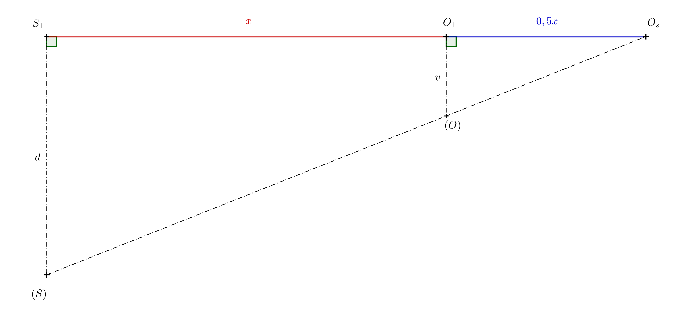

# Anamorphosis

## Anamorphosis in Visual Art

Anamorphosis is a type of visual trick or art in which a hidden image is revealed when viewed from a specific angle.
Anamorphosis relies on the observer finding the correct spot from which to look. This kind of art has a long and rich history.
One of the most famous paintings using anamorphosis is The Ambassadors (1533) by the German painter Hans Holbein the Younger (1497 - 1543). 

At the bottom of the painting, there is a strange elongated object.
You can only make out what it is if you stand against the wall near the right frame of the painting and look from that direction. 
If you find the right position from which to look, you will see that it is a skull. 

Anamorphic art can also use reflections of paintings or sculptures in a cylindrical mirror[^1].

By the end of the 20th century, anamorphic art experienced a major revival in photography, drawing, and large-scale installations.
Some artists create anamorphic images from everyday objects such as electronics, shoes and socks[^2]. 
Anamorphoses also appear in street art.
These are often drawings on sidewalks, streets, or walls that surprise and momentarily confuse passers-by.
For example, it can be a drawing that looks like a hole in the ground, into which a fall is imminent, legs sticking out of a wall or a canal, etc.
Anamorphoses based on central projection are more convincing when viewed with one eye or through a camera lens. 
However, if the center of projection is far enough from the object, if the shading is done well, or if the surrounding environment supports the illusion of space, the effect becomes even more realistic.

## Practical Applications

In the film industry, anamorphic lenses are sometimes used to shoot movies.
They were originally designed so that wide-format images would fully utilize the area of ​​standard 35mm film frames.
Without them, widescreen images would leave the top and bottom parts of the frame unused.
Despite the arrival of high-resolution digital sensors, anamorphic lenses are still used today for the uniqueness of the resulting image.

Some cities introduced pedestrian crossings that at some point looked like levitating prisms from the perspective of oncoming drivers.
After a short trial period, these crossings were mostly removed, as drivers tended to brake too sharply when approaching them.

The technique of anamorphic projection can also be seen in some sports stadiums, where it is used for advertising. Company logos are painted directly onto the playing field, and from the angle of the TV camera, the text appears to be standing vertically on the surface.

## Anamorphoses of Basic Solids

In the following text and examples, we will create anamorphoses of basic solids using central projection onto a plane.
The plane in which we will draw these anamorphic images is called the projection plane.
In our case, the projection plane will be a sheet of paper we draw on, which naturally limits the size of the objects we can create. We will then observe the resulting images through the camera eye via a mobile phone or camera.
If you have the opportunity, you can create anamorphic images outdoors, ideally away from roads or traffic.

## Pyramid and Cone

Perhaps the easiest solids to create anamorphic images of are the pyramid and the cone—provided their bases lie in the projection plane.
Let's explain the principle using a pyramid. 
In addition to the solid itself, we also need to define the center of projection $S$ 
and its perpendicular projection onto the projection plane $S_1$.
You can think of the center of projection as the observer’s eye, and the perpendicular projection as the spot where the observer is standing.
The distance $S _1S = d$ is then the distance from the projection plane to the center of projection.
For a regular square pyramid, we denote its apex as $V$ 
and the perpendicular projection of the apex onto the projection plane as $V_1$.
The intersection of the line $SV$ (called the projection ray) 
with the projection plane is then obtained as the intersection of lines $SV$ 
and $S_1V_1$ (see the following figure on the left).
It’s useful to sketch such a diagram when thinking about how the illusion works and what the central projection will look like.
However, this spatial picture is not needed to determine the anamorphosis of the pyramid.

What we actually need is just the trapezoid $S_1V_1VS$, which can also be represented in the projection plane as the trapezoid $S_1V_1(V)(S)$ (see previous figure on the right).
The points that were previously in space outside the projection (points $V$ and $S$) are now shown in parentheses in the projection to distinguish them.
The points $(V)$ and $(S)$ were created by rotating the plane $S_1VS$ by $90^\circ$ into the projection around the line $S_1V_1$.
If we know the height of the pyramid, the distance of the observer's eye to the projection plane, and the distance $S_1V_1$, we can draw the trapezoid.
By extending its non-parallel sides, we find the point $V_s$.

The result (see the previous figure on the left) should be drawn without construction lines. We can then observe it through the lens of a camera.
When viewed through the camera, we find that the hidden edges of the bottom base are best drawn with a denser dashed line than the projection of the invisible side edge.
To make the pyramid appear more realistic, we can shade the image. The shadow can be estimated freely, and the cast shadow of the apex can be chosen as needed.
The anamorphosis of the pyramid is complete. For the illusion to work, the camera lens must be positioned directly above point $S_1$ at a height equal to the distance $S_1(S)$.
As seen through a camera, the final image should resemble the one shown in the following figure.

> **Exercise 1.** We want to draw a shape on the ground that, when viewed in space, appears as a cone with a height of $1\,\mathrm{m}$
> and a base with a radius of $r=0{.}4\,\mathrm{m}$.
> As before, we denote the center of projection by $S$ and its perpendicular projection onto the ground by $S_1$.
> We assume that the eye of an average observer is at a height of $150\,\mathrm{cm}$ above the ground.
> At what distance must $V_s$ be from $V_1$ ($V_s$ is the central projection of the cone's apex onto the projection plane,
> $V_1$ is the perpendicular projection of the cone's apex onto the projection plane), assuming the observer is standing $3$ meters away from point $V_1$?

\iffalse

*Solution.* The triangles $S_1V_sS$ and $V_1V_sV$ are similar.

Therefore, the ratios of the corresponding sides are equal:

$$\frac{x}{1}= \frac{x+3}{1{.}5},$$

$$1{.}5\,x=x+3,$$

from which we get $x=6$. The distance of the point $V_s$ from $V_1$ must be $6$ meters.

\fi

> **Exercise 2.** We are given a base circle $k$ with center $V_1$ and point $V_s$ (see figure below for reference).
> Imagine a right circular cone in space with the base circle $k$ and a center of projection $S$, such that $V_s$ is the central projection of the cone's apex.
> Point $V_1$ is the perpendicular projection of the cone's apex onto the projection plane (i.e., the paper). Determine the outline of the central projection of the cone.

\iffalse

*Solution.* The outline of the cone (apart from part of the base circle) will consist of the tangents from the apex $V_s$.
More precisely, it will be the lines connecting point $V_s$ to the points of tangency $T$ and $T'$,
which we obtain as the intersection points of the Thales circle $l$ constructed over the diameter $V_1V_s$, and the base circle $k$.

\fi

> **Exercise 3.** To solve the previous problem, determine the position of point $S$ (using $S_1$ and $(S)$),
> if the height $v$ of the cone in space and the distance $d=\left|S_1S\right|$ are known. 
> See the following figure for reference, the lengths of $v$ and $d$ are given as segments.

\iffalse

*Solution.* Point $S$ must meet two conditions: Its distance from the projection plane is equal to $d$ and it must lie on the line $VV_s$.
Points $S$, as well as point $V$, lie in a plane perpendicular to the projection plane. 
The intersection of these two planes is the line $o=V_1V_s$.
We can rotate the apex $V$ by $90^\circ$ around this line into the projection plane.
We denote the rotated image of point $V$ by $(V)$. It must lie at a distance $v$ from point $V_1$, on a perpendicular to the axis $o$.
At a distance $d$ from the axis $o=V_1V_s$ we draw a line $p$. 
Point $(S)$ must lie at the intersection of the lines $p$ and the segment $(V)V_s$ 

\fi

## Prism and Cylinder

To construct an anamorphic image of a prism or a cylinder, we use homothety.
Let’s explain why, using the example of a cube shown in the diagram.

There is a similarity relationship between the top face of the cube and its projection in space, with the center of similarity at point $S$ (this follows from the similarity of triangles). Since the bottom face of the cube is also the perpendicular projection of the top face onto the projection plane, there is a similarity relationship between the bottom face and the central projection of the top face, with the center of similarity at point $S_1$

 
> **Exercise 4.** Determine the anamorphic projection of a cube. The square base is given by two opposite vertices $A_1$ and $C_1$.
> The position of the point $S_1$ (the perpendicular projection of the center of projection $S$) is also given.
> The length $d$ is given by the radius of the circle $k$.

\iffalse 

*Solution.* First, construct a square $A_1B_1C_1D_1$ with diagonal $A_1C_1$. In the previous figure, we see that point $A_s$ is the intersection of lines $AS$ and $A_1S_1$.
Since we know the lengths of the parallel sides of trapezoid $A_1S_1SA$, we can rotate it around side $A_1S_1$ by $90^\circ$ into the projection plane.
The length $S_1(S)=d$ is given by the radius of circle $k$ and the length $A_1(A)=a$ is the length of the side of square $A_1B_1C_1D_1$.
Point $A_s$ is the intersection of line $S_1A_1$ and line $(S)(A)$.

The square with vertex $A_s$ is then drawn using homothety.
The lateral edges of the cube correspond to lines connecting matching vertices of the original square and its image in a given homothety. And we’re done. However, if we want to enhance the illusion of the cube, we can draw another square
that corresponds to square $A_1B_1C_1D_1$ in homothety with center $S$ and ratio $0<k<1$.
If we shade this square in gray, it will serve as the shadow of the cube (assuming top-down lighting), helping to create the impression that the cube is floating in space.

\fi

> **Exercise 5.** We are given two circles of different sizes (see the figure below for reference).
> Determine their center of homothety $S_1$ that maps one circle on the other, and draw their common tangents so that the resulting image is an anamorphosis of a cylinder.

\iffalse

*Solution.* Any two non-concentric circles with different radii are homothetically related in two ways.
We are interested in the way in which the ratio of homothety is positive. 
First, we construct the center of homothety (see the following figure).

The points of tangency are found on Thales circles constructed over the diameters $S_1O_1$ and $S_1O_s$.
Only then do we draw the tangents (if using a ruler and compass).

The resulting anamorphosis of the cylinder is shown in the following figure.

 
\fi

> **Exercise 6.** The ratio of homothety $H(S,k)$ in the previous exercise, which maps point $O_1$ to $O_s$, is $k=1{.}5$.
> What must be the ratio $d:v$, where $d=\left|S_1S\right|$ and $v=\left|O_1O\right|$ (the height of the imaginary cylinder in space), in order for the spatial illusion to work?

\iffalse

*Solution.* Let us denote $x=\left|S_1O_1\right|$. Since the homothety retio is $k=1{.}5$, it follows that $\left|S_1O_s\right|=1{.}5\,x$.
This implies $\left|O_1O_s\right|=0{.}5\,x$. Then we again use the similarity of triangles $S_1O_s(S)$ and $O_1O_s(O)$ in the following figure.

$$
\frac{d}{v}= \frac{1{.}5\,x}{0{.}5\,x}=3
$$ 

The ratio $d:v$ must be equal to $3:1$.

\fi

## References and literature

### Literature

https://en.wikipedia.org/wiki/Anamorphosis

### Image Sources

- The Ambassadors
    <https://en.wikipedia.org/wiki/File:Hans_Holbein_the_Younger_-_The_Ambassadors_-_Google_Art_Project.jpg>
 
- Skull (detail of the painting The Ambassadors viewed from the correct location)
    <https://en.wikipedia.org/wiki/File:Holbein_Skull.jpg> 

[^1]: https://commons.wikimedia.org/wiki/File:Anamorphic_frog_sculpture_by_Jonty_Hurwitz.jpeg.

[^2]: https://www.youtube.com/watch?v=y__zPc3MZm4.
 

 

