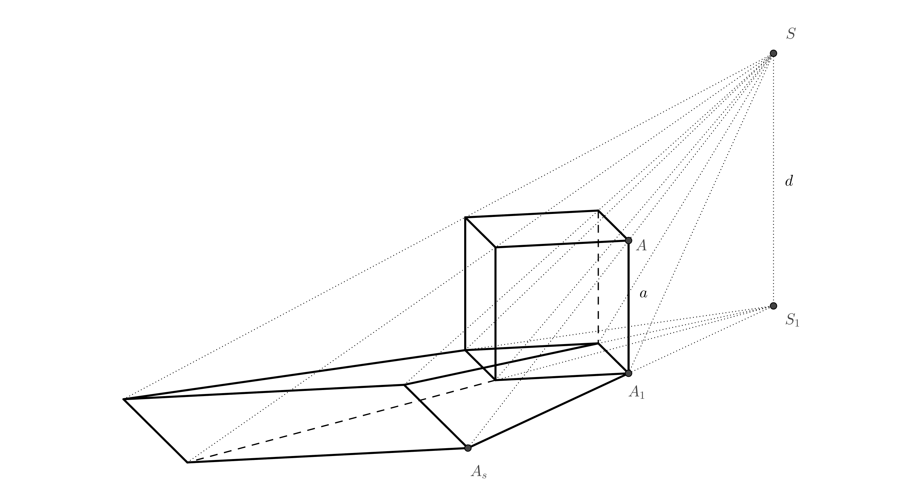

# Anamorfosis

## Anamorfosis en las bellas artes 

La anamorfosis es un tipo de arte visual en el que una parte de un plano o espacio, vista desde un ángulo determinado, revela una imagen oculta. 
La anamorfosis depende de que el observador encuentre el punto de vista adecuado. Esta forma de arte tiene una larga y rica historia. 
Una de las pinturas más famosas que utiliza la anamorfosis es "Los embajadores" (1533), del pintor alemán Hans Holbein el Joven (1497 – 1543). 

En la parte inferior del cuadro hay un extraño objeto alargado. 
Solo se puede apreciar si te colocas contra la pared cerca del marco derecho del cuadro y miras en esa dirección. 
Si encuentras la posición adecuada para mirar, verás que es una calavera. 

El arte anamórfico también puede utilizar reflejos de pinturas o esculturas en un cilindro[^1]. 

Hacia finales del siglo XX, el arte anamórfico experimentó un gran resurgimiento en la fotografía, el dibujo y las instalaciones a gran escala. 
Algunos artistas crean imágenes anamórficas a partir de objetos cotidianos como aparatos electrónicos, zapatos y calcetines[^2]. 
También encontramos anamorfosis en el arte callejero. 
A menudo, se trata de dibujos en la acera, la calle o la pared que sorprenden a un transeúnte y lo detienen un instante. 
Puede tratarse de un dibujo que parece un agujero en el suelo en el que corres el riesgo de caer, piernas que asoman por una pared o un canal, etc.
Las anamorfosis basadas en la proyección central resultan más convincentes si las observamos con un solo ojo o a través de una lente. 
Sin embargo, si el centro de la proyección está lo suficientemente alejado del objeto observado, está bien sombreado o su entorno refuerza de algún modo la impresión de espacio,
la ilusión es más convincente.

## Uso práctico  

En la industria cinematográfica, a veces se utilizan cámaras con lentes anamórficas para grabar películas. 
Estas se diseñaron originalmente para que las imágenes de formato ancho aprovecharan al máximo el área de los fotogramas estándar de 35mm. 
De lo contrario, las imágenes de formato ancho dejarían sin utilizar la parte superior e inferior del fotograma. 
A pesar de la llegada de los sensores digitales de alta resolución, las lentes anamórficas se siguen utilizando hoy en día por la apariencia única de la imagen resultante.

Algunas ciudades introdujeron cruces peatonales que, en algún momento, parecían prismas levitando a los ojos de los conductores que se aproximaban. 
Tras un breve periodo de prueba, la mayoría de estos cruces se cancelaron porque los conductores frenaban demasiado bruscamente delante de ellos. 

La técnica de proyección anamórfica se puede observar en algunos estadios deportivos, donde se utiliza para promocionar logotipos de empresas 
pintados en el campo de juego. Desde el ángulo de la cámara de televisión, las letras parecen estar en posición vertical dentro del campo de juego. 

## Anamorfosis de cuerpos básicos 

En el siguiente texto y ejemplos, crearemos anamorfosis de cuerpos básicos mediante proyección central sobre un plano. 
El plano en el que dibujaremos estas imágenes anamórficas se denominará plano de proyección. 
El plano de proyección será el papel sobre el que dibujaremo. 
Esto nos limitará el tamaño de los objetos. Observaremos las imágenes resultantes a través de la cámara de un teléfono móvil o una cámara fotográfica.
Si tienes la oportunidad, puedes crear imágenes anamórficas en exteriores, idealmente lejos del tráfico.  

## Pirámide y cono

Probablemente sea más fácil crear imágenes anamórficas de una pirámide y un cono, siempre que sus bases se encuentren en los planos de proyección. 
Expliquemos el principio en una pirámide. Además del cuerpo, es necesario especificar el centro de proyección $S$ y su proyección perpendicular sobre el plano de proyección $S_1$. 
Podemos imaginar el centro de proyección como el ojo del observador. La proyección perpendicular es el lugar donde se sitúa el observador.
La distancia $S _1S = d$ es, por lo tanto, la distancia del centro de proyección al plano de proyección. 
Para una pirámide tetraédrica regular, denotamos de forma similar su vértice como $V$ y la proyección perpendicular del vértice sobre el plano de proyección $V_1$. 
La intersección de la línea $SV$ (el llamado rayo de proyección) con el plano de proyección se obtiene entonces como la intersección de la línea $SV$ con la línea $S_1V_1$ (véase la siguiente figura a la izquierda). 
Es recomendable esbozar una imagen de este tipo al pensar en cómo funciona la ilusión y cómo se verá la proyección central. 
Sin embargo, esta imagen espacial no es necesaria para determinar la anamorfosis de la pirámide. 

Lo único que nos importa es el trapezoide $S_1V_1VS$, que también podemos representar en la proyección como el trapezoide $S_1V_1(V)(S)$(imagen anterior a la derecha). 
Los puntos que antes estaban en el espacio fuera de la proyección (puntos $V$ y $S$) ahora se muestran entre paréntesis en la proyección para distinguirlos. 
Los puntos $(V)$ y $(S)$ se crearon rotando el plano $S_1VS$ en $90^\circ$ hacia la tangente alrededor de la línea $S_1V_1$. 
Si conocemos la altura de la pirámide, la distancia del ojo del observador a la proyección y la distancia $S_1V_1$, podemos dibujar el trapezoide. 
Al extender sus lados no paralelos, obtenemos el punto de intersección $V_s$. 

El resultado (ver la imagen anterior a la izquierda) se dibuja mejor sin líneas auxiliares. Podemos observarlo a través del ojo de la cámara. 
Al observar a través del ojo de la cámara, observamos que los bordes invisibles de la base inferior se dibujan mejor con una línea discontinua más densa que la proyección del borde lateral invisible.
Para que la pirámide parezca creíble, sombreamos la imagen. Solo podemos estimar la sombra; podemos elegir la sombra proyectada por la cima. 
La anamorfosis de la pirámide está completa; para que la ilusión funcione, la cámara de la cámara debe estar colocada sobre el punto $S_1$ a una altura igual a la distancia$S_1(S)$.
La imagen resultante, vista a través del ojo de la cámara, debería ser similar a la siguiente imagen.

> **Tarea 1.** Queremos dibujar una figura en el suelo que se parezca a un cono con una altura de $1\,\mathrm{m}$ y una base con un radio de $r=0{,}4\,\mathrm{m}$ en el espacio.
> De nuevo, señalaremos el centro de proyección como $S$ y su proyección perpendicular como $S_1$.
> Supongamos que el ojo de un observador promedio está a una altura de $150\,\mathrm{cm}$ del suelo.
> ¿A qué distancia debe estar $V_s$ de $V_1$ ($V_s$ es la proyección central del vértice del cono sobre el plano de proyección, $V_1$ es la proyección perpendicular del vértice del cono sobre el plano de proyección)?

\iffalse

*Solución.* Los triángulos $S_1V_sS$ y $V_1V_sV$ son similares.   

 

Por tanto, se aplica que las proporciones de las respectivas partes son iguales: 

$$\frac{x}{1}= \frac{x+3}{1{,}5},$$ 

$$1{,}5\,x=x+3,$$ 

de donde obtenemos $x=6$. La distancia del punto $V_s$ a $V_1$ debe ser de $6$ metros.

\fi

> **Tarea 2.** Tenemos una circunferencia base $k$ con centro $V_1$ y punto $V_s$ (ver figura para la tarea).
> Ahora imaginemos un cono de revolución en el espacio con una circunferencia base $k$ y centro de proyección $S$, tal que $V_s$ es la proyección central del vértice del cono.
> $V_1$ es la proyección perpendicular del vértice del cono sobre el plano de proyección (en el papel). Determinemos el contorno de la proyección central del cono. 

\iffalse

*Solución.* El contorno del cono (excepto parte del círculo base) estará formado por tangentes desde el vértice $V_s$. 
Más precisamente, estas serán las rectas que unen el punto $V_s$ con los puntos de contacto $T$ y $T'$, 
que obtenemos como las intersecciones del círculo de Thales $l$ sobre el diámetro $V_1V_s$ con el círculo $k$. 

\fi

> **Tarea 3.** Para resolver el problema anterior, determine la posición del centro de $S$ (usando $S_1$ y $(S)$),
> si conocemos la altura $v$ del cono espacial y $d=\left|S_1S\right|$. 
> Mira la siguiente figura para la tarea; las longitudes $v$ y $d$ están dadas por líneas.

\iffalse

*Solución.* El punto $S$ debe cumplir dos condiciones. Su distancia a la proyección es igual a $d$ y debe estar sobre la recta $VV_s$. 
El centro $S$ y el punto $V$ se encuentran en un plano perpendicular a la proyección. La intersección de estos dos planos es la recta $o=V_1V_s$. 
Podemos rotar el vértice $V$ alrededor de esta recta $90^\circ$ con respecto a la proyección. 
Señalamos la imagen rotada del punto $V$ como $(V)$, debe estar a una distancia $v$ del punto $V_1$ sobre la perpendicular al eje $o$. 
A una distancia $d$ del eje $o=V_1V_s$ trazamos una recta $p$. El punto $(S)$ debe estar en la intersección de las rectas $p$ y $(V)V_s$  

\fi

## Prisma y cilindro

Al representar anamórficamente un prisma y un cilindro, utilizaremos la equivalencia. 
Explicaremos por qué esto es así utilizando el ejemplo de un cubo en la siguiente figura. 
Entre la base superior del cubo y su proyección, existe una relación de equivalencia en el espacio con el centro $S$ (esto se deduce de la semejanza de triángulos). 
Dado que la base inferior del cubo es también la proyección perpendicular de la base superior sobre el plano de proyección, 
entonces la relación de equivalencia entre la base inferior y la proyección central de la base superior con el centro de equivalencia $S_1$ funciona.  

 
> **Tarea 4.** Determinar la anamorfosis del cubo. El cuadrado de la base inferior está dado por los vértices opuestos $A_1$, $C_1$.
> A continuación, se da la posición del punto $S_1$ (la proyección perpendicular del centro de proyección $S$), la longitud $d$ está dada por el radio del círculo $k$. 

\iffalse

*Solución.* Construimos un cuadrado $A_1B_1C_1D_1$ con diagonal $A_1C_1$. En la figura, vemos que el punto $A_s$ es la intersección de las rectas $AS$ y $A_1S_1$. 
Conocemos las longitudes de los lados paralelos del trapezoide $A_1S_1SA$, por lo que alredededor del lado $A_1S_1$ podemos rotarlo $90^\circ$ con respecto a la proyección. 
La longitud $S_1(S)=d$ viene dada por el radio del círculo $k$ y longitud $A_1(A)=a$ es la longitud del lado del cuadrado $A_1B_1C_1D_1$. 
El punto $A_s$ es la intersección de la recta $S_1A_1$ y la recta $(S)(A)$. 

El cuadrado con vértice $A_s$ se dibuja entonces utilizando equilateralidad. Las aristas del cubo corresponden a los vértices de los cuadrados 
que se corresponden entre sí en equilateralidad. 
Hemos terminado. Sin embargo, si queremos reforzar la ilusión de un cubo, podemos dibujar otro cuadrado 
que corresponda al cuadrado $A_1B_1C_1D_1$ en equilateralidad con centro  $S$ y coeficiente $0<k<1$. 
Si lo coloreamos de gris, determinaremos la sombra del cubo (cuando la dirección de la iluminación sea superior) y crearemos la impresión de que el cubo levita en el espacio.

\fi

> **Tarea 5.** Dados dos círculos de diferentes tamaños, consulta la siguiente figura para la tarea.
> Determina su centro de simetría $S_1$ y sus tangentes comunes de modo que la imagen resultante sea una anamorfosis de un cilindro. 

\iffalse

*Solución.* Dos círculos excéntricos cualesquiera con radios diferentes colisionan de dos maneras. 
Nos interesa saber cómo el coeficiente de colisión es positivo. Primero, construimos el centro de colisión (véase la siguiente figura).

Encontramos los puntos de contacto en los círculos de Tales por encima de los diámetros $S_1O_1$ y $S_1O_s$. 
Solo entonces dibujamos las tangentes (si dibujamos con regla y compás).

La anamorfosis resultante del cilindro se muestra en la siguiente imagen.

 
\fi

> **Tarea 6.** El coeficiente de uniformidad $H(S,k)$ en el ejemplo anterior, que representa $O_1$ na $O_s$ es $k=1{,}5$.
> ¿Cuál debe ser la relación $d:v$, donde $d=\left|S_1S\right|$ y $v=\left|O_1O\right|$ (la altura del cilindro imaginario en el espacio)
> para que funcione la ilusión espacial?

\iffalse

*Solución.* Señalemos $x=\left|S_1O_1\right|$. Gracias al coeficiente de similitud, sabemos que $\left|S_1O_s\right|=1{,}5\,x$. 
Esto implica que $\left|O_1O_s\right|=0{,}5\,x$. Luego, volvemos a usar la similitud de los triángulos $S_1O_s(S)$ a $O_1O_s(O)$en la siguiente figura.

$$
\frac{d}{v}= \frac{1{,}5\,x}{0{,}5\,x}=3
$$ 

La relación $d:v$ debe ser igual a $3:1$

\fi 

## Referencias y bibliografía

### Bibliografía

https://en.wikipedia.org/wiki/Anamorphosis

### Fuentes de las imágenes

- Los embajadore
    <https://en.wikipedia.org/wiki/File:Hans_Holbein_the_Younger_-_The_Ambassadors_-_Google_Art_Project.jpg>
 
- Cráneo (detalle del cuadro Los Embajadores visto desde la ubicación correcta)
    <https://en.wikipedia.org/wiki/File:Holbein_Skull.jpg> 

[^1]: https://commons.wikimedia.org/wiki/File:Anamorphic_frog_sculpture_by_Jonty_Hurwitz.jpeg.

[^2]: https://www.youtube.com/watch?v=y__zPc3MZm4.
 

 

