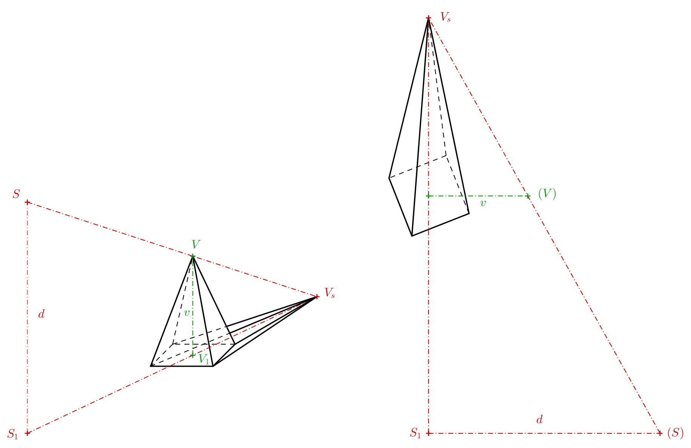
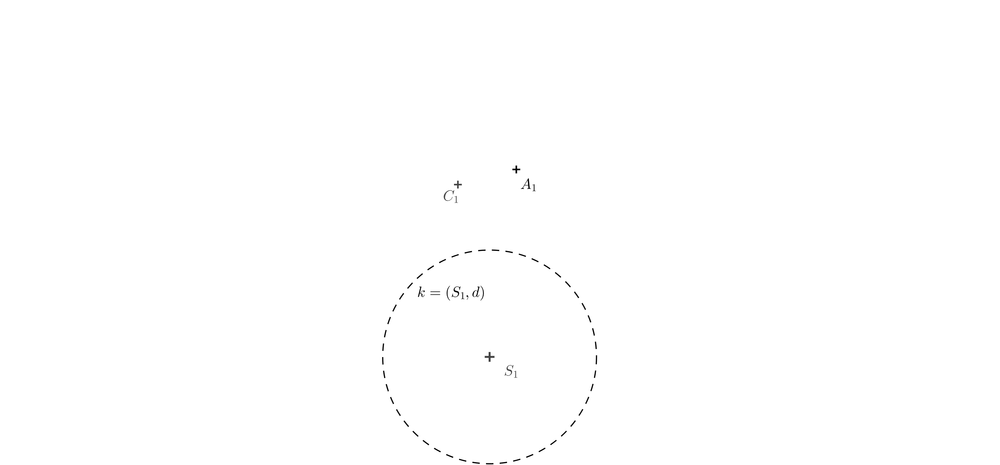

---
keywords:
- geometria v priestore
- anamorfózy
- telesá
- premietanie
- stredové premietanie
- perspektíva
is_finished: true
---

# Anamorfózy

## Anamorfózy vo výtvarnom umení 

Anamorfóza je druh vizuálneho triku či umenia, pri ktorom časť roviny alebo priestoru videná z určitého uhla odhaľuje skrytý obraz. 
Anamorfóza závisí od toho, či pozorovateľ nájde správne miesto, odkiaľ sa pozerať. Tento druh umenia má dlhú a bohatú históriu. 
Jedným z najznámejších obrazov využívajúcich anamorfózy sú Veľvyslanci (1533) nemeckého maliara Hansa Holbeina mladšieho (1497 – 1543). 

V dolnej časti obrazu je namaľovaný istý podivný predĺžený objekt. 
O čo ide je možné rozoznať len vtedy, ak sa postavíte k stene pri pravom ráme obrazu a zadívate sa tým smerom. 
Ak nájdete správnu pozíciu, odkiaľ sa pozerať, uvidíte, že ide o lebku. 

Anamorfné umenie môže využívať aj odrazy obrazov alebo sôch vo valci[^1]. 

Ku koncu 20. storočia zažilo anamorfné umenie veľké oživenie vo fotografii, kresbe a veľkoplošných inštaláciách. 
Niektorí umělci vytvárajú anamorfné obrazy z predmetov dennej potreby ako elektronika, alebo obuv a ponožky[^2]. 
S anamorfózami sa môžeme stretnúť aj v rámci street artu. 
Často ide o kresby na chodníku, ceste či na stene, ktoré náhodného okoloidúceho prekvapia a na okamih zamedzia. 
Môže ísť napríklad o kresbu, ktorá vyzerá ako diera v zemi, do ktorej hrozí pád, nohy vyčnievajúce zo steny či kanála a podobne.
Anamorfózy založené na stredovom premietaní sú presvedčivejšie, ak ich sledujeme jedným okom alebo cez objektív. 
Ak je ale stred premietania dostatočne ďaleko od pozorovaného objektu, je dobre vystienený alebo jeho okolie nejako podporuje dojem priestoru,
je ilúzia presvedčivejšia.

## Praktické využitie  

Vo filmovom priemysle sa na natáčanie filmov niekedy používajú kamery s anamorfnými šošovkami. 
Tie boli pôvodne navrhnuté z toho dôvodu, aby širokoformátové snímky plne využívali plochu štandardných filmových políčok s výškou 35 mm. 
Inak by širokoformátové snímky ponechali hornú a spodnú časť rámčeka nevyužitú. 
Napriek príchodu digitálnych snímačov s veľkým rozlíšením sa anamorfné objektívy používajú pre unikátnosť výsledného obrazu aj v dnešnej dobe.

V niektorých mestách zavádzali priechody pre chodcov, ktoré v určitom okamihu vyzerali z pohľadu prichádzajúceho vodiča ako levitujúce hranoly. 
Po krátkej skúšobnej dobe boli väčšinou zrušené, pretože pred nimi vodiči brzdili príliš prudko. 

Techniku anamorfnej projekcie môžeme vidieť na niektorých športových štadiónoch, keď sa používa na propagáciu firemných značiek, 
ktoré sú namaľované na hraciu plochu. Z uhla televíznej kamery sa nápis javí ako nápisy stojace zvisle v rámci hracej plochy. 

## Anamorfózy základných telies 

V nasledujúcom texte a príkladoch vytvoríme anamorfózy základných telies pomocou stredového premietania do roviny. 
Rovine, v ktorej tieto anamorfné obrazy budeme rysovať budeme hovoriť priemetňa. 
Priemetňou pre nás bude papier, na ktorý budeme rysovať. 
Tým budeme obmedzení, čo sa týka veľkosti objektov. Vzniknuté obrazy potom budeme pozorovať okom kamery cez mobil alebo fotoaparát.
Ak máte možnosť, môžete anamorfné obrazy vytvárať vonku, ideálne mimo komunikácií.  

## Ihlan a kužeľ

Asi najjednoduchšie je vytvoriť anamorfné obrazy ihlana a kužeľa, ak teda ich podstavy ležia v priemetňach. 
Poďme si princíp vysvetliť na ihlane. Okrem telesa je treba zadať aj stred premietania $S$ a jeho kolmý priemet do priemetne $S_1$. 
Stred premietania si môžeme predstaviť ako oko pozorovateľa. Kolmý priemet ako miesto, kde pozorovateľ stojí.
Vzdialenosť $S_1S = d$ je teda vzdialenosť stredu premietania od priemetne. 
U pravidelného štvorobokého ihlana obdobne označíme jeho vrchol ako $V$ a kolmý priemet vrcholu do priemetne $V_1$. 
Priesečník priamky $SV$ (takzvaného premietacieho lúča) s priemetňou potom získame ako priesečník priamky $SV$ s priamkou $S_1V_1$ (pozri nasledujúci obrázok vľavo). 
Taký obrázok je dobré si načrtnúť, keď premýšľame, ako ilúzia funguje, a ako bude stredový priemet vyzerať. 
Pre určenie anamorfózy ihlana ale tento priestorový obrázok treba nie je. 

Dôležitý je pre nás len lichobežník $S_1V_1VS$, ktorý si môžeme znázorniť aj v priemetni ako lichobežník $S_1V_1(V)(S)$ (predchádzajúci obrázok vpravo). 
Body, ktoré boli predtým v priestore mimo priemetne (body $V$ a $S$) teraz v priemetni uvádzame v zátvorke, aby sme ich vzájomne odlíšili. 
Body $(V)$ a $(S)$ vznikli pootočením roviny $S_1VS$ o $90^\circ$ do priemetne okolo priamky $S_1V_1$. 
Ak poznáme výšku ihlana, vzdialenosť oka pozorovateľa od priemetne, a vzdialenosť $S_1V_1$, potom môžeme lichobežník narysovať. 
Predĺžením jeho strán, ktoré nie sú vzájomne rovnobežné, dostaneme priesečník $V_s$. 

Výsledok (pozri predchádzajúci obrázok vľavo) je vhodné nakresliť bez pomocných čiar. Môžeme sa naň pozrieť okom kamery. 
Pri prehliadke cez oko kamery zistíme, že neviditeľné hrany dolnej podstavy je vhodné nakresliť hustšou čiarkovanou čiarou než priemet neviditeľnej bočnej hrany.
Ak chceme, aby ihlan vyzeral vierohodne, obrázok vystienujeme. Tieň môžeme len odhadnúť, vrhnutý tieň vrcholu si môžeme zvoliť. 
Anamorfóza ihlana je hotová, kameru fotoaparátu (aby ilúzia fungovala), je treba nastaviť nad bod $S_1$ vo výške rovnej vzdialenosti $S_1(S)$.
Výsledný obraz cez oko kamery by mal vyzerať približne ako na nasledujúcom obrázku.

> **Úloha 1.** Chceme na zem nakresliť tvar, ktorý bude v priestore vyzerať ako kužeľ o výške $1\,\mathrm{m}$ a s podstavou o polomere $r=0{,}4\,\mathrm{m}$.
> Stred premietania budeme opäť značiť $S$ a $S_1$ jeho kolmý priemet.
> Predpokladáme, že oko priemerného pozorovateľa je vo výške $150\,\mathrm{cm}$ od zeme.
> V akej vzdialenosti musí byť $V_s$ od $V_1$ ($V_s$ je stredový priemet vrcholu kužeľa do priemetne, $V_1$ je kolmý priemet vrcholu kužeľa do priemetne)?

\iffalse

*Riešenie.* Trojuholníky $S_1V_sS$ a $V_1V_sV$ sú podobné.   

 

Platí teda, že pomery príslušných strán sú si rovné: 

$$\frac{x}{1}= \frac{x+3}{1{,}5},$$ 

$$1{,}5\,x=x+3,$$ 

odkiaľ dostávame $x=6$. Vzdialenosť bodu $V_s$ od $V_1$ musí byť $6$ metrov.

\fi

> **Úloha 2.** Máme danú podstavnú kružnicu $k$ so stredom $V_1$ a bod $V_s$ (zadanie pozri obrázok).
> Predstavme si teraz v priestore rotačný kužeľ s podstavnou kružnicou $k$ a stred premietania $S$, také že $V_s$ je stredový priemet vrcholu kužeľa.
> $V_1$ je kolmý priemet vrcholu kužeľa do priemetne (na papier). Určte obrys stredového priemetu kužeľa. 

\iffalse

*Riešenie.* Obrys kužeľa bude (okrem časti podstavnej kružnice) tvorený dotyčnicami z vrcholu $V_s$. 
Presnejšie to budú spojnice bodu $V_s$ s bodmi dotyku $T$ a $T'$, 
ktoré získame ako priesečníky Thaletovej kružnice $l$ nad priemerom $V_1V_s$ s kružnicou $k$. 

\fi

> **Úloha 3.** Pre riešenie predchádzajúcej úlohy určte polohu stredu $S$ (pomocou $S_1$ a $(S)$),
> ak poznáme výšku $v$ priestorového kužeľa a $d=\left|S_1S\right|$. 
> Zadanie pozri nasledujúci obrázok, dĺžky $v$ a $d$ sú dané pomocou úsečiek.

\iffalse

*Riešenie.* Bod $S$ musí spĺňať dve podmienky. Jeho vzdialenosť od priemetne je rovná $d$ a musí ležať na spojnici $VV_s$. 
Stred $S$ aj bod $V$ ležia v rovine kolmej na priemetňu. Priesečnica týchto dvoch rovín je priamka $o=V_1V_s$. 
Okolo tejto priamky môžeme vrchol $V$ pootočiť o $90^\circ$ do priemetne. 
Otočený obraz bodu $V$ označíme $(V)$, musí ležať vo vzdialenosti $v$ od bodu $V_1$ na kolmici na os $o$. 
Vo vzdialenosti $d$ od osi $o=V_1V_s$ narysujeme priamku $p$. Bod $(S)$ musí ležať na priesečníku priamky $p$ a $(V)V_s$  

\fi

## Hranol a valec

Pri anamorfnom zobrazení hranola a valca budeme využívať súmernosť. 
Prečo tomu tak je si vysvetlíme na príklade kocky na nasledujúcom obrázku. 
Medzi hornou podstavou kocky a jej priemetom je v priestore vzťah súmernosti so stredom $S$ (plynie z podobnosti trojuholníkov). 
Pretože dolná podstava kocky je súčasne kolmým priemetom hornej podstavy do priemetne, 
funguje potom vzťah súmernosti medzi dolnou podstavou a stredovým priemetom hornej podstavy so stredom súmernosti $S_1$.  

 
> **Úloha 4.** Určte anamorfózu kocky. Štvorec dolnej podstavy je daný protiľahlými vrcholmi $A_1$, $C_1$.
> Ďalej je daná poloha bodu $S_1$ (kolmý priemet stredu premietania $S$), dĺžka $d$ je zadaná polomerom kružnice $k$. 

\iffalse 

*Riešenie.* Zostrojíme štvorec $A_1B_1C_1D_1$ s uhlopriečkou $A_1C_1$. Na obrázku .. vidíme, že bod $A_s$ je priesečník priamok $AS$ a $A_1S_1$. 
Poznáme dĺžky rovnobežných strán lichobežníka $A_1S_1SA$, takže môžeme opäť vykonať jeho pootočenie okolo strany $A_1S_1$ o $90^\circ$ do priemetne. 
Dĺžka $S_1(S)=d$ je daná polomerom kružnice $k$ a dĺžka $A_1(A)=a$ je dĺžka strany štvorca $A_1B_1C_1D_1$. 
Bod $A_s$ je priesečník priamky $S_1A_1$ a priamky $(S)(A)$. 

Štvorec s vrcholom $A_s$ potom dorysujeme pomocou súmernosti. Bočné hrany kocky zodpovedajú spojeniam vrcholov štvorcov, 
ktoré si zodpovedajú v súmernosti. 
Máme hotovo. Ak ale chceme podporiť ilúziu kocky, môžeme narysovať ešte štvorec, 
ktorý zodpovedá štvrocu $A_1B_1C_1D_1$ v súmernosti so stredom $S$ a koeficientom $0<k<1$. 
Ak ho vyfarbíme šedou, určíme tým tieň kocky (pri smere osvetlenia zhora) a vytvoríme tým dojem, že kocka levituje v priestore.

\fi

> **Úloha 5.** Majme dané dve rôzne veľké kružnice, zadanie pozri nasledujúci obrázok.
> Určte stred ich súmernosti $S_1$ a ich spoločné dotyčnice tak, aby výsledný obrázok bol anamorfózou valca. 

\iffalse

*Riešenie.* Každé dve nesústredné kružnice s rôznymi polomermi sú súmerné dvoma spôsobmi. 
Nás zaujíma ten spôsob, keď koeficient súmernosti je kladný. Najprv zostrojíme stred súmernosti (pozri nasledujúci obrázok).

Body dotyku nájdeme na Thaletových kružniciach nad priemrmi $S_1O_1$ a $S_1O_s$. 
Až potom rysujeme dotyčnice (ak rysujeme pomocou pravítka a kružidla).

Výsledná anamorfóza valca je na nasledujúcom obrázku.

 
\fi

> **Úloha 6.** Koeficient súmernosti $H(S,k)$ v predchádzajúcom príklade, ktorá zobrazuje $O_1$ na $O_s$ je $k=1{,}5$.
> Aký musí byť pomer $d:v$, kde $d=\left|S_1S\right|$ a $v=\left|O_1O\right|$ (výška pomyselného valca v priestore),
> aby priestorová ilúzia fungovala?

\iffalse

*Riešenie.* Označme si $x=\left|S_1O_1\right|$. Vďaka koeficientu súmernosti potom vieme, že $\left|S_1O_s\right|=1{,}5\,x$. 
Z toho plynie $\left|O_1O_s\right|=0{,}5\,x$. Potom opäť využijeme podobnosť trojuholníkov $S_1O_s(S)$ a $O_1O_s(O)$ na nasledujúcom obrázku.

$$\frac{d}{v}= \frac{1{,}5\,x}{0{,}5\,x}=3$$ 

Pomer $d:v$ musí byť rovný $3:1$

\fi
 

## Odkazy a literatúra

### Literatúra

https://en.wikipedia.org/wiki/Anamorphosis

### Zdroje obrázkov

- Velvyslanci 
    <https://en.wikipedia.org/wiki/File:Hans_Holbein_the_Younger_-_The_Ambassadors_-_Google_Art_Project.jpg>
 
- Lebka (detail obrazu Velvyslanci při pohledu ze správného místa)
    <https://en.wikipedia.org/wiki/File:Holbein_Skull.jpg> 

[^1]: https://commons.wikimedia.org/wiki/File:Anamorphic_frog_sculpture_by_Jonty_Hurwitz.jpeg.

[^2]: https://www.youtube.com/watch?v=y__zPc3MZm4.
 