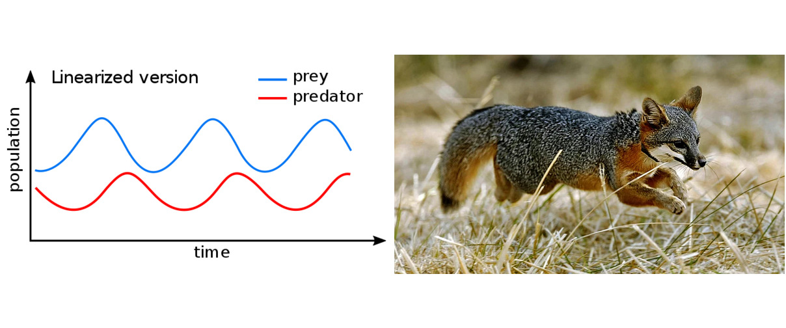

---
keywords:
- functions
- rational fractional function
- asymptote
is_finished: false
---

### Instructions for translators

1. Open this file on GitHub server. If you see `https://um.mendelu.cz/...` in
   URL, click `View on GitHub` to open this file on github.com.
1. If you see this file on GitHub server, you can edit the content of the file.
   Open the file in an editor. You can use simple editor (pres `e` on GitHub).
   However, an advanced VS Code editor (press `.` on GitHub) is better, since it
   provides preview how the Markdown code renders. Alternatively press pencil
   for simple editor or press triangle next to the pencil to get access to VS
   Code described as `github.dev`. 
1. Fix the keywords in the preamble.
1. Depending on which language version you want to use as a source for your
   translation, delete either English or Czech version below.
1. Translate to your language. Keep Markdown marking and math notation. If you
   use a tool to get first version of the translation, make sure that the markup
   is preserved. 
1. In VS Code you can open the preview in another window by pressing `Ctrl+V`
   and `K`. Keep the preview open as you work, or close using a mouse.
1. Instead of saving, you have to commit and push the changes to the repository.
   Fill the Message under `Source control` (describe your changes, such as
   "Polish translation started") and then press Commit&Push.
1. Make sure that your changes appear in the commit history. In rare cases
   (if you work with simultaneously with someone else) you have to download
   /Pull/ and merge his and yours changes. Usualy Sync (Pull & Push) should
   work.
1. When you finish the translation, change `is_finished: False` in header to `is_finished: True`.

### Instrukce pro překladatele

1. Otevřete tento soubor na serveru GitHub. Pokud máte soubor otevřen na `https://um.mendelu.cz/...`, otevřete jej na serveru github.com.
1. Pokud tento soubor vidíte na serveru GitHub, můžete obsah souboru upravit.
   Otevřete soubor v editoru. Můžete použít jednoduchý editor (stiskněte `e` na GitHubu).
   Lepší je však pokročilý editor VS Code (stikněte `.` na GitHubu), protože poskytuje náhled, jak se kód Markdown interpretuje. Případně stiskněte tužku
   pro jednoduchý editor nebo stiskněte trojúhelníček vedle tužky, abyste získali přístup k editoru VS
   Code popsaný jako `github.dev`. 
1. Opravte klíčová slova v preambuli.
1. V závislosti na tom, kterou jazykovou verzi chcete použít jako zdrojový kód pro svůj
   překladu, odstraňte níže uvedenou anglickou nebo českou verzi.
1. Přeložte do svého jazyka. Ponechte značení Markdown a matematický zápis. Pokud
   použijete nástroj typu DeepL pro získání první verze překladu, ujistěte se, že zápis matematických výrazů
   byl zachován. 
1. Ve VS Code můžete náhled otevřít v jiném okně stisknutím `Ctrl+V`.
   a `K`. Během práce nechte náhled otevřený nebo jej zavřete pomocí myši.
1. Místo uložení musíte změny zaregistrovat a odeslat do úložiště.
   Vyplňte zprávu v poli `Zpráva` (popište své změny, např.
   "Zahájen překlad do polštiny") a poté stiskněte tlačítko Commit&Push.
1. Ujistěte se, že se vaše změny objeví v historii revizí. Ve výjimečných případech
   (pokud pracujete současně s někým jiným) musíte stáhnout
   /Pull/ a sloučit jeho a vaše změny. Obvykle by synchronizace (Pull & Push) měla
   fungovat.
1. Po dokončení překladu změňte `is_finished: False` v záhlaví na `is_finished: True`.

---
---

### Czech source

# Trofické funkce v modelech dravce a kořisti

Při studiu přírody hrají neocenitelnou roli matematické modely. Tyto
modely otevírají cestu k předpovědím budoucího vývoje, ale plní i
další a důležitější role.

Používání ekologických modelů bývá někdy zmiňováno jako fyzikální postupy 
v ekologii, protože se studuje ekosystém z hlediska vývoje populací a
používají se k tomu matematické metody původně
odvozené na řešení fyzikálních úloh. Výstupy z modelů poté nesou například 
následující informace.

* **Predikce** Schopnost pracovat s matematickými modely ekosystémů
    umožňuje předpovídat budoucí vývoj. Může se jednat o vývoj v
    neměnném prostředí, nebo vývoj v prostředí, ve kterém se některý z
    parametrů mění. Znalost modelu potom umožní posoudit, jaký má tato
    změna vliv na ekosystém.
* **Porozumění principům** Matematické modely umožňují ekologům a
    vědcům zkoumat interakce mezi různými složkami ekosystémů a
    porozumět dynamice těchto systémů. Pomáhají tím identifikovat
    faktory ovlivňující strukturu a funkci těchto ekosystémů.
* **Optimalizace rozhodování** Matematické modelování ekosystémů může
     být použito k optimalizaci rozhodování v oblastech jako je
     ochrana biodiverzity nebo management lesů a rybolovu. 
     Pomáhá identifikovat nejlepší strategie pro
     dosažení vytyčených cílů.
  
Jedním ze základních vztahů v ekosystémech je vztah _dravce a
kořisti_. Tento vztah může být jedinou interakcí v ekosystému nebo
může být doplněn interakcemi dalšími. Důležitost modelování soužití
dravce a kořisti si objasníme na následujících historicky významných
modelech.

## Lotkův-Volterrův model

V roce 1926 publikoval jeden z prvních modelů dravce a kořisti italský
matematik Vito Voterra. Motivací k sestavení tohoto modelu byla
skutečnost, že během omezení rybolovu za první světové války v
úlovcích vzrostlo procento dravých ryb. Na tuto skutečnost upozornil
Volterru jeho zeť, mořský biolog Umberto D'Ancona, který si uvedený jev
nedokázal zdůvodnit. Dokonce čekal pravý opak: při omezení rybolovu
předpokládal zvýšení procentuálního podílu druhů menších ryb, které jsou
potravou pro dravce. Volterrův model toto chování vysvětluje jako
důsledek jednoduché představy interakce mezi dravými rybami a kořistí. 

Model obsahuje dvě rovnice. První rovnice 
popisující populaci kořisti obsahuje předpoklad, že tato populace 
přirozeně roste, ale růst je zpomalen
působením dravců. Více dravců vede k většímu zpomalení
růstu kořisti. Příliš mnoho dravců může vést dokonce k tomu, že velikost populace kořisti
bude klesat a kořist vymře. Rovnice věnovaná populaci dravců 
obsahuje předpoklad, že bez přítomnosti kořisti populace dravce vymírá. 
Čím více kořisti ale mají dravci k dispozici, tím spíše se toto vymírání
převrátí v nárůst populace dravce.

V systému popsaném výše vznikají přirozeně cykly. Dostatek kořisti
umožní nárůst populace dravců. Mnoho dravců poté působí na populaci
kořisti negativně do té míry, že populace kořisti začne vymírat. Toto
vymírání má za následek nedostatek potravy pro dravce a
ti začnou také vymírat. Po čase je populace dravce
redukována natolik, že kořist přítomnost dravce pociťuje
málo. Proto může její populace zase růst a namnožit se do původního stavu. To však
opět umožní růst populace dravce a uzavírá se cyklus. Velmi pěkně jsou
periodické změny velikosti obou populací patrné ze záznamů výkupu kožešin
sněžného zajíce a rysa v oblasti Hudsonova zálivu.

Volterra svým modelem vysvětlil nejenom vznik cyklů, ale i to, že
omezením lovu se rovnovážná poloha, okolo které populace dravce a
kořisti oscilují, posune ve prospěch dravce a nikoliv kořisti. Tento
jev, kterého si všiml D'Ancona, se nazývá _Volterrův efekt_.

Stejný model jako Volterra navrhl již v roce 1910 americký matematik
Alfred J. Lotka, a proto se model dnes nazývá Lotkův-Volterrův model.

## Model obaleče smrkového

Podobné periodické výkyvy jako v Lotkově-Volterrově modelu je možné
pozorovat i v kanadských lesích. Zde přibližně po 30 až 40 letech
docházelo k masovému přemnožení obaleče smrkového (_Choristoneura
fumiferana_). Populace tohoto motýla je relativně malá, ale některé
roky se zvýší tisícinásobně a jeho housenky dokáží zahubit až 80% stromů v
lese a ten tak prakticky zničit. Jeden z posledních masových výskytů byl
od roku 2006 v Quebecu. Zde bylo do roku 2019 zasaženo cca 9,6 milionu
hektarů lesa [^1], což je více než rozloha Maďarska.

[^1]: Zdroj viz <https://www.nrcan.gc.ca>.

V roce 1978 navrhli vědci D. Ludwig, D. D. Jones a C. S. Holling model, který
dokázal nejenom modelovat vývoj populace obaleče, ale pomohl objasnit
i důvody, proč k popisovanému přemnožení dochází. Důvodem byla
predace. V tomto případě šlo o konzumaci housenek obaleče ptáky. Ptáci
sloužili v přírodě jako faktor omezující počty housenek, ovšem jenom
do jistého limitu. Když se les dostatečně rozrostl, poskytl dostatek
potravy i populaci housenek. Populace housenek se pak rozrostla do
takové míry, že ptáci dosáhli při konzumaci potravy své saturace a
nedokázali dál stavy housenek redukovat. Tím se role ptáků jako
predátorů stala méně významnou a populace housenek se mohla velmi
rychle množit a poté zdevastovat les.

V tomto případě je predace důležitá pro omezení populace
housenek. Protože ptáci jako predátoři mají mnohem pomalejší cyklus
rozmnožování než obaleč, je možné jejich populaci považovat za
konstantní. Díky saturaci poté ptáci dokáží omezit rychlost růstu
obaleče jen do omezené míry. Toto omezení však od určité velikosti
populace obaleče přestává stačit a dojde k jeho nekontrolovatelnému přemnožení.

## Model lišky ostrovní

Liška ostrovní (_Urocyon littoralis_) je jedinečný živočišný druh,
endemit žijící jenom na ostrůvcích okolo Kalifornie. Je velká jako
kočka a díky absenci přirozených nepřátel důvěřivá. Jako druh je
citlivá a zranitelná vlivem malé genetické variability a malé
odolnosti vůči nemocem zavlečeným z pevniny. Je to jedna z nejmenších
psovitých šelem. Na rozdíl od ostatních psovitých šelem ale umí šplhat po
stromech.

Vlivem činnosti člověka se populace lišky ostrovní dostala na přelomu
tisíciletí do velkých potíží. Na ostrově San Miguel klesla populace z
450 dospělých jedinců v roce 1994 na 15 v roce 1999 [^2]. Podobná situace
byla i na okolních ostrovech, z nichž každý je osídlen samostatným
poddruhem lišky ostrovní. Příčinou úhynu byl celý řetězec událostí:
produkce insekticidu DDT ve 40. letech 20. století měla za následek
vymření orla bělohlavého (_Haliaeetus leucocephalus_) a ten byl
nahrazen orlem skalním (_Aquila chrysaetos_). Predátora živícího
se rybami tímto na ostrově vystřídal predátor preferující savce. Toto bylo
pro lišky ostrovní fatální. Lišky, dříve vrcholní predátoři, se najednou staly 
kořistí a na přelomu tisíciletí se ocitly těsně před vyhubením. A na
rozdíl od Lotkova--Volterrova modelu nebylo možné doufat v návrat
lišek na původní stavy díky oscilacím, protože orli měli i
alternativní potravu v podobě divokých prasat a skunků.

[^2]: Zdroj viz <https://www.iucnredlist.org/species/22781/13985603>.

Naštěstí se nesmírným úsilím podařilo lišky ostrovní jako druh
zachránit. Nejprve se podařilo správně identifikovat příčiny jejich 
úbytku. Poté již stačilo populaci lišek opětovně rozmnožit a zajistit
podmínky, ve kterých je populace stabilní. To zahrnovalo vybití
divokých prasat, přesídlení orlů skalních, návrat orlů bělohlavých,
umělé rozmnožení lišek, jejich návrat do přírody a jejich vakcinaci
proti zavlečeným chorobám. To vše se podařilo v rekordním čase, za
jednu dekádu. Jednalo se o jeden z nejúspěšnějších záchranných
programů pro savce.

## Trofické funkce

Důležitou komponentou modelů dravce a kořisti, ať se jedná o
kterýkoliv z výše uvedených případů, je _trofická funkce_. Tato funkce
modeluje působení jednoho predátora na populaci kořisti. Udává
rychlost, s jakou zpomaluje růst kořisti jeden dravec. Je-li $x$
velikost populace kořisti a $y$ rychlost, s jakou jeden dravec
zpomaluje růst kořisti (tj. množství kořisti ulovené dravcem za
jednotku času), můžeme tuto funkci matematicky zapsat ve tvaru
$$y=f(x).$$ 
Budeme se snažit najít přirozené předpoklady, které
trofická funkce musí splňovat. Poté se pro ni pokusíme najít vhodný
analytický tvar.

> **Úloha 1.** Předpoklady o působení dravce na kořist mají odraz ve
    vlastnostech, které musí mít trofická funkce. 
> 
> 1. Dravec v prostředí s chudou nabídkou potravy má i chudý
>    úlovek. Více kořisti znamená snazší dosah kořisti a tím i větší
>    úlovek.
> 1. Bez potravy dravec nic neuloví. Pokud je množství kořisti nulové,
>    je nulové i množství kořisti, které dravec uloví za jednotku času.
> 1. Dravci konzumují potravu jenom do své saturace. Je-li potravy
>    nadbytek, dravci neuloví za jednotku času více potravy než odpovídá
>    jejich saturaci.
> 
> Vyjádřete tyto vlastnosti pomocí pojmů, které používáme pro popis
>  vlastností funkcí. Jaké vlastnosti funkcí odpovídá každý z uvedených
>  bodů?

\iffalse

_Řešení._

1. Funkce $y=f(x)$ je rostoucí.

2. Funkce $y=f(x)$ prochází počátkem, tj. platí $f(0)=0$.

3. Funkce $y=f(x)$ je shora ohraničená. Jelikož je funkce rostoucí a 
shora ohraničená, tak má její graf vodorovnou asymptotu v nekonečnu.

\fi

## Trofická funkce Hollingova typu II

Trofická funkce udává, kolik kořisti zahubí jeden dravec za jednotku
času při dané velikosti populace kořisti. Musí tedy být definována na
množině nezáporných čísel a funkční hodnoty budou nezáporné (toto plyne 
i z bodů 1 a 2 v předchozí úloze). V předchozí části bylo ukázáno, že 
trofická funkce má procházet počátkem
a růst k vodorovné asymptotě (růst a ohraničenost shora). Tyto
vlastnosti nebudou splněny, pokud budeme hledat trofickou funkci mezi
lineárními funkcemi. Zkusíme tedy nejjednodušší nelineární funkci,
nepřímou úměrnost.

> **Úloha 2.** Vyjděte z grafu funkce $y=\frac 1x$. Na této funkci
>    provádějte transformace, které mění graf způsobem popsaným níže.
>
> 1. Přeškálujte graf $k$-krát ve svislém směru. Tím se nezmění monotonie
>    ani poloha vodorovné asymptoty, ale můžeme měnit rychlost růstu.
> 1. Převraťte graf okolo vodorovné osy a posuňte o $S$ nahoru. Tím
>    docílíme toho, že pro kladné $x$ bude funkce rostoucí a poroste k
>    asymptotě $S$.
> 1. Po uvedených transformacích má graf v nule svislou asymptotu a
>    jeden průsečík s vodorovnou osou vpravo od počátku. Posuňte graf
>    doleva tak, aby se svislá asymptota dostala vlevo od svislé osy a
>    průsečík s osou $x$ se posunul do počátku.

\iffalse

_Řešení._ Funkce, jejíž graf vznikne přeškálováním grafu funkce
$y=\frac{1}{x}$ ve svislém směru $k$-krát je $$y=\frac{k}{x}.$$
Převrácení dosáhneme vynásobením funkce fakorem $-1$ a posunu docílíme
přičtením hodnoty $S$. Těmito úpravami dostáváme funkci $$y=S-\frac{k}{x}.$$ Posun
doleva o $b$ zajistíme substitucí výrazu $x+b$ za $x$. Tím dostáváme
funkci $$y=S-\frac {k}{x+b}.$$ Po převedení na společného jmenovatele
má funkce tvar 
$$y=\frac{Sx+Sb}{x+b}-\frac{k}{x+b}=\frac{Sx + (Sb-k)}{x+b}.$$ 
Má-li platit $f(0)=0,$ musí být splněna podmínka
$$Sb-k=0.$$ 
Tato podmínka ukazuje, že tři konstanty nejsou nezávislé,
ale je mezi nimi uvedená vazba.

\fi

*Poznámka.* V předchozí úloze jsme odvodili analytický tvar pro
  jednu ze základních trofických funkcí. Jedná se o rostoucí funkci,
  která z počátku roste směrem k vodorovné asymptotě a rychlost růstu
  postupně klesá. Taková funkce se nazývá Hollingova funkce II
  typu. Bývá obvyklé ji psát ve tvaru $$f(x)=\frac {Sx}{x+b},\tag{1}$$
  kde $S$ je hladina saturace a $b$ konstanta, jejíž význam objasníme
  v následující úloze.

> **Úloha 3.** Ukažte, že pro velikost populace rovnu $b$ 
je hodnota trofické funkce (1) rovna polovině hodnoty 
saturace.

\iffalse

_Řešení._ Přímým dosazením do (1) dostáváme
$$f(b)=\frac{Sb}{b+b}=\frac {Sb}{2b}=\frac S2.$$ 
Tím je tvrzení dokázáno.

\fi

Následující úkol ukazuje opačný proces, kdy z trofické funkce ve tvaru
(1) odvodíme tvar ukazující postupné transformace funkce $y=\frac 1x$.

> **Úloha 4.** Upravte předpis funkce $$y=\frac {6x}{x+2}$$ do základního tvaru, tj. tak, abychom mohli vyčíst postupné transformace funkce $y=\frac 1x$ na graf zadané funkce.

\iffalse 

_Řešení._ Úlohu vyřešíme tak, že zlomek šikovně upravíme. V čitateli vytvoříme násobek
jmenovatele, zlomek rozdělíme na dva a zkrátíme:

$$\frac {6x}{x+2} = \frac {6(x+2)-12}{x+2}=\frac {6(x+2)}{x+2}-\frac {12}{x+2}=6-12\frac 1{x+2}$$

Tento výpočet ukazuje, že graf uvedené funkce obdržíme rozšířením
grafu funkce ve svislém směru dvanáctkrát, převrácením okolo vodorovné
osy, posunutím o šest jednotek nahoru a dvě jednotky doleva.

Stejného výsledku bychom docílili i tak, že bychom jmenovatele vydělili čitatelem.

\fi

> **Úloha 5.** Sestavte trofickou funkci, pokud víte, že rychlost
    konzumace potravy při saturaci predátorů je $6$, a že konzumace probíhá
    poloviční rychlostí pro populaci kořisti o velikosti $210$.

\iffalse

*Řešení.* Díky poznámce před třetí úlohou o obecném tvaru trofické funkce víme, že předpis bude tvaru
$$
y=\frac{Sx}{x+b},
$$
kde $S$ je hodnota saturace predátora, tj.
$$
y=\frac{6x}{x+b}\,.
$$
Hodnotu parametru $b$ můžeme rovnou říci díky Úloze 3, ale můžeme ji též rychle dopočítat z druhé podmínky ze zadání, jelikož víme, že
$$
3=\frac{6\cdot 210}{210+b}
$$
a odtud plyne $b=210$. Předpis výsledné funkce je tedy
$$
y=\frac{6x}{x+210}.
$$

\fi

## Literatura a odkazy

### Literatura

* Wikipedia, <https://en.wikipedia.org/wiki/Lotka%E2%80%93Volterra_equations> March 3, 2024
* R Mařík, Dynamické modely populací, <https://robert-marik.github.io/dmp/uvod.html>, March 3, 2024
* D. Ludwig, D.D. Jones, C.S. Holling: Qualitative analysis of insect outbreak systems: the spruce budworm and forest, Journal of Animal Ecology 47(1): 315–332, February 1978.

### Zdroje obrázků

* <https://en.wikipedia.org/wiki/Lotka%E2%80%93Volterra_equations#/media/File:Lotka_Volterra_dynamics.svg>
* <https://www.npr.org/sections/thetwo-way/2016/08/11/489695842/once-nearly-extinct-california-island-foxes-no-longer-endangered> Kevork Djansezian/AP 

---
---

### English source

Not available on July 10. If you want to start from English
translation, wait until it appears on <https://um.mendelu.cz/math4u/site/> anc copy the English text by hand.
