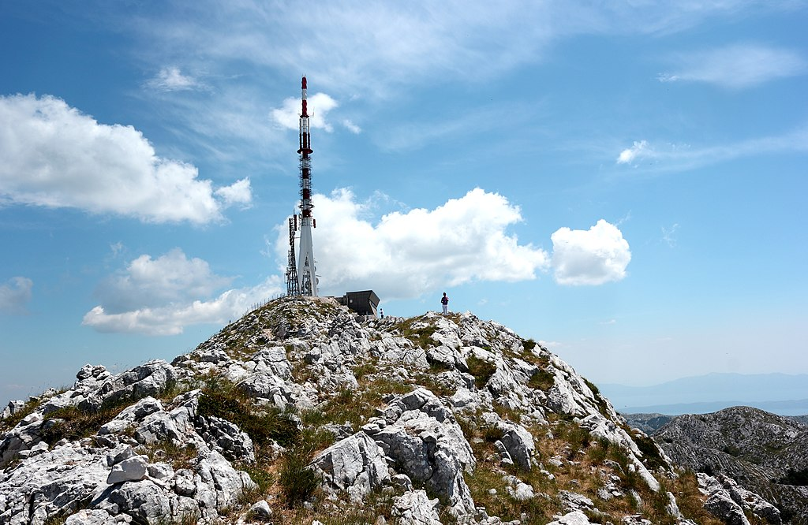
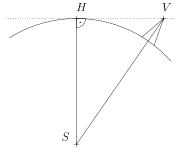
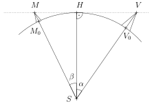

---
keywords:
- geometrie v rovině
- trigonometrie
is_finished: true
difficulty: 1
time: 15
---

# Výhled na moře

Už se vám někdy při letní procházce po mořském pobřeží 
stalo, že jste se zastavili, zadívali se na horizont a 
zamysleli se: Jak daleko vlastně dohlédnu? A co když je 
na druhé straně břehu něco — mohu to spatřit?

Pro konkrétnost se na chvíli přenesme do jedné z 
nejoblíbenějších evropských dovolenkových destinací – do 
Chorvatska, na břeh Jaderského moře k hoře Sveti Jure. O 
této hoře se můžeme dočíst následující informace[^1]: 

[^1]: www.chorvatsko.cz

*Sveti Jure* (Svatý Jiří) je nejvyšší vrchol (1762 m n. m.) 
vápencového Biokova, které se vypíná v délce 36 km 
souběžně s mořským pobřežím a odděluje Makarskou riviéru 
od vnitrozemské oblasti zvané Dalmatské Záhoří. Tyčí se 
nad pobřežím jako mohutná kamenná hradba. Díky svým 
geologickým zvláštnostem a přírodním krásám byla jeho 
část vyhlášena v roce 1981 chráněnou krajinnou oblastí 
(Park prirode Biokovo o rozloze 196 čtverečních kilometrů).

Pro vrchol Sveti Jure je charakteristická stavba 
televizního vysílače, kterou lze sledovat již většinu 
cesty hornatou krajinou. Pohled z vrcholu na moře i do 
vnitrozemí je při jasném počasí a dobré viditelnosti 
nezapomenutelný. Bohužel tu není žádná možnost 
občerstvení.

> **Úloha 1.** Stojíme-li na vrcholu Sveti Jure a díváme se na moře, jak daleko je od nás bod na horizontu na mořské hladině?

\iffalse

*Řešení.* Pro jednoduchost předpokládáme, že je Země 
koulí o poloměru $6371\,\text{km}$. Označme $S$ střed 
Země, bod $V$ naši polohu (vrchol hory Sveti Jure) a $H$ 
libovolný bod na mořské hladině na horizontu. Řezem 
zeměkoule rovinou $SVH$ je kružnice o poloměru Země, 
jejíž tečnou je přímka $VH$. Z toho vyplývá, že je úhel 
$VHS$ pravý, viz obrázek.

Víme, že $\lvert SH \rvert = 6371\,\text{km}$ a 
$\lvert SV \rvert  = 6372{,}762\,\text{km}$ (k poloměru 
Země přičítáme nadmořskou výšku hory). 
Užitím Pythagorovy věty pro pravoúhlý trojúhelník $VHS$ 
pak vypočítáme délku odvěsny $VH$: 
$$
\lvert VH \rvert = \sqrt{\lvert SV \rvert ^2 - \lvert SH \rvert ^2} \doteq 150\,\text{km}.
$$
Tato délka je zároveň hledaná vzdálenost k horizontu.

\fi

>**Úloha 2.** Je možné z vrcholu Sveti Jure vidět přes 
moře vrchol hory Monte Calvo ($1056\,\mathrm{m}\,\mathrm{n}.\,\mathrm{m}.$) na 
italském poloostrově Gargano? Monte Calvo je od Sveti 
Jure vzdálená přibližně $210\,\mathrm{km}$ a mezi oběma lokacemi se 
nenachází žádná suchozemská překážka. Dokonalému výhledu 
tak brání pouze horizont.

\iffalse

*Řešení.* Úlohu budeme řešit tak, že uvážíme hypotetickou 
horu stejné výšky jako je Monte Calvo, jejíž vrchol se 
nachází na horizontu. Výhled na tuto horu je tak zakryt 
horizontem. Označme vrchol této hory $M$ a dále označme 
$M_0$ kolmý průmět bodu $M$ do úrovně mořské hladiny a 
$V_0$ kolmý průmět bodu $V$.

Naším cílem bude určit vzdálenost obou hor, tj. délku 
oblouku $M_0V_0$. Bude-li menší než $210\,\text{km}$ 
(přibližná skutečná vzdálenost hor), nepůjde vidět z 
vrcholu Sveti Jure ani hora Monte Calvo.

Označme $\alpha$ velikost úhlu $VSH$ a $\beta$ velikost 
úhlu $MSH$; ze známé délky přepony a odvěsny v pravoúhlém 
trojúhelníku $VHS$ dostáváme
$$
\cos\alpha = \frac{6371}{6372{,}762} \Longrightarrow \alpha \doteq 1^{\circ}\,20'\,51''.
$$
Obdobně ze známé délky přepony a odvěsny v pravoúhlém 
trojúhelníku $MHS$ dostáváme
$$
\cos\beta = \arccos \frac{6371}{6372{,}056} \Longrightarrow \beta \doteq 1^{\circ}\,3'\,35''.
$$
Délku oblouku $M_0V_0$, který je příslušný úhlu o 
velikosti $\alpha + \beta$, pak určíme z přímé úměrnosti 
a známé délky celé kružnice:
$$
\frac{\alpha + \beta}{360^{\circ}}\cdot 2\pi\cdot 6371 \doteq 268\,\text{km}.
$$
Stejně vysoká hora Monte Calvo je blíže, její vrchol se 
proto nachází nad horizontem a můžeme ji (za dobré 
viditelnosti) z vrcholu Sveti Jure spatřit.

\fi

## Odkazy a literatura

### Literatura

* Chorvatsko.cz. *Sveti Jure* (online). Dostupné z https://www.chorvatsko.cz/stdal/svjure.html (cit. 12. 12. 2024).

### Zdroje obrázků

* Sveti Jure, SKas – Vlastní dílo, CC SA 4.0, dostupné z https://upload.wikimedia.org/wikipedia/commons/7/70/The_highest_peak_Sv_Jure_\%281762_m\%29_in_Biokovo_Nature_Park.jpg (cit. 12. 12. 2024).
