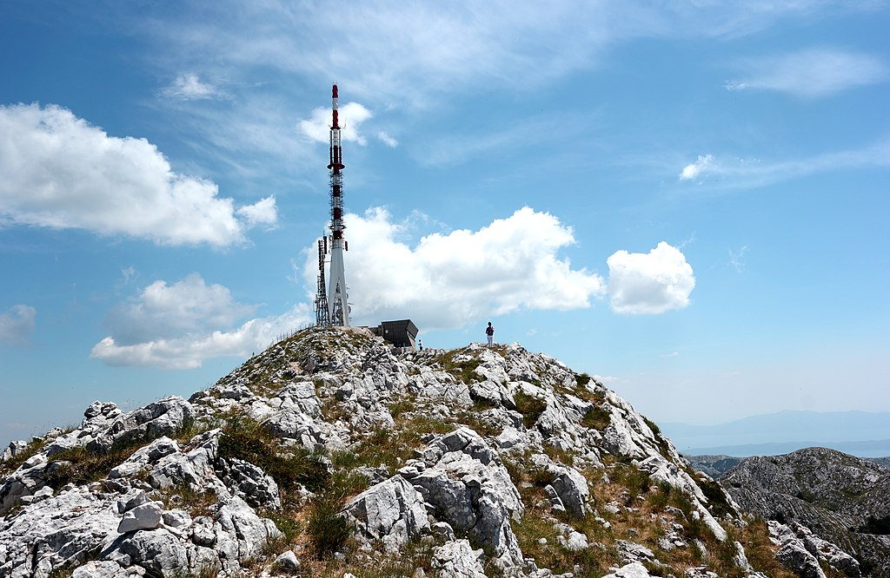

---
keywords:
- plane geometry
- trigonometry
is_finished: true
---

# A Sea View

Have you ever gone for a summer walk along the seashore, stopped, looked out at the horizon, and wondered: How far can I actually see? And what if there’s something on the far shore—could I see it?

To make this question more concrete, let’s travel for a moment to one of Europe’s most popular holiday destinations: Croatia, to the shores of the Adriatic Sea near Mount Sveti Jure. Here’s what we can read about this mountain[^1]: 

[^1]: www.chorvatsko.cz

*Sveti Jure* (Saint George) is the highest peak (1762 m above sea level) of the Biokovo limestone range, which stretches for 36 km along the coast and separates the Makarska Riviera from the inland region known as the Dalmatian Hinterland. It rises above the coast like a massive stone wall. Thanks to its unique geology and natural beauty, part of the area was designated a nature park in 1981 (Biokovo Nature Park, covering 196 square kilometres).

A distinctive feature of the Sveti Jure summit is a television transmitter, which can be seen from much of the surrounding mountainous terrain. On a clear day with good visibility, the view from the top—both toward the sea and inland—is unforgettable. Unfortunately, there are no refreshments available at the summit.

> **Exercise 1.** If we stand on the summit of Sveti Jure and look out to sea, how far away is the point on the horizon where the sea meets the sky?

\iffalse

*Solution.* For simplicity, let’s assume the Earth is a sphere with a radius of $6371\,\text{km}$. Let $S$ be the center of the Earth, $V$ our location (the summit of Mount Sveti Jure), and $H$ any point on the sea surface that lies on the horizon. The cross-section of the Earth through the plane $SVH$ is a circle with the Earth’s radius, and the line $VH$ is a tangent to this circle. This means that angle $VHS$ is a right angle (see figure below).

We know that $\lvert SH \rvert = 6371\,\text{km}$ and 
$\lvert SV \rvert  = 6372{.}762\,\text{km}$ (since we add the mountain’s elevation to the Earth’s radius). 
Using the Pythagorean theorem in the right triangle $VHS$ we calculate the length of the leg $VH$:
$$
\lvert VH \rvert = \sqrt{\lvert SV \rvert ^2 - \lvert SH \rvert ^2} \doteq 150\,\text{km}.
$$
This length is the distance to the horizon that we were looking for.

\fi

> **Exercise 2.** Is it possible to see the summit of Mount Monte Calvo (1056 m above sea level) on the Italian Gargano Peninsula from the summit of Sveti Jure? Monte Calvo is approximately 210 km away from Sveti Jure, and there are no land obstacles between the two locations. The only thing that could block the view is the curvature of the Earth.

\iffalse

*Solution.* We will solve this problem by imagining a hypothetical mountain of the same height as Monte Calvo, with its summit located exactly on the horizon. In such a case, the mountain would be just hidden behind the horizon. Let us label the summit of this hypothetical mountain as $M$, its vertical projection onto sea level as $M_0$, and the projection of point $V$ (Sveti Jure) as $V_0$.

Our goal is to determine the distance between the two mountains, i.e., the length of the arc $M_0V_0$. If this length is shorter than $210\,\text{km}$ 
(the actual distance), then Monte Calvo will be above the horizon and visible from Sveti Jure.

Let $\alpha$ be the angle $VSH$ and $\beta$ the angle $MSH$. From the known lengths of the hypotenuse and the adjacent side in the right triangle $VHS$ we get:
$$
\cos\alpha = \frac{6371}{6372{.}762} \Longrightarrow \alpha \doteq 1^{\circ}\,20'\,51''.
$$
Similarly, from triangle $MHS$:
$$
\cos\beta = \arccos \frac{6371}{6372{.}056} \Longrightarrow \beta \doteq 1^{\circ}\,3'\,35''.
$$
The arc length $M_0V_0$, corresponding to the angle $\alpha + \beta$, can then be calculated using direct proportion and the known circumference of the circle:
$$
\frac{\alpha + \beta}{360^{\circ}}\cdot 2\pi\cdot 6371 \doteq 268\,\text{km}.
$$
Since the real mountain Monte Calvo is located closer than that, its summit lies above the horizon, and we can (in good visibility conditions) see it from the top of Sveti Jure.

\fi

## Literature and References

### Literature

* Chorvatsko.cz. *Sveti Jure* (online). Available at: https://www.chorvatsko.cz/stdal/svjure.html (accessed December 12, 2024).

### Sources of figures

* Sveti Jure, SKas – Own work, CC SA 4.0, available at: https://upload.wikimedia.org/wikipedia/commons/7/70/The_highest_peak_Sv_Jure_\%281762_m\%29_in_Biokovo_Nature_Park.jpg (accessed December 12, 2024).
