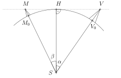

# Výhľad na more

Už sa vám niekedy pri letnej prechádzke po morskom pobreží stalo, že ste sa zastavili, zahľadeli na horizont a zamysleli sa: Ako ďaleko vlastne dovidím? A čo ak je na druhej strane brehu niečo — môžem to zazrieť?

Pre konkrétnosť sa na chvíľu prenesme do jednej z najobľúbenejších európskych dovolenkových destinácií – do Chorvátska, na breh Jadranského mora k hore Sveti Jure. O tejto hore si môžeme prečítať nasledujúce informácie:[^1]: 

[^1]: www.chorvatsko.cz

*Sveti Jure* (Svätý Juraj) je najvyšší vrchol ($1762\,m\,n.\,m.$)  vápenatého masívu Biokovo, ktoré sa tiahne v dĺžke 36 km súbežne s morským pobrežím a oddeľuje Makarskú riviéru od vnútrozemnej oblasti zvanej Dalmatské Záhorie. Vypína sa nad pobrežím ako mohutná kamenná hradba. Vďaka svojim geologickým zvláštnostiam a prírodným krásam bola jeho časť v roku 1981 vyhlásená za chránenú krajinnú oblasť (Park prirode Biokovo s rozlohou 196 štvorcových kilometrov).

Pre vrchol Sveti Jure je charakteristická stavba televízneho vysielača, ktorú možno vidieť už väčšinu cesty hornatou krajinou. Pohľad z vrcholu na more aj do vnútrozemia je pri jasnom počasí a dobrej viditeľnosti nezabudnuteľný. Žiaľ, nie je tam žiadna možnosť občerstvenia.

> **Úloha 1.** Stojíme na vrchole Sveti Jure a pozeráme sa na more – ako ďaleko je od nás bod na horizonte na morskej hladine?

\iffalse

*Riešenie.* Pre zjednodušenie predpokladajme, že Zem je guľa s polomerom $6371\,\text{km}$. Označme $S$ stred Zeme, bod $V$ našu polohu (vrchol hory Sveti Jure) a $H$ 
ľubovoľný bod na morskej hladine na horizonte. Rezom Zeme rovinou $SVH$ je kružnica s polomerom Zeme, ktorej dotyčnicou je priamka $VH$. Z toho vyplýva, že uhol 
$VHS$ je pravý, viď obrázok.

Vieme, že $\lvert SH \rvert = 6371\,\text{km}$ a 
$\lvert SV \rvert  = 6372{,}762\,\text{km}$ (k polomeru Zeme pripočítavame nadmorskú výšku hory). Použitím Pytagorovej vety pre pravouhlý trojuholník $VHS$ 
potom vypočítame dĺžku odvesny $VH$: 
$$
\lvert VH \rvert = \sqrt{\lvert SV \rvert ^2 - \lvert SH \rvert ^2} \doteq 150\,\text{km}.
$$
Táto dĺžka je zároveň hľadaná vzdialenosť k horizontu.

\fi

**Úloha 2.** 
Je možné z vrcholu Sveti Jure vidieť cez more vrchol hory Monte Calvo   ($1056\,m\,n.\,m.$) na Apeninskom polostrove Gargano? Monte Calvo je od Sveti Jure vzdialená približne $210\,\text{km}$ a medzi oboma miestami sa nenachádza žiadna pevninská prekážka. Dokonalému výhľadu tak bráni iba horizont.

\iffalse

*Riešenie.* Úlohu budeme riešiť tak, že uvažujeme hypotetickú horu rovnakej výšky, akú má Monte Calvo, ktorej vrchol sa nachádza na horizonte. Výhľad na túto horu je teda zakrytý horizontom. Označme vrchol tejto hory $M$ a ďalej označme 
$M_0$ kolmý priemet bodu $M$ do úrovne morskej hladiny a 
$V_0$ kolmý priemet bodu $V$.

Naším cieľom bude určiť vzdialenosť oboch hôr, teda dĺžku oblúka $M_0V_0$. Ak bude menšia než $210\,\text{km}$ 
(približná skutočná vzdialenosť hôr), nebude možné z vrcholu Sveti Jure vidieť ani horu Monte Calvo.

Označme $\alpha$ veľkosť uhla $VSH$ a $\beta$ veľkosť uhla $MSH$; zo známej dĺžky prepony a odvesny v pravouhlom trojuholníku $VHS$ dostávame
$$
\cos\alpha = \frac{6371}{6372{,}762} \Longrightarrow \alpha \doteq 1^{\circ}\,20'\,51''.
$$
Obdobne zo známej dĺžky prepony a odvesny v pravouhlom trojuholníku $MHS$ dostávame
$$
\cos\beta = \arccos \frac{6371}{6372{,}056} \Longrightarrow \beta \doteq 1^{\circ}\,3'\,35''.
$$
Dĺžku oblúka $M_0V_0$, ktorý prislúcha uhlu o veľkosti $\alpha + \beta$, potom určujeme z priamej úmernosti a známej dĺžky celej kružnice:
$$
\frac{\alpha + \beta}{360^{\circ}}\cdot 2\pi\cdot 6371 \doteq 268\,\text{km}.
$$
Rovnako vysoká hora Monte Calvo je bližšie, jej vrchol sa preto nachádza nad horizontom a môžeme ju (pri dobrej viditeľnosti) z vrcholu Sveti Jure zazrieť.

\fi

## Odkazy a literatúra

### Literatúra

* Chorvatsko.cz. *Sveti Jure* (online). Dostupné z https://www.chorvatsko.cz/stdal/svjure.html (cit. 12. 12. 2024).

### Zdroje obrázkov

* Sveti Jure, SKas – Vlastní dílo, CC SA 4.0, dostupné z https://upload.wikimedia.org/wikipedia/commons/7/70/The_highest_peak_Sv_Jure_\%281762_m\%29_in_Biokovo_Nature_Park.jpg (cit. 12. 12. 2024).

---
