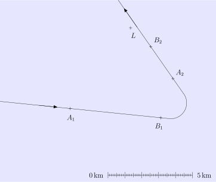
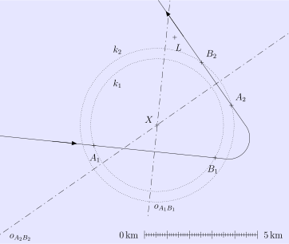
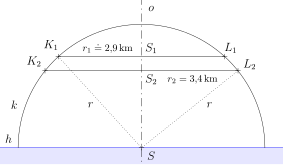
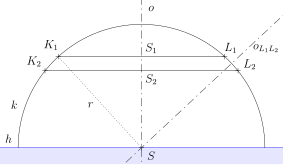
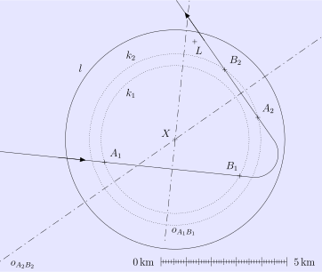

---
keywords:
- plane geometry
- Pythagorean theorem
- perpendicular bisector
is_finished: true
---

# Rescuing a Castaway

A plane is searching the open sea for a castaway who has a device on their raft that emits a distress signal.
The device has only a limited range. While flying over the sea, the crew picks up the signal, but after a short time, it is lost. The pilot turns the aircraft around, and they manage to receive the signal again, though only briefly.

The trajectory of the entire flight, including the direction of travel and the points where the signal was picked up (points $A_1$ a $A_2$) and lost (points $B_1$ and $B_2$) is shown on the map.

During both periods when the crew received the signal, the aircraft maintained a constant altitude.
Between points $B_1$ and $A_2$, the aircraft descended by $500,\text{m}$.

> **Exercise 1.** Use a geometric construction on the map to determine the position $X$ of the castaway.

\iffalse

*Solution.* The limited range of the castaway’s distress signal defines a hemisphere above the sea surface, with the center located at the castaway’s position. Horizontal cross-sections of this hemisphere are circles that appear on the map as concentric circles centered at point $X$. 

Since the aircraft maintained a constant altitude between points $A_1$ and $B_1$, the segment $A_1B_1$ forms a chord of a certain circle $k_1$ with center at point $X$. Therefore, point $X$ must lie on the perpendicular bisector of segment $A_1B_1$.
For the same reason, point $X$ must also lie on the perpendicular bisector of segment $A_2B_2$, since this segment is a chord of another circle $k_2$ centered at $X$.

\fi

> **Exercise 2.** There is a cargo ship in the area (position $L$).
> Can it also receive the castaway’s distress signal, or is it too far away?
>
> a) Transfer the lengths of segments $LX$, $A_1X$, and $A_2X$ from the solution to Exercise 1 to the scale provided. Using these distances (rounded to the nearest smallest unit of the scale), solve the problem numerically.
> 
> b) Using the construction from Exercise 1, solve the problem again—this time relying solely on geometric constructions.

\iffalse

*Solution.*

a) To solve the problem, we need to determine the range of the castaway’s device, which is the radius $r$ of the hemisphere mentioned in the solution to the previous exercise. 
By transferring the segments $A_1X$ and $A_2X$ to the scale and rounding their lengths to the nearest tenth of a kilometer, we get $\lvert A_1X \rvert \doteq 2{.}9\,\text{km}$ and $\lvert A_2X \rvert \doteq 3{.}4\,\text{km}$. These lengths are clearly the radii $r_1$ a $r_2$ of the circles $k_1$ a $k_2$.

Let us consider a projection of the hemisphere in which the circles $k_1$ and $k_2$ appear as parallel segments $K_1L_1$ and $K_2L_2$, such that they share the same perpendicular bisector $o$, their lengths are $2r_1$ and $2r_2$ respectively, and the vertical distance between them is $0{.}5\,\text{km}$.
Let $S$ be the center of the hemisphere, $S_1$ the midpoint of segment $K_1L_1$, and $S_2$ the midpoint of $K_2L_2$. See the figure below, where the sea level is also marked as a straight line $h$ for clarity.

Using the Pythagorean theorem on triangles $SS_1K_1$ and $SS_2L_2$, we obtain the following equations:
$$
\begin{align*}
r^2 &= r_1 ^2 + \lvert SS_1 \rvert ^2 \\
r^2 &= r_2 ^2 + \lvert SS_2 \rvert ^2.
\end{align*}
$$

We also know that $\lvert SS_1 \rvert = \lvert SS_2 \rvert + 0{.}5$. 
Substituting this into the first equation and comparing both expressions, we obtain a linear equation with a single unknown $\lvert SS_2 \rvert$, which we solve as follows:
$$
\begin{align*}
r_2 ^2 + \lvert SS_2 \rvert ^2 &= r_1 ^2 + \left( \left\lvert SS_2 \right\rvert + 0{.}5 \right) ^2 \\[1mm]
\left\lvert SS_2 \right\rvert &=  r_2^2 - r_1^2 - 0{.}25
\end{align*}
$$

Solving for $r$ using the second equation and substituting, we get:
$$
r = \sqrt{r_2 ^2 + \left(r_2^2 - r_1^2 - 0{.}25 \right)^2 } \doteq 4{.}5\,\text{km}.
$$

The distance from the ship to the castaway is given by the length of segment $LX$.
By transferring this segment to the scale, we find $\lvert LX \rvert \doteq 4{.}0,\text{km}$,
which is less than the range $r$ of the castaway’s signal.
Therefore, the ship can receive the signal.

b) To construct a geometric solution to the problem (i.e., to determine the radius $r$ of the hemisphere), we use the same auxiliary projection of the hemisphere as in Exercise 2a. 
The center of the hemisphere $S$ is the intersection of the common perpendicular bisector $o$ of segments $K_1L_1$ and $K_2L_2$ with the perpendicular bisector of segment $L_1L_2$, since $L_1L_2$ is a chord of the semicircle outline $k$. The desired radius $r$ is, for example, the length of segment $SK_1$ — see the figure.

To carry out the construction, we transfer the distances $r_1$ and $r_2$ from the solution to Exercise 1 (recall that $r_1=\lvert A_1X\rvert$ a $r_2=\lvert A_2X\rvert$), as well as the distance between the centers of the circles, $|S_1S_2|=d_{0{.}5}$, where $d_{0{.}5}$ is the map distance corresponding to $0{.}5\,\text{km}$, taken from the scale.

The projection of the hemisphere on the map is bounded by a circle $l$ with center at point $X$ and radius $r$, which we transfer from the auxiliary projection.
Once this circle is drawn, it is clear that the ship is within range of the distress signal.

\fi
