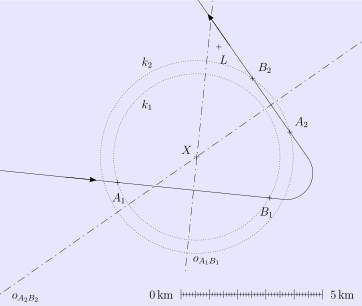
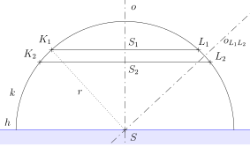

---
keywords:
- Geometría
- teorema de Pitágoras
- eje de recta
is_finished: True
---

# Rescate de un náufrago

Una aeronave busca en alta mar la posición de un náufrago que 
lleva una señal de socorro en su balsa. 
El dispositivo tiene un alcance limitado. Mientras sobrevuela el mar 
la tripulación capta la señal, pero al cabo de un rato se pierde. 
El piloto, por lo tanto, da la vuelta a la aeronave y consigue captar la señal de nuevo 
durante un breve periodo. 

La trayectoria completa del vuelo se muestra en el mapa, con la dirección indicada 
y las ubicaciones de adquisición de la señal (puntos $A_1$ a $A_2$) 
y pérdida (puntos $B_1$ a $B_2$).

Durante ambos momentos en que la tripulación recibió la señal, la aeronave 
no cambió su altitud, entre los puntos $B_1$ y $A_2$ disminuyó su  
altitud en $500\,\text{m}$.

> **Tarea 1.** Determinar en el mapa la posición $X$ 
> del náufrago.

\iffalse

*Solución.* El alcance limitado de la señal de socorro del náufrago determina un hemisferio en 
el espacio sobre la superficie, cuyo centro representa la posición 
del náufrago. Las secciones horizontales de este hemisferio son círculos que 
aparecen en el mapa concéntricos con el centro en el punto $X$. 

Dado que el avión entre los puntos $A_1$ y $B_1$ no cambia de altitud, es 
$A_1B_1$ una cuerda de un círculo $k_1$ con centro en el punto $X$. 
Por lo tanto, este debe estar sobre el eje del segmento $A_1B_1$. Por la misma razón,  
el punto $X$ también debe estar sobre el eje del segmento $A_2B_2$; es el centro  
de un círculo $k_2$, del cual este segmento es una cuerda. 

\fi

> **Tarea 2.** Hay un barco de transporte en la ubicación (posición $L$). 
> ¿Puede también registrar la señal de socorro del náufrago o está 
> demasiado lejos?
>
> a) Transfiere a escala los tamaños de los segmentos $LX$ y $A_1X$, $A_2X$ de la solución a la Tarea 1 
> Utilizando las distancias así determinadas 
> (redondeadas a la división entera más pequeña de la escala), resuelve 
> la tarea numéricamente.
> 
> b) Parte de la solución de la Tarea 1 y resuelve la tarea de nuevo, esta vez 
> utilizando únicamente construcciones geométricas.

\iffalse

*Solución.*

a) Para resolver el problema, necesitamos conocer el alcance del dispositivo 
zařízení, del náufrago, que es el radio $r$ del hemisferio mencionado en la solución 
del problema anterior. Al trasladar los segmentos $A_1X$ a $A_2X$ a escala y 
redondear sus longitudes a décimas de kilómetro, obtenemos 
$\lvert A_1X \rvert \doteq 2{,}9\,\text{km}$ 
a $\lvert A_2X \rvert \doteq 3{,}4\,\text{km}$. Estas longitudes son, 
obviamente, los radios $r_1$ y $r_2$ de los círculos $k_1$ a $k_2$.

Consideremos una proyección de un hemisferio en la que los círculos $k_1$ y 
$k_2$ se representan alternativamente como las líneas paralelas $K_1L_1$ y 
$K_2L_2$ de modo que tienen el mismo eje $o$, sus longitudes  
son $2r_1$ y $2r_2$ y su distancia es $0{,}5\,\text{km}$. 
Señalemos además el centro del hemisferio $S$, el centro de la línea $K_1L_1$ como 
$S_1$ y el centro de la línea $K_2L_2$ como $S_2$. Véase la figura en 
la que, para mayor claridad, el nivel del mar también se indica mediante la línea $h$.

El teorema de Pitágoras aplicado a los triángulos $SS_1K_1$ y 
$SS_2L_2$ produce las siguientes igualdades
$$
\begin{align*}
r^2 &= r_1 ^2 + \lvert SS_1 \rvert ^2 \\
r^2 &= r_2 ^2 + \lvert SS_2 \rvert ^2.
\end{align*}
$$

Sin embargo, se cumple $\lvert SS_1 \rvert = \lvert SS_2 \rvert + 0{,}5$. 
Sustituyendo en la primera ecuación y comparando ambos lados, obtenemos 
una ecuación lineal con una única incógnita $\lvert SS_2 \rvert$, 
que resolvemos:
$$
\begin{align*}
r_2 ^2 + \lvert SS_2 \rvert ^2 &= r_1 ^2 + \left( \left\lvert SS_2 \right\rvert + 0{,}5 \right) ^2 \\[1mm]
\left\lvert SS_2 \right\rvert &=  r_2^2 - r_1^2 - 0{,}25
\end{align*}
$$

Expresando $r$ a partir de la segunda ecuación y sustituyéndola, obtenemos
$$
r = \sqrt{r_2 ^2 + \left(r_2^2 - r_1^2 - 0{,}25 \right)^2 } \doteq 4{,}5\,\text{km}.
$$

La distancia entre el barco y el náufrago es la longitud del segmento de línea $LX$. Al transferir 
este segmento de línea a escala, leemos $\lvert LX \rvert \doteq 4{,}
0\,\text{km}$, que es menor que el alcance $r$ de la señal 
del náufrago. Por lo tanto, el barco puede registrar esta señal.

b) Para derivar la solución constructiva del problema (es decir, para construir 
el radio $r$ del hemisferio), utilizaremos la misma proyección auxiliar
del hemisferio que en el Problema 2a. El centro del hemisferio $S$ es la intersección 
del eje común $o$ de los segmentos $K_1L_1$ y $K_2L_2$ con el eje del segmento 
$L_1L_2$, ya que es una cuerda del semicírculo de contorno $k$. El radio 
buscado $r$ es entonces, por ejemplo, del tamaño del segmento $SK_1$, (véase la figura).

Al implementar la construcción, transferimos las distancias $r_1$ y 
$r_2$ de la solución de la Tarea 1 (donde recordamos que 
$r_1=\lvert A_1X\rvert$ y $r_2=\lvert A_2X\rvert$), la distancia 
de los centros de los círculos $|S_1S_2|=d_{0{,}5}$, donde $d_{0{,}5}$ indica 
la distancia en el mapa correspondiente a $0{,}5\,\text{km}$, que 
aplicamos a partir la escala.

La proyección del hemisferio en el mapa está delimitada por un círculo $l$ con centro en 
el punto $X$ y radio $r$, que transferimos de la proyección auxiliar. 
Tras construir este círculo, se observa que el barco se encuentra dentro 
del alcance de la señal de socorro.

\fi

