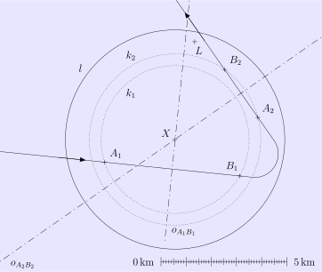

---
keywords:
- geometria płaska
- twierdzenie Pitagorasa
- symetria
is_finished: true

# Ratowanie rozbitka

Samolot przeszukuje otwarte morze w poszukiwaniu rozbitka, który ma na swojej tratwie urządzenie wysyłające sygnał SOS.
Urządzenie ma ograniczony zasięg. Podczas lotu nad morzem załoga odbiera sygnał, ale po chwili sygnał zanika. Pilot zawraca samolot i udaje się ponownie odebrać sygnał, choć tylko na krótko.

Trajektoria całego lotu, w tym kierunek podróży i punkty, w których sygnał został odebrany (punkty $A_1$ i $A_2$) oraz utracony (punkty $B_1$ i $B_2$), jest pokazana na mapie.

W obu okresach, kiedy załoga odebrała sygnał, samolot utrzymywał stałą wysokość.
Między punktami $B_1$ i $A_2$ samolot opadł o $500,\text{m}$.

> **Ćwiczenie 1.** Wykorzystaj konstrukcję geometryczną na mapie, aby określić położenie $X$ rozbitka.
*Rozwiązanie.* Ograniczony zasięg sygnału alarmowego rozbitka określa półkulę nad powierzchnią morza, której środek znajduje się w pozycji rozbitka. Poziome przekroje tej półkuli to okręgi, które na mapie wyglądają jak koncentryczne okręgi skupione w punkcie $X$. 

Ponieważ samolot utrzymywał stałą wysokość między punktami $A_1$ i $B_1$, odcinek $A_1B_1$ tworzy cięciwę pewnego okręgu $k_1$ o środku w punkcie $X$. Dlatego punkt $X$ musi leżeć na symetralnej odcinka $A_1B_1$.
Z tego samego powodu punkt $X$ musi również leżeć na symetralnej odcinka $A_2B_2$, ponieważ odcinek ten jest cięciwą innego okręgu $k_2$ o środku w punkcie $X$.

> **Ćwiczenie 2.** W okolicy znajduje się statek towarowy (pozycja $L$).
> Czy może on również odebrać sygnał SOS rozbitka, czy jest zbyt daleko?
>
> a) Przenieś długości odcinków $LX$, $A_1X$ i $A_2X$ z rozwiązania ćwiczenia 1 do podanej skali. Wykorzystując te odległości (zaokrąglone do najbliższej najmniejszej jednostki skali), rozwiąż zadanie numerycznie.
> 
> b) Wykorzystując konstrukcję z ćwiczenia 1, rozwiąż zadanie ponownie — tym razem opierając się wyłącznie na konstrukcjach geometrycznych.

*Rozwiązanie.*

a) Aby rozwiązać problem, musimy określić zasięg urządzenia rozbitka, którym jest promień $r$ półkuli wspomnianej w rozwiązaniu poprzedniego zadania. 
Przenosząc odcinki $A_1X$ i $A_2X$ na skalę i zaokrąglając ich długości do najbliższej dziesiątej części kilometra, otrzymujemy $\lvert A_1X \rvert \doteq 2{.}9\,\text{km}$ oraz $\lvert A_2X \rvert \doteq 3{.}4\,\text{km}$. Długości te są oczywiście promieniami $r_1$ i $r_2$ okręgów $k_1$ i $k_2$.

Rozważmy rzut półkuli, w którym okręgi $k_1$ i $k_2$ pojawiają się jako równoległe odcinki $K_1L_1$ i $K_2L_2$, tak że mają tę samą symetralną $o$, ich długości wynoszą odpowiednio $2r_1$ i $2r_2$, a pionowa odległość między nimi wynosi $0{.}5\,\text{km}$.
Niech $S$ będzie środkiem półkuli, $S_1$ środkiem odcinka $K_1L_1$, a $S_2$ środkiem odcinka $K_2L_2$. Zobacz rysunek poniżej, na którym dla jasności poziom morza jest również zaznaczony jako prosta linia $h$.

Stosując twierdzenie Pitagorasa do trójkątów $SS_1K_1$ i $SS_2L_2$, otrzymujemy następujące równania:

$$
\begin{align*}
r^2 &= r_1 ^2 + \lvert SS_1 \rvert ^2 \\
r^2 &= r_2 ^2 + \lvert SS_2 \rvert ^2.
\end{align*}
$$

Wiemy również, że $\lvert SS_1 \rvert = \lvert SS_2 \rvert + 0{.}5$. 
Podstawiając to do pierwszego równania i porównując oba wyrażenia, otrzymujemy równanie liniowe z jedną niewiadomą $\lvert SS_2 \rvert$, które rozwiązujemy w następujący sposób:

$$
\begin{align*}
r_2 ^2 + \lvert SS_2 \rvert ^2 &= r_1 ^2 + \left( \left\lvert SS_2 \right\rvert + 0{.}5 \right) ^2 \\[1mm]
\left\lvert SS_2 \right\rvert &=  r_2^2 - r_1^2 - 0{.}25
\end{align*}
$$

Rozwiązując dla $r$ za pomocą drugiego równania i podstawiając, otrzymujemy:

$$
r = \sqrt{r_2 ^2 + \left(r_2^2 - r_1^2 - 0{.}25 \right)^2 } \doteq 4{.}5\,\text{km}.
$$

Odległość od statku do rozbitka jest równa długości odcinka $LX$.
Przenosząc ten odcinek na skalę, otrzymujemy $\lvert LX \rvert \doteq 4{.}0,\text{km}$,
co jest wartością mniejszą niż zasięg $r$ sygnału rozbitka.
W związku z tym statek może odebrać sygnał.

b) Aby skonstruować geometryczne rozwiązanie zadania (tj. określić promień $r$ półkuli), używamy tego samego pomocniczego rzutu półkuli, co w ćwiczeniu 2a. 
Środek półkuli $S$ jest punktem przecięcia wspólnej symetralnej $o$ odcinków $K_1L_1$ i $K_2L_2$ z symetralną odcinka $L_1L_2$, ponieważ $L_1L_2$ jest cięciwą półkola $k$. Pożądany promień $r$ jest na przykład długością odcinka $SK_1$ — patrz rysunek.

Aby wykonać konstrukcję, przenosimy odległości $r_1$ i $r_2$ z rozwiązania zadania 1 (przypomnijmy, że $r_1=\lvert A_1X\rvert$ oraz $r_2=\lvert A_2X\rvert$), a także odległość między środkami okręgów, $|S_1S_2|=d_{0{.}5}$, gdzie $d_{0{.}5}$ jest odległością na mapie odpowiadającą $0{.}5\,\text{km}$, pobraną ze skali.

Rzut półkuli na mapę jest ograniczony okręgiem $l$ o środku w punkcie $X$ i promieniu $r$, który przenosimy z rzutu pomocniczego.
Po narysowaniu tego okręgu staje się jasne, że statek znajduje się w zasięgu sygnału SOS.

