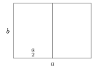
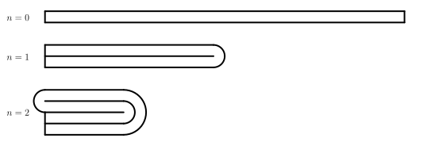

---
keywords:
- poměr
- geometrická posloupnost
- aritmetická posloupnost
is_finished: True
difficulty: 1
time: 30
---

# Matematika ukrytá v listu papíru

## Formáty papíru

Mezinárodní standard formátů papíru je dán normou ISO 216 a zahrnuje dvě základní řady. Řada A 
obsahuje formáty A0-A10 a řada B formáty B0-B10.
Tato norma je založena na původní normě DIN 476, která se používala již od roku 1922 v Německu. Vytvořil ji německý matematik a fyzik Walter Porstmann.

Obě řady mají dvě společné základní vlastnosti:

1. Všechny formáty jsou navzájem podobné pravoúhelníky.
2. Menší formát vzniká z většího rozpůlením, tj. 
rozdělením na dva navzájem osově souměrné pravoúhelníky.[^1]

Tyto vlastnosti nejsou náhodně zvolené. Mají jednak estetický význam a jednak svoje praktické využití. Například každý list papíru v daném systému se dá vyrobit z největšího kusu prostým řezáním a nevzniká žádný odpad. 

Řady A i B dále mají každá jistou speciální vlastost navíc:

* U řady A navíc platí, že obsah největšího papíru A0 je $1\,\text{m}^2$.
* U největšího formátu B0 řady B pak platí, že jeho kratší strana má délku $1\,\text{m}$.

> **Úloha 1.** Určete koeficient podobnosti (zmenšení) dvou po sobě 
> následujících formátů papíru a určete také poměr sousedních stran, 
> které musí každý z formátů dodržet.

\iffalse

*Řešení.* Nejprve si uvědomme, že pravoúhelníkem 
je obdélník (neboť žádným rozpůlením čtverce 
nemůže vzniknout čtverec). Rozpůlení dotyčného 
obdélníku provádíme podél osy delší strany tohoto 
obdélníka. Pokud bychom půlení provedli podél osy 
kratší strany, nedostali bychom obdélník podobný 
s původním – delší strana se nezmění a kratší se 
zkrátí. 

Označíme-li $a$ delší stranu obdélníka, $b$ jeho 
kratší stranu a $k$ koeficient zmenšení dvou po 
sobě jdoucích formátů, platí $k\cdot a = b$ a 
$k\cdot b = \frac{a}{2}$. Dosazením prvního 
vztahu za $b$ ve druhém vztahu dostáváme
$$
\begin{align*}
k^2 \cdot a &= \frac{a}{2} \quad / :a \\
k^2 &= \frac{1}{2} \qquad \rightarrow \qquad k = \frac{1}{\sqrt{2}}=\frac{\sqrt{2}}{2}.
\end{align*}
$$
Ze vztahu $k\cdot a = b$ dále plyne, že poměr 
stran obdélníka $a:b$ je převrácenou hodnotou 
koeficientu $k$, tj. $\sqrt{2}$.

\fi

> **Úloha 2.** Vypočítejte rozměry největšího formátu A0, jestliže víte, 
> že mají jeho délky stran celočíselné velikosti v mm a jeho obsah je 
> co možná nejbližší jednomu čtverečnímu metru.

\iffalse

*Řešení.* Z předchozí úlohy víme, že rozměry 
listu formátu A0 jsou $b_0$ (kratší strana) a 
$b_0\cdot\sqrt{2}$ (delší strana) pro neznámou délku
$b_0$, kterou je potřeba vypočítat. Víme, že 
$$
b_0\cdot b_0\cdot \sqrt{2} = 1000000\,\text{mm}^2,
$$
a tedy po vyjádření $b_0$ a zaokrouhlení výsledku 
na jednotky dostáváme hodnotu $b_0\doteq 841\,\text{mm}$. 
Délka delší strany formátu A0 je pak součinem $841\cdot \sqrt{2} \doteq 1189\,\text{mm}$. 

\fi

> **Úloha 3.** Řada formátů B má kromě společných vlastností platných pro obě řady A i B
> také tu vlastnost, že délka kratší strany největšího formátu B0 je 
> rovna jednomu metru. Ukažte, že pokud formát A0 bude mít obsah přesně jeden metr čtvereční a připustíme-li 
> u všech formátů neceločíselné rozměry, platí pro každé nezáporné celé 
> číslo $n$ vztah
> $$
> S(\mathrm{B}(n+1))=\sqrt{S(\mathrm{A}(n)) \cdot S(\mathrm{A}(n+1))},
> $$
> tj. obsah formátu $\mathrm{B}(n+1)$ je geometrickým průměrem obsahů 
> formátů $\mathrm{A}(n)$ a $\mathrm{A}(n+1)$.

\iffalse

*Řešení.* Protože kratší strana formátu B0 měří 
$1\,\text{m}$, měří jeho delší strana podle 
řešení Úlohy 1 (platného i pro formát B, neboť 
vycházíme ze stejných vlastností) $\sqrt{2}\,\text{m}$. 
Tedy obsah formátu B0 je $\sqrt{2}\,\text{m}^2$ a 
každý následující list formátu $\mathrm{B}(n)$ má 
poloviční obsah oproti předchozímu, 
tedy $S\left( \mathrm{B}(n) \right) = \frac{\sqrt{2}}{2^n}\,\text{m}^2$ 
pro každé nezáporné celé $n$.

Protože dále $S(\mathrm{A}0)=1\,\mathrm{m}^2$ a každý následující list 
formátu $\mathrm{A}(n)$ má poloviční obsah oproti předchozímu, 
je $S\left( \mathrm{A}(n) \right) = \left( \frac{1}{2}\right)^n = \frac{1}{2^n}\,\text{m}^2$ 
pro každé $n$. Tedy
$$
\begin{align*}
\sqrt{S(\mathrm{A}(n)) \cdot S(\mathrm{A}(n+1))} &= \sqrt{\frac{1}{2^n} \cdot \frac{1}{2^{n+1}} }  
=\sqrt{\frac{1}{2^n} \cdot \frac{1}{2^n} \cdot \frac{1}{2} } \\
&= \frac{1}{2^n} \cdot \frac{\sqrt{2}}{2} = \frac{\sqrt{2}}{2^{n+1}} = S(\mathrm{B}(n+1)).
\end{align*}
$$

\fi

## Skládání papíru

Možná vás už někdy napadla otázky, kolikrát je možné přeložit 
papír formátu A4 napůl a možná jste si to i sami vyzkoušeli. 
Pravděpodobně vás ale ani nenapadlo, že odpověď na tuto otázku 
může dát matematik, aniž by papír musel vůbec překládat.

Představme si následující jednoduchý model překládání papíru.

Při přeložení papíru napůl se nám vždy část papíru spotřebuje na vytvoření 
skladu. Jeho tvar si můžeme modelovat jako polovinu kružnice, jejíž poloměr
je roven tlouštce papíru. Navíc si také můžeme všimnout, že papír se při překládání
vrství. Na začátku máme jen jednu vrstvu, po prvním přeložení dvě vrstvy, po druhém
přeložení čtyři vrstvy atd. V dalších úlohách budeme pracovat s tímto modelem.

> **Úloha 4.** Jaká by byla tloušťka navrstveného kancelářského papíru po čtyřech, 
sedmi, deseti, jednadvaceti a dvaačtyřiceti přeloženích? Předpokládejme, že tloušťka našeho
> listu papíru je $t_0=0{,}1\,\text{mm}$.

\iffalse

*Řešení.* Je možné si snadno všimnout, že po $k$ přeloženích dostaneme celkem $2^k$ vrstev papíru. Tloušťky
by tak byly
$$
\begin{align*}
t_4=&t_0\cdot 2^4=1{,}6\,\text{mm}\\
t_7=&t_0\cdot 2^{7}=12{,}8\,\text{mm}\\
t_{10}=&t_0\cdot 2^{10}=102{,}4\,\text{mm}\\
t_{21}=&t_0\cdot 2^{21}\approx 209{,}7\,\text{m}\\
t_{42}=&t_0\cdot 2^{42}\approx 439\,804\,\text{km}
\end{align*}
$$

\fi

Dle výsledků předchozí úlohy je vidět, že pro 
překládání papíru musí existovat nějaký limit. 
Jednou z možností, jak tento limit poznat, je 
zkoumání kolik papíru se nám při překládání vlastně 
ztrácí při vytváření skladu.

> **Úloha 5.** Jaké množství papíru se "ztratí" při jeho skládání?

\iffalse

*Řešení.* Uvažujme papír o tlouštce $t$. Při prvním 
přeložení se na skladu vytvoří 
polokružnice o poloměru $t$ (viz předchozí obrázek), 
na přeložení tedy 
potřebujeme $\pi t$ papíru. Při druhém přeložení
se vytvoří dvě polokružnice. Jedna o poloměru $t$ a 
druhá o poloměru $2t$, potřebujeme tedy $\pi t + 2\pi t$ 
papíru a dohromady
$$
\pi t+ (\pi t+2\pi t)\,.
$$
Při třetím přeložení se vytvoří polokružnice o 
poloměrech $t$, $2t$, $3t$ a $4t$. Ztratíme tedy
$\pi t +2\pi t + 3\pi t + 4\pi t$ papíru.
Celková ztráta bude
$$
\pi t+ (\pi t+2\pi t) + (\pi t +2\pi t + 3\pi t + 4\pi t)
$$
Analogicky po $n$ složeních ztratíme
$$
\pi t+ (\pi t+2\pi t) + \cdots + (\pi t +2\pi t + \cdots  + 2^{n-1}\pi t)
$$
papíru. Vytkneme-li $\pi t$, můžeme si všimnout, že máme v závorkách součet prvních členů aritmetické posloupnosti
$$
\pi t\left[1+(1+2)+(1+2+3+4)+\cdots+(1+2+\cdots+2^{n-1}) \right]\,.
$$
Použijeme-li opakované vzorec pro součet prvních členů aritmetické posloupnosti, dostaneme
$$
\frac{\pi t}{2}(1\cdot 2+2\cdot 3+4\cdot 5+\cdots+2^{n-1}\cdot(2^{n-1}+1))\,.
$$
Zde je možné $k$-tý člen obecně zapsat jako
$$
2^{k-1}\cdot\left(2^{k-1}+1\right)=(2^2)^{k-1}+2^{k-1}.
$$
Vztah pro celkovou ztrátu papíru tedy můžeme přepsat ve tvaru
$$
\frac{\pi t}{2}\left[\left((2^2)^0+(2^2)^1+\cdots+(2^2)^{n-1}\right)+\left(2^0+2^1+\cdots+2^{n-1}\right) \right]\,.
$$
Dostáváme tak součet prvních členů dvou geometrických
posloupností, můžeme tedy použít vzorec pro jejich součet a dostaneme
$$
\frac{\pi t}{2}\left( \frac{2^{2n}-1}{3} + 2^n-1 \right)\,.
$$
Po vytknutí $\frac 13$ ze závorky máme
$$
\frac{\pi t}{6}\left((2^n)^2+3\cdot 2^n-4\right)
$$
a rozkladem na součin získáme
$$
\frac{\pi t}{6}(2^n+4)(2^n-1)\,.
$$
Tento poslední vztah vlastně vyjadřuje jakýsi odhad 
minimální délky papíru tlouštky $t$, který potřebujeme, abychom jej mohli $n$-krát přeložit.

\fi

> **Úloha 6.** Kolikrát je možné přeložit typický 
> kancelářský papír formátu A4 o tlouštce $0{,}1\,\text{mm}$? 

\iffalse

*Řešení.* Využitím výsledku předchozí úlohy víme, že hledáme takové největší přirozené $n$, aby platilo
$$
\frac{\pi \cdot 0{,}1}{6}(2^n+4)(2^n-1)<297.
$$
Přesné řešení této nerovnice by nebylo úplně snadné, 
ale naštěstí není nutně potřeba. Stačí nám dosadit 
nějaké vhodné $n$:
$$
\begin{align*}
\frac{\pi \cdot 0{,}1}{6}(2^6+4)(2^6-1)\doteq224{,}31;\\
\frac{\pi \cdot 0{,}1}{6}(2^7+4)(2^7-1)\doteq 877{,}76.
\end{align*}
$$
Podle tohoto modelu je tedy možné papír dané velikost 
přehnout maximálně šestkrát. 

\fi

Pro zajímavost dodejme, že jako první rovnici z 
Úlohy 5 odvodila středoškolská studentka Britney 
Gallivan z Californie, která je momentálně držitelkou 
světového rekordu v Guinnesově knize rekordů za 
největší počet přeložení papíru napůl. Celkem 
přeložila papír dvanáctkrát. K tomu ovšem nemohla 
použít normální papír formátu A4, ale použila 
toaletní papír délky $1\,219$ metrů. Navíc použila 
jinou techniku skládání (střídala směry).

## Literatura

1. Niss, Mogens; Bluem Werner. *The Learning and Teaching of Mathematical Modelling*, Routledge 2020, 978-1-315-18931-4

2. *Most times to fold a piece of paper.* https://www.guinnessworldrecords.com/world-records/494571-most-times-to-fold-a-piece-of-paper

3. *Wikipedia. Paper size.*  https://en.wikipedia.org/wiki/Paper_size

[^1]: Délky stran formátů, které vznikly rozpůlením, jsou zaokrouhleny na celé milimetry směrem dolů. Nejčastěji používaný formát A4 má rozměry $210 \times 297 \, \mathrm{mm}$.
