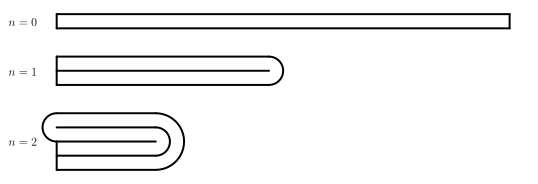

# Las matemáticas ocultas en una hoja de papel

## Formatos de papel

El estándar internacional de formatos de papel está establecido por la norma ISO 216 e incluye dos series básicas. La serie A 
contiene los formatos A0-A10 y la serie B los formatos B0-B10.
Esta norma se basa en la norma original DIN 476, que se utilizaba en Alemania desde 1922. Fue creada por el matemático y físico alemán Walter Porstmann.

Ambas series tienen dos características básicas en común:

1. Todos los formatos son rectángulos similares entre sí.
2.El formato más pequeño se obtiene dividiendo el más grande por la mitad, es decir, 
dividiéndolo en dos rectángulos simétricos entre sí.[^1]

Estas características no se han elegido al azar. Tienen un significado estético y, además, una utilidad práctica. Por ejemplo, cada hoja de papel del sistema se puede fabricar a partir de la pieza más grande mediante un simple corte, sin que se genere ningún residuo. 

Las series A y B tienen además cada una una característica especial adicional:

* En la serie A, además, el tamaño del papel más grande, A0, es de $1\,\text{m}^2$.
* En el formato más grande de la serie B, B0, el lado más corto mide $1\,\text{m}$.

> **Tarea 1.** Determina el coeficiente de similitud (reducción) de dos formatos de papel consecutivos 
> y determina también la relación entre los lados adyacentes, 
> que debe respetar cada uno de los formatos.

\iffalse

*Solución.* En primer lugar, debemos tener en cuenta que un rectángulo 
es un cuadrilátero (ya que al dividir un cuadrado por la mitad 
no se obtiene otro cuadrado). La división del rectángulo 
en cuestión se realiza a lo largo del eje del lado más largo de este 
rectángulo. Si realizáramos la división a lo largo del eje 
del lado más corto, no obtendríamos un rectángulo similar 
al original: el lado más largo no cambiaría y el más corto se 
acortaría. 

Si designamos con $a$ el lado más largo del rectángulo, con, $b$ su 
lado más corto y con $k$ el coeficiente de reducción de dos 
formatos consecutivos, se cumple que $k\cdot y = b$ a 
$k\cdot b = \frac{a}{2}$. Sustituyendo la primera 
relación por $b$ en la segunda relación, obtenemos
$$
\begin{align*}
k^2 \cdot a &= \frac{a}{2} \quad / :a \\
k^2 &= \frac{1}{2} \qquad \rightarrow \qquad k = \frac{1}{\sqrt{2}}=\frac{\sqrt{2}}{2}.
\end{align*}
$$
De la relación $k\cdot a = b$ se deduce además que la proporción 
entre los lados del rectángulo $a:b$ es el valor inverso 
del coeficiente $k$, es decir, $\sqrt{2}$.

\fi

> **Tarea 2.** Calcula las dimensiones del formato A0 más grande, si sabes 
> que sus lados tienen longitudes enteras en mm y su área es 
> lo más cercana posible a un metro cuadrado.

\iffalse

*Solución.* De la tarea anterior sabemos que las dimensiones 
de una hoja de formato A0 son $b_0$ (lado más corto) y 
$b_0\cdot\sqrt{2}$ (lado más largo) para una longitud desconocida
$b_0$, que es necesario calcular. Sabemos que 
$$
b_0\cdot b_0\cdot \sqrt{2} = 1000000\,\text{mm}^2,
$$
y, por lo tanto, tras expresar $b_0$ y redondear el resultado 
a unidades, obtenemos el valor $b_0\doteq 841\,\text{mm}$. 
La longitud del lado más largo del formato A0 es entonces el producto de $841\cdot \sqrt{2} \doteq 1189\,\text{mm}$. 

\fi

> **Tarea 3.** La serie de formatos B, además de las propiedades comunes válidas para las series A y B,
> también tiene la propiedad de que la longitud del lado más corto del formato más grande B0 es 
> igual a un metro. Demuestre que si el formato A0 tiene exactamente un metro cuadrado de superficie y admitimos 
> dimensiones no enteras para todos los formatos, se cumple la relación siguiente para cada número entero no negativo 
> número entero no negativo $n$
> $$
> S(\mathrm{B}(n+1))=\sqrt{S(\mathrm{A}(n)) \cdot S(\mathrm{A}(n+1))},
> $$
> es decir, el área del formato $\mathrm{B}(n+1)$ es la media geométrica de las áreas 
> de los formatos $\mathrm{A}(n)$ y $\mathrm{A}(n+1)$.

\iffalse

*Solución.* Dado que el lado más corto del formato B0 mide 
$1\,\text{m}$, su lado más largo mide, según 
la solución de la Tarea 1 (válida también para el formato B, ya que 
partimos de las mismas propiedades) $\sqrt{2}\,\text{m}$. 
Por lo tanto, el área del formato B0 es $\sqrt{2}\,\text{m}^2$ y 
cada hoja siguiente del formato $\mathrm{B}(n)$ tiene 
la mitad del área de la anterior, 
es decir, $S\left( \mathrm{B}(n) \right) = \frac{\sqrt{2}}{2^n}\,\text{m}^2$ 
para cada $n$ entero no negativo.

Dado que además $S(\mathrm{A}0)=1\,\mathrm{m}^2$ y cada hoja siguiente 
del formato $\mathrm{A}(n)$ tiene la mitad del tamaño que la anterior, 
entonces $S\left( \mathrm{A}(n) \right) = \left( \frac{1}{2}\right)^n = \frac{1}{2^n}\,\text{m}^2$ 
para cada $n$. Por lo tanto
$$
\begin{align*}
\sqrt{S(\mathrm{A}(n)) \cdot S(\mathrm{A}(n+1))} &= \sqrt{\frac{1}{2^n} \cdot \frac{1}{2^{n+1}} }  
=\sqrt{\frac{1}{2^n} \cdot \frac{1}{2^n} \cdot \frac{1}{2} } \\
&= \frac{1}{2^n} \cdot \frac{\sqrt{2}}{2} = \frac{\sqrt{2}}{2^{n+1}} = S(\mathrm{B}(n+1)).
\end{align*}
$$

\fi

## Plegado de papel

Quizás alguna vez se haya preguntado cuántas veces se puede doblar 
una hoja de papel A4 por la mitad y quizás incluso lo hayas probado. 
Pero probablemente ni se te haya ocurrido que la respuesta a esta pregunta 
puede darla un matemático sin tener que doblar el papel.

Imaginemos el siguiente modelo sencillo de doblado de papel.

Al doblar el papel por la mitad, siempre se consume una parte del papel para crear 
el pliegue. Podemos modelar su forma como la mitad de un círculo cuyo radio
es igual al grosor del papel. Además, también podemos observar que el papel se superpone al 
doblarlo. Al principio solo tenemos una capa, después de la primera doblez tenemos dos capas, después de la segunda
doblez cuatro capas, etc. En las siguientes tareas trabajaremos con este modelo.

> **Tarea 4.** ¿Cuál sería el grosor del papel de oficina apilado después de cuatro, 
siete, diez, veintiún y cuarenta y dos pliegues? Supongamos que el grosor de nuestra
> hoja de papel es $t_0=0{,}1\,\text{mm}$.

\iffalse

*Solución.* Es fácil observar que tras $k$ pliegues obtenemos un total de $2^k$ capas de papel. Los grosores
serían entonces
$$
\begin{align*}
t_4=&t_0\cdot 2^4=1{,}6\,\text{mm}\\
t_7=&t_0\cdot 2^{7}=12{,}8\,\text{mm}\\
t_{10}=&t_0\cdot 2^{10}=102{,}4\,\text{mm}\\
t_{21}=&t_0\cdot 2^{21}\approx 209{,}7\,\text{m}\\
t_{42}=&t_0\cdot 2^{42}\approx 439\,804\,\text{km}
\end{align*}
$$

Según los resultados de la tarea anterior, se puede ver que 
debe haber algún límite para doblar el papel. 
Una forma de conocer este límite es 
investigar cuánto papel se pierde realmente 
al doblarlo  al crear el pliegue.

\fi

> **Tarea 5.** ¿Qué cantidad de papel se «pierde» al doblarlo?

\iffalse

*Solución.* Consideremos un papel con un grosor $t$. Al doblarlo 
por primera vez, se crea 
un semicírculo con un radio $t$ (véase la imagen anterior), 
por lo que para doblarlo 
necesitamos $\pi t$ de papel. Al doblarlo por segunda vez,
se crean dos semicírculos. Uno con un radio de $t$ y 
otro con un radio de $2t$, por lo que necesitamos $\pi t + 2\pi t$ 
de papel y, en total,
$$
\pi t+ (\pi t+2\pi t)\,.
$$
En la tercera traslación se crean semicírculos con 
radios $t$, $2t$, $3t$ y $4t$. Por lo tanto, perderemos
$\pi t +2\pi t + 3\pi t + 4\pi t$ de papel.
La pérdida total será
$$
\pi t+ (\pi t+2\pi t) + (\pi t +2\pi t + 3\pi t + 4\pi t)
$$
De forma análoga, tras $n$ plegados perderemos
$$
\pi t+ (\pi t+2\pi t) + \cdots + (\pi t +2\pi t + \cdots  + 2^{n-1}\pi t)
$$
de papel. Si eliminamos $\pi t$, podemos observar que entre paréntesis tenemos la suma de los primeros términos de la sucesión aritmética
$$
\pi t\left[1+(1+2)+(1+2+3+4)+\cdots+(1+2+\cdots+2^{n-1}) \right]\,.
$$
Si utilizamos la fórmula recurrente para la suma de los primeros términos de una progresión aritmética, obtenemos
$$
\frac{\pi t}{2}(1\cdot 2+2\cdot 3+4\cdot 5+\cdots+2^{n-1}\cdot(2^{n-1}+1))\,.
$$
Aquí, el término $k$ se puede escribir generalmente como
$$
2^{k-1}\cdot\left(2^{k-1}+1\right)=(2^2)^{k-1}+2^{k-1}.
$$
Por lo tanto, la relación para la pérdida total de papel se puede reescribir de la siguiente forma
$$
\frac{\pi t}{2}\left[\left((2^2)^0+(2^2)^1+\cdots+(2^2)^{n-1}\right)+\left(2^0+2^1+\cdots+2^{n-1}\right) \right]\,.
$$
De este modo, obtenemos la suma de los primeros términos de dos sucesiones
geométricas, por lo que podemos utilizar la fórmula para su suma y obtenemos
$$
\frac{\pi t}{2}\left( \frac{2^{2n}-1}{3} + 2^n-1 \right)\,.
$$
Después de extraer $\frac 13$ del paréntesis, tenemos
$$
\frac{\pi t}{6}\left((2^n)^2+3\cdot 2^n-4\right)
$$
y, al descomponerlo en un producto, obtenemos
$$
\frac{\pi t}{6}(2^n+4)(2^n-1)\,.
$$
Esta última relación expresa, en realidad, una especie de estimación de 
la longitud mínima del papel de grosor $t$, que necesitamos para poder doblarlo $n$ veces.

\fi

> **Tarea 6.** ¿Cuántas veces se puede doblar una hoja de papel de oficina típica 
> de formato A4 con un grosor de $0{,}1\,\text{mm}$? 

\iffalse

*Solución.* Utilizando el resultado de la tarea anterior, sabemos que buscamos el mayor número natural $n$, tal que se cumpla
$$
\frac{\pi \cdot 0{,}1}{6}(2^n+4)(2^n-1)<297.
$$
La solución exacta de esta desigualdad no sería del todo fácil, 
pero, afortunadamente, no es necesaria. Basta con sustituir 
algún $n$ adecuado:
$$
\begin{align*}
\frac{\pi \cdot 0{,}1}{6}(2^6+4)(2^6-1)\doteq224{,}31;\\
\frac{\pi \cdot 0{,}1}{6}(2^7+4)(2^7-1)\doteq 877{,}76.
\end{align*}
$$
Según este modelo, es posible doblar el papel de un tamaño determinado 
un máximo de seis veces. 

\fi

Como dato curioso, cabe mencionar que la primera ecuación de 
la tarea 5 fue deducida por la estudiante de secundaria Britney 
Gallivan, de California, que actualmente ostenta 
el récord mundial Guinness por 
el mayor número de veces que se ha doblado un papel por la mitad. En total, 
dobló el papel doce veces. Sin embargo, no pudo 
utilizar papel normal de tamaño A4, sino que utilizó 
papel higiénico de $1\,219$ metros de longitud. Además, utilizó 
otra técnica de plegado (alternando las direcciones).

## Bibliografía

1. Niss, Mogens; Bluem Werner. *The Learning and Teaching of Mathematical Modelling*, Routledge 2020, 978-1-315-18931-4

2. *Most times to fold a piece of paper.* https://www.guinnessworldrecords.com/world-records/494571-most-times-to-fold-a-piece-of-paper

3. *Wikipedia. Paper size.*  https://en.wikipedia.org/wiki/Paper_size

[^1]: Las longitudes de los lados de los formatos resultantes de la división se redondean a milímetros enteros hacia abajo. El formato más utilizado, el A4, tiene unas dimensiones de $210 \times 297 \, \mathrm{mm}$.

