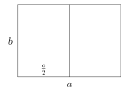

# Matematyka ukryta w kartce papieru

## Formaty papieru

Międzynarodowy standard rozmiarów papieru jest zdefiniowany w normie ISO 216 i obejmuje dwie główne serie. Seria A obejmuje formaty od A0 do A10, natomiast seria B obejmuje formaty od B0 do B10. Standard ten opiera się na oryginalnej normie DIN 476, która jest używana od 1922 roku w Niemczech. Została ona opracowana przez niemieckiego matematyka i fizyka Waltera Porstmanna.

Obie serie mają dwie podstawowe właściwości:

1. Wszystkie formaty są podobnymi prostokątami.

2. Mniejszy format jest tworzony z większego poprzez zmniejszenie go o połowę, tj. podzielenie go na dwa wzajemnie symetryczne prostokąty.[^1]

Właściwości te nie są arbitralne. Mają one zarówno wartość estetyczną, jak i praktyczne zastosowanie. Na przykład, każdy arkusz papieru w systemie może być wyprodukowany z największego arkusza po prostu przez cięcie, bez generowania jakichkolwiek odpadów.

Każda seria ma również określoną dodatkową właściwość:

* W serii A, powierzchnia największego papieru A0 wynosi $1\,\text{m}^2$.
* W serii B krótszy bok największego formatu B0 mierzy 1,\mathrm{m}$.

> **Zadanie 1.** Określ współczynnik podobieństwa (współczynnik redukcji) między dwoma kolejnymi formatami papieru, a także znajdź stosunek sąsiednich boków, który musi spełniać każdy format.

\iffalse

*Rozwiązanie.* Uświadommy sobie najpierw, że będziemy pracować z prostokątem (ponieważ przepołowienie kwadratu nigdy nie daje innego kwadratu). Prostokąt jest dzielony wzdłuż osi jego dłuższego boku. Gdyby został podzielony wzdłuż osi krótszego boku, wynik nie byłby podobny do oryginalnego prostokąta - dłuższy bok pozostałby niezmieniony, podczas gdy krótszy zostałby zmniejszony o połowę.

Niech $a$ będzie dłuższym bokiem prostokąta, $b$ krótszym bokiem, a $k$ współczynnikiem redukcji między dwoma kolejnymi formatami. Mamy $k\cdot a = b$ i $k\cdot b = \frac{a}{2}$. Podstawiając pierwsze wyrażenie $b$ do drugiego równania otrzymujemy:
$$
\begin{align*}
k^2 \cdot a &= \frac{a}{2} \quad / :a \\
k^2 &= \frac{1}{2} \qquad \rightarrow \qquad k = \frac{1}{\sqrt{2}}=\frac{\sqrt{2}}{2}.
\end{align*}
$$
Z zależności $k\cdot a = b$ wynika, że współczynnik kształtu boków prostokąta $a:b$ jest odwrotnością $k$, czyli $\sqrt{2}$.

\fi

> **Zadanie 2.** Oblicz wymiary największego formatu papieru A0, zakładając, że długości jego boków są liczbami całkowitymi w milimetrach, a jego powierzchnia jest jak najbardziej zbliżona do jednego metra kwadratowego.

\iffalse

*Rozwiązanie.* Z poprzedniego zadania wiemy, że wymiary arkusza A0 wynoszą $b_0$ (krótszy bok) i
$b_0\cdot\sqrt{2}$ (dłuższy bok), gdzie $b_0$ jest nieznaną długością, którą należy obliczyć. Wiemy, że
$$
b_0\cdot b_0\cdot \sqrt{2} = 1000000\,\text{mm}^2,
$$
a zatem, rozwiązując dla $b_0$ i po zaokrągleniu do najbliższego milimetra, otrzymujemy wartość $b_0\doteq 841\,\text{mm}$.
Długość dłuższego boku wynosi zatem $841\cdot \sqrt{2} \doteq 1189\,\text{mm}$.

\fi

> **Zadanie 3.** Oprócz własności wspólnych z serią A, seria B ma również tę własność, że krótszy bok największego formatu B0 mierzy dokładnie jeden metr. Wykaż, że jeśli przyjmiemy, że format A0 ma powierzchnię dokładnie jednego metra kwadratowego, a wszystkie formaty mogą mieć wymiary niecałkowite, to dla każdej nieujemnej liczby całkowitej $n$ zachodzi następująca własność:
> $$
> S(\mathrm{B}(n+1))=\sqrt{S(\mathrm{A}(n)) \cdot S(\mathrm{A}(n+1))},
> $$
> tj. obszar formatu $\mathrm{B}(n+1)$ jest średnią geometryczną obszarów formatów $\mathrm{A}(n)$ i $\mathrm{A}(n+1).$

\iffalse

*Rozwiązanie.* Skoro krótszy bok formatu B0 ma długość $1,\mathrm{m}$, to jego dłuższy bok, zgodnie z rozwiązaniem ćwiczenia 1 (które dotyczy także formatu B, gdyż stosowane są te same zasady geometryczne), musi mieć długość $\sqrt{2},\mathrm{m}$.
Dlatego powierzchnia formatu B0 wynosi $\sqrt{2}\,\text{m}^2$
, a każdy kolejny arkusz formatu B(n) ma połowę powierzchni poprzedniego. Stąd 
$S\left( \mathrm{B}(n) \right) = \frac{\sqrt{2}}{2^n}\,\text{m}^2$ dla każdej nieujemnej liczby całkowitej $n$.

Podobnie, ponieważ $S(\mathrm{A}0)=1\,\mathrm{m}^2$
i każdy kolejny arkusz formatu $\mathrm{A}(n)$ ma połowę powierzchni poprzedniego,
wynika, że $S\left( \mathrm{A}(n) \right) = \left( \frac{1}{2}\right)^n = \frac{1}{2^n}\,\text{m}^2$ dla każdego $n$. Zatem,
$$
\begin{align*}
\sqrt{S(\mathrm{A}(n)) \cdot S(\mathrm{A}(n+1))} &= \sqrt{\frac{1}{2^n} \cdot \frac{1}{2^{n+1}} }  
=\sqrt{\frac{1}{2^n} \cdot \frac{1}{2^n} \cdot \frac{1}{2} } \\
&= \frac{1}{2^n} \cdot \frac{\sqrt{2}}{2} = \frac{\sqrt{2}}{2^{n+1}} = S(\mathrm{B}(n+1)).
\end{align*}
$$

\fi

## Składanie papieru

Być może zastanawiałeś się kiedyś, ile razy można złożyć kartkę papieru A4 na pół - a może nawet sam spróbowałeś. Ale prawdopodobnie nie przyszło ci do głowy, że matematyk może odpowiedzieć na to pytanie bez składania papieru.

Rozważmy następujący prosty model składania papieru.

Za każdym razem, gdy papier jest składany na pół, jego część jest wykorzystywana do utworzenia zagięcia. Możemy modelować kształt zagięcia jako półkole, którego promień jest równy grubości papieru. Możemy również zaobserwować, że papier układa się w stos przy każdym zagięciu: zaczynamy z pojedynczą warstwą, po pierwszym zagięciu mamy dwie warstwy, po drugim zagięciu cztery warstwy itd. W kolejnych zadaniach będziemy pracować z tym modelem.

> **Zadanie 4.** Jaka będzie grubość stosu papieru biurowego po czterech, siedmiu, dziesięciu, dwudziestu jeden i czterdziestu dwóch złożeniach?
> Załóżmy, że grubość papieru wynosi $t_0=0{.}1\,\text{mm}$.

\iffalse

*Rozwiązanie.* Łatwo zauważyć, że po $k$ zagięciach istnieje $2^k$ warstw papieru. Całkowite grubości wynosiłyby zatem:
$$
\begin{align*}
t_4=&t_0\cdot 2^4=1{,}6\,\text{mm}\\
t_7=&t_0\cdot 2^{7}=12{,}8\,\text{mm}\\
t_{10}=&t_0\cdot 2^{10}=102{,}4\,\text{mm}\\
t_{21}=&t_0\cdot 2^{21}\approx 209{,}7\,\text{m}\\
t_{42}=&t_0\cdot 2^{42}\approx 439\,804\,\text{km}
\end{align*}
$$

Wyniki te pokazują, że musi istnieć pewne ograniczenie co do tego, ile razy można złożyć arkusz papieru. Jednym ze sposobów na zrozumienie tego ograniczenia jest zbadanie, ile papieru jest faktycznie zużywane przez samo składanie podczas każdego kroku.

\fi

> **Zadanie 5.** Ile papieru jest "tracone" podczas składania?

\iffalse

*Rozwiązanie.* Rozważmy papier o grubości $t$. Podczas pierwszego zagięcia, półkole o promieniu $t$ tworzy się na zagięciu (patrz poprzedni rysunek), więc potrzebujemy $\pi t$ papieru na zagięcie.
Podczas drugiego zagięcia powstają dwa półkola - jedno o promieniu $t$, a drugie o promieniu $2t$, więc potrzebujemy $\pi t + 2\pi t$ papieru:
$$
\pi t+ (\pi t+2\pi t)\,.
$$
W trzecim zagięciu powstają półkola o promieniach $t$, $2t$, $3t$ i $4t$. Tracimy zatem
$\pi t +2\pi t + 3\pi t + 4\pi t$ papieru.
Całkowita strata wyniesie:
$$
\pi t+ (\pi t+2\pi t) + (\pi t +2\pi t + 3\pi t + 4\pi t)
$$
Analogicznie, po $n$ fałdach tracimy
$$
\pi t+ (\pi t+2\pi t) + \cdots + (\pi t +2\pi t + \cdots  + 2^{n-1}\pi t)
$$
papieru. Odejmując $\pi t$, możemy zauważyć, że to, co pozostaje wewnątrz nawiasów, jest sumą pierwszych wyrazów ciągów arytmetycznych:
$$
\pi t\left[1+(1+2)+(1+2+3+4)+\cdots+(1+2+\cdots+2^{n-1}) \right]\,.
$$
Jeśli wielokrotnie użyjemy standardowego wzoru na sumę pierwszych wyrazów ciągu arytmetycznego, otrzymamy:
$$
\frac{\pi t}{2}(1\cdot 2+2\cdot 3+4\cdot 5+\cdots+2^{n-1}\cdot(2^{n-1}+1))\,.
$$
K-tą część $k$ można zapisać w postaci ogólnej jako:
$$
2^{k-1}\cdot\left(2^{k-1}+1\right)=(2^2)^{k-1}+2^{k-1}.
$$
Wyrażenie na całkowitą stratę papieru można zatem przepisać jako:
$$
\frac{\pi t}{2}\left[\left((2^2)^0+(2^2)^1+\cdots+(2^2)^{n-1}\right)+\left(2^0+2^1+\cdots+2^{n-1}\right) \right]\,.
$$
W ten sposób otrzymujemy sumę pierwszych wyrazów dwóch ciągów geometrycznych
, więc możemy użyć wzoru na ich sumę i otrzymać:
$$
\frac{\pi t}{2}\left( \frac{2^{2n}-1}{3} + 2^n-1 \right)\,.
$$
Odejmując $\frac{1}{3}$ od nawiasów, otrzymujemy:
$$
\frac{\pi t}{6}\left((2^n)^2+3\cdot 2^n-4\right)
$$
i poprzez faktoryzację wyrażenia otrzymujemy
$$
\frac{\pi t}{6}(2^n+4)(2^n-1)\,.
$$
To końcowe wyrażenie zasadniczo daje oszacowanie minimalnej długości papieru o grubości $t$ potrzebnej do złożenia $n$ razy.

\fi

> **Zadanie 6.** Ile razy można złożyć typowy papier biurowy A4 o grubości $0{,}1\text{mm}$?

\iffalse

*Solution.* Using the result of the previous exercise, we are looking for the greatest natural number $n$ such that the following inequality holds:
$$
\frac{\pi \cdot 0{,}1}{6}(2^n+4)(2^n-1)<297.
$$
Dokładne rozwiązanie tej nierówności nie byłoby łatwe - ale na szczęście nie jest konieczne. Musimy jedynie wypróbować kilka odpowiednich wartości $n$:
$$
\begin{align*}
\frac{\pi \cdot 0{,}1}{6}(2^6+4)(2^6-1)\doteq224{,}31;\\
\frac{\pi \cdot 0{,}1}{6}(2^7+4)(2^7-1)\doteq 877{,}76.
\end{align*}
$$
Zgodnie z tym modelem, arkusz o tym rozmiarze można złożyć maksymalnie sześć razy.

\fi

Jako ciekawostkę dodajmy, że pierwszą osobą, która wyprowadziła równanie z Ćwiczenia 5 była licealistka Britney Gallivan z Kalifornii. Jest ona obecnie rekordzistką Guinnessa w największej liczbie złożeń kartki papieru na pół. Udało jej się złożyć papier dwanaście razy.
Nie mogła jednak użyć do tego standardowego papieru A4 - użyła papieru toaletowego o długości $1{,}219$ metrów.
Co więcej, zastosowała inną technikę składania, zmieniając kierunki składania.

## Literatura

1. Niss, Mogens; Bluem Werner. *The Learning and Teaching of Mathematical Modelling*, Routledge 2020, 978-1-315-18931-4

2. *Most times to fold a piece of paper.* https://www.guinnessworldrecords.com/world-records/494571-most-times-to-fold-a-piece-of-paper

3. *Wikipedia. Paper size.*  https://en.wikipedia.org/wiki/Paper_size

[^1]: Długości boków formatów utworzonych przez przepołowienie są zaokrąglane w dół do pełnych milimetrów. Najczęściej używany format A4 ma wymiary $210 \times 297 \, \mathrm{mm}$.
