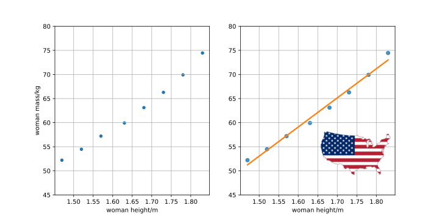
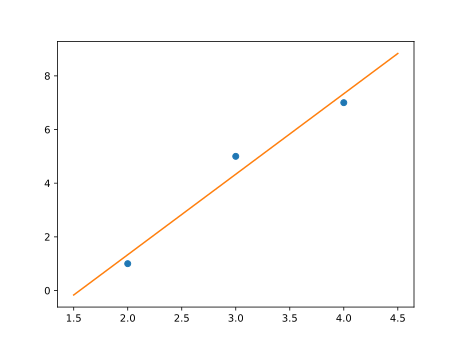
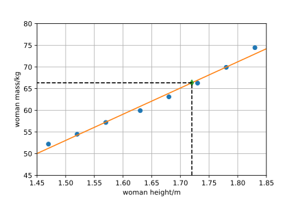
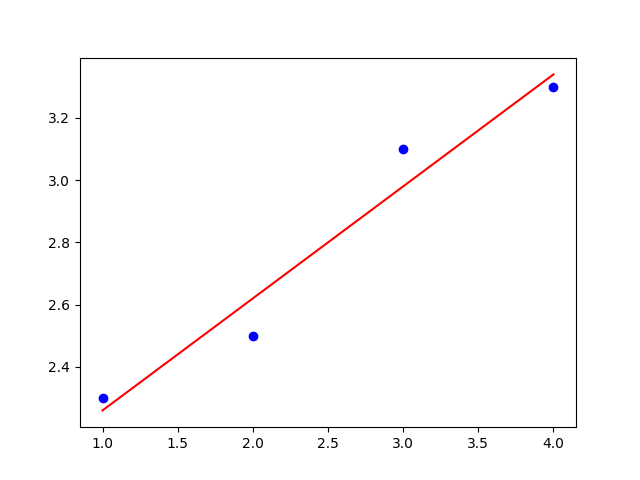

---
keywords:
- kombinatorika, pravděpodobnost a statistika
- vektory
- skalární součin
- lineární regrese
- strojové učení
- zpracování dat
is_finished: true
difficulty: 2
time: 30
---

# Lineární regrese

V praxi se často setkáváme s tím, že hodnotami jedné veličiny jsou dány hodnoty druhé veličiny a ze
sady naměřených nebo statisticky získaných dat určujeme matematický model
udávající funkční závislost mezi oběma veličinami. Jako příklad můžeme uvažovat
data udávající výšku a hmotnost amerických žen ve věku mezi 30 a 39 lety (zdroj
<https://en.wikipedia.org/wiki/Simple_linear_regression>, 12.4.2024, pro stručnost je použita jenom polovina dat).

| výška/m |  $1{,}47$ |  $1{,}52$ |  $1{,}57$ |  $1{,}63$ |  $1{,}68$ |  $1{,}73$ |  $1{,}78$ |  $1{,}83$ |
|:-------|------:|------:|------:|------:|------:|------:|------:|------:|
| hmotnost/kg   | $52{,}21$ | $54{,}48$ | $57{,}20$  | $59{,}93$ | $63{,}11$ | $66{,}28$ | $69{,}92$ | $74{,}46$ |

Data jsou vykreslena na obrázku vlevo. Z obrázku je patrné, že s rostoucí
výškou roste i hmotnost. V takovém případě je možné najít matematický model,
který udává hmotnost jako funkci výšky. Takový matematický model je znázorněn
barevně na obrázku vpravo. Jedná se o model, který umožní pro zadanou výšku
ženy předpovědět její hmotnost.

Popsaná úloha se nazývá *lineární regrese*.

Lineární regrese je jednou ze základních metod *strojového učení*, kdy v
datech odhalíme jistou funkční závislost. Tuto poté můžeme použít k
tomu, abychom dávali predikce funkčních hodnot pro data, která se v
zadaném souboru nevyskytují.

V následujícím si ukážeme, jak lineární regrese souvisí s lineární
kombinací vektorů, a jak je možné regresní přímku najít pomocí operací s
vektory. Budeme postupovat po malých krocích:

* Nejprve si připomeneme, jak se řeší úlohy na zápis vektoru jako lineární
  kombinace zadaných vektorů.
* Poté se podíváme, jak je možné předchozí úlohu usnadnit, pokud je
  některý z vektorů kolmý k ostatním.
* Ukážeme, jak je možné najít přibližné řešení úlohy v případě,
  že přesné řešení neexistuje.
* Na závěr využijeme předchozích poznatků k vyřešení úlohy lineární regrese, tj. ze zadaných dat sestavíme matematický model odhalující trend
  v těchto datech a umožňující predikovat funkční hodnoty i pro
  hodnoty, které se v datovém souboru nevyskytují.

## Lineární kombinace vektorů

> **Úloha 1.** Zapište vektor $\vec c = \begin{pmatrix}1 \cr 2\end{pmatrix}$ 
> jako lineární kombinaci vektorů 
> $\vec a = \begin{pmatrix}2 \cr 2\end{pmatrix}$
> a $\vec b = \begin{pmatrix}3 \cr 1\end{pmatrix}$. 

*Řešení.* Zapsat vektor $\vec c$ jako kombinaci vektorů $\vec a$ a $\vec b$ znamená najít čísla $t_1$ a $t_2$ taková, že
$$
t_1 \vec a + t_2 \vec b = \vec c.
$$
Po rozepsání do souřadnic vidíme, že tato úloha vede na soustavu rovnic
$$
\begin{aligned}
2t_1+3t_2 &= 1,\cr
2t_1+t_2 &=2.
\end{aligned}
$$
Tato soustava má jediné řešení $t_1=\frac 54$ a $t_2=-\frac 12$.

>**Úloha 2.** Napište vektor $\vec w=\begin{pmatrix}1\cr 2\cr 1\end{pmatrix}$ jako lineární kombinaci vektorů 
> $$ \vec u_1=\begin{pmatrix}2\cr 2\cr 1\end{pmatrix},\quad \vec u_2=\begin{pmatrix}3\cr 1\cr 2\end{pmatrix},\quad \vec u_3=\begin{pmatrix}3\cr -1\cr -4\end{pmatrix}. $$

*Řešení.* Podobně jako v předchozí úloze hledáme čísla $t_1$, $t_2$ a $t_3$ taková, že
$$
t_1 \vec u_1+t_2\vec u_2 + t_3 \vec u_3 = \vec w.\tag{1}
$$
Po dosazení a rozepsání do souřadnic dostáváme soustavu tří rovnic o třech neznámých
$$\tag{2}
\begin{aligned}
2t_1 + 3t_2 + 3t_3 &= 1,\cr
2 t_1 + t_2 -t_3 &=2,\cr
t_1+2t_2-4t_3&=1.
\end{aligned}
$$
Řešení takové soustavy je již poměrně nepříjemné. Pomocí sčítací nebo dosazovací metody bychom mohli ale zjistit, že
$$
t_1=\frac{14}{13},\quad t_2=-\frac{7}{26},\quad t_3=-\frac{3}{26}.
$$

## Lineární kombinace s využitím skalárního součinu

Pokud je alespoň jeden ze zadaných vektorů kolmý ke zbylým 
vektorům, můžeme šikovným trikem získat jednodušší 
soustavu rovnic.

Vraťme se k předchozí úloze. Můžeme si všimnout, že vektor 
$\vec u_3$ je kolmý k vektorům $\vec u_1$ a $\vec u_2$. Tím 
pádem je i kolmý k rovině definované těmito vektory. Tuto 
skutečnost snadno ukážeme výpočtem skalárních součinů 
$$
\vec u_1\cdot \vec u_3 = 2\cdot 3 +2\cdot (-1)+1\cdot (-4) = 0
$$
a
$$
\vec u_2\cdot \vec u_3 = 3\cdot 3 +1\cdot (-1)+2\cdot (-4) = 0.
$$
Díky této vlastnosti se vyplatí rovnici (1) vynásobit skalárně po řadě vektory $\vec u_1$ až $\vec u_3$. Tím dostáváme následující tři rovnice.
$$
\begin{aligned}
t_1 (\vec u_1\cdot \vec u_1) + t_2 (\vec u_2\cdot \vec u_1) + t_3 (\vec u_3\cdot \vec u_1) &= \vec w\cdot \vec u_1\cr
t_1 (\vec u_1\cdot \vec u_2) + t_2 (\vec u_2\cdot \vec u_2) + t_3 (\vec u_3\cdot \vec u_2) &= \vec w\cdot \vec u_2\cr
t_1 (\vec u_1\cdot \vec u_3) + t_2 (\vec u_2\cdot \vec u_3) + t_3 (\vec u_3\cdot \vec u_3) &= \vec w\cdot \vec u_3
\end{aligned}
$$
Výpočtem skalárních součinů dostáváme soustavu, která je nepoměrně jednodušší než soustava (2).
$$
\begin{aligned}
9t_1+10t_2=7\cr
10t_1+14t_2=7\cr
26t_3=-3
\end{aligned}
$$
Z poslední rovnice vidíme přímo jednu z neznámých a dvě první 
rovnice tvoří soustavu dvou rovnic o dvou neznámých $t_1$ a 
$t_2$. 

## Lineární kombinace a nekonzistentní soustavy rovnic

Připomeňme, že za nekonzistentní označujeme takové soustavy 
lineárních rovnic, které nemají řešení.

Naši úlohu o nalezení vyjádření vektoru jako lineární 
kombinace daných vektorů modifikujeme. Jeden z vektorů, se 
kterými pracujeme, vynecháme. Tím se stane úloha v klasickém 
smyslu neřešitelnou. 

>**Úloha 3.** Napište vektor $\vec w=\begin{pmatrix}1\cr 2\cr 1\end{pmatrix}$ jako lineární kombinaci vektorů 
>$$ \vec u_1=\begin{pmatrix}2\cr 2\cr 1\end{pmatrix},\quad \vec u_2=\begin{pmatrix}3\cr 1\cr 2\end{pmatrix}. $$

*Řešení.* Musíme najít čísla $t_1$, $t_2$ taková, že platí 
$$t_1\vec u_1 + t_2\vec u_2 = \vec w.$$
Rozepsáním v souřadnicích dostaneme soustavu
$$
\begin{aligned}
2t_1 + 3t_2  &= 1,\cr
2 t_1 + t_2  &=2,\cr
t_1+2t_2&=1.
\end{aligned}
$$
Je snadné se přesvědčit, že tato soustava je nekonzistentní a nemá řešení. Opravdu, soustavu složenou z prvních dvou rovnic jsme vyřešili v úvodu ($t_1=\frac 54$ a $t_2=-\frac 12$) a poslední rovnice je s touto volbou ve sporu ($\frac 54+2\cdot(-\frac 12)\neq 1$).  

## Řešení nekonzistentní soustavy rovnic

Pojďme nyní rozumným způsobem zobecnit pojem řešení.
Nebudeme hledat hodnoty neznámých, pro které jsou si levé a pravé 
strany rovny. Namísto toho  budeme  hledat alespoň takové 
hodnoty neznámých, pro které se levé a pravé strany co 
nejméně liší.

*Řešením nekonzistentní soustavy rovnic budeme rozumět takovou volbu hodnot neznámých, pro kterou je délka vektoru vyjadřujícího rozdíl levých a pravých stran soustavy minimální.*

Na obrázku si vysvětlíme, co daná soustava vyjadřuje a jak je možné si
představit její řešení ve výše uvedeném oslabeném smyslu.

![Vektory $\vec u_1$ a $\vec u_2$ definují rovinu, v níž neleží vektor $\vec w$.
Proto vektor $\vec w$ není možné zapsat jako lineární kombinaci vektorů $u_1$ a
$u_2$. Je však možné jako lineární kombinaci zadaných vektorů zapsat kolmý
průmět $\vec w_0$ vektoru $\vec w$ do uvažované roviny. Vektor $\vec w_0$ je ze
všech vektorů, které je možno zapsat jako lineární kombinaci vektorů $\vec u_1$
a $\vec u_2$, nejblíže vektoru $\vec w$. Kvantitativní kriterium pro tuto
vlastnost je délka vektoru $\vec \varepsilon$. Skutečnost, že ze všech vektorů
roviny je k vektoru $\vec w$ nejblíže vektor $\vec w_0$ plyne z kolmosti vektoru 
$\vec \varepsilon$ k rovině určené vektory $\vec u_1$ a $\vec u_2$.](regrese_image.svg)

Snažíme se pomocí lineární
kombinace vektorů $\vec u_1$ a $\vec u_2$ vyjádřit vektor $\vec w$, který ale neleží v
rovině definované těmito vektory. Taková úloha nemá řešení. Budeme se proto snažit najít alespoň takovou lineární kombinaci, 
která se od vektoru $\vec w$ liší co nejméně. 

Tato kombinace je dána vektorem $\vec w_0$, přičemž rozdíl mezi $\vec w$ a $\vec
w_0$ je znázorněn vektorem $\vec \varepsilon$. Snažíme se o to, aby délka
vektoru $\vec \varepsilon$ byla co nejmenší. 

Z názorného pohledu a geometrických vlastností je snadné nahlédnout, že toto nastane v případě, 
kdy je vektor $\vec \varepsilon$ kolmý k rovině
určené vektory $\vec u_1$ a $\vec u_2$. Tím se dostáváme do stejné situace,
jako při alternativním řešení třetí úlohy. Tam jsme také viděli trik, jak najít
koeficienty u vektorů $\vec u_1$ a $\vec u_2$ bez řešení plné soustavy rovnic:
vynásobili jsme soustavu skalárně vektory $\vec u_1$ a $\vec u_2$. Dokonce k
tomuto výpočtu ani nemusíme znát vektor $\vec \varepsilon$.

Protože délka vektoru $\vec\varepsilon$ se vyjadřuje pomocí druhých mocnin
souřadnic tohoto vektoru, má metoda název *metoda nejmenších čtverců*.

Celý postup si ukážeme na následujícím příkladě.

## Lineární regrese

Uvažujme data z následující tabulky.

|$x$|$2$|$3$|$4$|
|-:|-:|-:|-:|
|$y$|$1$|$5$|$7$|

Hledáme přímku $y=ax+b$, která co nejlépe vystihuje trend v tomto souboru a byla by vhodným matematickým modelem pro tato data. Dosazením každého ze tří bodů do rovnice přímky dostáváme soustavu tří rovnic o dvou neznámých. 
$$
\begin{aligned}
2a+b=1\cr
3a+b=5\cr
4a+b=7
\end{aligned}
$$
To je úloha s nekonzistentní soustavou rovnic (tzv. přeurčenou soustavou), která nemá řešení v klasickém slova smyslu.
Vektorový tvar této soustavy je následující.
$$
a
\begin{pmatrix}2\\3\\4\end{pmatrix}
+
b
\begin{pmatrix}1\\1\\1\end{pmatrix} = \begin{pmatrix}1\\5\\7\end{pmatrix}
$$
Po vynásobení po řadě vektory $\begin{pmatrix}2\\3\\4\end{pmatrix}$ a 
$\begin{pmatrix}1\\1\\1\end{pmatrix}$ 
dostáváme soustavu dvou rovnic.
$$
\begin{aligned}
29a+9b&=45\\
9a+3b&=13
\end{aligned}
$$
Řešení této soustavy je $a=3$ a $b=-\frac {14}3$. Regresním modelem pro zadaná data je tedy přímka 
$$y=3x-\frac {14}3.$$
Graf obsahující uvedená data a regresní přímku je na obrázku.

## Regrese pro větší datové soubory

Postup uvedený v předchozím textu pro tři body je možné zobecnit na libovolný
počet bodů. Není neobvyklé pracovat s datovým souborem obsahujícím stovky bodů.

Je-li vektor $\vec X$ vektorem obsahujícím hodnoty nezávislé proměnné[^1]
a $\vec Y$ vektor obsahující hodnoty závislé proměnné, budeme uvažovat model[^3] 
$$
\vec Y = a\vec X+b.
$$
Koeficienty $a$ a $b$ určíme tak, že tuto rovnici přepíšeme na vektorovou rovnici 
$$
\vec Y = a\vec X+b\vec 1,
$$
kde $\vec 1$ je vektor sestavený z jedniček. Tuto rovnici vynásobíme skalárně
vektorem $\vec X$ a vektorem $\vec 1$. Dostáváme tak soustavu
$$
\begin{aligned}
a(\vec X\cdot \vec X)+ b(\vec X\cdot \vec 1) &=
\vec X\cdot \vec Y \cr 
a(\vec 1\cdot \vec X)+ b(\vec 1\cdot \vec 1) &=
\vec 1\cdot \vec Y \cr 
\end{aligned}\tag{3}
$$

Pro více než tři body takto pracujeme s vektory větší dimenze než tři. V
důsledku toho přicházíme o názornou geometrickou představu. Až na tuto
skutečnost se však na práci nic nemění. Skalární součin dvou vektorů se stále počítá
tak, že se vynásobí odpovídající komponenty a tyto součiny se poté sečtou.

> **Úloha 4.** Nalezněte vhodný lineární model pro 
> tabulku dat z úvodního textu.

*Řešení.* Připomeňme si uvedená data:

| výška/m |  $1{,}47$ |  $1{,}52$ |  $1{,}57$ |  $1{,}63$ |  $1{,}68$ |  $1{,}73$ |  $1{,}78$ |  $1{,}83$ |
|:-------|------:|------:|------:|------:|------:|------:|------:|------:|
| hmotnost/kg   | $52{,}21$ | $54{,}48$ | $57{,}20$  | $59{,}93$ | $63{,}11$ | $66{,}28$ | $69{,}92$ | $74{,}46$ |

Po dosazení dat do potřebných skalárních součinů dostaneme:

$$
\begin{aligned}
\vec X\cdot\vec X&=
1{,}47^2 + 1{,}52^2+1{,}57^2+\cdots+1{,}83^2=21{,}9257\cr
\vec X\cdot\vec Y&=
1{,}47 \cdot 52{,}21 + 
1{,}52\cdot 54{,}48 + 
1{,}57\cdot 57{,}20+\cdots+
1{,}83\cdot 74{,}46=828{,}4568\cr
\vec 1\cdot\vec X&=
 1{,}47 + 1{,}52+ 1{,}57+\cdots+ 1{,}83=
13{,}21\cr
\vec 1\cdot\vec Y&=
52{,}21 + 54{,}48+57{,}20+\cdots+74{,}46=497{,}59\cr
\vec 1\cdot\vec 1 &= 1+1+1+\cdots +1=8
\end{aligned}
$$

Po dosazení hodnot do (3) dostáváme soustavu
dvou rovnic o dvou neznámých

$$
\begin{aligned}
21{,}9257a+13{,}21b&=828{,}4568,\cr
13{,}21a+8b&=497{,}59,
\end{aligned}
$$

která má jediné řešení. Tímto řešením[^2] je 
 $a=60{,}44$ a $b=-37{,}61$. Modelem, který udává
závislost hmotnosti žen $y$ na jejich výšce $x$, je vztah
$$y=60{,}44x-37{,}61.$$

Obrázek 4 ukazuje použitá data, regresní závislost a predikci pro hmotnost ženy o
výšce $1{,}72$ metru.

> **Úloha 5.** Najděte regresní přímku pro zadaná data.
> 
> |$x$|$1{,}0$|$2{,}0$|$3{,}0$|$4{,}0$|
> |-:|-:|-:|-:|-:|
> |$y$|$2{,}3$|$2{,}5$|$3{,}1$|$3{,}3$|

\iffalse

*Řešení.*

Pro vektory $\vec X$ a $\vec Y$ dané po řadě první a druhou řadou tabulky dostáváme
$$
\begin{aligned}
\vec X\cdot\vec X&=1{,}0^2+2{,}0^2+3{,}0^2+4{,}0^2=30,\cr
\vec X\cdot\vec Y&=1{,}0\cdot 2{,}3+2{,}0\cdot 2{,}5+3{,}0\cdot 3{,}1+4{,}0\cdot 3{,}3=29{,}8,\cr
\vec 1\cdot\vec X&=1{,}0+2{,}0+3{,}0+4{,}0=10,\cr
\vec 1\cdot\vec Y&=2{,}3+2{,}5+3{,}1+3{,}3=11{,}2,\cr
\vec 1\cdot\vec 1&=1+1+1+1=4.
\end{aligned}
$$

Soustava rovnic (3) po dosazení těchto hodnot má tvar
$$
\begin{aligned}
30a+10b&=29{,}8,\cr
10a+4b&=11{,}2.
\end{aligned}
$$
Řešením této soustavy je $a=0{,}36$ a $b=1{,}90$. Regresní přímka pro zadaná
data je tedy
$$
y=0{,}36x+1{,}90.
$$ 
Obrázek ukazuje regresní přímku a zadaná data.

\fi

## Závěrečné poznámky

* Ve statistice je uvedená metoda jednou ze základních metod při predikci, zda
  jedna veličina má vliv na hodnoty druhé veličiny. Proto jsou k dispozici
  metody, které hodnotí kvalitu aproximace a také to, zda je pro daný soubor bodů
  uvažovaná aproximace vhodná či nikoliv.
* Existují také vícerozměrné verze metody nejmenších čtverců, kdy predikovanou hodnotu 
  určujeme ne z jedné, ale z několika nezávislých veličin.
* Úloha najít řešení nekonzistentní soustavy lineárních rovnic se vyskytuje i při
  rekonstrukci obrazu v *akustické tomografii*. To umožňuje studovat složení
  geologických vrstev nebo zdravotní stav dřeva či stromu na základě informace o
  rychlosti, s jakou materiálem prochází vlny elastické deformace. Jako úvod do
  problematiky může posloužit série článků na blogu <https://tomroelandts.com/>.
* Je možné sestavit přímo vztahy pro výpočet koeficientů lineární regrese ze zadaných dat 
  a vynechat tak výpočet skalárních součinů a řešení soustavy rovnic. 
  Viz například <https://en.wikipedia.org/wiki/Simple_linear_regression#Expanded_formulas>.

## Literatura a odkazy

### Literatura

* Wikipedie, Simple linear regression, https://en.wikipedia.org/wiki/Simple_linear_regression, 12.4.2024
* Tom Roelandts, https://tomroelandts.com/articles/tomography-part-1-projections, https://tomroelandts.com/articles/the-sirt-algorithm, 13.4.2024
  

### Zdroje obrázků

* https://commons.wikimedia.org/wiki/File:Flag-map_of_the_United_States.svg

[^1]: Použijeme zápis běžně užívaný při zpracování dat, kdy datové soubory
(vektory) označujeme velkými písmeny a vektor, který má všechny komponenty
rovny stejnému číslu zapisujeme jako dané číslo se šipkou pro označení vektoru.

[^2]: Pozor, úloha je poměrně citlivá na zaokrouhlování. 

[^3]: Přísně vzato tato operace nemá matematicky smysl, protože sčítáme vektor
s reálným číslem. Tuto operaci je nutno interpretovat po složkách, kdy toto
sčítání znamená, že se reálné číslo změní na vektor příslušné dimenze tak, aby
operace byla definována. Toto přizpůsobení se naýváme *broadcasting*. Ve
výsledku ke každé komponentě vektoru $a\vec X$ přičítáme hodnotu $b$.
