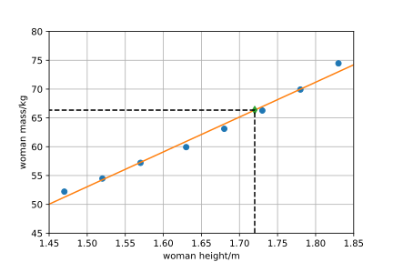
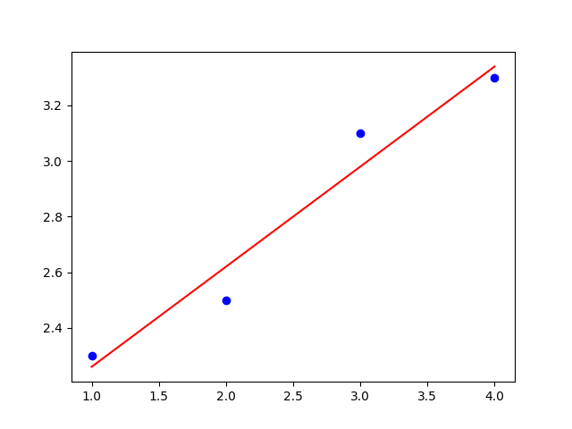

# Regresión lineal

En la práctica, a menudo nos encontramos con que los valores de una variable determinan los valores de otra variable y, a partir de
un conjunto de datos medidos u obtenidos estadísticamente, determinamos un modelo matemático
que indica la dependencia funcional entre ambas variables. Como ejemplo, podemos considerar
los datos que indican la altura y el peso de las mujeres estadounidenses de entre 30 y 39 años (fuente
<https://en.wikipedia.org/wiki/Simple_linear_regression>, 12.4.2024, por brevedad se utiliza solo la mitad de los datos).

| altura/m |  $1{,}47$ |  $1{,}52$ |  $1{,}57$ |  $1{,}63$ |  $1{,}68$ |  $1{,}73$ |  $1{,}78$ |  $1{,}83$ |
|:-------|------:|------:|------:|------:|------:|------:|------:|------:|
| peso/kg   | $52{,}21$ | $54{,}48$ | $57{,}20$  | $59{,}93$ | $63{,}11$ | $66{,}28$ | $69{,}92$ | $74{,}46$ |

Los datos se muestran en la imagen de la izquierda. En la imagen se puede observar que,
a medida que aumenta laaltura, también aumenta el peso. En tal caso, es posible encontrar un modelo matemático,
que indique el peso en función de la altura. Dicho modelo matemático se muestra
en color en la imagen de la derecha. Se trata de un modelo que permite predecir el peso
de una mujer para una altura determinada.

La tarea descrita se denomina *regresión lineal*.

La regresión lineal es uno de los métodos básicos del *aprendizaje automático*, en el que
descubrimos una cierta dependencia funcional en los datos. A continuación, podemos utilizarla
para hacer predicciones de valores funcionales para datos que no aparecen en
el conjunto especificado.

A continuación, veremos cómo la regresión lineal se relaciona con la combinación
lineal de vectores y cómo es posible encontrar la línea de regresión mediante operaciones con
vectores. Procederemos paso a paso:

* Primero recordaremos cómo se resuelven las tareas de escritura de vectores como combinaciones
  lineales de vectores dados.
* A continuación, veremos cómo se puede facilitar la tarea anterior si
  alguno de los vectores es perpendicular a los demás.
* Mostraremos cómo es posible encontrar una solución aproximada a la tarea en caso de que
  no exista una solución exacta.
* Por último, utilizaremos los conocimientos adquiridos anteriormente para resolver la tarea de regresión lineal, es decir, a partir de los datos dados, construiremos un modelo matemático
  que revele la tendencia en estos datos y permita predecir los valores funcionales incluso para
  los valores que no aparecen en el conjunto de datos.

## Combinación lineal de vectores

> **Tarea 1.** Escribe el vector $\vec c = \begin{pmatrix}1 \cr 2\end{pmatrix}$ 
> como una combinación lineal de vectores 
> $\vec a = \begin{pmatrix}2 \cr 2\end{pmatrix}$
> a $\vec b = \begin{pmatrix}3 \cr 1\end{pmatrix}$. 

\iffalse

*Solución.* Escribir el vector $\vec c$ como una combinación de los vectores $\vec a$ a $\vec b$ significa encontrar los números $t_1$ a $t_2$ tales que
$$
t_1 \vec a + t_2 \vec b = \vec c.
$$
Tras descomponerlo en coordenadas, vemos que esta tarea conduce a un sistema de ecuaciones
$$
\begin{aligned}
2t_1+3t_2 &= 1,\cr
2t_1+t_2 &=2.
\end{aligned}
$$
Este sistema tiene una única solución $t_1=\frac 54$ a $t_2=-\frac 12$.

\fi

>**Tarea 2.** Escribe el vector $\vec w=\begin{pmatrix}1\cr 2\cr 1\end{pmatrix}$ como una combinación lineal de vectores 
> $$ \vec u_1=\begin{pmatrix}2\cr 2\cr 1\end{pmatrix},\quad \vec u_2=\begin{pmatrix}3\cr 1\cr 2\end{pmatrix},\quad \vec u_3=\begin{pmatrix}3\cr -1\cr -4\end{pmatrix}. $$

\iffalse

*Solución.* Al igual que en la tarea anterior, buscamos los números $t_1$, $t_2$ a $t_3$ tales que
$$
t_1 \vec u_1+t_2\vec u_2 + t_3 \vec u_3 = \vec w.\tag{1}
$$
Tras sustituir y escribir las coordenadas, obtenemos un sistema de tres ecuaciones con tres incógnitas
$$\tag{2}
\begin{aligned}
2t_1 + 3t_2 + 3t_3 &= 1,\cr
2 t_1 + t_2 -t_3 &=2,\cr
t_1+2t_2-4t_3&=1.
\end{aligned}
$$
La resolución de un sistema de este tipo ya resulta bastante complicada. Sin embargo, utilizando el método de suma o sustitución, podríamos averiguar que
$$
t_1=\frac{14}{13},\quad t_2=-\frac{7}{26},\quad t_3=-\frac{3}{26}.
$$

\fi

## Combinación lineal utilizando el producto escalar

Si al menos uno de los vectores introducidos es perpendicular al resto 
de vectores, podemos obtener un sistema de ecuaciones más sencillo 
mediante un ingenioso truco.

Volvamos a la tarea anterior. Podemos observar que el vector 
$\vec u_3$ es perpendicular a los vectores $\vec u_1$ a $\vec u_2$. Por lo tanto, 
también es perpendicular al plano definido por estos vectores. Podemos 
demostrar fácilmente este hecho calculando los productos escalares 
$$
\vec u_1\cdot \vec u_3 = 2\cdot 3 +2\cdot (-1)+1\cdot (-4) = 0
$$
a
$$
\vec u_2\cdot \vec u_3 = 3\cdot 3 +1\cdot (-1)+2\cdot (-4) = 0.
$$
Gracias a esta propiedad, vale la pena multiplicar la ecuación (1) escalarmente por los vectores $\vec u_1$ až $\vec u_3$. De este modo, obtenemos las tres ecuaciones siguientes.
$$
\begin{aligned}
t_1 (\vec u_1\cdot \vec u_1) + t_2 (\vec u_2\cdot \vec u_1) + t_3 (\vec u_3\cdot \vec u_1) &= \vec w\cdot \vec u_1\cr
t_1 (\vec u_1\cdot \vec u_2) + t_2 (\vec u_2\cdot \vec u_2) + t_3 (\vec u_3\cdot \vec u_2) &= \vec w\cdot \vec u_2\cr
t_1 (\vec u_1\cdot \vec u_3) + t_2 (\vec u_2\cdot \vec u_3) + t_3 (\vec u_3\cdot \vec u_3) &= \vec w\cdot \vec u_3
\end{aligned}
$$
Al calcular los productos escalares, obtenemos un sistema que es mucho más sencillo que el sistema (2).
$$
\begin{aligned}
9t_1+10t_2=7\cr
10t_1+14t_2=7\cr
26t_3=-3
\end{aligned}
$$
De la última ecuación vemos directamente una de las incógnitas y las dos primeras 
ecuaciones forman un sistema de dos ecuaciones con dos incógnitas $t_1$ a 
$t_2$. 

## Combinaciones lineales y sistemas de ecuaciones inconsistentes

Recordemos que denominamos inconsistentes a aquellos sistemas 
de ecuaciones lineales que no tienen solución.

Modificamos nuestra tarea de encontrar la expresión del vector como una combinación 
lineal de los vectores dados. Omitimos uno de los vectores con 
los que trabajamos. De este modo, la tarea se vuelve irresoluble 
en el sentido clásico. 

>**Tarea 3.** Escribe el vector $\vec w=\begin{pmatrix}1\cr 2\cr 1\end{pmatrix}$ como una combinación lineal de vectores 
>$$ \vec u_1=\begin{pmatrix}2\cr 2\cr 1\end{pmatrix},\quad \vec u_2=\begin{pmatrix}3\cr 1\cr 2\end{pmatrix}. $$

\iffalse

*Solución.* Debemos encontrar los números $t_1$, $t_2$ tales que se cumpla 
$$t_1\vec u_1 + t_2\vec u_2 = \vec w.$$
Descomponiéndolo en coordenadas obtenemos el sistema
$$
\begin{aligned}
2t_1 + 3t_2  &= 1,\cr
2 t_1 + t_2  &=2,\cr
t_1+2t_2&=1.
\end{aligned}
$$
Es fácil convencerse de que este sistema es inconsistente y no tiene solución. De hecho, hemos resuelto el sistema compuesto por las dos primeras ecuaciones en la introducción ($t_1=\frac 54$ a $t_2=-\frac 12$) y la última ecuación contradice esta elección ($\frac 54+2\cdot(-\frac 12)\neq 1$).  

\fi

## Solución de un sistema de ecuaciones inconsistente

Ahora generalicemos de manera razonable el concepto de solución.
No buscaremos los valores de las incógnitas para los que los lados izquierdo y derecho 
sean iguales. En su lugar, buscaremos al menos aquellos 
valores de las incógnitas para los que los lados izquierdo y derecho difieran 
lo menos posible.

*ntenderemos por solución de un sistema de ecuaciones inconsistente aquella elección de valores de las incógnitas para la que la longitud del vector que expresa la diferencia entre los lados izquierdo y derecho del sistema es mínima.*

En la imagen explicaremos qué expresa el sistema en cuestión y cómo es posible
imaginar su solución en el sentido atenuado mencionado anteriormente.

![Los vectores $\vec u_1$ a $\vec u_2$ definen el plano en el que no se encuentra el vector $\vec w$.
Por lo tanto, el vector $\vec w$ no se puede escribir como una combinación lineal de los vectores $u_1$ y
$u_2$. Sin embargo, es posible escribir como combinación lineal de los vectores dados la proyección
perpendicular $\vec w_0$ del vector $\vec w$ en el plano considerado. El vector $\vec w_0$ es, de
todos los vectores que se pueden escribir como combinación lineal de los vectores $\vec u_1$
y $\vec u_2$, el más cercano al vector $\vec w$. El criterio cuantitativo para esta
propiedad es la longitud del vector $\vec \varepsilon$. El hecho de que, de todos los vectores
del plano, el vector $\vec w$ sea el más cercano al vector $\vec w_0$ se deduce de la perpendicularidad del vector 
$\vec \varepsilon$ al plano determinado por los vectores $\vec u_1$ a $\vec u_2$.](regrese_image.svg)

Intentamos mediante una combinación
lineal de los vectores $\vec u_1$ y $\vec u_2$ expresar el vector $\vec w$, pero este no se encuentra en
el plano definido por dichos vectores. Esta tarea no tiene solución. Por lo tanto, intentaremos encontrar al menos una combinación lineal, 
que se diferencie lo menos posible del vector $\vec w$. 

Esta combinación viene dada por el vector $\vec w_0$, siendo la diferencia entre $\vec w$ y $\vec
w_0$ representada por el vector $\vec \varepsilon$. Intentamos que la longitud del
vector $\vec \varepsilon$ sea lo más pequeña posible. 

Desde un punto de vista ilustrativo y de las propiedades geométricas, es fácil ver que esto ocurre cuando 
el vector $\vec \varepsilon$ es perpendicular al plano
determinado por los vectores $\vec u_1$ y $\vec u_2$. Esto nos lleva a la misma situación
que en la solución alternativa del tercer problema. Allí también vimos el truco para encontrar
los coeficientes de los vectores $\vec u_1$ y $\vec u_2$ sin resolver el sistema completo de ecuaciones:
multiplicamos el sistema por los vectores escalares $\vec u_1$ y $\vec u_2$. Ni siquiera
Ni siquiera necesitamos conocer el vector para realizar este cálculo $\vec \varepsilon$.

Dado que la longitud del vector $\vec\varepsilon$ se expresa mediante las potencias cuadradas
de las coordenadas de este vector, el método se denomina *método de mínimos cuadrados*.

Mostraremos todo el proceso en el siguiente ejemplo.

## Regresión lineal

Consideremos los datos de la siguiente tabla.

|$x$|$2$|$3$|$4$|
|-:|-:|-:|-:|
|$y$|$1$|$5$|$7$|

Buscamos la recta $y=ax+b$, que mejor represente la tendencia de este conjunto y que sea un modelo matemático adecuado para estos datos. Al sustituir cada uno de los tres puntos en la ecuación de la recta, obtenemos un sistema de tres ecuaciones con dos incógnitas. 
$$
\begin{aligned}
2a+b=1\cr
3a+b=5\cr
4a+b=7
\end{aligned}
$$
Se trata de una ecuación con un sistema inconsistente (lo que se denomina «sistema sobredeterminado») que no tiene solución en el sentido clásico del término.
La forma vectorial de este sistema es la siguiente.
$$
a
\begin{pmatrix}2\\3\\4\end{pmatrix}
+
b
\begin{pmatrix}1\\1\\1\end{pmatrix} = \begin{pmatrix}1\\5\\7\end{pmatrix}
$$
Después de multiplicar sucesivamente los vectores $\begin{pmatrix}2\\3\\4\end{pmatrix}$ y 
$\begin{pmatrix}1\\1\\1\end{pmatrix}$ 
obtenemos un sistema de dos ecuaciones.
$$
\begin{aligned}
29a+9b&=45\\
9a+3b&=13
\end{aligned}
$$
La solución de este sistema es $a=3$ y $b=-\frac {14}3$. Por lo tanto, el modelo de regresión para los datos especificados es la recta 
$$y=3x-\frac {14}3.$$
El gráfico que contiene los datos mencionados y la recta de regresión se muestra en la figura.

## Regresión para archivos de datos más grandes

El procedimiento descrito anteriormente para tres puntos se puede generalizar a cualquier
número de puntos. No es raro trabajar con un archivo de datos que contenga cientos de puntos.

Si el vector $\vec X$ es un vector que contiene valores de variables independientes[^1]
y $\vec Y$ es un vector que contiene valores de variables dependientes, consideraremos el modelo[^3] 
$$
\vec Y = a\vec X+b.
$$
Los coeficientes $a$ y $b$ se determinan reescribiendo esta ecuación como una ecuación vectorial 
$$
\vec Y = a\vec X+b\vec 1,
$$
donde $\vec 1$ es un vector compuesto por unos. Multiplicamos esta ecuación por el vector
escalar $\vec X$ y el vector $\vec 1$. De este modo obtenemos el sistema
$$
\begin{aligned}
a(\vec X\cdot \vec X)+ b(\vec X\cdot \vec 1) &=
\vec X\cdot \vec Y \cr 
a(\vec 1\cdot \vec X)+ b(\vec 1\cdot \vec 1) &=
\vec 1\cdot \vec Y \cr 
\end{aligned}\tag{3}
$$

Para más de tres puntos, trabajamos con vectores de dimensión superior a tres. Como
consecuencia, perdemos la representación geométrica ilustrativa. Sin embargo,
salvo por este hecho, el trabajo no cambia en nada. El producto escalar de dos vectores se sigue calculando
multiplicando los componentes correspondientes y sumando estos productos.

> **Tarea 4.** Encuentra un modelo lineal adecuado para 
> la tabla de datos del texto inicial.

\iffalse

*Solución.* Recordemos los datos mencionados:

| altura/m |  $1{,}47$ |  $1{,}52$ |  $1{,}57$ |  $1{,}63$ |  $1{,}68$ |  $1{,}73$ |  $1{,}78$ |  $1{,}83$ |
|:-------|------:|------:|------:|------:|------:|------:|------:|------:|
| peso/kg   | $52{,}21$ | $54{,}48$ | $57{,}20$  | $59{,}93$ | $63{,}11$ | $66{,}28$ | $69{,}92$ | $74{,}46$ |

Después de sustituir los datos en los productos escalares necesarios, obtenemos:

$$
\begin{aligned}
\vec X\cdot\vec X&=
1{,}47^2 + 1{,}52^2+1{,}57^2+\cdots+1{,}83^2=21{,}9257\cr
\vec X\cdot\vec Y&=
1{,}47 \cdot 52{,}21 + 
1{,}52\cdot 54{,}48 + 
1{,}57\cdot 57{,}20+\cdots+
1{,}83\cdot 74{,}46=828{,}4568\cr
\vec 1\cdot\vec X&=
 1{,}47 + 1{,}52+ 1{,}57+\cdots+ 1{,}83=
13{,}21\cr
\vec 1\cdot\vec Y&=
52{,}21 + 54{,}48+57{,}20+\cdots+74{,}46=497{,}59\cr
\vec 1\cdot\vec 1 &= 1+1+1+\cdots +1=8
\end{aligned}
$$

Tras sustituir los valores en (3), obtenemos un sistema
de dos ecuaciones con dos incógnitas

$$
\begin{aligned}
21{,}9257a+13{,}21b&=828{,}4568,\cr
13{,}21a+8b&=497{,}59,
\end{aligned}
$$

que tiene una única solución. Esta solución[^2] es 
 $a=60{,}44$ y $b=-37{,}61$. El modelo que indica
la dependencia del peso de las mujeres $y$ de su altura $x$, es la relación
$$y=60{,}44x-37{,}61.$$

La figura 4 muestra los datos utilizados, la dependencia de regresión y la predicción para el peso de una mujer con
una altura de $1{,}72$ metros.

\fi

> **Tarea 5.** Halla la recta de regresión para los datos dados.
> 
> |$x$|$1{,}0$|$2{,}0$|$3{,}0$|$4{,}0$|
> |-:|-:|-:|-:|-:|
> |$y$|$2{,}3$|$2{,}5$|$3{,}1$|$3{,}3$|

\iffalse

*Solución.*

Para los vectores $\vec X$ y $\vec Y$ dados por la primera y segunda fila de la tabla, obtenemos
$$
\begin{aligned}
\vec X\cdot\vec X&=1{,}0^2+2{,}0^2+3{,}0^2+4{,}0^2=30,\cr
\vec X\cdot\vec Y&=1{,}0\cdot 2{,}3+2{,}0\cdot 2{,}5+3{,}0\cdot 3{,}1+4{,}0\cdot 3{,}3=29{,}8,\cr
\vec 1\cdot\vec X&=1{,}0+2{,}0+3{,}0+4{,}0=10,\cr
\vec 1\cdot\vec Y&=2{,}3+2{,}5+3{,}1+3{,}3=11{,}2,\cr
\vec 1\cdot\vec 1&=1+1+1+1=4.
\end{aligned}
$$

El sistema de ecuaciones (3) tras sustituir estos valores tiene la forma
$$
\begin{aligned}
30a+10b&=29{,}8,\cr
10a+4b&=11{,}2.
\end{aligned}
$$
La solución de este sistema es $a=0{,}36$ y $b=1{,}90$. La recta de regresión para los datos
dados es, por lo tanto
$$
y=0{,}36x+1{,}90.
$$ 
La figura muestra la recta de regresión y los datos dados.

\fi

## Notas finales

*  En estadística, este método es uno de los métodos básicos para predecir si
  una variable influye en los valores de otra variable. Por eso, existen
  métodos que evalúan la calidad de la aproximación y también si la aproximación considerada es adecuada o no
  para un conjunto de puntos determinado.
* También existen versiones multidimensionales del método de mínimos cuadrados, en las que el valor predicho 
  no se determina a partir de una sola variable, sino de varias variables independientes.
* La tarea de encontrar la solución a un sistema inconsistente de ecuaciones lineales también se da en
  la reconstrucción de imágenes en la *tomografía acústica*. Esto permite estudiar la composición de
  las capas geológicas o el estado de salud de la madera o los árboles basándose en la información sobre
  la velocidad a la que las ondas de deformación elástica atraviesan el material. Como introducción al
  tema, puede servir una serie de artículos del blog <https://tomroelandts.com/>.
* Es posible establecer relaciones directas para calcular los coeficientes de regresión lineal a partir de los datos introducidos 
 y omitir así el cálculo de los productos escalares y la resolución del sistema de ecuaciones. 
 Véase, por ejemplo, <https://en.wikipedia.org/wiki/Simple_linear_regression#Expanded_formulas>.

## Bibliografía y referencias

### Bibliografía

* Wikipedie, Simple linear regression, https://en.wikipedia.org/wiki/Simple_linear_regression, 12.4.2024
* Tom Roelandts, https://tomroelandts.com/articles/tomography-part-1-projections, https://tomroelandts.com/articles/the-sirt-algorithm, 13.4.2024
  

### Fuentes de las imágenes

* https://commons.wikimedia.org/wiki/File:Flag-map_of_the_United_States.svg

[^1]: Utilizaremos la notación habitual en el procesamiento de datos, en la que los archivos de datos
(vectores) se designan con letras mayúsculas y los vectores que tienen todos los componentes
iguales a un mismo número se escriben como dicho número con una flecha para indicar el vector.

[^2]: Atención, la tarea es bastante sensible al redondeo. 

[^3]: Estrictamente hablando, esta operación no tiene sentido matemático, ya que estamos sumando un vector
con un número real. Esta operación debe interpretarse por componentes, donde esta
suma significa que el número real se convierte en un vector de la dimensión correspondiente para que
la operación esté definida. A este ajuste lo llamamos *broadcasting*. Como
resultado, a cada componente del vector $a\vec X$ le sumamos el valor $b$.

