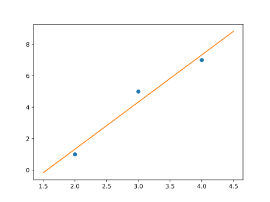

# Lineárna regresia

V praxi sa často stretávame s tým, že hodnotami jednej veličiny sú dané hodnoty druhej veličiny a zo
sady nameraných alebo štatisticky získaných dát určujeme matematický model
udávajúci funkčnú závislosť medzi oboma veličinami. Ako príklad môžeme uvažovať
dáta udávajúce výšku a hmotnosť amerických žien vo veku medzi 30 a 39 rokov (zdroj
<https://en.wikipedia.org/wiki/Simple_linear_regression>, 12.4.2024, pre stručnosť je použitá len polovica dát).

| výška/m |  $1{,}47$ |  $1{,}52$ |  $1{,}57$ |  $1{,}63$ |  $1{,}68$ |  $1{,}73$ |  $1{,}78$ |  $1{,}83$ |
|:-------|------:|------:|------:|------:|------:|------:|------:|------:|
| hmotnosť/kg   | $52{,}21$ | $54{,}48$ | $57{,}20$  | $59{,}93$ | $63{,}11$ | $66{,}28$ | $69{,}92$ | $74{,}46$ |

Dáta sú vykreslené na obrázku vľavo. Z obrázka je zrejmé, že s rastúcou
výškou rastie aj hmotnosť. V takom prípade je možné nájsť matematický model,
ktorý udáva hmotnosť ako funkciu výšky. Taký matematický model je znázornený
farebne na obrázku vpravo. Jedná sa o model, ktorý umožní pre zadanú výšku
ženy predpovedať jej hmotnosť.

Popísaná úloha sa nazýva *lineárna regresia*.

Lineárna regresia je jednou zo základných metód *strojového učenia*, keď v
dátach odhalíme istú funkčnú závislosť. Túto potom môžeme použiť k
tomu, aby sme dávali predikcie funkčných hodnôt pre dáta, ktoré sa v
zadanom súbore nevyskytujú.

V nasledujúcom si ukážeme, ako lineárna regresia súvisí s lineárnou
kombináciou vektorov, a ako je možné regresnú priamku nájsť pomocou operácií s
vektormi. Budeme postupovať po malých krokoch:

* Najprv si pripomenieme, ako sa riešia úlohy na zápis vektora ako lineárna
  kombinácia zadaných vektorov.
* Potom sa pozrieme, ako je možné predchádzajúcu úlohu uľahčiť, ak je
  niektorý z vektorov kolmý k ostatným.
* Ukážeme, ako je možné nájsť približné riešenie úlohy v prípade,
  že presné riešenie neexistuje.
* Na záver využijeme predchádzajúcich poznatkov na vyriešenie úlohy lineárnej regresie, t. j. zo zadaných dát zostavíme matematický model odhaľujúci trend
  v týchto dátach a umožňujúci predikovať funkčné hodnoty aj pre
  hodnoty, ktoré sa v dátovom súbore nevyskytujú.

## Lineárna kombinácia vektorov

> **Úloha 1.** Zapíšte vektor $\vec c = \begin{pmatrix}1 \cr 2\end{pmatrix}$ 
> ako lineárnu kombináciu vektorov 
> $\vec a = \begin{pmatrix}2 \cr 2\end{pmatrix}$
> a $\vec b = \begin{pmatrix}3 \cr 1\end{pmatrix}$. 

*Riešenie.* Zapísať vektor $\vec c$ ako kombináciu vektorov $\vec a$ a $\vec b$ znamená nájsť čísla $t_1$ a $t_2$ také, že
$$
t_1 \vec a + t_2 \vec b = \vec c.
$$
Po rozpísaní do súradníc vidíme, že táto úloha vedie na sústavu rovníc
$$
\begin{aligned}
2t_1+3t_2 &= 1,\cr
2t_1+t_2 &=2.
\end{aligned}
$$
Táto sústava má jediné riešenie $t_1=\frac 54$ a $t_2=-\frac 12$.

>**Úloha 2.** Napíšte vektor $\vec w=\begin{pmatrix}1\cr 2\cr 1\end{pmatrix}$ ako lineárnu kombináciu vektorov 
> $$ \vec u_1=\begin{pmatrix}2\cr 2\cr 1\end{pmatrix},\quad \vec u_2=\begin{pmatrix}3\cr 1\cr 2\end{pmatrix},\quad \vec u_3=\begin{pmatrix}3\cr -1\cr -4\end{pmatrix}. $$

*Riešenie.* Podobne ako v predchádzajúcej úlohe hľadáme čísla $t_1$, $t_2$ a $t_3$ také, že
$$
t_1 \vec u_1+t_2\vec u_2 + t_3 \vec u_3 = \vec w.\tag{1}
$$
Po dosadení a rozpísaní do súradníc dostávame sústavu troch rovníc o troch neznámych
$$\tag{2}
\begin{aligned}
2t_1 + 3t_2 + 3t_3 &= 1,\cr
2 t_1 + t_2 -t_3 &=2,\cr
t_1+2t_2-4t_3&=1.
\end{aligned}
$$
Riešenie takej sústavy je už pomerne nepríjemné. Pomocou sčítacej alebo dosadzovacej metódy by sme mohli ale zistiť, že
$$
t_1=\frac{14}{13},\quad t_2=-\frac{7}{26},\quad t_3=-\frac{3}{26}.
$$

## Lineárna kombinácia s využitím skalárneho súčinu

Ak je aspoň jeden zo zadaných vektorov kolmý k zvyšným 
vektorom, môžeme šikovným trikom získať jednoduchšiu 
sústavu rovníc.

Vráťme sa k predchádzajúcej úlohe. Môžeme si všimnúť, že vektor 
$\vec u_3$ je kolmý k vektorom $\vec u_1$ a $\vec u_2$. Tým 
pádom je aj kolmý k rovine definovanej týmito vektormi. Túto 
skutočnosť ľahko ukážeme výpočtom skalárnych súčinov 
$$
\vec u_1\cdot \vec u_3 = 2\cdot 3 +2\cdot (-1)+1\cdot (-4) = 0
$$
a
$$
\vec u_2\cdot \vec u_3 = 3\cdot 3 +1\cdot (-1)+2\cdot (-4) = 0.
$$
Vďaka tejto vlastnosti sa oplatí rovnicu (1) vynásobiť skalárne po rade vektormi $\vec u_1$ až $\vec u_3$. Tým dostávame nasledujúce tri rovnice.
$$
\begin{aligned}
t_1 (\vec u_1\cdot \vec u_1) + t_2 (\vec u_2\cdot \vec u_1) + t_3 (\vec u_3\cdot \vec u_1) &= \vec w\cdot \vec u_1\cr
t_1 (\vec u_1\cdot \vec u_2) + t_2 (\vec u_2\cdot \vec u_2) + t_3 (\vec u_3\cdot \vec u_2) &= \vec w\cdot \vec u_2\cr
t_1 (\vec u_1\cdot \vec u_3) + t_2 (\vec u_2\cdot \vec u_3) + t_3 (\vec u_3\cdot \vec u_3) &= \vec w\cdot \vec u_3
\end{aligned}
$$
Výpočtom skalárnych súčinov dostávame sústavu, ktorá je neporovnateľne jednoduchšia než sústava (2).
$$
\begin{aligned}
9t_1+10t_2=7\cr
10t_1+14t_2=7\cr
26t_3=-3
\end{aligned}
$$
Z poslednej rovnice vidíme priamo jednu z neznámych a dve prvé 
rovnice tvoria sústavu dvoch rovníc o dvoch neznámych $t_1$ a 
$t_2$. 

## Lineárna kombinácia a nekonzistentné sústavy rovníc

Pripomeňme, že za nekonzistentnú označujeme také sústavy 
lineárnych rovníc, ktoré nemajú riešenie.

Našu úlohu o nájdení vyjadrenia vektora ako lineárna 
kombinácia daných vektorov modifikujeme. Jeden z vektorov, s 
ktorými pracujeme, vynecháme. Tým sa stane úloha v klasickom 
zmysle neriešiteľnou. 

>**Úloha 3.** Napíšte vektor $\vec w=\begin{pmatrix}1\cr 2\cr 1\end{pmatrix}$ ako lineárnu kombináciu vektorov 
>$$ \vec u_1=\begin{pmatrix}2\cr 2\cr 1\end{pmatrix},\quad \vec u_2=\begin{pmatrix}3\cr 1\cr 2\end{pmatrix}. $$

*Riešenie.* Musíme nájsť čísla $t_1$, $t_2$ také, že platí 
$$t_1\vec u_1 + t_2\vec u_2 = \vec w.$$
Rozpísaním v súradniciach dostaneme sústavu
$$
\begin{aligned}
2t_1 + 3t_2  &= 1,\cr
2 t_1 + t_2  &=2,\cr
t_1+2t_2&=1.
\end{aligned}
$$
Je jednoduché sa presvedčiť, že táto sústava je nekonzistentná a nemá riešenie. Naozaj, sústavu zloženú z prvých dvoch rovníc sme vyriešili v úvode ($t_1=\frac 54$ a $t_2=-\frac 12$) a posledná rovnica je s touto voľbou v rozpore ($\frac 54+2\cdot(-\frac 12)\neq 1$).  

## Riešenie nekonzistentnej sústavy rovníc 

Poďme teraz rozumným způsobom zovšeobecniť pojem riešenia.
Nebudeme hľadať hodnoty neznámych, pre ktoré sú si ľavé a pravé 
strany rovné. Namiesto toho budeme hľadať aspoň také 
hodnoty neznámych, pre ktoré sa ľavé a pravé strany čo 
najmenej líšia.

*Riešením nekonzistentnej sústavy rovníc budeme rozumieť takú voľbu hodnôt neznámych, pre ktorú je dĺžka vektora vyjadrujúceho rozdiel ľavých a pravých strán sústavy minimálna.*

Na obrázku si vysvetlíme, čo daná sústava vyjadruje a ako je možné si
predstaviť jej riešenie vo vyššie uvedenom oslabenom zmysle.

![Vektory $\vec u_1$ a $\vec u_2$ definujú rovinu, v ktorej neleží vektor $\vec w$.
Preto vektor $\vec w$ nie je možné zapísať ako lineárnu kombináciu vektorov $u_1$ a
$u_2$. Je však možné ako lineárnu kombináciu zadaných vektorov zapísať kolmý
priemet $\vec w_0$ vektora $\vec w$ do uvažovanej roviny. Vektor $\vec w_0$ je zo
všetkých vektorov, ktoré je možné zapísať ako lineárnu kombináciu vektorov $\vec u_1$
a $\vec u_2$, najbližšie vektoru $\vec w$. Kvantitatívne kritérium pre túto
vlastnosť je dĺžka vektora $\vec \varepsilon$. Skutočnosť, že zo všetkých vektorov
roviny je k vektoru $\vec w$ najbližšie vektor $\vec w_0$ plynie z kolmosti vektora 
$\vec \varepsilon$ k rovine určenej vektormi $\vec u_1$ a $\vec u_2$.](regrese_image.svg)

Snažíme sa pomocou lineárnej
kombinácie vektorov $\vec u_1$ a $\vec u_2$ vyjadriť vektor $\vec w$, ktorý ale neleží v
rovine definovanej týmito vektormi. Taká úloha nemá riešenie. Budeme sa preto snažiť nájsť aspoň takú lineárnu kombináciu, 
ktorá sa od vektora $\vec w$ líši čo najmenej. 

Táto kombinácia je daná vektorom $\vec w_0$, pričom rozdiel medzi $\vec w$ a $\vec
w_0$ je znázornený vektorom $\vec \varepsilon$. Snažíme sa o to, aby dĺžka
vektora $\vec \varepsilon$ bola čo najmenšia. 

Z názorného pohľadu a geometrických vlastností je jednoduché nahliadnuť, že toto nastane v prípade, 
keď je vektor $\vec \varepsilon$ kolmý k rovine
určenej vektormi $\vec u_1$ a $\vec u_2$. Tým sa dostávame do rovnakej situácie,
ako pri alternatívnom riešení tretej úlohy. Tam sme tiež videli trik, ako nájsť
koeficienty pri vektoroch $\vec u_1$ a $\vec u_2$ bez riešenia plnej sústavy rovníc:
vynásobili sme sústavu skalárne vektormi $\vec u_1$ a $\vec u_2$. Dokonca k
tomuto výpočtu ani nemusíme poznať vektor $\vec \varepsilon$.

Pretože dĺžka vektora $\vec\varepsilon$ sa vyjadruje pomocou druhých mocnín
súradníc tohto vektora, má metóda názov *metóda najmenších štvorcov*.

Celý postup si ukážeme na nasledujúcom príklade.

## Lineárna regresia

Uvažujme dáta z nasledujúcej tabuľky.

|$x$|$2$|$3$|$4$|
|-:|-:|-:|-:|
|$y$|$1$|$5$|$7$|

Hľadáme priamku $y=ax+b$, ktorá čo najlepšie vystihuje trend v tomto súbore a bola by vhodným matematickým modelom pre tieto dáta. Dosadením každého z troch bodov do rovnice priamky dostávame sústavu troch rovníc o dvoch neznámych. 
$$
\begin{aligned}
2a+b=1\cr
3a+b=5\cr
4a+b=7
\end{aligned}
$$
To je úloha s nekonzistentnou sústavou rovníc (tzv. preurčenou sústavou), ktorá nemá riešenie v klasickom zmysle slova.
Vektorový tvar tejto sústavy je nasledujúci.
$$
a
\begin{pmatrix}2\\3\\4\end{pmatrix}
+
b
\begin{pmatrix}1\\1\\1\end{pmatrix} = \begin{pmatrix}1\\5\\7\end{pmatrix}
$$
Po vynásobení po rade vektormi $\begin{pmatrix}2\\3\\4\end{pmatrix}$ a 
$\begin{pmatrix}1\\1\\1\end{pmatrix}$ 
dostávame sústavu dvoch rovníc.
$$
\begin{aligned}
29a+9b&=45\\
9a+3b&=13
\end{aligned}
$$
Riešenie tejto sústavy je $a=3$ a $b=-\frac {14}3$. Regresným modelom pre zadané dáta je teda priamka 
$$y=3x-\frac {14}3.$$
Graf obsahujúci uvedené dáta a regresnú priamku je na obrázku.

## Regresia pre väčšie dátové súbory

Postup uvedený v predchádzajúcom texte pre tri body je možné zovšeobecniť na ľubovoľný
počet bodov. Nie je neobvyklé pracovať s dátovým súborom obsahujúcim stovky bodov.

Je-li vektor $\vec X$ vektorom obsahujúcim hodnoty nezávislej premennej[^1]
a $\vec Y$ vektor obsahujúci hodnoty závislej premennej, budeme uvažovať model[^3] 
$$
\vec Y = a\vec X+b.
$$
Koeficienty $a$ a $b$ určíme tak, že túto rovnicu prepíšeme na vektorovú rovnicu 
$$
\vec Y = a\vec X+b\vec 1,
$$
kde $\vec 1$ je vektor zostavený z jednotiek. Túto rovnicu vynásobíme skalárne
vektorom $\vec X$ a vektorom $\vec 1$. Dostávame tak sústavu
$$
\begin{aligned}
a(\vec X\cdot \vec X)+ b(\vec X\cdot \vec 1) &=
\vec X\cdot \vec Y \cr 
a(\vec 1\cdot \vec X)+ b(\vec 1\cdot \vec 1) &=
\vec 1\cdot \vec Y \cr 
\end{aligned}\tag{3}
$$

Pre viac než tri body takto pracujeme s vektormi väčšej dimenzie než tri. V
dôsledku toho prichádzame o názornú geometrickú predstavu. Až na túto
skutočnosť sa však na práci nič nemení. Skalárny súčin dvoch vektorov sa stále počíta
tak, že sa vynásobia zodpovedajúce komponenty a tieto súčiny sa potom sčítajú.

> **Úloha 4.** Nájdite vhodný lineárny model pre 
> tabuľku dát z úvodného textu.

*Riešenie.* Pripomeňme si uvedené dáta:

| výška/m |  $1{,}47$ |  $1{,}52$ |  $1{,}57$ |  $1{,}63$ |  $1{,}68$ |  $1{,}73$ |  $1{,}78$ |  $1{,}83$ |
|:-------|------:|------:|------:|------:|------:|------:|------:|------:|
| hmotnosť/kg   | $52{,}21$ | $54{,}48$ | $57{,}20$  | $59{,}93$ | $63{,}11$ | $66{,}28$ | $69{,}92$ | $74{,}46$ |

Po dosadení dát do potrebných skalárnych súčinov dostaneme:

$$
\begin{aligned}
\vec X\cdot\vec X&=
1{,}47^2 + 1{,}52^2+1{,}57^2+\cdots+1{,}83^2=21{,}9257\cr
\vec X\cdot\vec Y&=
1{,}47 \cdot 52{,}21 + 
1{,}52\cdot 54{,}48 + 
1{,}57\cdot 57{,}20+\cdots+
1{,}83\cdot 74{,}46=828{,}4568\cr
\vec 1\cdot\vec X&=
 1{,}47 + 1{,}52+ 1{,}57+\cdots+ 1{,}83=
13{,}21\cr
\vec 1\cdot\vec Y&=
52{,}21 + 54{,}48+57{,}20+\cdots+74{,}46=497{,}59\cr
\vec 1\cdot\vec 1 &= 1+1+1+\cdots +1=8
\end{aligned}
$$

Po dosadení hodnôt do (3) dostávame sústavu
dvoch rovníc o dvoch neznámych

$$
\begin{aligned}
21{,}9257a+13{,}21b&=828{,}4568,\cr
13{,}21a+8b&=497{,}59,
\end{aligned}
$$

ktorá má jediné riešenie. Týmto riešením[^2] je 
 $a=60{,}44$ a $b=-37{,}61$. Modelom, ktorý udáva
závislosť hmotnosti žien $y$ na ich výške $x$, je vzťah
$$y=60{,}44x-37{,}61.$$

Obrázok 4 ukazuje použité dáta, regresnú závislosť a predikciu pre hmotnosť ženy o
výške $1{,}72$ metra.

> **Úloha 5.** Nájdite regresnú priamku pre zadané dáta.
> 
> |$x$|$1{,}0$|$2{,}0$|$3{,}0$|$4{,}0$|
> |-:|-:|-:|-:|-:|
> |$y$|$2{,}3$|$2{,}5$|$3{,}1$|$3{,}3$|

\iffalse

*Riešenie.*

Pre vektory $\vec X$ a $\vec Y$ dané po rade prvým a druhým riadkom tabuľky dostávame
$$
\begin{aligned}
\vec X\cdot\vec X&=1{,}0^2+2{,}0^2+3{,}0^2+4{,}0^2=30,\cr
\vec X\cdot\vec Y&=1{,}0\cdot 2{,}3+2{,}0\cdot 2{,}5+3{,}0\cdot 3{,}1+4{,}0\cdot 3{,}3=29{,}8,\cr
\vec 1\cdot\vec X&=1{,}0+2{,}0+3{,}0+4{,}0=10,\cr
\vec 1\cdot\vec Y&=2{,}3+2{,}5+3{,}1+3{,}3=11{,}2,\cr
\vec 1\cdot\vec 1&=1+1+1+1=4.
\end{aligned}
$$

Sústava rovníc (3) po dosadení týchto hodnôt má tvar
$$
\begin{aligned}
30a+10b&=29{,}8,\cr
10a+4b&=11{,}2.
\end{aligned}
$$
Riešením tejto sústavy je $a=0{,}36$ a $b=1{,}90$. Regresná priamka pre zadané
dáta je teda
$$y=0{,}36x+1{,}90.$$ 
Obrázok ukazuje regresnú priamku a zadané dáta.

\fi

## Záverečné poznámky

* V štatistike je uvedená metóda jednou zo základných metód pri predikcii, či
  jedna veličina má vplyv na hodnoty druhej veličiny. Preto sú k dispozícii
  metódy, ktoré hodnotia kvalitu aproximácie a tiež to, či je pre daný súbor bodov
  uvažovaná aproximácia vhodná či nie.
* Existujú aj viacrozmerné verzie metódy najmenších štvorcov, keď predikovanú hodnotu 
  určujeme nie z jednej, ale z niekoľkých nezávislých veličín.
* Úloha nájsť riešenie nekonzistentnej sústavy lineárnych rovníc sa vyskytuje aj pri
  rekonštrukcii obrazu v *akustickej tomografii*. To umožňuje študovať zloženie
  geologických vrstiev alebo zdravotný stav dreva či stromu na základe informácie o
  rýchlosti, s akou materiálom prechádzajú vlny elastickej deformácie. Ako úvod do
  problematiky môže poslúžiť séria článkov na blogu <https://tomroelandts.com/>.
* Je možné zostaviť priamo vzťahy pre výpočet koeficientov lineárnej regresie zo zadaných dát 
  a vynechať tak výpočet skalárnych súčinov a riešenie sústavy rovníc. 
  Pozri napríklad <https://en.wikipedia.org/wiki/Simple_linear_regression#Expanded_formulas>.

## Literatúra a odkazy

### Literatúra

* Wikipedie, Simple linear regression, https://en.wikipedia.org/wiki/Simple_linear_regression, 12.4.2024
* Tom Roelandts, https://tomroelandts.com/articles/tomography-part-1-projections, https://tomroelandts.com/articles/the-sirt-algorithm, 13.4.2024
  

### Zdroje obrázkov

* https://commons.wikimedia.org/wiki/File:Flag-map_of_the_United_States.svg

[^1]: Použijeme zápis bežne používaný pri spracovaní dát, keď dátové súbory
(vektory) označujeme veľkými písmenami a vektor, ktorý má všetky komponenty
rovné rovnakému číslu zapisujeme ako dané číslo so šípkou pre označenie vektora.

[^2]: Pozor, úloha je pomerne citlivá na zaokrúhľovanie. 

[^3]: Prísne vzaté táto operácia nemá matematicky zmysel, pretože sčítavame vektor
s reálnym číslom. Túto operáciu je nutné interpretovať po zložkách, keď toto
sčítanie znamená, že sa reálne číslo zmení na vektor príslušnej dimenzie tak, aby
operácia bola definovaná. Toto prispôsobenie sa nazývame *broadcasting*. Vo
výsledku ku každej komponente vektora $a\vec X$ pripočítavame hodnotu $b$.

