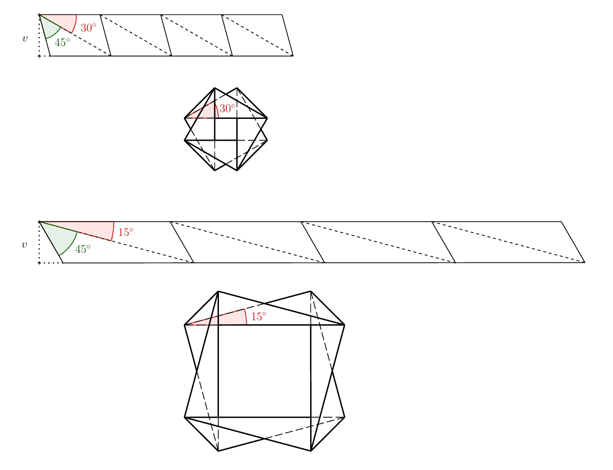
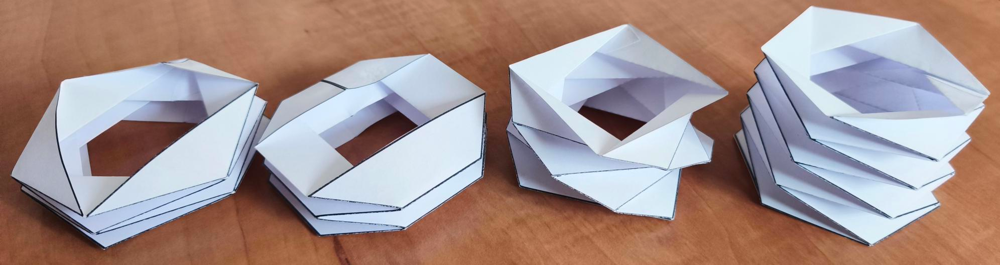

---
keywords:
- origami
- skládání papíru
- vedlejší úhly
- střídavé úhly
is_finished: True
difficulty: 1
time: 15
---

# Origami
 
Když slyšíme slovo origami, představíme si asi nejdříve papírovou skládanku ve tvaru zvířete nebo lodičky. 
Tyto jednoduché tvary často slouží jako první krok do fascinujícího světa skládání papíru. 
Existují ale i origami, které zaberou několik hodin či dokonce dní pečlivé práce.

Fascinující je ale skutečnost, že princip skládání, jak ho známe z origami, se objevuje i v přírodě kolem nás i v nás samotných. 
Rozvíjející se poupě květu, jemně se rozbalující křídla hmyzu ukrytá pod pevnými krovkami, 
složitá struktura lidské DNA, nebo stěny tlustého střeva, to vše využívá principy podobné těm, které najdeme v origami. 
Schopnost materiálů a struktur „skládat se“ a „rozkládat se“ podle potřeby je jedním ze základních stavebních prvků života.

V posledních letech zažilo origami skutečný rozmach, a to nejen jako koníček pro milovníky papíru, 
ale i v mnoha uměleckých a vědních oborech. Ovlivnilo architekty, designéry nábytku, umělce a vědce. 
Origami se tak proměnilo z pouhého umění skládání papíru v nástroj, který pomáhá formovat budoucnost.

## Skládání kolem dokola
 
Pojďme začít jednoduše a to proužkem papíru. Zkuste vytvořit sklady na proužku papíru tak, 
aby se opakovaly pravidelným způsobem, proužek se dal díky skladům složit do roviny 
a současně abyste se po několika krocích s krátkými konci proužku papíru dostali k sobě 
(zatím stačí přibližně, později budeme chtít kratší konce na sebe přesně navázat). 
Současně se nesmí libovolně křížit dlouhé okraje proužku. 
Jeden dlouhý okraj proužku musí být po poskládání tvaru viditelný po celé délce. 
Druhý dlouhý okraj proužku papíru bude logicky po celé délce přiléhat k podložce, 
na které výsledný tvar leží. Na následujícím obrázku je ukázka chybného i správného řešení.

> **Úloha 1.** Vyzkoušejte si složit z proužku papíru správné řešení z předchozího obrázku
> a vytvořte několik dalších variant tak, aby opět platilo:
> 1) proužek se dá složit do roviny a sklady se pravidelně opakují, 
> 2) jeho kratší okraje na sebe přibližně navazují,
> 3) jeden z jeho delších okrajů je při pohledu shora celý viditelný.

\iffalse

*Řešení.* Několik možných řešení (včetně ukázkového) je na následujím obrázku.

Pokud proužky papíru opět rozvineme, uvidíme následující (viz obrázek).

\fi

> **Úloha 2.**  Pro předchozí typy řešení určete přesný vzor skladů proužku papíru tak,
> aby se oba kratší konce potkaly přesně a šly slepit.

\iffalse

*Řešení.* Jak je obvyklé v origami, budeme značit hřebeny plně a údolí čárkovaně. 
Pokud si nakreslíme všechny varianty ve složeném tvaru je řešení ve většině případů zřejmé 
a vyplývá z pravidelnosti a symetrií, které se ve vzoru platí.
Řešení společně s naznačenými úhly jsou na následujícím obrázku.
Velikosti zbylých úhlů jsou zřejmé ze znalostí o vedlejších a střídavých úhlech.
 
 

U třetí varianty je ale situace složitější (na předchozích fotografiích jde o variantu ze žlutého papíru). 
Pro naznačený úhel $\beta$ platí 

$$
\sin\beta=\frac{v}{c},
$$ 

kde $v$ je výška proužku papíru. 
Pokud tuto výšku zafixujeme, stále existuje nekonečně mnoho řešení v závislosti na úhlu $\beta$, 
kde $\beta\in(0; 180^{\circ}-45^{\circ})$. 
Dvě varianty pro úhel $\beta=30^{\circ}$ a $\beta=15^{\circ}$ jsou na následujícím obrázku.

Jednotlivé proužky můžeme také skládat na sebe, pokud to uděláme vhodným způsobem, 
půjde vzor opět složit do roviny. Ukázky dvou variant jsou na obrázku.

Všechny varianty vzniklé skládáním na sebe z proužků z předchozího řešení najdete na pracovních listech 1 a 2
(pokud chcete boční strany slepit, musíte jen přidat přesahy na přilepení). 
Na následujícím obrázku jsou varianty z pracovního listu složené a slepené.

\fi

Tyto a další origami "trubice" nacházejí uplatnění v medicíně, designu či materiálovém inženýrství.
Na uplatnění origami v medicíně se zaměříme i v dalším odstavci. 
Nebudeme v něm sice nebudeme řešit žádnou úlohu, představime si ale další zajimavou aplikaci origami.

## Vodní bomba nebo stent

Lékařský stent je malá, většinou síťovitá trubice, 
která se zavádí do zúžené nebo zablokované cévy nebo jiného průchodu v těle, 
aby pomohla udržet ji otevřenou a umožnila správný průtok krve nebo tekutin. 
Tato zařízení se běžně používají, když je krevní oběh narušen v důsledku zúžení tepen. 
Primárním cílem umístění stentu je obnovit normální průtok krve.

Stenty musí být dostatečně pevné, aby odolaly silám v lidském těle, 
ale také musí mít dostatečnou flexibilitu, aby se přizpůsobily tvaru cévy.

Mezi nedávné inovace patří vývoj stentů inspirovaných vzorem vodní bomby, 
který je známý svými vynikajícími roztažnými vlastnostmi a flexibilitou. 
Tento design si klade za cíl zlepšit přizpůsobivost stentů v cévách
a představuje inovativní přístup k minimálně invazivním kardiovaskulárním intervencím. 
Tato konstrukce umožňuje kompaktní složení stentu pro zavedení a následné kontrolované a rovnoměrné roztažení po zavedení, 
což zvyšuje bezpečnost a účinnost při obnově správného průtoku krve.

Ve třetím pracovním listu najdete vzor pro výrobu tohoto modelu. 
To doporučuji ale jen pro opravdové nadšence do skládání z papíru.

## Literatura a odkazy

* https://www.mdpi.com/2218-6581/12/1/21
* https://techxplore.com/news/2025-05-origami-materials.html
* https://www.nature.com/articles/s41528-022-00139-x
* https://www.sfu.ca/sfunews/media/issues-experts/2021/09/technology-takes-the-art-of-origami-into-the-fight-against-covid.html
* https://www.mddionline.com/implants/from-origami-to-a-prototype-stent
* https://www.sciencedirect.com/science/article/pii/S0263822322004512
* https://www.youtube.com/watch?v=uFyJykl1O0k

