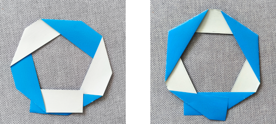
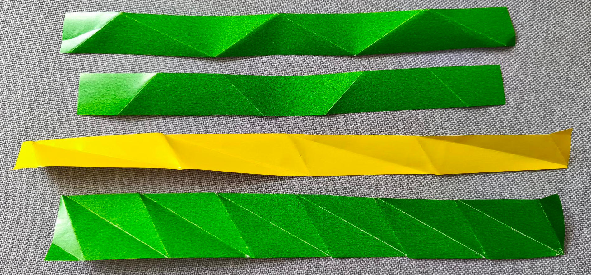
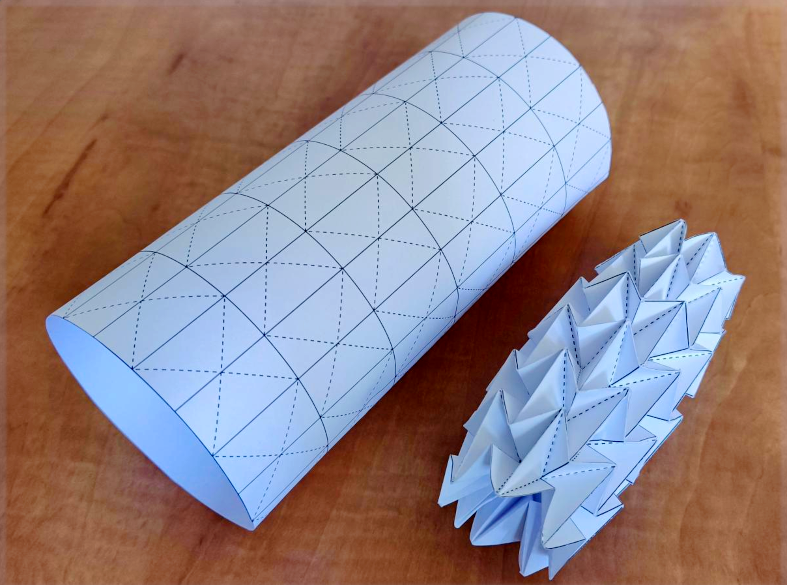

---
keywords:
- origami
- paper folding
- supplementary angles
- alternate angles
is_finished: True
---

# Origami
 
When we hear the word origami, we usually picture a simple paper model shaped like an animal or a boat.
These simple shapes often serve as an entry point into the fascinating world of paper folding.
However, there are also origami creations that require several hours—or even days—of meticulous work.

What’s truly fascinating is that the principles of folding, as we know them from origami, appear not only in the paper art itself but also in nature—both around us and within us. A flower bud gradually opening up, the gently unfolding wings of insects hidden beneath elytra (hardened forewings), the complex structure of human DNA, or the walls of the large intestine—all of these use principles similar to those found in origami. The ability of materials and structures to “fold” and “unfold” as needed is one of the fundamental building blocks of life.

In recent years, origami has experienced a true renaissance—not only as a hobby for paper enthusiasts but also in many artistic and scientific fields. It has influenced architects, furniture designers, artists and scientists alike. 
Origami has thus evolved from a simple art of paper folding into a tool that helps shape the future.

## Folding Round and Round

Let’s start simple—with a strip of paper. Try creating folds along the strip in such a way that they repeat regularly, allowing the strip to lie flat when folded. At the same time, after a few folding steps, the short ends of the strip should meet each other (an approximate match is fine for now—we’ll aim for a precise connection later).
While folding, the long edges of the strip must not cross each other arbitrarily.
One of the long edges should remain fully visible along the entire shape once it is folded.
Logically, the other long edge of the strip will lie flush with the surface on which the final shape rests. 
The following figure shows both an incorrect and a correct solution.

> **Exercise 1.** Try folding a strip of paper to recreate the correct solution shown in the previous image. Then, create several more variations that meet the following criteria:
> 1) the strip can be folded flat, and the folds repeat in a regular pattern,
> 2) the short ends of the strip approximately align,
> 3) one of the long edges remains completely visible when viewed from above.

\iffalse

 *Solution.* Several possible solutions—including the example from the previous image—are shown below.

If we unfold the strips again, we get the following (see figure).

\fi

> **Exercise 2.**  For the previous types of solutions, determine the exact pattern of folds on the paper strip
> so that the two short ends meet precisely and can be glued together.

\iffalse

*Solution.* As is common in origami, we will use solid lines to indicate mountain folds and dashed lines for valley folds. 
If we draw all the variants in their folded form, the solution is, in most cases, straightforward.
It follows from the regularity and symmetry present in the pattern.
The solutions, along with marked angles, are shown in the following figure.
The sizes of the remaining angles can be determined using knowledge of supplementary and alternate angles.

However, the third variant is more complex (in the previous photos, it is the version made from yellow paper).
For the indicated angle $\beta$ it holds

$$
\sin\beta=\frac{v}{c},
$$ 

where $v$ is the height of the paper strip.
If we fix this height, there are still infinitely many solutions depending on the angle $\beta$,
where $\beta\in(0; 180^{\circ}-45^{\circ})$.
Two possible variants for $\beta=30^{\circ}$ and $\beta=15^{\circ}$ are shown in the following figure.

We can also stack individual paper strips on top of each other. If we do this in a suitable way, the resulting pattern can still be folded flat. Examples of two such variants are shown in the image.

\fi

All the variants created by stacking the folded strips from the previous task can be found in Worksheets 1 and 2 (if you want to glue the side edges together, you just need to add tabs for gluing).
The following figure shows the variants from the worksheets folded and glued.

These and other origami “tubes” have found applications in medicine, design, and materials engineering. In the next section, we will focus specifically on how origami is used in medicine. While we won’t be solving a task this time, we will explore another fascinating application of origami.

## Water Bomb or Stent

A medical stent is a small, usually mesh-like tube that is inserted into a narrowed or blocked blood vessel or other passageway in the body to help keep it open and ensure proper blood or fluid flow. These devices are commonly used when blood circulation is impaired due to narrowed arteries. The primary goal of placing a stent is to restore normal blood flow.

Stents must be strong enough to withstand the forces within the human body, yet flexible enough to adapt to the shape of the vessel.

Recent innovations include the development of stents inspired by the water bomb folding pattern, known for its excellent expandability and flexibility. This design aims to improve the adaptability of stents within blood vessels and represents an innovative approach to minimally invasive cardiovascular procedures. It allows the stent to be folded into a compact shape for insertion and then expanded in a controlled and uniform way once deployed, increasing both safety and effectiveness in restoring proper blood flow.

Worksheet 3 includes a template for constructing this model. Due to its complexity, it is recommended for true paper folding enthusiasts.

## Literature and references

* https://www.mdpi.com/2218-6581/12/1/21
* https://techxplore.com/news/2025-05-origami-materials.html
* https://www.nature.com/articles/s41528-022-00139-x
* https://www.sfu.ca/sfunews/media/issues-experts/2021/09/technology-takes-the-art-of-origami-into-the-fight-against-covid.html
* https://www.mddionline.com/implants/from-origami-to-a-prototype-stent
* https://www.sciencedirect.com/science/article/pii/S0263822322004512
* https://www.youtube.com/watch?v=uFyJykl1O0k
