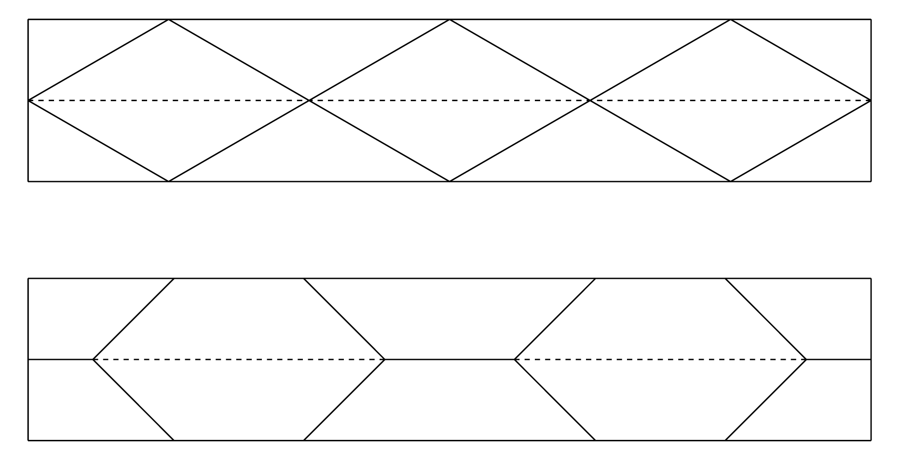

# Origami
 
Cuando oímos la palabra «origami», lo primero que nos viene a la mente es probablemente un papel doblado con forma de animal o de barco. 
Estas formas sencillas suelen ser el primer paso para adentrarse en el fascinante mundo del plegado de papel. 
Sin embargo, también hay origamis que requieren varias horas o incluso días de minucioso trabajo.

Sin embargo, lo fascinante es que el principio del plegado, tal y como lo conocemos en el origami, también aparece en la naturaleza que nos rodea y en nosotros mismos. 
El capullo de una flor en desarrollo, las alas de un insecto que se despliegan suavemente bajo sus resistentes alas, 
la compleja estructura del ADN humano o las paredes del intestino grueso; todos ellos utilizan principios similares a los que encontramos en el origami. 
La capacidad de los materiales y las estructuras para «plegarse» y "desplegarse" según sea necesario es uno de los elementos fundamentales de la vida.

En los últimos años, el origami ha experimentado un verdadero auge, no solo como pasatiempo para los amantes del papel, 
sino también en muchos campos artísticos y científicos. Ha influido en arquitectos, diseñadores de muebles, artistas y científicos. 
Así, el origami ha pasado de ser un simple arte de plegar papel a convertirse en una herramienta que ayuda a dar forma al futuro.

## Plegado en círculo
 
Empecemos por algo sencillo, con una tira de papel. Intenta crear pliegues en la tira de papel de manera que, 
se repitan de forma regular, que la tira se pueda doblar en plano gracias a los pliegues 
y que, al mismo tiempo, tras varios pasos, los extremos cortos de la tira de papel queden juntos 
(por ahora basta con que sea aproximado, más adelante querremos unir los extremos cortos con precisión). 
Al mismo tiempo, los bordes largos de la tira no deben cruzarse arbitrariamente. 
Uno de los bordes largos de la tira debe quedar visible en toda su longitud después de doblar la forma. 
El otro borde largo de la tira de papel quedará lógicamente pegado en toda su longitud a la base 
sobre la que se apoya la forma resultante. En la siguiente imagen se muestra un ejemplo de solución incorrecta y correcta.

> **Tarea 1.** Intenta doblar una tira de papel para obtener la solución correcta de la imagen anterior
> y crea varias variantes más, de modo que se cumpla lo siguiente:
> 1) la tira se puede doblar en plano y los pliegues se repiten regularmente, 
> 2) sus bordes más cortos se unen aproximadamente,
> 3) uno de sus bordes más largos es completamente visible cuando se mira desde arriba.

\iffalse

*Solución.* En la siguiente imagen se muestran varias soluciones posibles (incluida una propuesta).

Si volvemos a desplegar las tiras de papel, veremos lo siguiente (véase la imagen).

\fi

> **Tarea 2.**  Para los tipos de soluciones anteriores, determine el patrón exacto de los pliegues de la tira de papel, de modo que,
> ambos extremos más cortos coincidan exactamente y se puedan pegar.

\iffalse

*Solución.* Como es habitual en origami, marcaremos los picos con líneas continuas y los valles con líneas discontinuas. 
Si dibujamos todas las variantes en la forma plegada, la solución es evidente en la mayoría de los casos 
y se deduce de la regularidad y simetría que se aplican en el patrón.
La solución, junto con los ángulos indicados, se muestra en la siguiente imagen.
Los tamaños de los ángulos restantes son evidentes a partir del conocimiento de los ángulos adyacentes y alternos.
 
 

Sin embargo, en la tercera variante, la situación es más compleja (en las fotografías anteriores se trata de la variante de papel amarillo). 
Para el ángulo indicado $\beta$ se aplica 

$$
\sin\beta=\frac{v}{c},
$$ 

donde $v$ es la altura de la tira de papel. 
Si fijamos esta altura, sigue habiendo infinitas soluciones en función del ángulo $\beta$, 
donde $\beta\in(0; 180^{\circ}-45^{\circ})$. 
Las dos variantes para el ángulo $\beta=30^{\circ}$ y $\beta=15^{\circ}$ se muestran en la siguiente figura.

Las tiras individuales también se pueden apilar unas sobre otras; si lo hacemos de la manera adecuada, 
el patrón volverá a quedar plano. En la imagen se muestran dos variantes.

Todas las variantes creadas al superponer las tiras de la solución anterior se encuentran en las hojas de trabajo 1 y 2
(si desea pegar los lados, solo tiene que añadir solapas para pegarlas). 
En la siguiente imagen se muestran las variantes de la hoja de trabajo plegadas y pegadas.

\fi

Estos y otros "tubos" de origami se utilizan en medicina, diseño e ingeniería de materiales.
En el siguiente apartado nos centraremos en el uso del origami en medicina. 
Aunque no resolveremos ninguna tarea, presentaremos otra aplicación interesante del origami.

## Bomba de agua o stent

Un stent médico es un pequeño tubo, generalmente en forma de malla, 
que se inserta en un vaso sanguíneo estrecho u obstruido u otro conducto del cuerpo, 
para ayudar a mantenerlo abierto y permitir el flujo adecuado de sangre o fluidos. 
Estos dispositivos se utilizan habitualmente cuando la circulación sanguínea se ve afectada por el estrechamiento de las arterias. 
El objetivo principal de la colocación de un stent es restablecer el flujo sanguíneo normal.

Los stents deben ser lo suficientemente resistentes como para soportar las fuerzas del cuerpo humano, 
pero también deben tener la flexibilidad suficiente para adaptarse a la forma del vaso sanguíneo.

Entre las innovaciones recientes se encuentra el desarrollo de stents inspirados en el diseño de la bomba de agua, 
conocida por sus excelentes propiedades de expansión y flexibilidad. 
Este diseño tiene como objetivo mejorar la adaptabilidad de los stents en los vasos sanguíneos
y representa un enfoque innovador para las intervenciones cardiovasculares mínimamente invasivas. 
Esta construcción permite una composición compacta del stent para su implantación y una expansión controlada y uniforme tras la implantación, 
lo que aumenta la seguridad y la eficacia en la restauración del flujo sanguíneo adecuado.

En la tercera hoja de trabajo encontrarás un patrón para hacer este modelo. 
Pero solo lo recomiendo para los verdaderos entusiastas del plegado de papel.

## Bibliografía y referencias

* https://www.mdpi.com/2218-6581/12/1/21
* https://techxplore.com/news/2025-05-origami-materials.html
* https://www.nature.com/articles/s41528-022-00139-x
* https://www.sfu.ca/sfunews/media/issues-experts/2021/09/technology-takes-the-art-of-origami-into-the-fight-against-covid.html
* https://www.mddionline.com/implants/from-origami-to-a-prototype-stent
* https://www.sciencedirect.com/science/article/pii/S0263822322004512
* https://www.youtube.com/watch?v=uFyJykl1O0k

