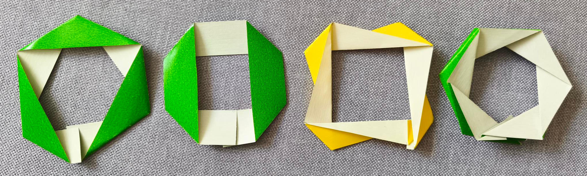
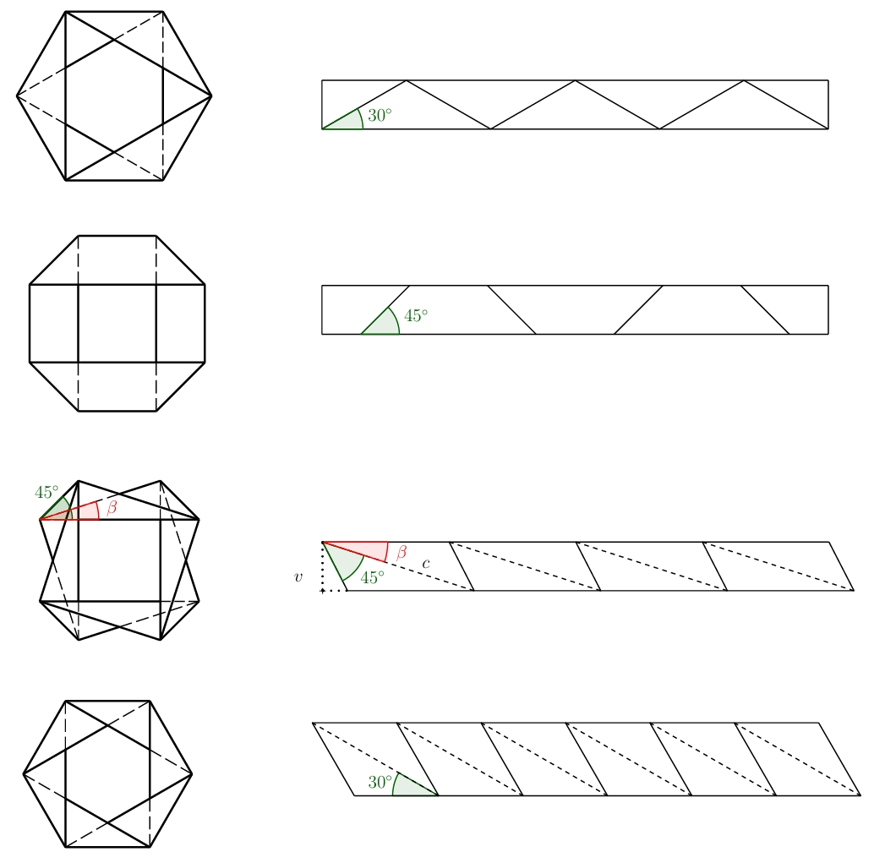

---
keywords:
- trygonometria
- origami
- składanie papieru
- kąty dodatkowe
- kąty naprzemienne
is_finished: true
---

# Origami
 
Kiedy słyszymy słowo origami, prawdopodobnie najpierw wyobrażamy sobie papierową układankę w kształcie zwierzęcia lub łodzi. 
Te proste kształty często stanowią pierwszy krok do fascynującego świata składania papieru. 
Ale są też origami, które wymagają godzin, a nawet dni starannej pracy.
Fascynujące jest jednak to, że zasada składania, jaką znamy z origami, występuje również w otaczającej nas naturze i w nas samych. 
Rozwijający się pączek kwiatu, delikatnie rozwijające się skrzydła owada ukryte pod solidnymi kratownicami, 
skomplikowana struktura ludzkiego DNA lub ściany jelita grubego, wszystkie wykorzystują zasady podobne do tych znalezionych w origami. 
Zdolność materiałów i struktur do „składania” i „rozkładania” w zależności od potrzeb jest jednym z podstawowych budulców życia.

W ostatnich latach origami przeżywa prawdziwy rozkwit, nie tylko jako hobby dla miłośników papieru, 
ale także w wielu dziedzinach artystycznych i naukowych. Wpłynęło na architektów, projektantów mebli, artystów i naukowców. 
W ten sposób origami przekształciło się ze zwykłej sztuki składania papieru w narzędzie, które pomaga kształtować przyszłość.

## Składanie dookoła
 
Zacznijmy po prostu od paska papieru. Spróbuj utworzyć zagięcia na pasku papieru, 
tak, aby powtarzały się w regularny sposób, pasek można było złożyć w płaszczyznę dzięki zagięciom 
i jednocześnie połączyć krótkie końce paska papieru po kilku krokach 
(na razie wystarczy w przybliżeniu, później będziemy chcieli, aby krótsze końce były dokładnie połączone ze sobą). 
Jednocześnie długie krawędzie paska nie mogą się dowolnie przecinać. 
Jedna długa krawędź paska musi być widoczna na całej długości po złożeniu kształtu. 
Druga długa krawędź paska papieru będzie logicznie przylegać na całej długości do podpory, 
na której spoczywa wynikowy kształt. Poniższy rysunek przedstawia przykład zarówno błędnego, jak i poprawnego rozwiązania.

> **Zadanie 1.** Spróbuj złożyć pasek papieru w prawidłowe rozwiązanie z poprzedniego obrazka i stwórz kilka innych wariantów, aby ponownie było prawidłowe:
> 1) pasek można złożyć na płasko, a zagięcia są regularnie powtarzane,
> 2) jego krótsze krawędzie z grubsza przylegają do siebie,
> 3) jedna z jego dłuższych krawędzi jest całkowicie widoczna, gdy patrzy się na nią z góry.

\iffalse

*Rozwiązanie.* Na poniższym rysunku przedstawiono kilka możliwych rozwiązań (w tym przykładowe).

Jeśli ponownie rozwiniemy paski papieru, zobaczymy następujący obrazek.

\fi

> **Zadanie 2.**  W przypadku poprzednich typów rozwiązań należy określić dokładny wzór zagięcia paska papieru, tak aby dwa krótsze końce dokładnie się stykały i można je było skleić.

\iffalse

*Rozwiązanie.* Jak zwykle w origami, zaznaczymy grzbiety w całości, a doliny przerywanymi liniami. Jeśli narysujemy wszystkie warianty złożonego kształtu, rozwiązanie jest oczywiste w większości przypadków i wynika z regularności i symetrii, które mają zastosowanie we wzorze. Rozwiązania wraz ze wskazanymi kątami pokazano na poniższym rysunku.
Wielkości pozostałych kątów są oczywiste ze znajomości kątów bocznych i naprzemianległych.
 
 

Sytuacja jest jednak bardziej skomplikowana w przypadku trzeciego wariantu (na poprzednich zdjęciach jest to wariant wykonany z żółtego papieru). 
Dla wskazanego kąta $\beta$ 

$$
\sin\beta=\frac{v}{c},
$$ 

gdzie $v$  to wysokość paska papieru.
Jeśli ustalimy tę wysokość, nadal istnieje nieskończenie wiele rozwiązań zależnych od kąta $\beta$, 
gdzie $\beta\in(0; 180^{\circ}-45^{\circ})$. 
Dwa warianty dla kąta $\beta=30^{\circ}$ i $\beta=15^{\circ}$ pokazano na poniższym rysunku.

Paski można również układać jeden na drugim, jeśli robi się to we właściwy sposób, 
wzór można ponownie złożyć na płasko. Przykłady dwóch wariantów pokazano na ilustracji.

Wszystkie warianty utworzone przez ułożenie pasków z poprzedniego rozwiązania można znaleźć na arkuszach 1 i 2
(jeśli chcesz skleić boki, wystarczy dodać zakładki do sklejenia). 
Poniższy rysunek przedstawia warianty z arkusza roboczego złożone i sklejone razem.

\fi

Te i inne „rurki” origami znajdują zastosowanie w medycynie, projektowaniu i inżynierii materiałowej.
W następnym akapicie skupimy się na zastosowaniu origami w medycynie. 
Choć nie zajmiemy się w nim z żadnym zadaniem, przedstawimy inne interesujące zastosowanie origami.

## Bomba wodna lub stent

Stent medyczny to niewielka, zwykle przypominająca siatkę rurka, którą wprowadza się do zwężonego lub zablokowanego naczynia krwionośnego lub innego przejścia w ciele, aby pomóc utrzymać je otwarte i umożliwić prawidłowy przepływ krwi lub płynów. 
Urządzenia te są powszechnie stosowane, gdy krążenie krwi jest upośledzone z powodu zwężenia tętnic. 
Głównym celem umieszczenia stentu jest przywrócenie prawidłowego przepływu krwi.

Stenty muszą być wystarczająco mocne, aby wytrzymać siły działające w ludzkim ciele, 
ale muszą też mieć wystarczającą elastyczność, aby dostosować się do kształtu naczynia krwionośnego.
Ostatnie innowacje obejmują opracowanie stentów inspirowanych wzorem bomby wodnej, 
która jest znana z doskonałych właściwości rozszerzania i elastyczności. 
Konstrukcja ta ma na celu poprawę zdolności adaptacyjnych stentów w naczyniach
i stanowi innowacyjne podejście do minimalnie inwazyjnych interwencji sercowo-naczyniowych. 
Konstrukcja ta pozwala na kompaktową kompozycję stentu do rozmieszczenia, a następnie kontrolowane i równomierne rozszerzanie po rozmieszczeniu, 
co poprawia bezpieczeństwo i skuteczność w przywracaniu prawidłowego przepływu krwi.

W trzecim arkuszu znajduje się wzór do wykonania tego modelu. 
Polecam go tylko prawdziwym entuzjastom składania papieru.

## Literatura 

* https://www.mdpi.com/2218-6581/12/1/21
* https://techxplore.com/news/2025-05-origami-materials.html
* https://www.nature.com/articles/s41528-022-00139-x
* https://www.sfu.ca/sfunews/media/issues-experts/2021/09/technology-takes-the-art-of-origami-into-the-fight-against-covid.html
* https://www.mddionline.com/implants/from-origami-to-a-prototype-stent
* https://www.sciencedirect.com/science/article/pii/S0263822322004512
* https://www.youtube.com/watch?v=uFyJykl1O0k

