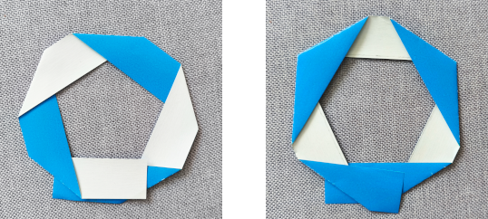
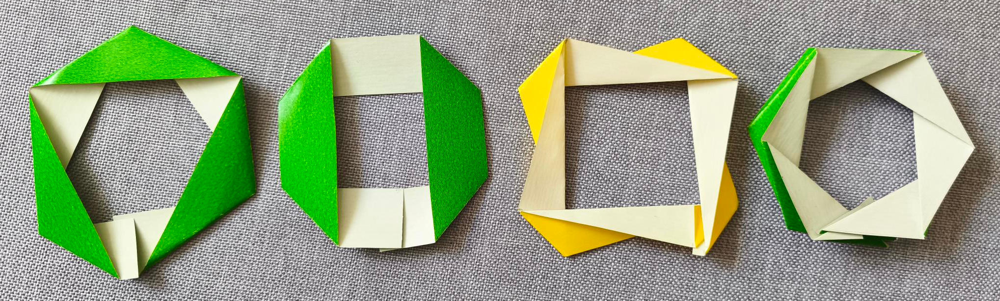
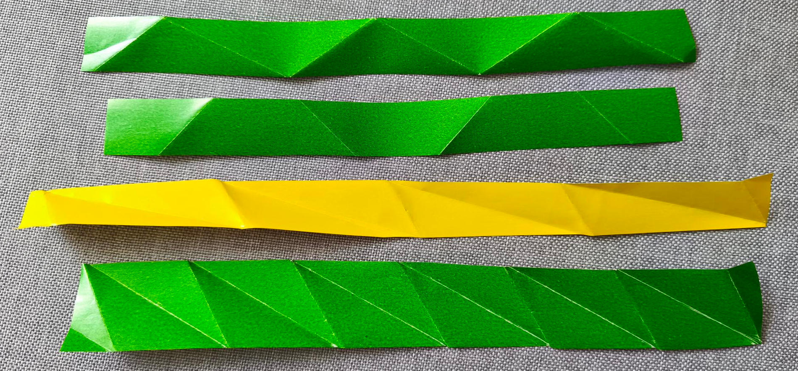
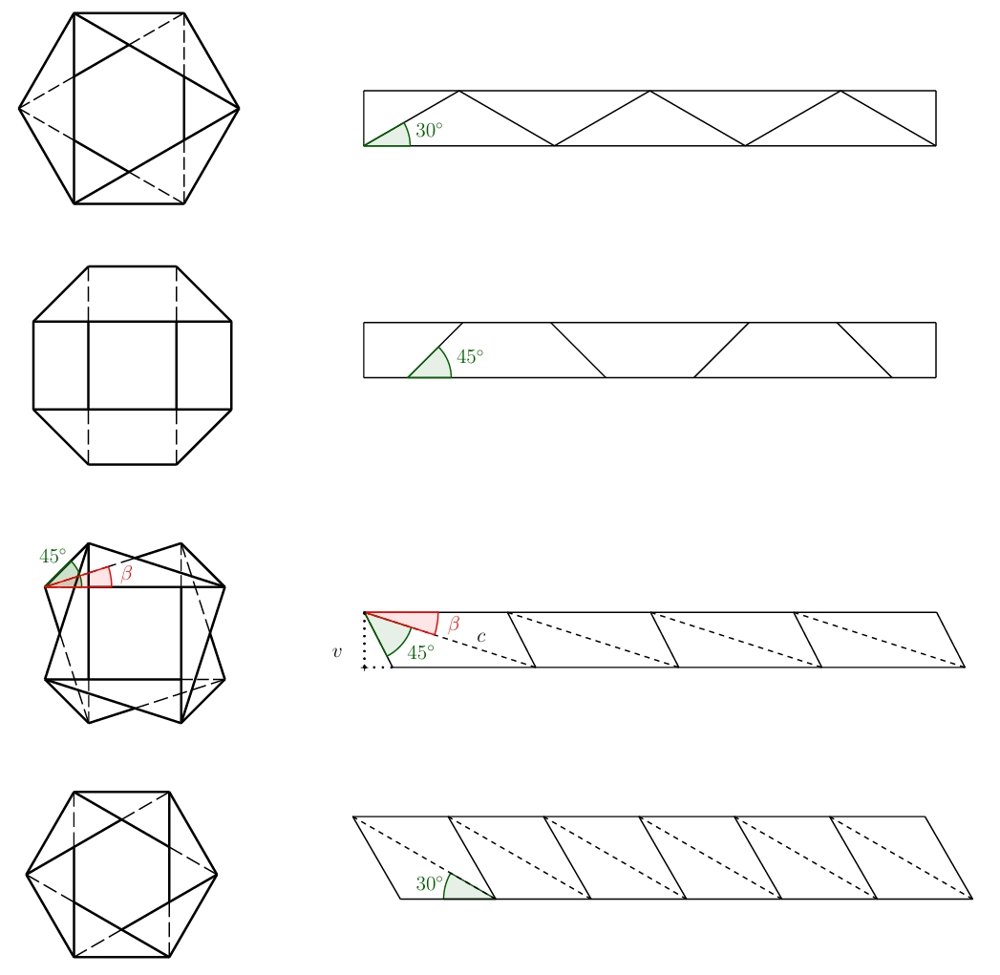
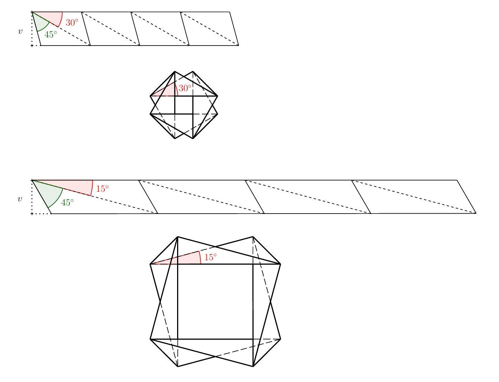
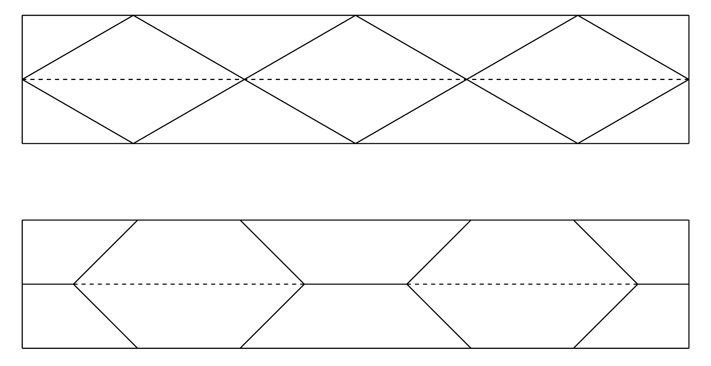
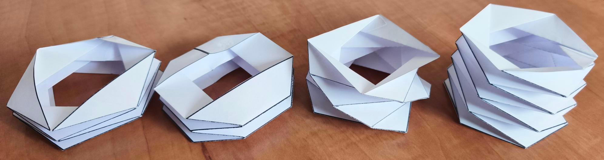
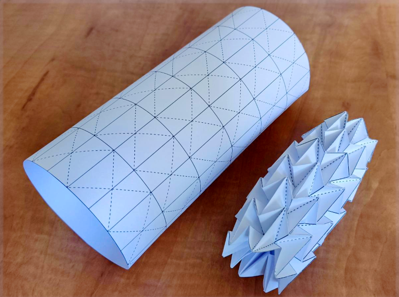

---
keywords:
- goniometria
- origami
- skladanie papiera
- vedľajšie uhly
- striedavé úhly
is_finished: true
---

# Origami
Keď počujeme slovo origami, predstavíme si asi najskôr papierovú skladačku v tvare zvieraťa alebo lodičky.
Tieto jednoduché tvary často slúžia ako prvý krok do fascinujúceho sveta skladania papiera.
Existujú ale aj origami, ktoré zaberú niekoľko hodín či dokonca dní starostlivej práce.
Fascinujúca je však skutočnosť, že princíp skladania, ako ho poznáme z origami, sa objavuje aj v prírode okolo nás i v nás samotných.
Rozvíjajúci sa púčik kvetu, jemne sa rozbaľujúce krídla hmyzu ukryté pod pevnými krovkami,
zložitá štruktúra ľudskej DNA alebo steny hrubého čreva, to všetko využíva princípy podobné tým, ktoré nájdeme v origami.
Schopnosť materiálov a štruktúr „skladať sa" a „rozkládať sa" podľa potreby, je jedným zo základných stavebných prvkov života.
V posledných rokoch zažilo origami skutočný rozmach, a to nielen ako koníček pre milovníkov papiera,
ale aj v mnohých umeleckých a vedeckých odboroch. Ovplyvnilo architektov, dizajnérov nábytku, umelcov a vedcov.
Origami sa tak premenilo z obyčajného umenia skladania papiera na nástroj, ktorý pomáha formovať budúcnosť.

## Skladanie dokola
Poďme začať jednoducho a to pásikom papiera. Skúste vytvoriť sklady na pásiku papiera tak, aby sa opakovali pravidelným spôsobom, pásik sa dal vďaka skladom zložiť do roviny a súčasne, aby ste sa po niekoľkých krokoch s krátkymi koncami pásika papiera dostali k sebe (zatiaľ stačí približne, neskôr budeme chcieť kratšie konce na seba presne napojiť). Súčasne sa nesmú svojvoľne krížiť dlhé okraje pásika. Jeden dlhý okraj pásika musí byť po zložení tvaru viditeľný po celej dĺžke. Druhý dlhý okraj pásika papiera bude logicky po celej dĺžke priliehat k podložke, na ktorej výsledný tvar leží. Na nasledujúcom obrázku je ukážka chybného i správneho riešenia.

> **Úloha 1.** Vyskúšajte si zložiť z pásika papiera správne riešenie z predchádzajúceho obrázku a vytvorte niekoľko ďalších variantov tak, aby opäť platilo:
> 1) pásik sa dá zložiť do roviny a sklady sa pravidelne opakujú, 
> 2) jeho kratšie okraje na seba približne nadväzujú,
> 3) jeden z jeho dlhších okrajov je pri pohľade zhora celý viditeľný..

\iffalse

*Riešenie.* Niekoľko možných riešení (vrátane ukážkového) je na nasledujúcom obrázku.

Pokiaľ pásiky papiera opäť rozvinieme, uvidíme nasledujúce (viz obrázok).

\fi

> **Úloha 2.** Pre predchádzajúce typy riešení určte presný vzor skladov pásika papiera tak, aby sa oba kratšie konce stretli presne a dali sa zlepiť.

\iffalse

*Riešenie.* Ako je obvyklé v origami, budeme označovať hrebene plnou čiarou a údolia čiarkovanе. Pokiaľ si nakreslíme všetky varianty v zloženom tvare, je riešenie vo väčšine prípadov zrejmé a vyplýva z pravidelnosti a symetrií, ktoré sa vo vzore platia. Riešenia spolu s naznačenými uhlami sú na nasledujúcom obrázku. Veľkosti zvyšných uhlov sú zrejmé zo znalostí o vedľajších a striedavých uhloch.
 
 

Pri tretej variante je však situácia zložitejšia (na predchádzajúcich fotografiách ide o variantu zo žltého papiera).
Pre naznačený uhol $\beta$ platí 

$$
\sin\beta=\frac{v}{c},
$$ 

kde $v$ je výška pásika papiera.
Pokiaľ túto výšku zafixujeme, stále existuje nekonečne veľa riešení v závislosti na uhle $\beta$, 
kde $\beta\in(0; 180^{\circ}-45^{\circ})$. 
Dve varianty pre uhol $\beta=30^{\circ}$ a $\beta=15^{\circ}$ sú na nasledujúcom obrázku.

Jednotlivé pásiky môžeme tiež skladať na seba, pokiaľ to urobíme vhodným způsobom, pôjde vzor opäť zložiť do roviny. Ukážky dvoch variantov sú na obrázku.

Všetky varianty vzniknuté skladaním na seba z pásikov z predchádzajúceho riešenia nájdete na pracovných listoch 1 a 2 (pokiaľ chcete bočné strany zlepiť, musíte len pridať presahy na prilepenie). Na nasledujúcom obrázku sú varianty z pracovného listu zložené a zlepené.

\fi

Tieto a ďalšie origami „trubice“ nachádzajú uplatnenie v medicíne, dizajne či materiálovom inžinierstve.
Na uplatnenie origami v medicíne sa zameriame aj v ďalšom odseku.
Nebudeme v ňom síce riešiť žiadnu úlohu, ale predstavíme si ďalšiu zaujímavú aplikáciu origami

## Vodná bomba alebo stent

Lekársky stent je malá, väčšinou sieťová trubica, ktorá sa zavádza do zúženého alebo zablokovaného cievneho alebo iného prietoku v tele, s cieľom udržať ho otvorený a umožniť správny prietok krvi alebo tekutín.
Tieto zariadenia sa bežne používajú pri narušení krvného obehu spôsobenom zúžením tepien. Hlavným cieľom umiestnenia stentu je obnova normálneho prietoku krvi.
Stenty musia mať dostatočnú pevnosť na odolávanie silám pôsobiacim v ľudskom tele, zároveň však musia byť dostatočne flexibilné, aby sa prispôsobili tvaru ciev.
Medzi nedávne inovácie patrí vývoj stentov inšpirovaných vzorom vodnej bomby, známeho svojimi vynikajúcimi rozťahovacími vlastnosťami a flexibilitou. Tento dizajn má za cieľ zlepšiť prispôsobivosť stentov v cievach a predstavuje inovatívny prístup k minimálne invazívnym kardiovaskulárnym intervenciám.
Konštrukcia umožňuje kompaktné zloženie stentu pre zavedenie a následné kontrolované a rovnomerné rozťahovanie po zavedení, čím sa zvyšuje bezpečnosť a účinnosť pri obnove správneho prietoku krvi.

V treťom pracovnom liste nájdete vzor na výrobu tohto modelu.
To však odporúčam len pre skutočných nadšencov skladačky z papiera.

## Literatúra a odkazy

* https://www.mdpi.com/2218-6581/12/1/21
* https://techxplore.com/news/2025-05-origami-materials.html
* https://www.nature.com/articles/s41528-022-00139-x
* https://www.sfu.ca/sfunews/media/issues-experts/2021/09/technology-takes-the-art-of-origami-into-the-fight-against-covid.html
* https://www.mddionline.com/implants/from-origami-to-a-prototype-stent
* https://www.sciencedirect.com/science/article/pii/S0263822322004512
* https://www.youtube.com/watch?v=uFyJykl1O0k
