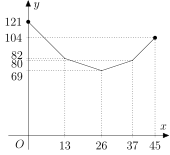
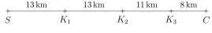
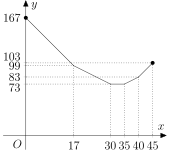
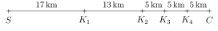

---
keywords:
- functions
- linear function
- absolute value
- optimization
is_finished: true
---

# Medical Station at a Running Race

Imagine you're helping organize a large running race. Dozens of runners are about to hit the track, and your task is to decide where to place the medical station so that it is as helpful as possible.
Should it be close to the starting line? Or perhaps somewhere in the middle? And what if there are several checkpoints along the route? Where is the best spot from which everything is roughly the same distance?

It might sound simple at first, but when you think about it more carefully, you’ll realize that finding the best possible location isn’t so easy after all. In the following exercises, we’ll explore this kind of situation. And who knows — maybe thanks to us, a runner will safely make it to the finish line.

>**Exercise 1.** Along a $45\,\text{km}$ race course, there are three checkpoints, and a medical station needs to be placed somewhere on the route. The first checkpoint is located at the 13th kilometer, the second at the 26th kilometer, and the third at the 37th kilometer. Because the medical station should be as close as possible to the checkpoints, the start, and the finish, the race organizer wants to place it so that the sum of distances from the medical station to these five locations is as small as possible.
>
>At which kilometer mark should the medical station be placed? 
>Is this the only possible location the organizer should choose? Assume the race finishes at a different location than where it starts, and that there is no shorter path between any points than along the race route itself.

\iffalse

*Solution.* Let the medical station be located at the $x$-th kilometer of the race.
Then the distance from the start is $x\,\text{km}$, from the first checkpoint it is 
$\lvert x - 13 \rvert\,\text{km}$, from the second checkpoint $\lvert x - 26 \rvert\,\text{km}$, 
from the third checkpoint $\lvert x-37 \rvert\,\text{km}$ and from the finish line $(45-x)\,\text{km}$. 
We want to find the minimum value of the function
$$
\begin{align*}
f(x) &= x + \lvert x - 13 \rvert + \lvert x - 26 \rvert + \lvert x-37 \rvert + (45-x) = \\
&= \lvert x - 13 \rvert + \lvert x - 26 \rvert + \lvert x-37 \rvert + 45
\end{align*}
$$
on the interval $\langle 0;45\rangle$.

The graph of the function $f$ on this interval is a piecewise linear curve made up of four consecutive segments connecting the points $[0;121]$, $[13;82]$, $[26;69]$, $[37;80]$ a $[45;104]$. The second coordinates of these points are obtained by substituting the first coordinate into the function $f$.

 

From this graph, it is clear that the function $f$ reaches its minimum value at $x = 26$, i.e., exactly at the second checkpoint.
This is the only location where the medical station should be placed.

*Note.* This exercise can also be solved without using functions and absolute values. Let us represent the race course as a line segment $SC$, on which the points $K_1$, $K_2$ and $K_3$ are marked so that their positions correspond to the first, second, and third checkpoints along the course.

 

Our task is to place a point $Z$ somewhere on the segment $SC$ so that the total sum 
$$
\lvert SZ \rvert + \lvert K_1Z \rvert + \lvert K_2Z \rvert + \lvert K_3Z \rvert + \lvert CZ \rvert \tag{$\star$}
$$
is as small as possible. We will examine the value of this sum depending on whether the point $Z$ lies on one of the segments $SK_1$, $K_1K_3$ a $K_3C$ or $Z$.

If $Z \in SK_1$, the sum $(\star)$ can be simplified as follows:
$$
\overbrace{\lvert SZ \rvert + \lvert CZ \rvert}^{45}{} + \lvert K_1Z \rvert + {}\overbrace{\lvert K_2Z \rvert}^{\lvert K_1Z \rvert + 13}{} + {}\overbrace{\lvert K_3Z \rvert}^{\lvert K_1Z \rvert + 24} = 3\cdot \lvert K_1Z \rvert + 82.
$$
For $Z \in K_1K_3$, the sum becomes:
$$
\overbrace{\lvert SZ \rvert + \lvert CZ \rvert}^{45}{}  + {}\overbrace{\lvert K_1Z \rvert + \lvert K_3Z \rvert}^{24}{} + \lvert K_2Z \rvert = \lvert K_2Z \rvert + 69.
$$
Finally, for $Z \in K_3C$, we can rewrite the sum $(\star)$ as:
$$
\overbrace{\lvert SZ \rvert + \lvert CZ \rvert}^{45}{}  + \overbrace{\lvert K_1Z \rvert}^{\lvert K_3Z \rvert + 24}{} + {}\overbrace{\lvert K_2Z \rvert}^{\lvert K_3Z \rvert + 11}{} + \lvert K_3Z \rvert = 3\cdot \lvert K_3Z \rvert + 80.
$$

Comparing all three expressions, we see that the sum $(\star)$ reaches its minimum when $Z \in K_1K_3$ and, more precisely, when $Z = K_2$ (in which case the value of the sum is $69$). Therefore, the medical station should be located at the second checkpoint.

\fi

>**Exercise 2.** How does the solution to the previous exercise change if there are four checkpoints located at the 17th, 30th, 35th, and 40th kilometers?

\iffalse

*Solution.* As in the solution to Exercise 1, we define the function
$$
\begin{align*}
g(x) &= x + \lvert x-17 \rvert + \lvert x-30 \rvert + \lvert x-35 \rvert + \lvert x-40 \rvert + 45-x =\\
&=\lvert x-17 \rvert + \lvert x-30 \rvert + \lvert x-35 \rvert + \lvert x-40 \rvert + 45,
\end{align*}
$$
whose graph is a piecewise linear curve made up of five connected line segments, joining the points $[0;167]$, $[17;99]$, $[30;73]$, $[35;73]$, $[40;83]$ and $[45;103]$ in sequence. 

 

From the graph, we can see that the function $g$ reaches its minimum value at any point in the interval $\langle 30;35 \rangle$. Therefore, the medical station can be located anywhere between the second and third checkpoints.

*Note.* This problem can also be solved in a similar way as in the second solution to the previous exercise. We place the points $K_1$, $K_2$, $K_3$, and $K_4$ along the segment $SC$, as shown in the figure below.

 

We now consider the value of the sum $\lvert SZ \rvert + \lvert K_1Z \rvert + \lvert K_2Z \rvert + \lvert K_3Z \rvert + \lvert K_4Z \rvert + \lvert CZ \rvert$ 
depending on which of the five parts of the segment $SC$ the point $Z$ lies on.

We won’t solve the entire problem using this method, but we will at least consider the case where $Z \in K_2K_3$.
In this case, the total sum becomes
$$
\overbrace{\lvert SZ \rvert + \lvert CZ \rvert}^{45}{} + \overbrace{\lvert K_1Z \rvert + \lvert K_4Z \rvert}^{23}{} + \overbrace{\lvert K_2Z \rvert + \lvert K_3Z \rvert}^{5}=73.
$$
As we can see, for any point $Z \in K_2K_3$, the total sum remains the same.

\fi

This problem can also be generalized.

> **Exercise 3.** There are $n$ different checkpoints placed along the race course.
> Where should the medical station be located so that the sum of its distances from all the checkpoints, the start, and the finish is as small as possible?

\iffalse

*Solution.* Let the medical station be located at the $x$-th kilometer of a course that is $d\,\text{km}$ long, and let the checkpoints be located at the $x_1$-th, $x_2$-th,$\ldots$ , $x_n$-th kilometers of the course. We assume that $0 < x_1 < x_2 < \ldots x_n < d$. 

The function $f$, whose minimum we are now looking for on the interval $\langle 0;d \rangle$, is given by
$$
\begin{align*}
f(x) &= x + \lvert x - x_1 \rvert +  \lvert x - x_2 \rvert + \ldots + \lvert x - x_n \rvert + (d-x) =\\
{} &= \lvert x - x_1 \rvert +  \lvert x - x_2 \rvert + \ldots + \lvert x - x_n \rvert + d.
\end{align*}
$$
We now express this function on the individual intervals $\langle 0;x_1 )$, $\langle x_1;x_2 )$, $\ldots$ , $\langle x_{n-1};x_n )$, $\langle x_n;d \rangle$ 
so that the expressions with absolute values no longer appear in the function definition. In the following table, each absolute value term is rewritten for the respective intervals, and the last row shows the full expression of the function $f(x)$. 

|                           | $\langle 0;x_1 )$ | $\langle x_1;x_2 )$ | $\langle x_2;x_3 )$ | $\ldots$ | $\langle x_{n-1};x_n )$ | $\langle x_n;d \rangle$ |
|---------------------------|-------------------|---------------------|---------------------|----------|--------------------------|--------------------------|
| $\lvert x - x_1 \rvert$   | $x_1 - x$         | $x - x_1$           | $x - x_1$           | $\ldots$ | $x - x_1$                | $x - x_1$                |
| $\lvert x - x_2 \rvert$   | $x_2 - x$         | $x_2 - x$           | $x - x_2$           | $\ldots$ | $x - x_2$                | $x - x_2$                |
| $\lvert x - x_3 \rvert$   | $x_3 - x$         | $x_3 - x$           | $x_3 - x$           | $\ldots$ | $x - x_3$                | $x - x_3$                |
| $\vdots$                  | $\vdots$          | $\vdots$            | $\vdots$            | $\ddots$ | $\vdots$                 | $\vdots$                 |
| $\lvert x - x_{n-1} \rvert$ | $x_{n-1} - x$     | $x_{n-1} - x$       | $x_{n-1} - x$       | $\ldots$ | $x - x_{n-1}$            | $x - x_{n-1}$            |
| $\lvert x - x_n \rvert$   | $x_n - x$         | $x_n - x$           | $x_n - x$           | $\ldots$ | $x_n - x$                | $x - x_n$                |
| **$f(x)$**                | $-nx + k_0$       | $-(n-2)x + k_1$     | $-(n-4)x + k_2$     | $\ldots$ | $(n-2)x + k_{n-1}$       | $nx + k_n$               |

For the constants $k_i$ in the last row, we have:
$$
\begin{align*}
k_0 &=x_1+x_2+\ldots + x_n +d \\
k_1 &=-x_1+x_2+\ldots + x_n +d \\
\vdots & \\
k_n &=-x_1-x_2-\ldots - x_n +d.
\end{align*}
$$

Let us now focus on the slopes of the line segments that make up the graph of the piecewise linear function $f(x)$. Notice that each slope increases by 2 compared to the previous one. We will now solve the exercise separately for odd and even values of $n$.

For odd values of $n$, none of the slopes of the linear segments are equal to zero.
Let us denote $m=\frac{n+1}{2}$. On the interval $\left\langle x_{m-1}; x_{m} \right) $ 
the slope of the graph of the function is $-1$ and on the following interval
$\left\langle x_{m}; x_{m+1} \right) $, the slope is 1. This also means that the entire function $f$ is decreasing on the interval $\left\langle 0; x_{m} \right)$ (since all segment slopes there are negative), and increasing on the interval $\left\langle x_{m};d \right\rangle$ (because all slopes in this part are positive). It follows that the function $f$ reaches its minimum at the point $x_{m}$, and therefore,
for odd $n$, the medical station must be placed at the $\frac{n+1}{2}$-th checkpoint.

For even values of $n$, one of the slopes is equal to zero — specifically, the slope of the piece of the graph on the interval $\left\langle x_{p}; x_{p+1} \right) $, where $p=\frac{n}{2}$. 
On the interval $\left\langle 0; x_{p} \right)$ the function $f$ is decreasing;
on the interval $\left\langle x_{p}; x_{p+1} \right) $ it is constant;
and on the interval $\left\langle x_{p+1}; d \right\rangle $ it is increasing. 
Therefore, the function $f$ reaches its minimum value at every point of the interval $\left\langle x_{p}; x_{p+1} \right\rangle $. So, for even $n$, the medical station may be placed anywhere between the $\frac{n}{2}$-th and the $(\frac{n}{2} + 1)$-th checkpoint.

\fi
