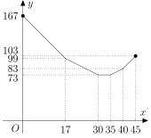

---
keywords:
- funkcje
- funkcja liniowa
- wartość bezwzględna
- optymalizacja
is_finished: true
---

# Stacja medyczna na zawodach biegowych

Wyobraź sobie, że pomagasz w organizacji dużego wyścigu biegowego. Dziesiątki biegaczy wkrótce wyruszą na trasę, a Twoim zadaniem jest zdecydować, gdzie umieścić punkt medyczny, aby był jak najbardziej pomocny.
Czy powinien znajdować się blisko linii startu? A może gdzieś pośrodku? A co jeśli na trasie jest kilka punktów kontrolnych? Gdzie jest najlepsze miejsce, z którego wszystko jest mniej więcej w tej samej odległości?

Na początku może się to wydawać proste, ale kiedy zastanowisz się nad tym dokładniej, zdasz sobie sprawę, że znalezienie najlepszej możliwej lokalizacji wcale nie jest takie proste. W kolejnych ćwiczeniach przeanalizujemy tego typu sytuacje. I kto wie - może dzięki nam jakiś biegacz bezpiecznie dotrze do mety.

>**Zadanie 1.** Na trasie wyścigu o długości 45\text{km}$ znajdują się trzy punkty kontrolne, a gdzieś na trasie należy umieścić punkt medyczny. Pierwszy punkt kontrolny znajduje się na 13. kilometrze, drugi na 26. kilometrze, a trzeci na 37. kilometrze. Ponieważ stacja medyczna powinna znajdować się jak najbliżej punktów kontrolnych, startu i mety, organizator wyścigu chce umieścić ją tak, aby suma odległości od stacji medycznej do tych pięciu lokalizacji była jak najmniejsza.
>
>Na którym kilometrze powinna znajdować się stacja medyczna?
>Czy jest to jedyna możliwa lokalizacja, którą powinien wybrać organizator? Załóżmy, że wyścig kończy się w innym miejscu niż zaczyna i że nie ma krótszej drogi między punktami niż wzdłuż samej trasy wyścigu.

\iffalse

*Rozwiązanie.* Niech punkt medyczny znajduje się na $x$-tym kilometrze wyścigu.
Wtedy odległość od startu wynosi $x\,\text{km}$, od pierwszego punktu kontrolnego wynosi 
$\lvert x - 13 \rvert\,\text{km}$, od drugiego punktu kontrolnego $\lvert x - 26 \rvert\,\text{km}$, 
od trzeciego punktu kontrolnego $\lvert x-37 \rvert\,\text{km}$, a od mety $(45-x)\,\text{km}$. 
Chcemy znaleźć minimalną wartość funkcji
$$
\begin{align*}
f(x) &= x + \lvert x - 13 \rvert + \lvert x - 26 \rvert + \lvert x-37 \rvert + (45-x) = \\
&= \lvert x - 13 \rvert + \lvert x - 26 \rvert + \lvert x-37 \rvert + 45
\end{align*}
$$
w przedziale $\langle 0;45\rangle$.

Wykresem funkcji $f$ na tym przedziale jest fragmentaryczna krzywa liniowa złożona z czterech kolejnych odcinków łączących punkty $[0;121]$, $[13;82]$, $[26;69]$, $[37;80]$ a $[45;104]$. Drugie współrzędne tych punktów uzyskuje się przez podstawienie pierwszej współrzędnej do funkcji $f$.

 

Z tego wykresu jasno wynika, że funkcja $f$ osiąga swoją minimalną wartość przy $x = 26$, czyli dokładnie w drugim punkcie kontrolnym.
Jest to jedyne miejsce, w którym powinna znajdować się stacja medyczna.

*Uwaga.* Ćwiczenie to można również rozwiązać bez użycia funkcji i wartości bezwzględnych. Przedstawmy trasę wyścigu jako odcinek linii $SC$, na którym zaznaczono punkty $K_1$, $K_2$ i $K_3$ tak, aby ich pozycje odpowiadały pierwszemu, drugiemu i trzeciemu punktowi kontrolnemu na trasie.

 

Naszym zadaniem jest umieszczenie punktu $Z$ gdzieś na odcinku $SC$ tak, aby całkowita suma
$$
\lvert SZ \rvert + \lvert K_1Z \rvert + \lvert K_2Z \rvert + \lvert K_3Z \rvert + \lvert CZ \rvert \tag{$\star$}
$$
jest tak mała, jak to tylko możliwe. Zbadamy wartość tej sumy w zależności od tego, czy punkt $Z$ leży na jednym z odcinków $SK_1$, $K_1K_3$ a $K_3C$ czy $Z$.

Jeśli $Z \ in SK_1$, sumę $(\star)$ można uprościć w następujący sposób:
$$
\overbrace{\lvert SZ \rvert + \lvert CZ \rvert}^{45}{} + \lvert K_1Z \rvert + {}\overbrace{\lvert K_2Z \rvert}^{\lvert K_1Z \rvert + 13}{} + {}\overbrace{\lvert K_3Z \rvert}^{\lvert K_1Z \rvert + 24} = 3\cdot \lvert K_1Z \rvert + 82.
$$
Dla $Z \ w K_1K_3$, suma staje się:
$$
\overbrace{\lvert SZ \rvert + \lvert CZ \rvert}^{45}{}  + {}\overbrace{\lvert K_1Z \rvert + \lvert K_3Z \rvert}^{24}{} + \lvert K_2Z \rvert = \lvert K_2Z \rvert + 69.
$$
Wreszcie, dla $Z \ in K_3C$, możemy przepisać sumę $(\star)$ jako:
$$
\overbrace{\lvert SZ \rvert + \lvert CZ \rvert}^{45}{}  + \overbrace{\lvert K_1Z \rvert}^{\lvert K_3Z \rvert + 24}{} + {}\overbrace{\lvert K_2Z \rvert}^{\lvert K_3Z \rvert + 11}{} + \lvert K_3Z \rvert = 3\cdot \lvert K_3Z \rvert + 80.
$$

Porównując wszystkie trzy wyrażenia, widzimy, że suma $(\star)$ osiąga minimum, gdy $Z \in K_1K_3$, a dokładniej, gdy $Z = K_2$ (wtedy wartość sumy wynosi $69$). Dlatego stacja medyczna powinna znajdować się w drugim punkcie kontrolnym.

\fi

>**Zadanie 2.** Jak zmienia się rozwiązanie poprzedniego zadania, jeśli istnieją cztery punkty kontrolne zlokalizowane na 17, 30, 35 i 40 kilometrze?

\iffalse

*Rozwiązanie.* Podobnie jak w rozwiązaniu ćwiczenia 1, definiujemy funkcję
$$
\begin{align*}
g(x) &= x + \lvert x-17 \rvert + \lvert x-30 \rvert + \lvert x-35 \rvert + \lvert x-40 \rvert + 45-x =\\
&=\lvert x-17 \rvert + \lvert x-30 \rvert + \lvert x-35 \rvert + \lvert x-40 \rvert + 45,
\end{align*}
$$
której wykresem jest krzywa liniowa złożona z pięciu połączonych odcinków, łączących kolejno punkty $[0;167]$, $[17;99]$, $[30;73]$, $[35;73]$, $[40;83]$ i $[45;103]$. 

 

Z wykresu widać, że funkcja $g$ osiąga wartość minimalną w dowolnym punkcie przedziału $\langle 30;35 \rangle$. Dlatego stacja medyczna może znajdować się w dowolnym miejscu między drugim a trzecim punktem kontrolnym.

*Uwaga.* Problem ten można również rozwiązać w podobny sposób, jak w przypadku drugiego rozwiązania poprzedniego ćwiczenia. Umieszczamy punkty $K_1$, $K_2$, $K_3$ i $K_4$ wzdłuż odcinka $SC$, jak pokazano na poniższym rysunku.

 

Rozważymy teraz wartość sumy $\lvert SZ \rvert + \lvert K_1Z \rvert + \lvert K_2Z \rvert + \lvert K_3Z \rvert + \lvert K_4Z \rvert + \lvert CZ \rvert$ 
w zależności od tego, na której z pięciu części odcinka $SC$ leży punkt $Z$.

Nie rozwiążemy całego problemu przy użyciu tej metody, ale rozważymy przynajmniej przypadek, w którym $Z \in K_2K_3$.
W tym przypadku suma całkowita wynosi
$$
\overbrace{\lvert SZ \rvert + \lvert CZ \rvert}^{45}{} + \overbrace{\lvert K_1Z \rvert + \lvert K_4Z \rvert}^{23}{} + \overbrace{\lvert K_2Z \rvert + \lvert K_3Z \rvert}^{5}=73.
$$
Jak widać, dla dowolnego punktu $Z\in K_2K_3$ suma całkowita pozostaje taka sama.

\fi

Problem ten można również uogólnić.

> **Zadanie 3.** Na trasie wyścigu znajduje się $n$ różnych punktów kontrolnych.
> Gdzie powinien znajdować się punkt medyczny, aby suma jego odległości od wszystkich punktów kontrolnych, startu i mety była jak najmniejsza?

\iffalse

*Rozwiązanie.* Niech punkt medyczny znajduje się na $x$-tym kilometrze trasy o długości $d\,\text{km}$, a punkty kontrolne na $x_1$-tym, $x_2$-tym, $\ldots$, $x_n$-tym kilometrze trasy. Zakładamy, że $0 < x_1 < x_2 < \ldots x_n < d$.

Funkcja $f$, której minimum szukamy teraz w przedziale $\langle 0;d\rangle$, jest określona przez
$$
\begin{align*}
f(x) &= x + \lvert x - x_1 \rvert +  \lvert x - x_2 \rvert + \ldots + \lvert x - x_n \rvert + (d-x) =\\
{} &= \lvert x - x_1 \rvert +  \lvert x - x_2 \rvert + \ldots + \lvert x - x_n \rvert + d.
\end{align*}
$$
Teraz wyrazimy tę funkcję na poszczególnych przedziałach $\langle 0;x_1 )$, $\langle x_1;x_2 )$, $\ldots$ , $\langle x_{n-1};x_n )$, $\langle x_n;d \rangle$ 
tak, aby wyrażenia z wartościami bezwzględnymi nie pojawiały się już w definicji funkcji. W poniższej tabeli każdy termin z wartością bezwzględną został przepisany dla odpowiednich przedziałów, a ostatni wiersz przedstawia pełne wyrażenie funkcji $f(x)$. 

|                           | $\langle 0;x_1 )$ | $\langle x_1;x_2 )$ | $\langle x_2;x_3 )$ | $\ldots$ | $\langle x_{n-1};x_n )$ | $\langle x_n;d \rangle$ |
|---------------------------|-------------------|---------------------|---------------------|----------|--------------------------|--------------------------|
| $\lvert x - x_1 \rvert$   | $x_1 - x$         | $x - x_1$           | $x - x_1$           | $\ldots$ | $x - x_1$                | $x - x_1$                |
| $\lvert x - x_2 \rvert$   | $x_2 - x$         | $x_2 - x$           | $x - x_2$           | $\ldots$ | $x - x_2$                | $x - x_2$                |
| $\lvert x - x_3 \rvert$   | $x_3 - x$         | $x_3 - x$           | $x_3 - x$           | $\ldots$ | $x - x_3$                | $x - x_3$                |
| $\vdots$                  | $\vdots$          | $\vdots$            | $\vdots$            | $\ddots$ | $\vdots$                 | $\vdots$                 |
| $\lvert x - x_{n-1} \rvert$ | $x_{n-1} - x$     | $x_{n-1} - x$       | $x_{n-1} - x$       | $\ldots$ | $x - x_{n-1}$            | $x - x_{n-1}$            |
| $\lvert x - x_n \rvert$   | $x_n - x$         | $x_n - x$           | $x_n - x$           | $\ldots$ | $x_n - x$                | $x - x_n$                |
| **$f(x)$**                | $-nx + k_0$       | $-(n-2)x + k_1$     | $-(n-4)x + k_2$     | $\ldots$ | $(n-2)x + k_{n-1}$       | $nx + k_n$               |

Dla stałych $k_i$ w ostatnim wierszu mamy:
$$
\begin{align*}
k_0 &=x_1+x_2+\ldots + x_n +d \\
k_1 &=-x_1+x_2+\ldots + x_n +d \\
\vdots & \\
k_n &=-x_1-x_2-\ldots - x_n +d.
\end{align*}
$$

Skupmy się teraz na nachyleniach odcinków linii tworzących wykres funkcji liniowej fragmentarycznej $f(x)$. Zauważmy, że każde nachylenie wzrasta o 2 w stosunku do poprzedniego. Teraz rozwiążemy ćwiczenie oddzielnie dla nieparzystych i parzystych wartości $n$.

Dla nieparzystych wartości $n$, żadne z nachyleń odcinków liniowych nie jest równe zero.
Oznaczmy $m=\frac{n+1}{2}$. Na przedziale $\left\langle x_{m-1}; x_{m} \right) $ 
nachylenie wykresu funkcji wynosi $-1$, a na następującym przedziale
$\left\langle x_{m}; x_{m+1} \right) $, nachylenie wynosi 1. Oznacza to również, że cała funkcja $f$ jest malejąca na przedziale $\left\langle 0; x_{m} \right)$ (ponieważ wszystkie nachylenia segmentów są tam ujemne) i rosnąca na przedziale $\left\langle x_{m};d \right\rangle$ (ponieważ wszystkie nachylenia w tej części są dodatnie). Wynika z tego, że funkcja $f$ osiąga swoje minimum w punkcie $x_{m}$, a zatem,
dla nieparzystych $n$, stacja medyczna musi być umieszczona w $\frac{n+1}{2}$-tym punkcie kontrolnym.

Dla parzystych wartości $n$, jedno z nachyleń jest równe zeru - konkretnie, nachylenie fragmentu wykresu na przedziale $\left\langle x_{p}; x_{p+1} \right) $, gdzie $p=\frac{n}{2}$. 
Na przedziale $\left\langle 0; x_{p} \right)$ funkcja $f$ jest malejąca;
na przedziale $\left\langle x_{p}; x_{p+1} \right) $ jest stała;
i na przedziale $\left\langle x_{p+1}; d \right\rangle $ jest rosnąca. 
Zatem funkcja $f$ osiąga wartość minimalną w każdym punkcie przedziału $\left\langle x_{p}; x_{p+1} \right\rangle $. Tak więc, dla nawet $n$, stacja medyczna może być umieszczona w dowolnym miejscu pomiędzy $\frac{n}{2}$-tym i $(\frac{n}{2} + 1)$-tym punktem kontrolnym.

\fi
