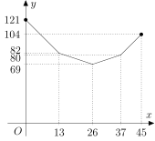

---
keywords:
- functions
- linear function
- absolute value
- optimization
is_finished: false
---

### Instructions for translators

1. Open this file on GitHub server. If you see `https://um.mendelu.cz/...` in
   URL, click `View on GitHub` to open this file on github.com.
1. If you see this file on GitHub server, you can edit the content of the file.
   Open the file in an editor. You can use simple editor (pres `e` on GitHub).
   However, an advanced VS Code editor (press `.` on GitHub) is better, since it
   provides preview how the Markdown code renders. Alternatively press pencil
   for simple editor or press triangle next to the pencil to get access to VS
   Code described as `github.dev`. 
1. Fix the keywords in the preamble.
1. Depending on which language version you want to use as a source for your
   translation, delete either English or Czech version below.
1. Translate to your language. Keep Markdown marking and math notation. If you
   use a tool to get first version of the translation, make sure that the markup
   is preserved. 
1. In VS Code you can open the preview in another window by pressing `Ctrl+V`
   and `K`. Keep the preview open as you work, or close using a mouse.
1. Instead of saving, you have to commit and push the changes to the repository.
   Fill the Message under `Source control` (describe your changes, such as
   "Polish translation started") and then press Commit&Push.
1. Make sure that your changes appear in the commit history. In rare cases
   (if you work with simultaneously with someone else) you have to download
   /Pull/ and merge his and yours changes. Usualy Sync (Pull & Push) should
   work.
1. When you finish the translation, change `is_finished: False` in header to `is_finished: True`.

### Instrukce pro překladatele

1. Otevřete tento soubor na serveru GitHub. Pokud máte soubor otevřen na `https://um.mendelu.cz/...`, otevřete jej na serveru github.com.
1. Pokud tento soubor vidíte na serveru GitHub, můžete obsah souboru upravit.
   Otevřete soubor v editoru. Můžete použít jednoduchý editor (stiskněte `e` na GitHubu).
   Lepší je však pokročilý editor VS Code (stikněte `.` na GitHubu), protože poskytuje náhled, jak se kód Markdown interpretuje. Případně stiskněte tužku
   pro jednoduchý editor nebo stiskněte trojúhelníček vedle tužky, abyste získali přístup k editoru VS
   Code popsaný jako `github.dev`. 
1. Opravte klíčová slova v preambuli.
1. V závislosti na tom, kterou jazykovou verzi chcete použít jako zdrojový kód pro svůj
   překladu, odstraňte níže uvedenou anglickou nebo českou verzi.
1. Přeložte do svého jazyka. Ponechte značení Markdown a matematický zápis. Pokud
   použijete nástroj typu DeepL pro získání první verze překladu, ujistěte se, že zápis matematických výrazů
   byl zachován. 
1. Ve VS Code můžete náhled otevřít v jiném okně stisknutím `Ctrl+V`.
   a `K`. Během práce nechte náhled otevřený nebo jej zavřete pomocí myši.
1. Místo uložení musíte změny zaregistrovat a odeslat do úložiště.
   Vyplňte zprávu v poli `Zpráva` (popište své změny, např.
   "Zahájen překlad do polštiny") a poté stiskněte tlačítko Commit&Push.
1. Ujistěte se, že se vaše změny objeví v historii revizí. Ve výjimečných případech
   (pokud pracujete současně s někým jiným) musíte stáhnout
   /Pull/ a sloučit jeho a vaše změny. Obvykle by synchronizace (Pull & Push) měla
   fungovat.
1. Po dokončení překladu změňte `is_finished: False` v záhlaví na `is_finished: True`.

---
---

### Czech source

# Zdravotnické stanoviště na běžeckém závodě

Představte si, že pomáháte organizovat velký běžecký závod. Na trať se chystají desítky závodníků 
a vaším úkolem je rozhodnout, kam umístit zdravotnické stanoviště, aby bylo co nejvíce nápomocné. 
Mělo by být blízko startu? Nebo raději někde uprostřed? A co když je kontrolních bodů na trati víc? 
Kde bude to správné místo, odkud to bude všude tak akorát daleko?

Možná to zní jednoduše, ale když se nad tím zamyslíte, tak zjistíte, že najít nejlepší možné umístění není 
zas tak snadné. V následujících úlohách si takovou situaci rozebereme. A kdo ví, třeba právě díky nám doběhne 
závodník v pořádku do cíle.

>**Úloha 1.** Na běžecké trase dlouhé $45\,\text{km}$ se nachází tři kontrolní stanoviště 
>a je třeba na ni umístit stanoviště zdravotníků. První kontrolní stanoviště je 
>zřízeno na 13. kilometru, druhé na 26. kilometru a třetí na 37. kilometru. 
>Protože má být zdravotní stanoviště co možná nejblíže kontrolním stanovištím, 
>startu i cíli, organizátor běhu jej chce zřídit tak, aby byl součet vzdáleností od něj 
>k uvedeným pěti lokacím co nejmenší.
>
>Na kterém kilometru trasy má organizátor stanoviště zdravotníků zřídit? 
>Je to jediná lokace, kterou má zvolit? Předpokládejme, že závod končí jinde 
>než začal a že neexistuje kratší cesta mezi stanovišti než po závodní trase.

\iffalse

*Řešení.* Nechť je zdravotnické stanoviště na $x$-tém kilometru běžecké trasy. 
Vzdálenost od startu je potom rovna $x\,\text{km}$, od prvního stanoviště 
$\lvert x - 13 \rvert\,\text{km}$, od druhého stanoviště $\lvert x - 26 \rvert\,\text{km}$, 
od třetího stanoviště $\lvert x-37 \rvert\,\text{km}$ a od cíle $(45-x)\,\text{km}$. 
Chceme tedy najít minimální hodnotu funkce
$$
\begin{align*}
f(x) &= x + \lvert x - 13 \rvert + \lvert x - 26 \rvert + \lvert x-37 \rvert + (45-x) = \\
&= \lvert x - 13 \rvert + \lvert x - 26 \rvert + \lvert x-37 \rvert + 45
\end{align*}
$$
na intervalu $\langle 0;45\rangle$.

Grafem funkce $f$ na tomto intervalu je lomená čára složená ze čtyř na 
sebe navazujících úseček, které postupně spojují body $[0;121]$, 
$[13;82]$, $[26;69]$, $[37;80]$ a $[45;104]$. Druhé souřadnice zmíněných 
bodů získáme dosazením prvních do předpisu funkce $f$. 

 

Z tohoto grafu je pak zřejmé, že nejmenší hodnotu má funkce $f$ právě v 
bodě $x=26$, tj. přímo na druhém stanovišti. Tam (a nikde jinde) by se 
mělo nacházet stanoviště zdravotníků.

*Poznámka*. Úlohu lze řešit i jiným způsobem, bez funkcí a absolutních 
hodnot. Znázorněme trasu závodu úsečkou $SC$, na které jsou umístěny 
body $K_1$, $K_2$ a $K_3$ tak, aby jejich poloha odpovídala poloze 
prvního, druhého a třetího kontrolního stanoviště na trase.

 

Naším úkolem je na úsečku $SC$ umístit bod $Z$ tak, aby byl součet 
$$
\lvert SZ \rvert + \lvert K_1Z \rvert + \lvert K_2Z \rvert + \lvert K_3Z \rvert + \lvert CZ \rvert \tag{$\star$}
$$
co nejmenší. Hodnotu tohotu součtu budeme zkoumat v závislosti na tom, 
na které z úseček $SK_1$, $K_1K_3$ a $K_3C$ bod $Z$ leží.

Jestliže platí $Z\in SK_1$, lze upravit součet $(\star)$ následujícím způsobem:
$$
\overbrace{\lvert SZ \rvert + \lvert CZ \rvert}^{45}{} + \lvert K_1Z \rvert + {}\overbrace{\lvert K_2Z \rvert}^{\lvert K_1Z \rvert + 13}{} + {}\overbrace{\lvert K_3Z \rvert}^{\lvert K_1Z \rvert + 24} = 3\cdot \lvert K_1Z \rvert + 82.
$$
Pro $Z\in K_1K_3$ upravíme zkoumaný výraz takto:
$$
\overbrace{\lvert SZ \rvert + \lvert CZ \rvert}^{45}{}  + {}\overbrace{\lvert K_1Z \rvert + \lvert K_3Z \rvert}^{24}{} + \lvert K_2Z \rvert = \lvert K_2Z \rvert + 69.
$$
A konečně pro $Z\in K_3C$ upravujeme součet $(\star)$ následovně:
$$
\overbrace{\lvert SZ \rvert + \lvert CZ \rvert}^{45}{}  + \overbrace{\lvert K_1Z \rvert}^{\lvert K_3Z \rvert + 24}{} + {}\overbrace{\lvert K_2Z \rvert}^{\lvert K_3Z \rvert + 11}{} + \lvert K_3Z \rvert = 3\cdot \lvert K_3Z \rvert + 80.
$$

Porovnáme-li všechna tři vyjádření, je vidět, že nejmenší hodnotu bude mít 
součet $(\star)$ právě tehdy, bude-li $Z\in K_1K_3$ a navíc $Z=K_2$ (hodnota součtu 
bude v takovém případě $69$). Proto musí být zdravotnické stanoviště 
v místě 2. kontrolního stanoviště.

\fi

**Úloha 2.** Jak se řešení předchozí úlohy změní, jestliže budou 
stanoviště čtyři, a to na 17., 30., 35. a 40. kilometru?

\iffalse

*Řešení.* Podobně jako v řešení úlohy 1 sestavíme předpis funkce
$$
\begin{align*}
g(x) &= x + \lvert x-17 \rvert + \lvert x-30 \rvert + \lvert x-35 \rvert + \lvert x-40 \rvert + 45-x =\\
&=\lvert x-17 \rvert + \lvert x-30 \rvert + \lvert x-35 \rvert + \lvert x-40 \rvert + 45,
\end{align*}
$$
jejímž grafem je lomená čára složená z pěti na sebe navazujících 
úseček, které postupně spojují body $[0;167]$, $[17;99]$, $[30;73]$, 
$[35;73]$, $[40;83]$ a $[45;103]$. 

 

Z grafu je nyní vidět, že své minimální hodnoty nabývá funkce $g$ v 
libovolném bodě intervalu $\langle 30;35 \rangle$. Zdravotnické 
stanoviště tak může být kdekoliv mezi druhým a třetím kontrolním 
stanovištěm.

*Poznámka.* I tuto úlohu můžeme řešit podobně jako ve druhém řešení 
předešlé úlohy. Na úsečku $SC$ umístíme body $K_1$, $K_2$, $K_3$, $K_4$ 
jako na obrázku. 

 

Nyní budeme zkoumat hodnotu součtu $\lvert SZ \rvert + \lvert K_1Z \rvert + \lvert K_2Z \rvert + \lvert K_3Z \rvert + \lvert K_4Z \rvert + \lvert CZ \rvert$ 
v závislosti na tom, na které z pěti částí úsečky $SC$ bod $Z$ leží. 

Podrobně řešit úlohu tímto způsobem nebudeme, zmíníme však alespoň 
případ $Z\in K_2K_3$, pro který můžeme zkoumaný součet upravit na
$$
\overbrace{\lvert SZ \rvert + \lvert CZ \rvert}^{45}{} + \overbrace{\lvert K_1Z \rvert + \lvert K_4Z \rvert}^{23}{} + \overbrace{\lvert K_2Z \rvert + \lvert K_3Z \rvert}^{5}=73.
$$
Jde tak vidět, že pro libovolný bod $Z\in K_2K_3$ má součet stejnou 
hodnotu.

\fi

Úlohu můžeme i zobecnit.

> **Úloha 3.** Na závodní trati je rozmístěno $n$ různých stanovišť. 
> Kde máme umístit zdravotní stanoviště tak, aby součet vzdáleností 
> zdravotního stanoviště od všech kontrolních stanovišť, od startu a od 
> cíle byl co nejmenší?

\iffalse

*Řešení.* Nechť se zdravotnické stanoviště nachází na $x$-tém kilometru 
trasy dlouhé $d\,\text{km}$ a kontrolní stanoviště se nachází postupně 
na $x_1$-tém, $x_2$-tém,$\ldots$ , $x_n$-tém kilometru trasy. Platí 
přitom jistě $0 < x_1 < x_2 < \ldots x_n < d$. 

Funkce $f$, jejíž minimum nyní budeme na intervalu $\langle 0;d \rangle$ 
hledat, má předpis tvaru
$$
\begin{align*}
f(x) &= x + \lvert x - x_1 \rvert +  \lvert x - x_2 \rvert + \ldots + \lvert x - x_n \rvert + (d-x) =\\
{} &= \lvert x - x_1 \rvert +  \lvert x - x_2 \rvert + \ldots + \lvert x - x_n \rvert + d.
\end{align*}
$$
Vyjádřeme nyní tuto funkci v jednotlivých intervalech $\langle 0;x_1 )$, $\langle x_1;x_2 )$, $\ldots$ , $\langle x_{n-1};x_n )$, $\langle x_n;d \rangle$ 
tak, aby se v jejím předpisu nevyskytovaly výrazy s absolutními 
hodnotami. V tabulce jsou v těchto intervalech vyjádřeny jednotlivé 
výrazy s absolutními hodnotách a v jejím posledním řádku je vyjádřena 
celá funkce $f(x)$ 

|                           | $\langle 0;x_1 )$ | $\langle x_1;x_2 )$ | $\langle x_2;x_3 )$ | $\ldots$ | $\langle x_{n-1};x_n )$ | $\langle x_n;d \rangle$ |
|---------------------------|-------------------|---------------------|---------------------|----------|--------------------------|--------------------------|
| $\lvert x - x_1 \rvert$   | $x_1 - x$         | $x - x_1$           | $x - x_1$           | $\ldots$ | $x - x_1$                | $x - x_1$                |
| $\lvert x - x_2 \rvert$   | $x_2 - x$         | $x_2 - x$           | $x - x_2$           | $\ldots$ | $x - x_2$                | $x - x_2$                |
| $\lvert x - x_3 \rvert$   | $x_3 - x$         | $x_3 - x$           | $x_3 - x$           | $\ldots$ | $x - x_3$                | $x - x_3$                |
| $\vdots$                  | $\vdots$          | $\vdots$            | $\vdots$            | $\ddots$ | $\vdots$                 | $\vdots$                 |
| $\lvert x - x_{n-1} \rvert$ | $x_{n-1} - x$     | $x_{n-1} - x$       | $x_{n-1} - x$       | $\ldots$ | $x - x_{n-1}$            | $x - x_{n-1}$            |
| $\lvert x - x_n \rvert$   | $x_n - x$         | $x_n - x$           | $x_n - x$           | $\ldots$ | $x_n - x$                | $x - x_n$                |
| **$f(x)$**                | $-nx + k_0$       | $-(n-2)x + k_1$     | $-(n-4)x + k_2$     | $\ldots$ | $(n-2)x + k_{n-1}$       | $nx + k_n$               |

Pro konstanty $k_i$ v posledním řádku platí
$$
\begin{align*}
k_0 &=x_1+x_2+\ldots + x_n +d \\
k_1 &=-x_1+x_2+\ldots + x_n +d \\
\vdots & \\
k_n &=-x_1-x_2-\ldots - x_n +d.
\end{align*}
$$

Soustřeďme se nyní na směrnice přímek, které tvoři grafy získaných 
lineárních funkcí. Všimněme si, že každá následující směrnice je o 2 
větší než předchozí. Úlohu budeme řešit zvlášť pro $n$ liché a $n$ sudé.

Pro lichá $n$ to znamená, že žádná z těchto směrnic není nulová. 
Označíme-li $m=\frac{n+1}{2}$, v intervalu $\left\langle x_{m-1}; x_{m} \right) $ 
má totiž graf funkce směrnici $-1$ a v následujícím intervalu 
$\left\langle x_{m}; x_{m+1} \right) $ má graf směrnici 1. Dále to 
znamená, že pro lichá $n$ je celá funkce $f$ na intervalu $\left\langle 0; x_{m} \right)$ 
klesající (protože směrnice všech dílčích funkcí jsou tu záporné) a na 
intervalu $\left\langle x_{m};d \right\rangle$ zase rostoucí (protože 
jsou tyto směrnice kladné). Odtud dostáváme, že v bodě $x_{m}$ musí být 
minimum funkce $f$, a proto pro lichá $n$ musí být zdravotnické 
stanoviště na $\frac{n+1}{2}$-tém stanovišti.

Pro sudá $n$ je jedna ze směrnic nulová, a to směrnice grafu dílčí 
funkce na intervalu $\left\langle x_{p}; x_{p+1} \right) $, kde $p=\frac{n}{2}$. 
Na intervalu $\left\langle 0; x_{p} \right)$ je tak celá funkce $f$ 
klesající, na intervalu $\left\langle x_{p}; x_{p+1} \right) $ 
konstantní a na intervalu  $\left\langle x_{p+1}; d \right\rangle $ 
rostoucí. Nejnižší hodnoty tak nabývá funkce $f$ v libovolném bodu 
intervalu $\left\langle x_{p}; x_{p+1} \right\rangle $. Pro sudá $n$ 
proto můžeme zdravotnické stanoviště postavit kdekoli mezi $\frac{n}{2}
$-tým a $(\frac{n}{2}+1)$-tým stanovištěm.

\fi

---
---

### English source

Not available on July 10. If you want to start from English
translation, wait until it appears on <https://um.mendelu.cz/math4u/site/> anc copy the English text by hand.
