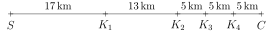

# Zdravotnícke stanovište na bežeckom preteku

Predstavte si, že pomáhate organizovať veľký bežecký pretek. Na trať sa chystajú desiatky pretekárov 
a vašou úlohou je rozhodnúť, kam umiestniť zdravotnícke stanovište, aby bolo čo najviac nápomocné. 
Malo by byť blízko štartu? Alebo radšej niekde uprostred? A čo keď je kontrolných bodov na trati viac? 
Kde bude to správne miesto, odkiaľ to bude všade tak akurát ďaleko?

Možno to znie jednoducho, ale keď sa nad tým zamyslíte, zistíte, že nájsť najlepšie možné umiestnenie nie je 
zas tak jednoduché. V nasledujúcich úlohách si takúto situáciu rozoberieme. A kto vie, možno práve vďaka nám dobehnú 
pretekár v poriadku do cieľa.

>**Úloha 1.** Na bežeckej trati dlhej $45\,\text{km}$ sa nachádzajú tri kontrolné stanovištia 
>a je potrebné na ňu umiestniť stanovište zdravotníkov. Prvé kontrolné stanovište je 
>zriadené na 13. kilometri, druhé na 26. kilometri a tretie na 37. kilometri. 
>Pretože má byť zdravotné stanovište čo možno najbližšie kontrolným stanovištiam, 
>štartu i cieľu, organizátor behu ho chce zriadiť tak, aby bol súčet vzdialeností od neho 
>k uvedeným piatim lokáciám co najmenší.
>
>Na ktorom kilometri trate má organizátor stanovište zdravotníkov zriadiť? 
>Je to jediná lokácia, ktorú má zvoliť? Predpokladajme, že pretek končí inde 
>ako začal a že neexistuje kratšia cesta medzi stanovišťami než po pretekárskej trati.

\iffalse

*Riešenie.* Nech je zdravotnícke stanovište na $x$-tom kilometri bežeckej trate. 
Vzdialenosť od štartu je potom rovná $x\,\text{km}$, od prvého stanovišťa 
$\lvert x - 13 \rvert\,\text{km}$, od druhého stanovišťa $\lvert x - 26 \rvert\,\text{km}$, 
od tretieho stanovišťa $\lvert x-37 \rvert\,\text{km}$ a od cieľa $(45-x)\,\text{km}$. 
Chceme teda nájsť minimálnu hodnotu funkcie
$$
\begin{align*}
f(x) &= x + \lvert x - 13 \rvert + \lvert x - 26 \rvert + \lvert x-37 \rvert + (45-x) = \\
&= \lvert x - 13 \rvert + \lvert x - 26 \rvert + \lvert x-37 \rvert + 45
\end{align*}
$$
na intervale $\langle 0;45\rangle$.

Grafom funkcie $f$ na tomto intervale je lomená čiara zložená zo štyroch na 
seba nadväzujúcich úsečiek, ktoré postupne spájajú body $[0;121]$, 
$[13;82]$, $[26;69]$, $[37;80]$ a $[45;104]$. Druhé súradnice spomínaných 
bodov získame dosadením prvých do predpisu funkcie $f$. 

 

Z tohto grafu je potom zrejmé, že najmenšiu hodnotu má funkcia $f$ práve v 
bode $x=26$, t. j. priamo na druhom stanovišti. Tam (a nikde inde) by sa 
malo nachádzať stanovište zdravotníkov.

*Poznámka*. Úlohu možno riešiť aj iným spôsobom, bez funkcií a absolutných 
hodnôt. Znázornime trať preteku úsečkou $SC$, na ktorej sú umiestnené 
body $K_1$, $K_2$ a $K_3$ tak, aby ich poloha zodpovedala polohe 
prvého, druhého a tretieho kontrolného stanovišťa na trati.

 

Našou úlohou je na úsečku $SC$ umiestniť bod $Z$ tak, aby bol súčet 
$$
\lvert SZ \rvert + \lvert K_1Z \rvert + \lvert K_2Z \rvert + \lvert K_3Z \rvert + \lvert CZ \rvert \tag{$\star$}
$$
čo najmenší. Hodnotu tohoto súčtu budeme skúmať v závislosti na tom, 
na ktorej z úsečiek $SK_1$, $K_1K_3$ a $K_3C$ bod $Z$ leží.

Ak platí $Z\in SK_1$, možno upraviť súčet $(\star)$ nasledujúcim spôsobom:
$$
\overbrace{\lvert SZ \rvert + \lvert CZ \rvert}^{45}{} + \lvert K_1Z \rvert + {}\overbrace{\lvert K_2Z \rvert}^{\lvert K_1Z \rvert + 13}{} + {}\overbrace{\lvert K_3Z \rvert}^{\lvert K_1Z \rvert + 24} = 3\cdot \lvert K_1Z \rvert + 82.
$$
Pre $Z\in K_1K_3$ upravíme skúmaný výraz takto:
$$
\overbrace{\lvert SZ \rvert + \lvert CZ \rvert}^{45}{}  + {}\overbrace{\lvert K_1Z \rvert + \lvert K_3Z \rvert}^{24}{} + \lvert K_2Z \rvert = \lvert K_2Z \rvert + 69.
$$
A napokon pre $Z\in K_3C$ upravujeme súčet $(\star)$ nasledovne:
$$
\overbrace{\lvert SZ \rvert + \lvert CZ \rvert}^{45}{}  + \overbrace{\lvert K_1Z \rvert}^{\lvert K_3Z \rvert + 24}{} + {}\overbrace{\lvert K_2Z \rvert}^{\lvert K_3Z \rvert + 11}{} + \lvert K_3Z \rvert = 3\cdot \lvert K_3Z \rvert + 80.
$$

Ak porovnáme všetky tri vyjadrenia, je vidieť, že najmenšiu hodnotu bude mať 
súčet $(\star)$ práve vtedy, keď bude $Z\in K_1K_3$ a navyše $Z=K_2$ (hodnota súčtu 
bude v takom prípade $69$). Preto musí byť zdravotnícke stanovište 
v mieste 2. kontrolného stanovišťa.

\fi

**Úloha 2.** Ako sa zmení riešenie predchádzajúcej úlohy, ak budú 
stanovištia štyri, a to na 17., 30., 35. a 40. kilometri?

\iffalse

*Riešenie.* Podobne ako v riešení úlohy 1 zostavíme predpis funkcie
$$
\begin{align*}
g(x) &= x + \lvert x-17 \rvert + \lvert x-30 \rvert + \lvert x-35 \rvert + \lvert x-40 \rvert + 45-x =\\
&=\lvert x-17 \rvert + \lvert x-30 \rvert + \lvert x-35 \rvert + \lvert x-40 \rvert + 45,
\end{align*}
$$
ktorej grafom je lomená čiara zložená z piatich na seba nadväzujúcich 
úsečiek, ktoré postupne spájajú body $[0;167]$, $[17;99]$, $[30;73]$, 
$[35;73]$, $[40;83]$ a $[45;103]$. 

 

Z grafu je teraz vidieť, že svojej minimálnej hodnoty nadobúda funkcia $g$ v 
ľubovoľnom bode intervalu $\langle 30;35 \rangle$. Zdravotnícke 
stanovište tak môže byť kdekoľvek medzi druhým a tretím kontrolným 
stanovišťom.

*Poznámka.* Aj túto úlohu môžeme riešiť podobne ako v druhom riešení 
predošlej úlohy. Na úsečku $SC$ umiestnime body $K_1$, $K_2$, $K_3$, $K_4$ 
ako na obrázku. 

 

Teraz budeme skúmať hodnotu súčtu $\lvert SZ \rvert + \lvert K_1Z \rvert + \lvert K_2Z \rvert + \lvert K_3Z \rvert + \lvert K_4Z \rvert + \lvert CZ \rvert$ 
v závislosti na tom, na ktorej z piatich častí úsečky $SC$ bod $Z$ leží. 

Podrobne riešiť úlohu týmto spôsobom nebudeme, zmienime však aspoň 
prípad $Z\in K_2K_3$, pre ktorý môžeme skúmaný súčet upraviť na
$$
\overbrace{\lvert SZ \rvert + \lvert CZ \rvert}^{45}{} + \overbrace{\lvert K_1Z \rvert + \lvert K_4Z \rvert}^{23}{} + \overbrace{\lvert K_2Z \rvert + \lvert K_3Z \rvert}^{5}=73.
$$
Ide tak vidieť, že pre ľubovoľný bod $Z\in K_2K_3$ má súčet rovnakú 
hodnotu.

\fi

Úlohu môžeme aj zovšeobecniť.

> **Úloha 3.** Na pretekárskej trati je rozmiestnených $n$ rôznych stanovíšť. 
> Kde máme umiestniť zdravotné stanovište tak, aby súčet vzdialeností 
> zdravotného stanovišťa od všetkých kontrolných stanovíšť, od štartu a od 
> cieľa bol čo najmenší?

\iffalse

*Riešenie.* Nech sa zdravotnícke stanovište nachádza na $x$-tom kilometri 
trate dlhej $d\,\text{km}$ a kontrolné stanovištia sa nachádzajú postupne 
na $x_1$-tom, $x_2$-tom,$\ldots$ , $x_n$-tom kilometri trate. Platí 
pritom iste $0 < x_1 < x_2 < \ldots x_n < d$. 

Funkcia $f$, ktorej minimum teraz budeme na intervale $\langle 0;d \rangle$ 
hľadať, má predpis tvaru
$$
\begin{align*}
f(x) &= x + \lvert x - x_1 \rvert +  \lvert x - x_2 \rvert + \ldots + \lvert x - x_n \rvert + (d-x) =\\
{} &= \lvert x - x_1 \rvert +  \lvert x - x_2 \rvert + \ldots + \lvert x - x_n \rvert + d.
\end{align*}
$$
Vyjadrime teraz túto funkciu v jednotlivých intervaloch $\langle 0;x_1 )$, $\langle x_1;x_2 )$, $\ldots$ , $\langle x_{n-1};x_n )$, $\langle x_n;d \rangle$ 
tak, aby sa v jej predpise nevyskytovali výrazy s absolutnými 
hodnotami. V tabuľke sú v týchto intervaloch vyjadrené jednotlivé 
výrazy s absolutnými hodnotami a v jej poslednom riadku je vyjadrená 
celá funkcia $f(x)$ 

|                           | $\langle 0;x_1 )$ | $\langle x_1;x_2 )$ | $\langle x_2;x_3 )$ | $\ldots$ | $\langle x_{n-1};x_n )$ | $\langle x_n;d \rangle$ |
|---------------------------|-------------------|---------------------|---------------------|----------|--------------------------|--------------------------|
| $\lvert x - x_1 \rvert$   | $x_1 - x$         | $x - x_1$           | $x - x_1$           | $\ldots$ | $x - x_1$                | $x - x_1$                |
| $\lvert x - x_2 \rvert$   | $x_2 - x$         | $x_2 - x$           | $x - x_2$           | $\ldots$ | $x - x_2$                | $x - x_2$                |
| $\lvert x - x_3 \rvert$   | $x_3 - x$         | $x_3 - x$           | $x_3 - x$           | $\ldots$ | $x - x_3$                | $x - x_3$                |
| $\vdots$                  | $\vdots$          | $\vdots$            | $\vdots$            | $\ddots$ | $\vdots$                 | $\vdots$                 |
| $\lvert x - x_{n-1} \rvert$ | $x_{n-1} - x$     | $x_{n-1} - x$       | $x_{n-1} - x$       | $\ldots$ | $x - x_{n-1}$            | $x - x_{n-1}$            |
| $\lvert x - x_n \rvert$   | $x_n - x$         | $x_n - x$           | $x_n - x$           | $\ldots$ | $x_n - x$                | $x - x_n$                |
| **$f(x)$**                | $-nx + k_0$       | $-(n-2)x + k_1$     | $-(n-4)x + k_2$     | $\ldots$ | $(n-2)x + k_{n-1}$       | $nx + k_n$               |

Pre konštanty $k_i$ v poslednom riadku platí
$$
\begin{align*}
k_0 &=x_1+x_2+\ldots + x_n +d \\
k_1 &=-x_1+x_2+\ldots + x_n +d \\
\vdots & \\
k_n &=-x_1-x_2-\ldots - x_n +d.
\end{align*}
$$

Sústreďme sa teraz na smernice priamok, ktoré tvoria grafy získaných 
lineárnych funkcií. Všimnime si, že každá nasledujúca smernica je o 2 
väčšia než predchádzajúca. Úlohu budeme riešiť osobitne pre $n$ nepárne a $n$ párne.

Pre nepárne $n$ to znamená, že žiadna z týchto smerníc nie je nulová. 
Označíme-li $m=\frac{n+1}{2}$, v intervale $\left\langle x_{m-1}; x_{m} \right) $ 
má totiž graf funkcie smernicu $-1$ a v nasledujúcom intervale 
$\left\langle x_{m}; x_{m+1} \right) $ má graf smernicu 1. Ďalej to 
znamená, že pre nepárne $n$ je celá funkcia $f$ na intervale $\left\langle 0; x_{m} \right)$ 
klesajúca (pretože smernice všetkých dielčích funkcií sú tu záporné) a na 
intervale $\left\langle x_{m};d \right\rangle$ zase rastúca (pretože 
sú tieto smernice kladné). Odtiaľ dostávame, že v bode $x_{m}$ musí byť 
minimum funkcie $f$, a preto pre nepárne $n$ musí byť zdravotnícke 
stanovište na $\frac{n+1}{2}$-tom stanovišti.

Pre párne $n$ je jedna zo smerníc nulová, a to smernica grafu dielčej 
funkcie na intervale $\left\langle x_{p}; x_{p+1} \right) $, kde $p=\frac{n}{2}$. 
Na intervale $\left\langle 0; x_{p} \right)$ je tak celá funkcia $f$ 
klesajúca, na intervale $\left\langle x_{p}; x_{p+1} \right) $ 
konštantná a na intervale  $\left\langle x_{p+1}; d \right\rangle $ 
rastúca. Najnižšej hodnoty tak nadobúda funkcia $f$ v ľubovoľnom bode 
intervalu $\left\langle x_{p}; x_{p+1} \right\rangle $. Pre párne $n$ 
preto môžeme zdravotnícke stanovište postaviť kdekoľvek medzi $\frac{n}{2}
$-tym a $(\frac{n}{2}+1)$-tým stanovišťom.

\fi
