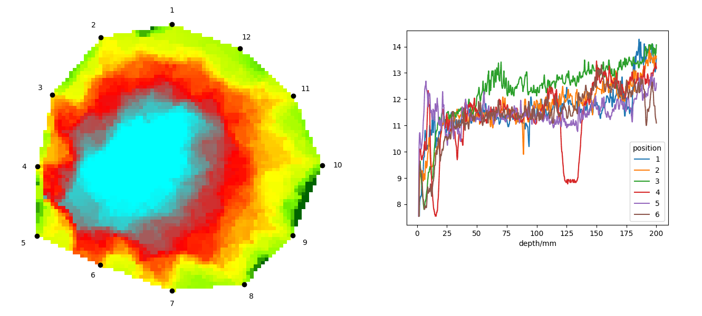

---
keywords:
- geometria analityczna
- tomograf akustyczny
- rezystograf
- równanie linii
- wielkość wektorowa
is_finished: true
---

# Gdy tomograf akustyczny spotyka się z rezystografem

Być może się tego nie spodziewasz, ale geometria analityczna odgrywa rolę w monitorowaniu zdrowia drzew. Drzewa są istotną częścią środowiska miejskiego. Jednak ocena ich stanu może być trudna - zwłaszcza, gdy nie ma widocznych oznak uszkodzenia. Geometria analityczna zapewnia skuteczny sposób łączenia różnych metod diagnostycznych i tworzenia ujednoliconego modelu, który pomaga ocenić ryzyko upadku drzewa. Umożliwia to podejmowanie bardziej świadomych decyzji dotyczących pielęgnacji drzew i potencjalnej interwencji.

## Kwestia drzew na obszarach miejskich

Drzewa są ważnym elementem, który sprawia, że życie w środowisku miejskim jest przyjemniejsze.
Zapewniają cień i tlen, redukują kurz i hałas, obniżają temperaturę otoczenia i stanowią schronienie dla ptaków i innych zwierząt.

Jednak sadzenie drzew na obszarach miejskich wiąże się również z pewnym ryzykiem. Jednym z najpoważniejszych jest ryzyko upadku drzewa.
Upadające drzewo może zranić ludzi, uszkodzić mienie lub - w najgorszym przypadku - spowodować śmierć.
Dlatego tak ważne jest regularne monitorowanie stanu drzew i wykrywanie potencjalnych problemów na czas.

## Diagnostyka drzewa

Arboryści - specjaliści od pielęgnacji drzew poza lasami - stosują różne metody oceny stanu zdrowotnego drzew. 
Jedną z tych metod jest tomograf akustyczny, który pozwala na nieinwazyjną ocenę drewna wewnątrz pnia bez uszkadzania drzewa. 
Działa to podobnie jak tomografia komputerowa drzew, ujawniając ukryte wady i próchnicę drewna. 
Jednak w przeciwieństwie do tomografii medycznej, tomograf akustyczny wykorzystuje fale dźwiękowe o dużej długości fali, co wiąże się z ograniczeniami wynikającymi z fizycznych zasad propagacji fal.
Jedną z konsekwencji jest to, że tomograf akustyczny nie jest w stanie wiarygodnie odróżnić dziupli od pęknięcia wewnątrz drzewa.
Oba defekty pojawiają się jako obszary, w których dźwięk przemieszcza się wolniej niż w otaczającym zdrowym drewnie.
Pęknięcia są często przeszacowywane pod względem rozmiaru i mogą wyglądać podobnie do ubytków na wynikowym obrazie.
Z tego powodu zaleca się użycie dodatkowych narzędzi diagnostycznych, aby uzyskać pełniejsze zrozumienie stanu drzewa.

Jednym z takich narzędzi jest rezystograf, który mierzy sztywność drewna i pomaga wykryć ukryte wady.
Rezystograf wykorzystuje cienkie wiertło i mierzy opór drewna w celu oceny jego struktury i właściwości mechanicznych.
Ponieważ wiertło jest bardzo cienkie, metoda ta jest minimalnie inwazyjna i nie powoduje żadnych uszkodzeń drzewa.
Rezystograf może wykrywać pęknięcia, ubytki i inne wady wewnętrzne.
Dostarczane przez niego dane mogą uzupełniać ustalenia tomografu akustycznego.

W praktyce diagnostyka drzew zwykle rozpoczyna się od pomiarów wykonanych za pomocą tomografu akustycznego, który dostarcza podstawowych informacji o stanie drewna wewnątrz pnia.
Następnie zazwyczaj wykonuje się pomiary za pomocą rezystografu, który zapewnia dodatkowy wgląd i pomaga wykryć ukryte wady.
Dzięki połączeniu obu metod możliwe jest stworzenie kompleksowego obrazu stanu zdrowia drzewa i wczesne wykrycie potencjalnych problemów.

Poniższy rysunek przedstawia przykładowe dane wyjściowe z tomografu akustycznego i rezystografu.
Po lewej stronie znajduje się rekonstrukcja z tomografu akustycznego, pokazująca prędkość propagacji dźwięku przez drewno.
Prędkość ta jest ważna, ponieważ bezpośrednio wiąże się z właściwościami mechanicznymi drewna.
Niebieskie i czerwone obszary reprezentują strefy, w których dźwięk porusza się wolniej; w zielonych obszarach dźwięk porusza się szybciej.
Po prawej stronie znajduje się wynik z rezystografu, który pokazuje moc wymaganą do utrzymania stałej prędkości wiercenia - służy to jako wskaźnik wytrzymałości mechanicznej drewna.
Każdy pomiar wiercenia został wykonany pomiędzy dwoma czujnikami tomografu akustycznego, co oznacza, że wykonano dwanaście wierceń pomiędzy dwunastoma czujnikami tomografu.

Obraz pokazuje, że jedna z krzywych rezystografu ma zauważalny spadek na głębokości około 125 milimetrów.
Spadek ten odpowiada wgłębieniu o wielkości około jednego centymetra.
Tomograf akustyczny wskazuje jednak na większe zagłębienie.
Aby ułatwić przetwarzanie danych, warto połączyć je w jeden obraz.
Z tego powodu chcielibyśmy uwzględnić zarówno lokalizacje wierceń, jak i odczyty rezystografu w *tomogramie* (dane wyjściowe z tomografu akustycznego).

## Łączenie danych z tomografu akustycznego i rezystografu

Proces łączenia danych z obu metod wymaga zastosowania matematyki.
Załóżmy, że wiercenie zostało wykonane z punktu środkowego między dwoma sąsiednimi czujnikami i skierowane w kierunku środka pnia drzewa.
Będziemy reprezentować odczyty rezystografu za pomocą intensywności w skali szarości, a ostateczny obraz będzie kompozycją tomogramu i kolumny o różnej intensywności w skali szarości.

Tomogram jest zwykle umieszczany w układzie współrzędnych w taki sposób, że jego środek znajduje się w punkcie początkowym,
pierwszy czujnik znajduje się na dodatniej części osi $y$, a pozostałe czujniki są ponumerowane przeciwnie do ruchu wskazówek zegara. 
Aby utworzyć kolumnę danych rezystograficznych między drugim i trzecim czujnikiem,
potrzebujemy funkcji matematycznej, która odwzorowuje wartość głębokości z krzywej rezystograficznej na pozycję w układzie współrzędnych tomogramu.
Wykres tej funkcji będzie linią prostą rozciągającą się od punktu środkowego między dwoma czujnikami do środka drzewa. Oznaczmy tę linię jako $p$.

Kroki do znalezienia odpowiedniego równania dla linii $p$ mogą być następujące:

* Najpierw określ współrzędne punktu środkowego między dwoma czujnikami. Niech tym punktem będzie $A$.
  Prosta $p$ musi przechodzić przez punkt $A$.
* Następnie wyznacz wektor kierunku $\vec u$ prostej $p$. Będzie to wektor skierowany od punktu $A$ do początku układu współrzędnych.
* Używając punktu $A$ i wektora kierunku $\vec u$, możemy napisać równanie parametryczne prostej $p$.
  Takie podejście wymagałoby jednak ustanowienia związku między parametrem w równaniu a głębokością wiercenia. Jeśli zamiast tego przekształcimy wektor kierunku $\vec u$ w wektor jednostkowy, oznaczony $\vec e$,
 parametr w równaniu liniowym będzie bezpośrednio odpowiadał głębokości wiercenia. Dlatego najpierw znajdujemy wektor $\vec e$ jako wektor jednostkowy w kierunku wektora $\vec u$.
* Równanie parametryczne linii zdefiniowanej przez punkt $A$ i wektor $\vec e$
 daje odwzorowanie głębokości wiercenia na współrzędne w układzie współrzędnych tomogramu.
  Funkcji tej można następnie użyć do nałożenia danych z rezystografu na tomogram.

Wypróbujmy tę procedurę na konkretnym przykładzie opartym na geometrii pokazanej na rysunku 1.

> **Zadanie 1.** Współrzędne czujników tomografu akustycznego 2 i 3 to $P_2=[-15, 26]$ i $P_3=[-25, 14]$.
> Współrzędne środka tomogramu to $O=[0, 0]$. 
> 
> Znaleźć parametryczną reprezentację linii $p$ przechodzącej przez punkt $A$ i środek
tomogramu $O$, tak aby parametr odpowiadał głębokości wiercenia.

\iffalse

*Rozwiązanie.* Punkt środkowy $A$ odcinka pomiędzy punktami $P_2$ i $P_3$ jest obliczany za pomocą wzoru

$$
A = \frac{P_2 + P_3}{2}.$$

Podstawiając współrzędne, otrzymujemy $A=[-20, 20]$.

Wektor kierunku $\vec u$ prostej $p$ jest wyznaczany przy użyciu punktów $O$ i $A$ leżących na prostej:
$$\vec u = O-A,$$
co we współrzędnych daje $\vec u = [0,0] - [-20, 20] = (20, -20)$.
Wielkość wektora $\vec u=(u_1, u_2)$ jest obliczana przy użyciu twierdzenia Pitagorasa:
$$|\vec u| = \sqrt{u_1^2 + u_2^2} = \sqrt{20^2 + (-20)^2} = \sqrt{800} =
20\sqrt{2}.$$

Wektor jednostkowy $\vec e$ w kierunku wektora $\vec u$ jest dany przez podzielenie wektora przez jego wielkość:
$$\vec e = \frac{\vec u}{|\vec u|} = \left(\frac{20}{20\sqrt{2}}, \frac{-20}{20\sqrt{2}}\right) =
\left(\frac{1}{\sqrt{2}}, \frac{-1}{\sqrt{2}}\right).$$

Ostateczne równania parametryczne linii $p$ są zatem następujące:
$$
\begin{align*}
x &= -20 + t \cdot \frac{1}{\sqrt{2}}, \\
y &= 20 - t \cdot \frac{1}{\sqrt{2}}, \qquad t\in\mathbb R.
\end{align*}
$$

\fi

> **Zadanie 2.** Zmodyfikuj procedurę z ćwiczenia 1 tak, aby wiercenie było prostopadłe do segmentu określonego przez czujniki tomografu akustycznego.

\iffalse

*Rozwiązanie.* Musimy zastąpić wektor $\vec u$ wektorem kierunku, który jest prostopadły
do segmentu zdefiniowanego przez czujniki tomografu akustycznego.
Wektory prostopadłe do danego wektora $v = (v_1,v_2)$ to $(-v_2,v_1)$ i $(v_2,-v_1)$. 
Wektor z punktu $P_2$ do punktu $P_3$ ma współrzędne
$$
\vec v = P_3 - P_2 = (-25, 14) - (-15, 26) = (-10, -12).
$$ 
W naszym przypadku dwa prostopadłe wektory kierunku to
$$
\vec n_{1} = (12, -10), \quad \vec n_{2} = (-12, 10).
$$ 
Z rysunku 2 jasno wynika, że wektor kierunku powinien być skierowany w prawo i w dół,
więc używamy wektora $\vec n_{1}$. Wielkość wektora $\vec n_{1}$ wynosi
$$
|\vec n_{1}| = \sqrt{12^2 + (-10)^2} = \sqrt{244} = 2\sqrt{61}
$$ 
a wektor jednostkowy w kierunku $\vec n_{1}$ uzyskuje się dzieląc wektor przez jego wielkość:
$$\vec e = \frac{\vec n_{1}}{|\vec n_{1}|} = \left(\frac{12}{2\sqrt{61}},
\frac{-10}{2\sqrt{61}}\right) =   
\left(\frac{6}{\sqrt{61}}, \frac{-5}{\sqrt{61}}\right).$$

Równania parametryczne linii $p$ są zatem następujące:
$$
\begin{align*}
x &= -20 + t \cdot \frac{6}{\sqrt{61}}, \\
y &= 20 - t \cdot \frac{5}{\sqrt{61}}, \qquad t\in\mathbb R.
\end{align*}
$$

\fi

*Uwaga.* Procedura opisana w poprzednich problemach może być zastosowana do dowolnej pary
czujników tomografu akustycznego i może być łatwo zaimplementowana w algorytmie.
Rezultatem jest połączona wizualizacja danych z rezystografu i tomografu akustycznego na jednym obrazie.

## Źródło danych

Dane i zdjęcia w tym tekście pochodzą z rzeczywistych pomiarów przeprowadzonych na drzewach w Alei Lipowej Valdštejn w Jičínie.
Jest to najstarsza aleja lipowa w Czechach, o długości ponad 1700 metrów.
Ponieważ nie wszystkie drzewa są w dobrym stanie, konieczne jest ich regularne monitorowanie.
W ramach procesu monitorowania wybrano niektóre drzewa do wycinki, a następnie przeprowadzono na nich pomiary.
Dało to unikalną możliwość porównania wyników diagnostycznych z rzeczywistym stanem drzew.
Pomiary przeprowadził arborysta Vojtěch Semík, a dane zostały przetworzone w ramach projektu ERC CZ DYNATREE(<https://starfos.tacr.cz/cs/projekty/LL1909>).

## Wnioski

W tym tekście zbadaliśmy, w jaki sposób można zastosować narzędzia geometrii analitycznej do łączenia danych z tomografu akustycznego i rezystografu.
Zademonstrowaliśmy, jak wykorzystać parametryczne równanie linii do konwersji danych dotyczących głębokości wiercenia z rezystografu na współrzędne w układzie współrzędnych tomografu.
Metoda ta może poprawić dokładność oceny stanu zdrowotnego drzew i zapewnić pełniejszy obraz wewnętrznego stanu drewna.
Łącząc dane z obu narzędzi diagnostycznych, możliwe jest bardziej niezawodne wykrywanie ukrytych wad - co jest niezbędnym krokiem do utrzymania zdrowia drzew i zapewnienia bezpieczeństwa w środowiskach miejskich.

## Literatura i odniesienia
### Literatura

1. <https://rinntech.info/products/resistograph/> (online, dostępny 6. czerwiec 2025)
2. <https://www.kudyznudy.cz/aktivity/valdstejnska-lipova-alej-v-jicine-nejstarsi-doch>
   (online, dostępny 6. czerwiec 2025)
3. <https://www.jicin.org/lipova-alej> (online, dostępny 6. czerwiec 2025)
4. <https://zpravyceskyraj.cz/stromy-vedi-co-a-proc-delaji-arborista-vojtech-semik-o-jicinske-lipove-aleji/>
   (online, dostępny 6. czerwiec 2025)

### Źródła obrazu

1. Projekt DYNATREE – Tree Dynamics: Understanding of Mechanical Response to Loading, <https://starfos.tacr.cz/cs/projekty/LL1909>.
2. Obrazy własne autora
 
