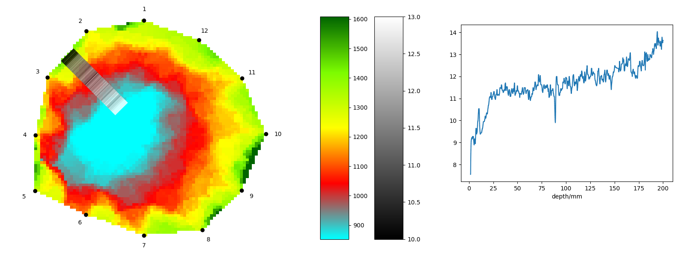

---
keywords:
- akustický tomograf
- resistograf
- analytická geometria
- rovnica priamky
- dĺžka vektora
is_finished: True
difficulty: 1
time: 15
---
---

# Keď sa akustický tomograf stretne s resistografom

Možno by ste to nepovedali, ale analytická geometria prispieva k monitorovaniu zdravotného stavu stromov. Stromy zohrávajú v mestskom prostredí nezastupiteľnú úlohu. Často je však ich zdravotný stav ťažké posúdiť, najmä keď nie sú viditeľné žiadne vonkajšie známky poškodenia. Analytická geometria však ponúka účinný spôsob, ako prepojiť rôzne diagnostické metódy a vytvoriť jednotný model, ktorý umožní lepšie vyhodnotiť riziko pádu stromu. Vďaka tomu možno robiť informovanejšie rozhodnutia o starostlivosti aj prípadnom zásahu.

## Problematika stromov v mestskej zástavbe

Stromy sú dôležitým prvkom, ktorý robí život v mestskej zástavbe príjemnejším. Poskytujú tieň a kyslík, obmedzujú prašnosť a hluk, znižujú teplotu v okolí a poskytujú útočisko pre vtáky a ďalšie živočíchy.

Umiestnenie stromov do mestskej zástavby je však spojené s rizikami. Jedným z rizík s najvážnejšími následkami je riziko pádu stromu. Pád stromu môže spôsobiť zranenie osôb, poškodenie majetku a v najhoršom prípade aj smrť. Preto je dôležité pravidelne kontrolovať zdravotný stav stromov a včas odhaliť prípadné problémy.

## Diagnostika stromov

Arboristi, odborníci na starostlivosť o dreviny mimo lesa, používajú rôzne metódy na diagnostiku zdravotného stavu stromov. Medzi tieto metódy patrí napríklad akustický tomograf, ktorý umožňuje posúdiť stav dreva v kmeni stromu neinvazívne, bez nutnosti poškodenia stromu. Je to akési CT vyšetrenie stromov, ktoré odhaľuje skryté vady a degradáciu dreva. Na rozdiel od lekárskeho CT vyšetrenia akustický tomograf využíva zvukové vlny s veľkou vlnovou dĺžkou, čo je spojené s fyzikálnymi obmedzeniami ich šírenia.

Jedným z dôsledkov je, že akustický tomograf nedokáže s dostatočnou istotou rozlíšiť medzi stromom s dutinou a stromom s prasklinou. Oba defekty sa pri vyšetrení javia ako miesto, kde sa zvuk šíri pomalšie než v okolí zdravého dreva. Veľkosť praskliny však býva často nadhodnotená a môže sa zobrazovať podobne ako dutina. Pri kontrole stromov je preto vhodné používať aj ďalšie doplnkové metódy, ktoré umožnia získať komplexnejšie informácie o zdravotnom stave stromu.

Jednou z takýchto metód je resistograf, ktorý meria tvrdosť dreva a pomáha odhaliť skryté vady. Resistograf je prístroj, ktorý pomocou vrtáka a merania odporu dreva dokáže posúdiť jeho štruktúru a mechanické vlastnosti. Keďže vrták je veľmi tenký, táto metóda je len málo invazívna a strom nepoškodzuje. Resistograf dokáže odhaliť praskliny, dutiny a ďalšie chyby v dreve a takto získané dáta môžu byť využité na doplnenie informácií z akustického tomografu.

V praxi prebieha diagnostika stromov zvyčajne tak, že sa najprv urobí meranie pomocou akustického tomografu, ktorý poskytne základné informácie o stave dreva v kmeni. Následne sa uskutoční meranie resistografom, ktoré umožní získať doplňujúce informácie a odhaliť prípadné skryté vady. Takto je možné vytvoriť komplexný obraz o zdravotnom stave stromu a včas odhaliť rizikové miesta.

Na nasledujúcom obrázku sú znázornené možné výstupy z akustického tomografu a resistografu. Vľavo je rekonštrukcia obrazu z akustického tomografu, ktorá ukazuje rýchlosť šírenia zvuku v dreve. Táto rýchlosť nás zaujíma, pretože priamo súvisí s mechanickými vlastnosťami dreva. Modré a červené oblasti predstavujú miesta, kde sa zvuk šíri pomalšie, zelená oblasť zasa miesta, kde sa šíri rýchlejšie. Vpravo je výstup z resistografu, ktorý ukazuje výkon potrebný na udržanie konštantných otáčok vrtáka, čo je zároveň mierou mechanickej pevnosti dreva. Vrtanie sa vykonalo vždy medzi dvoma senzormi akustického tomografu, takže medzi dvanástimi senzormi tomografu bolo uskutočnených dvanásť vrtov resistografom.

Na obrázku vidíme, že jedna z kriviek resistografu má výrazný pokles v hĺbke približne 125 milimetrov. Tento pokles zodpovedá dutine s veľkosťou asi jeden centimeter, avšak akustický tomograf zobrazuje dutinu väčšieho rozsahu. Pre pohodlnejšie spracovanie dát je preto vhodné spojiť výsledky oboch meraní do jedného obrázka. V *tomograme* (výstupe z akustického tomografu) by tak mali byť zobrazené aj pozície vrtov spolu s údajmi z resistografu.

## Spojenie dát z akustického tomografu a resistografu

Pri probléme prepojenia výsledkov z oboch metód vstupuje do hry matematické spracovanie. Predstavme si, že vrtanie prebiehalo zo stredu spojnice dvoch susedných senzorov a smerovalo do stredu kmeňa stromu. Hodnoty z resistografu sa budú znázorňovať odtieňmi šedej a výsledný obrázok bude kombináciou tomogramu a stĺpca s meniacou sa intenzitou šedej farby.

Tomogram sa väčšinou umiestňuje do súradnicovej sústavy tak, že jeho stred leží v počiatku, prvý senzor je na kladnej časti osi $y$ a ďalšie senzory sa číslujú proti smeru hodinových ručičiek. Aby sme mohli vytvoriť stĺpec s údajmi z resistografu medzi druhým a tretím senzorom, je potrebné previesť hĺbku nameranú resistografom na konkrétnu pozíciu v súradnicovom systéme spojenom s tomogramom.

Graficky tak vznikne priamka, ktorá spája stred úsečky medzi dvoma senzormi so stredom stromu. Označme túto priamku $p$.

Jednotlivé kroky pri vytváraní tejto priamky $p$ sú nasledujúce:

* Najskôr určíme polohu stredu spojnice senzorov – nazveme ho bod $A$. 
   Hľadaná priamka $p$ bude bodom $A$ prechádzať.

* Následne určíme smerový vektor $\vec u$ priamky $p$. To bude vektor, ktorý bude smerovať z bodu $A$ do stredu (počiatku) súradnicovej sústavy.

* Pomocou bodu $A$ a smerového vektora $\vec u$ môžeme napísať  parametrickú
  rovnicu priamky $p$. Toto by však malo nevýhodu v tom, že by bolo nutné nájsť väzbu medzi týmto parametrom a medzi hĺbkou vrtu. Ak však smerový vektor
  $\vec u$ prevedieme na vektor jednotkovej dĺžky, bude parameter rovnice priamky zodpovedať hĺbke vrtu. Preto najprv nájdeme vektor $\vec e$ ako jednotkový vektor v smere vektora $\vec u$.

* Parametrická rovnica priamky zadanej bodom $A$ a vektorom $\vec e$ definuje zobrazenie hĺbky vrtu na súradnice v súradnicovej sústave tomogramu a môže byť použitá na doplnenie tomogramu o údaje z resistografu.

Vyskúšajme si tento postup na konkrétnom príklade, ktorý sa vzťahuje na geometriu z Obrázka 1.

> **Úloha 1.** Súradnice bodov, v ktorých boli umiestnené senzory číslo 2 a 3 akustického tomografu, sú $P_2=[-15, 26]$ a $P_3=[-25, 14]$.  Súradnice stredu tomogramu sú $O=[0, 0]$. 
> 
> Nájdite parametrické vyjadrenie priamky $p$ prechádzajúcej bodom $A$ a stredom tomogramu $O$, pričom hodnota parametra sa bude rovnať hĺbke vrtu.

*Riešenie.* Stred $A$ úsečky medzi bodmi $P_2$ a $P_3$ vypočítame podľa vzorca
$$
A = \frac{P_2 + P_3}{2}.$$

Po dosadení dostaneme $A=[-20, 20]$.

Smerový vektor $\vec u$ priamky $p$, ktorá prechádza bodmi  $O$ a $A$, je
$$\vec u = O-A,$$
$\vec u = [0,0] - [-20, 20] = (20, -20)$.

Dĺžka vektora $\vec u=(u_1, u_2)$ je podľa Pytagorovej vety
$$|\vec u| = \sqrt{u_1^2 + u_2^2} = \sqrt{20^2 + (-20)^2} = \sqrt{800} =
20\sqrt{2}.$$

Jednotkový vektor $\vec e$ v smere vektora $\vec u$ určíme ako podiel vektora a jeho dĺžky, 
$$\vec e = \frac{\vec u}{|\vec u|} = \left(\frac{20}{20\sqrt{2}}, \frac{-20}{20\sqrt{2}}\right) =
\left(\frac{1}{\sqrt{2}}, \frac{-1}{\sqrt{2}}\right).$$

Parametrické rovnice priamky $p$ sú 
$$
\begin{align*}
x &= -20 + t \cdot \frac{1}{\sqrt{2}}, \\
y &= 20 - t \cdot \frac{1}{\sqrt{2}}, \qquad t\in\mathbb R.
\end{align*}
$$

> **Úloha 2.** Modifikujte postup z Úlohy 1 tak, aby vrt bol kolmý na úsečku definovanú senzormi akustického tomografu

*Riešenie.* Je potrebné nahradiť vektor $\vec u$ smerovým vektorom kolmým na úsečku, ktorú určujú senzory tomografu. Smerové vektory kolmé na vektor $\vec
v = (v_1,v_2)$ sú $(-v_2,v_1)$ a $(v_2,-v_1)$. Vektor z bodu $P_2$ do bodu
$P_3$ má súradnice: 
$$\vec v = P_3 - P_2 = (-25, 14) - (-15, 26) = (-10,-12).$$ 
Pre kolmý vektor získame možnosti:
$$
\vec n_{1} = (12, -10), \quad \vec n_{2} = (-12, 10).
$$ 
Z obrázka 2 je vidieť, že smerový vektor má smerovať doprava a nadol, preto použijeme $\vec n_{1}$. Dĺžka vektora $\vec n_{1}$ je daná vzťahom
$$|\vec n_{1}| = \sqrt{12^2 + (-10)^2} = \sqrt{244} = 2\sqrt{61}$$ 
a jednotkový vektor v smere $\vec n_{1}$ je podielom vektora a jeho dĺžky, t. j.
$$\vec e = \frac{\vec n_{1}}{|\vec n_{1}|} = \left(\frac{12}{2\sqrt{61}},
\frac{-10}{2\sqrt{61}}\right) =   
\left(\frac{6}{\sqrt{61}}, \frac{-5}{\sqrt{61}}\right).$$

Parametrická rovnica priamky $p$ je teda
$$
\begin{align*}
x &= -20 + t \cdot \frac{6}{\sqrt{61}}, \\
y &= 20 - t \cdot \frac{5}{\sqrt{61}}, \qquad t\in\mathbb R.
\end{align*}
$$

**Poznámka.** Postup z predchádzajúcich úloh možno použiť pre ľubovoľné dva senzory akustického tomografu a je možné ho algoritmizovať. Výstupom potom bude spojenie dát z resistografu a akustického tomografu do jedného obrázka.

## Zdroj dát

Údaje a fotografie v texte pochádzajú zo skutočných meraní, ktoré boli uskutočnené na stromoch vo Valdštejnovej lipovej aleji v Jičíne. Ide o najstaršie stromoradie líp v Českej republike s dĺžkou viac než 1700 metrov.

Keďže nie všetky stromy sú v dobrom zdravotnom stave, je nutné ich pravidelne monitorovať. V rámci toho boli niektoré stromy vybrané na výrub a predtým na nich arboristi vykonali merania. Vďaka tomu vznikla jedinečná možnosť porovnať výsledky meraní so skutočným stavom dreva. Merania uskutočnil arborista Vojtěch Semík a údaje boli spracované v rámci projektu ERC CZ – DYNATREE (<https://starfos.tacr.cz/cs/projekty/LL1909>).

## Záver

V tomto texte sme ukázali využitie aparátu analytickej geometrie pri prepájaní dát z akustického tomografu a resistografu. Predstavili sme spôsob, ako pomocou parametrickej rovnice priamky previesť hĺbku vrtu z resistografu na súradnice v sústave tomogramu.

Tento postup možno využiť na spresnenie predpovede zdravotného stavu stromov a na získanie komplexného obrazu o ich stave. Kombinácia výsledkov oboch metód umožňuje získať presnejšie informácie o stave dreva a odhaliť skryté chyby, čo je dôležité pre zdravie stromov a bezpečnosť v mestskej zástavbe.

## Literatúra a zdroje obrázkov

### Literatúra

1. <https://rinntech.info/products/resistograph/> (online, prístup 6.6.2025)
2. <https://www.kudyznudy.cz/aktivity/valdstejnska-lipova-alej-v-jicine-nejstarsi-doch>
   (online, prístup 6.6.2025)
3. <https://www.jicin.org/lipova-alej> (online, prístup 6.6.2025)
4. <https://zpravyceskyraj.cz/stromy-vedi-co-a-proc-delaji-arborista-vojtech-semik-o-jicinske-lipove-aleji/>
   (online, prístup 6.6.2025)

### Zdroje obrázkov

1. Projekt DYNATREE – Tree Dynamics: Understanding of Mechanical Response to Loading, <https://starfos.tacr.cz/cs/projekty/LL1909>.
2. Vlastné obrázky
 
