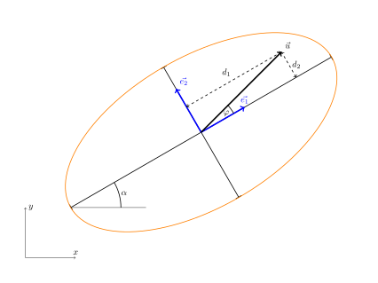

# Acoustic Tomograph and the Equation of an Ellipse

Imagine you need to assess the health of an old tree without cutting it down or damaging it in any way. Modern technology now makes it possible to do so gently and accurately — and one of the key tools involved is the equation of an ellipse. Using the EBSI method (ellipse-based spatial interpolation), it is possible to estimate the physical properties of the wood inside the trunk based on measured data, and thus get an idea of its strength and condition. To achieve this, we need to understand how to work with the equation of an ellipse even when the ellipse is not aligned with the coordinate axes. In such cases, the dot product is used to find the projection of a vector in the desired direction.

## Acoustic Tomograph

In the work of an arborist — a specialist in the care of trees outside forests — one of the most common tasks is to assess a tree’s vitality and health. This must be done with minimal or zero interference, so as not to affect the tree’s condition. One of the very few minimally invasive methods is the use of an acoustic tomograph. This device measures the *time of flight* (TOF) of a sound signal between two sensors. Using methods of analytic geometry, the distance between the sensors can be determined, and assuming the sound travels along straight paths, the speed of sound propagation through the material can be calculated. This value is an important indicator of the physical and mechanical properties of the wood, since sound travels faster through *sound wood* than through *degraded wood*.

## The Challenge of Image Reconstruction

Image reconstruction in an acoustic tomograph is based on the assumption that sound rays travel in straight lines across the cross-section of the tree trunk. Reflections or refractions of the wave are not taken into account. The validity of this assumption is currently being studied by researchers, but for practical use of the method, such a simplification is necessary.

Because the number of rays used is relatively small (an acoustic tomograph typically has 12, at most 24 sensors — sometimes even fewer for trees with small diameters), it is necessary to apply a method of interpolation and averaging. This makes the task quite different from medical tomography, where the number of imaging rays is orders of magnitude higher and the geometry of the measurement is better defined: sources and detectors are, for instance, placed around the perimeter of a perfect circle, unlike the irregular perimeter of a tree trunk. To overcome the limitations associated with using acoustic tomography on trees, several techniques have been developed that allow for the interpolation and averaging of measured values.

## The EBSI Method and Its Successors

Many image reconstruction methods in acoustic tomography are based on the assumption that the speed of sound is influenced by the quality of the wood in the elliptical region surrounding the line segment between two sensors. This assumption was tested on real measurements in Du et al. (2015), where a formula was also proposed to relate the distance between sensors to the eccentricity of the ellipse. This approach produced better results than methods based on simple ray intersections and averaging of velocities at those intersections. The method was named Ellipse-Based Spatial Interpolation, abbreviated as EBSI.

The practical implementation of image reconstruction involves dividing the tree cross-section into individual cells, within which the measured values are averaged in a certain way.
In the EBSI method, for each cell, the velocity is calculated as the average of the velocities of all rays whose elliptical area of influence includes that cell. 

In later studies, the EBSI method was further developed. Around each ray, an ellipse is again considered, defining the area of influence of that ray (see Figure 3).
The data are processed in two steps using the RSEN and SISE methods, with acronyms derived from “*ray segmentation by elliptical neighborhood*” and “*spatial interpolation by segmented ellipse*”, as described in Du et al. (2018).

A detailed description of the methods can be found in the original literature. However, even from the simplified description above, it is clear that a key subproblem in the implementation of image reconstruction is checking whether a point in the plane lies inside or outside a given ellipse.

## The Equation of an Ellipse

From the previous motivating section, it follows that for the practical implementation of image reconstruction using the EBSI method, it is necessary to work efficiently with ellipses in various orientations. This includes arbitrary rotation of the axes and arbitrary displacement of the ellipse's center. We need to be able to efficiently determine whether a given point lies inside or outside the ellipse.

An ellipse is the set of points in a plane such that the sum of the distances from any point on the ellipse to two fixed points (called foci) is constant. An ellipse can also be defined by its major and minor axes. Let us consider an ellipse with a semi-major axis of length $a$ and a semi-minor axis of length $b$. The equation of an ellipse centered at the origin with its major axis aligned with the $x$-axis has the following form:

$$
\frac{x^2}{a^2}+\frac{y^2}{b^2}=1.
$$
Points lying inside the ellipse satisfy the inequality
$$
\frac{x^2}{a^2}+\frac{y^2}{b^2}<1.
$$

However, we are dealing with ellipses in general positions. While their equations can be transformed into the same form as above, this process is rather tedious and unnecessary for our purposes. Instead of working with coordinates, we will use the distances of a point from the semi-major and semi-minor axes. In the case of the equation above, these distances correspond directly to the $x$- and $y$-coordinates of the point.

That is, if $d_1$ is the distance from the point to the line defined by the minor axis (for brevity, we call it the distance to the minor axis), and $d_2$ is the distance from the point to the major axis, then the point lies inside the ellipse if and only if

$$
\frac{d_1^2}{a^2}+\frac{d_2^2}{b^2}<1.\tag{1}
$$

To check whether a point lies inside the ellipse, it is therefore sufficient to determine its distances to the major and minor axes and verify whether inequality (1) holds.

## Magnitude of Vector Projection and the Dot Product

The figure shows the major and minor axes of the ellipse, unit vectors in the directions of these axes, a line connecting the tested point to the center of the ellipse, and the distances from the point to each axis. 

For simplicity, let us assume that the angle between vectors $\vec u$ and $\vec e_1$ is acute. By the definition of the dot product and the fact that $\vec e_1$ is a unit vector, we get

$$\vec u\cdot\vec e_1 = |\vec u||\vec e_1|\cos\varphi = |\vec u| \cos\varphi = d_1.$$

The distance to the minor axis can therefore be calculated using the dot product.
From the diagram, it is clear that $d_1$ is the magnitude of the projection of vector $\vec u$ onto the direction of vector $\vec e_1$.
If the angle between $\vec u$ and $\vec e_1$ were obtuse, the value of $d_1$ would be negative — however, this does not affect the test condition (1).

Analogously, the magnitude of the projection of vector $\vec u$ in the direction defined by vector $\vec e_2$ is (up to a possible sign, which again does not affect test (1)) given by:

$$d_2=\vec u\cdot \vec e_2.$$

*Note.*
The dot product can be computed using coordinates according to the formula

$$\vec u\cdot\vec v = u_1v_1+u_2v_2,$$

where $\vec u = (u_1, u_2)$ and $\vec v=(v_1,v_2)$. This calculation can be performed very efficiently on a computer, and with appropriate programming techniques (such as vectorization), the computation can be carried out simultaneously for thousands of points — typically hundreds of times faster than using a loop that tests each point one by one.

*Note.*
The unit vector $\vec e_1$ in the direction of the major axis can be determined either as the vector from the center to the major vertex divided by its magnitude, or using the angle between the major axis and the $x$-axis. If this angle is $\alpha$, then the unit vector is given by

$$\vec e_1=(\cos\alpha, \sin\alpha).$$

The unit vector in the direction of the minor axis is perpendicular to $\vec e_1$, so we can take, for example:

$$\vec e_2 = (-\sin\alpha, \cos\alpha).$$

## Example Application

> **Exercise** An ellipse has a semi-major axis of length $a=3$ and a semi-minor axis of length $b=1{.}5$. The center of the ellipse is at the origin, and the major axis forms an angle of $\alpha=30^\circ$ with the horizontal direction.
> Determine whether the point $X=[1{.}6;1{.}6]$ lies inside or outside the ellipse. (The values used are taken from Figure 4. Point $X$ is the endpoint of vector $\vec u$.)

\iffalse

*Solution.*
The unit vector in the direction of the major axis is $\vec e_1=(\cos 30^\circ,
\sin 30^\circ)$. The vector $\vec u$ is defined by the coordinates of point $X$, i.e. $\vec
u=(1{.}6;1{.}6)$. The dot product is therefore

$$d_1=\vec u\cdot \vec e_1 = 1{.}6\cdot\cos 30^\circ + 1{.}6\cdot\sin 30^\circ\doteq 2{.}186.$$

Similarly, the magnitude of the projection in the direction of the minor axis, defined by vector $\vec e_2=(-\sin 30^\circ,\, \cos 30^\circ)$ is

$$d_2=\vec u\cdot \vec e_2 = -1{.}6\cdot\sin 30^\circ + 1{.}6\cdot\cos 30^\circ
\doteq 0{.}586.$$

We have

$$
\frac{d_1^2}{a^2} + \frac{d_2^2}{b^2} \doteq 0{.}683<1.
$$

Therefore, the point lies inside the ellipse.
The situation is shown in the following figure. 

\fi

## Conclusion

This text presented the fundamental steps on which image reconstruction in acoustic tomography is based. One of the key subtasks is to determine whether a given point lies inside or outside an ellipse that is in a general position and defined by its semi-axes.
For this purpose, it is advantageous to use an equation of the ellipse based not on coordinates, but on the distances from the major and minor axes. These distances can be determined using the dot product of vectors.

## Literature and Image Sources

### Literature

1. Du, X., Li, S., Li, G., Feng, H., and Chen, S. (2015). "Stress wave tomography
of wood internal defects using ellipse-based spatial interpolation and velocity
compensation," BioRes. 10(3), 3948-3962. http://doi.org/10.15376/biores.10.3.3948-3962 
2. Du, X.; Li, J.; Feng, H.; Chen, S. Image Reconstruction of Internal Defects
   in Wood Based on Segmented Propagation Rays of Stress Waves. Appl. Sci. 2018,
   8, 1778. https://doi.org/10.3390/app8101778 

### Image Sources

1. Projekt DYNATREE – Tree Dynamics: Understanding of Mechanical Response to Loading, <https://starfos.tacr.cz/cs/projekty/LL1909>.
2. Author’s own images
 
