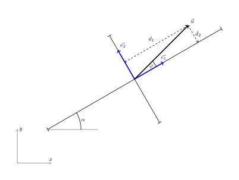

---
keywords:
- tomograf akustyczny
- geometria analityczna
- elipsa
- iloczyn skalarny
- projekcja wektorowa
is_finished: True
---

# Tomograf akustyczny i równanie elipsy

Wyobraź sobie, że musisz ocenić stan zdrowia starego drzewa bez wycinania go lub uszkadzania w jakikolwiek sposób. Nowoczesna technologia pozwala to zrobić delikatnie i dokładnie - a jednym z kluczowych narzędzi jest równanie elipsy. Korzystając z metody EBSI (interpolacja przestrzenna oparta na elipsie), można oszacować właściwości fizyczne drewna wewnątrz pnia na podstawie zmierzonych danych, a tym samym uzyskać wyobrażenie o jego wytrzymałości i stanie. Aby to osiągnąć, musimy zrozumieć, jak pracować z równaniem elipsy, nawet jeśli elipsa nie jest wyrównana z osiami współrzędnych. W takich przypadkach iloczyn kropkowy jest używany do znalezienia rzutu wektora w pożądanym kierunku.

## Tomograf akustyczny

W pracy arborysty - specjalisty zajmującego się pielęgnacją drzew poza lasami - jednym z najczęstszych zadań jest ocena żywotności i stanu zdrowia drzewa. Musi się to odbywać przy minimalnej lub zerowej ingerencji, aby nie wpływać na kondycję drzewa. Jedną z niewielu minimalnie inwazyjnych metod jest użycie tomografu akustycznego. Urządzenie to mierzy *czas przelotu* (TOF) sygnału dźwiękowego pomiędzy dwoma czujnikami. Korzystając z metod geometrii analitycznej, można określić odległość między czujnikami i zakładając, że dźwięk przemieszcza się po prostych ścieżkach, można obliczyć prędkość propagacji dźwięku przez materiał. Wartość ta jest ważnym wskaźnikiem fizycznych i mechanicznych właściwości drewna, ponieważ dźwięk przemieszcza się szybciej przez *dobre drewno* niż przez *zdegradowane drewno*.

## Wyzwanie związane z rekonstrukcją obrazu

Rekonstrukcja obrazu w tomografie akustycznym opiera się na założeniu, że promienie dźwiękowe przemieszczają się w liniach prostych w przekroju poprzecznym pnia drzewa. Odbicia lub załamania fali nie są brane pod uwagę. Zasadność tego założenia jest obecnie badana przez naukowców, ale dla praktycznego wykorzystania metody takie uproszczenie jest konieczne.

Ponieważ liczba wykorzystywanych promieni jest stosunkowo niewielka (tomograf akustyczny ma zazwyczaj 12, maksymalnie 24 detektory - czasem nawet mniej w przypadku drzew o niewielkich średnicach), konieczne jest zastosowanie metody interpolacji i uśredniania. To sprawia, że zadanie to różni się znacznie od tomografii medycznej, w której liczba promieni obrazujących jest o rząd wielkości większa, a geometria pomiaru jest lepiej zdefiniowana: źródła i detektory są na przykład umieszczone na obwodzie idealnego koła, w przeciwieństwie do nieregularnego obwodu pnia drzewa. Aby przezwyciężyć ograniczenia związane z wykorzystaniem tomografii akustycznej na drzewach, opracowano kilka technik, które pozwalają na interpolację i uśrednianie zmierzonych wartości.

## Metoda EBSI i jej następcy

Wiele metod rekonstrukcji obrazu w tomografii akustycznej opiera się na założeniu, że na prędkość dźwięku wpływa jakość drewna w eliptycznym obszarze otaczającym odcinek linii między dwoma czujnikami. Założenie to zostało przetestowane na rzeczywistych pomiarach w Du et al. (2015), gdzie zaproponowano również wzór odnoszący odległość między czujnikami do mimośrodu elipsy. Podejście to dało lepsze wyniki niż metody oparte na prostych przecięciach promieni i uśrednianiu prędkości na tych przecięciach. Metoda ta została nazwana Ellipse-Based Spatial Interpolation, w skrócie EBSI.

Praktyczna implementacja rekonstrukcji obrazu polega na podzieleniu przekroju drzewa na poszczególne komórki, w obrębie których zmierzone wartości są uśredniane w określony sposób.
W metodzie EBSI dla każdej komórki prędkość jest obliczana jako średnia prędkości wszystkich promieni, których eliptyczny obszar oddziaływania obejmuje tę komórkę.

W późniejszych badaniach metoda EBSI była dalej rozwijana. Wokół każdego promienia ponownie rozważana jest elipsa, definiująca obszar wpływu tego promienia (patrz rysunek 3).
Dane są przetwarzane w dwóch etapach przy użyciu metod RSEN i SISE, których akronimy pochodzą od "*segmentacji promieni przez eliptyczne sąsiedztwo*" i "*interpolacji przestrzennej przez segmentowaną elipsę*", jak opisano w Du et al. (2018).

Szczegółowy opis tych metod można znaleźć w oryginalnej literaturze. Jednak nawet z powyższego uproszczonego opisu jasno wynika, że kluczowym podproblemem w implementacji rekonstrukcji obrazu jest sprawdzenie, czy punkt na płaszczyźnie leży wewnątrz czy na zewnątrz danej elipsy.

## Równanie elipsy

Z poprzedniej sekcji motywującej wynika, że do praktycznej implementacji rekonstrukcji obrazu przy użyciu metody EBSI konieczna jest wydajna praca z elipsami w różnych orientacjach. Obejmuje to dowolny obrót osi i dowolne przesunięcie środka elipsy. Musimy być w stanie skutecznie określić, czy dany punkt leży wewnątrz czy na zewnątrz elipsy.

Elipsa to zbiór punktów na płaszczyźnie takich, że suma odległości od dowolnego punktu na elipsie do dwóch stałych punktów (zwanych ogniskami) jest stała. Elipsę można również zdefiniować za pomocą osi głównej i pomocniczej. Rozważmy elipsę z półoś główną o długości $a$ i półoś małą o długości $b$. Równanie elipsy wyśrodkowanej w punkcie początkowym z osią główną wyrównaną z osią $x$ ma następującą postać:

$$
\frac{x^2}{a^2}+\frac{y^2}{b^2}=1.
$$
Punkty leżące wewnątrz elipsy spełniają nierówność
$$
\frac{x^2}{a^2}+\frac{y^2}{b^2}<1.
$$

Mamy jednak do czynienia z elipsami w położeniach ogólnych. Chociaż ich równania można przekształcić do tej samej postaci, co powyżej, proces ten jest raczej żmudny i niepotrzebny do naszych celów. Zamiast pracować ze współrzędnymi, użyjemy odległości punktu od osi pół-większej i pół-mniejszej. W przypadku powyższego równania, odległości te odpowiadają bezpośrednio współrzędnym $x$ i $y$ punktu.

Oznacza to, że jeśli $d_1$ jest odległością od punktu do linii wyznaczonej przez oś pomocniczą (dla uproszczenia nazywamy ją odległością do osi pomocniczej), a $d_2$ jest odległością od punktu do osi głównej, to punkt leży wewnątrz elipsy wtedy i tylko wtedy, gdy

$$
\frac{d_1^2}{a^2}+\frac{d_2^2}{b^2}<1.\tag{1}
$$

Aby sprawdzić, czy punkt leży wewnątrz elipsy, wystarczy zatem określić jego odległości od osi głównej i pomocniczej i zweryfikować, czy zachodzi nierówność (1).

## Magnitude of Vector Projection and the Dot Product

The figure shows the major and minor axes of the ellipse, unit vectors in the directions of these axes, a line connecting the tested point to the center of the ellipse, and the distances from the point to each axis. 

Dla uproszczenia przyjmijmy, że kąt pomiędzy wektorami $\vec u$ i $\vec e_1$ jest ostry. Z definicji iloczynu skalarnego i faktu, że $\vec e_1$ jest wektorem jednostkowym, otrzymujemy

$$\vec u\cdot\vec e_1 = |\vec u||\vec e_1|\cos\varphi = |\vec u| \cos\varphi = d_1.$$

Odległość do osi pomocniczej można zatem obliczyć za pomocą iloczynu skalarnego.
Z diagramu jasno wynika, że $d_1$ jest wielkością rzutu wektora $\vec u$ na kierunek wektora $\vec e_1$.
Gdyby kąt pomiędzy $\vec u$ i $\vec e_1$ był rozwarty, wartość $d_1$ byłaby ujemna - nie ma to jednak wpływu na warunek testu (1).

Analogicznie, wielkość rzutu wektora $\vec u$ w kierunku określonym przez wektor $\vec e_2$ jest (z możliwym znakiem, który ponownie nie wpływa na test (1)) dana przez:

$$d_2=\vec u\cdot \vec e_2.$$

*Uwaga.*
Iloczyn skalarny można obliczyć za pomocą współrzędnych według wzoru

$$\vec u\cdot\vec v = u_1v_1+u_2v_2,$$

gdzie $\vec u = (u_1, u_2)$ i $\vec v=(v_1,v_2)$. Obliczenia te mogą być wykonywane bardzo wydajnie na komputerze, a przy użyciu odpowiednich technik programowania (takich jak wektoryzacja), obliczenia mogą być wykonywane jednocześnie dla tysięcy punktów - zwykle setki razy szybciej niż przy użyciu pętli, która testuje każdy punkt jeden po drugim.

*Uwaga.*
Wektor jednostkowy $\vec e_1$ w kierunku osi głównej można wyznaczyć albo jako wektor od środka do wierzchołka głównego podzielony przez jego wielkość, albo przy użyciu kąta między osią główną a osią $x$. Jeśli kąt ten wynosi $\alpha$, to wektor jednostkowy jest dany przez

$$\vec e_1=(\cos\alpha, \sin\alpha).$$

Wektor jednostkowy w kierunku osi pomocniczej jest prostopadły do $\vec e_1$, więc możemy przyjąć, na przykład:

$$\vec e_2 = (-\sin\alpha, \cos\alpha).$$

## Przykładowe zastosowanie

> **Zadanie.** Elipsa ma oś półpełną o długości $a=3$ i oś półpełną o długości $b=1{.}5$. Środek elipsy znajduje się w punkcie początkowym, a oś główna tworzy kąt $\alpha=30^\circ$ z kierunkiem poziomym.
> Określ, czy punkt $X=[1{.}6;1{.}6]$ leży wewnątrz czy na zewnątrz elipsy. (Użyte wartości pochodzą z rysunku 4. Punkt $X$ jest punktem końcowym wektora $\vec u$.)

\iffalse

*Rozwiązanie.*
Wektor jednostkowy w kierunku osi głównej to $\vec e_1=(\cos 30^\circ,
\sin 30^\circ)$. Wektor $\vec u$ jest zdefiniowany przez współrzędne punktu $X$, tj. $\vec
u=(1{.}6;1{.}6)$. Iloczyn skalarny wynosi zatem

$$d_1=\vec u\cdot \vec e_1 = 1{.}6\cdot\cos 30^\circ + 1{.}6\cdot\sin 30^\circ\doteq 2{.}186.$$

Podobnie, wielkość rzutu w kierunku osi pomocniczej, zdefiniowana przez wektor $\vec e_2=(-\sin 30^\circ,\, \cos 30^\circ)$ wynosi

$$d_2=\vec u\cdot \vec e_2 = -1{.}6\cdot\sin 30^\circ + 1{.}6\cdot\cos 30^\circ
\doteq 0{.}586.$$

Otrzymujemy

$$
\frac{d_1^2}{a^2} + \frac{d_2^2}{b^2} \doteq 0{.}683<1.
$$

Dlatego punkt leży wewnątrz elipsy.
Sytuację pokazano na poniższym rysunku.

\fi

## Wnioski

W niniejszym tekście przedstawiono podstawowe kroki, na których opiera się rekonstrukcja obrazu w tomografii akustycznej. Jednym z kluczowych podzadań jest określenie, czy dany punkt leży wewnątrz czy na zewnątrz elipsy, która znajduje się w ogólnym położeniu i jest zdefiniowana przez jej półosie.
W tym celu korzystne jest użycie równania elipsy opartego nie na współrzędnych, ale na odległościach od osi głównej i pomocniczej. Odległości te można określić za pomocą iloczynu skalarnego wektorów.

## Literatura i źródła obrazu

### Literatura

1. Du, X., Li, S., Li, G., Feng, H., and Chen, S. (2015). "Stress wave tomography
of wood internal defects using ellipse-based spatial interpolation and velocity
compensation," BioRes. 10(3), 3948-3962. http://doi.org/10.15376/biores.10.3.3948-3962 
2. Du, X.; Li, J.; Feng, H.; Chen, S. Image Reconstruction of Internal Defects
   in Wood Based on Segmented Propagation Rays of Stress Waves. Appl. Sci. 2018,
   8, 1778. https://doi.org/10.3390/app8101778 

### Źródła obrazu

1. Projekt DYNATREE – Tree Dynamics: Understanding of Mechanical Response to Loading, <https://starfos.tacr.cz/cs/projekty/LL1909>.
2. Obrazy własne autora
 
