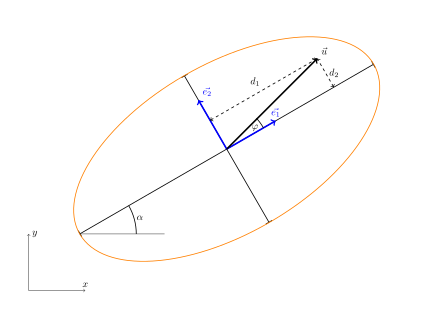

# Akustický tomograf a rovnica elipsy

Predstavte si, že potrebujete posúdiť zdravotný stav starého stromu, ani by ste ho museli 
poraziť alebo doň rezať. Moderné technológie dnes umožňujú takéto posúdenie vykonať šetrne 
a pritom presne – a jedným z kľúčových nástrojov je pritom rovnica elipsy. Pomocou metódy EBSI 
(elliptise-based spatial interpolation) možno z nameraných údajov odhadnúť fyzikálne vlastnosti 
dreva vnútri kmeňa a získať tak predstavu o jeho pevnosti a zdraví. K tomu je však potrebné vedieť 
zaobchádzať s rovnicou elipsy aj vtedy, keď je elipsa vo všeobecnej polohe vzhľadom k osiam. V takom 
prípade využijeme skalárny súčin pre nájdenie projekcie vektora do požadovaného smeru.

## Akustický tomograf

V praxi arboristu, odborníka pre starostlivosť o dreviny mimo lesa, je častou úlohou posúdenie vitality 
a zdravotného stavu stromu. Toto je nutné urobiť s nulovým alebo minimálnym zásahom, ktorý kondíciu 
stromu výrazne neovplyvní. Jednou z veľmi málo invazívnych metód je použitie akustického tomografu. 
Jedná sa o prístroj, ktorý dokáže merať "*dobu letu*" zvukového signálu (anglicky používaný 
termín *time of flight*, TOF) medzi dvoma senzormi. S pomocou metód analytickej geometrie je potom možné 
určiť vzdialenosť medzi senzormi a s využitím predpokladu o šírení zvukových signálov priamymi lúčmi sa 
dá zistiť rýchlosť šírenia zvuku v materiáli. Táto hodnota je veľmi dôležitým indikátorom fyzikálno-mechanických 
vlastností, pretože v zdravom dreve (angl. *sound wood*) sa zvuk šíri rýchlejšie ako v dreve 
degradovanom (angl. *degraded wood*).

## Problematika rekonštrukcie obrazu

Rekonštrukcia obrazu v akustickom tomografe vychádza z predpokladu priameho šírenia lúčov v reze kmeňa.
Nie sú teda brané do úvahy odrazy alebo lom vlnenia. Kvalita tohto predpokladu je
predmetom aktuálneho vedeckého skúmania, avšak predpoklad tohto typu je nutné
pre praktické využitie metódy urobiť.

Pretože sa vychádza z pomerne malého množstva lúčov (akustický tomograf má
typicky 12, najviac 24 senzorov, pre stromy malého priemeru aj menej), je nutné využiť nejakú metódu
interpolácie a spriemerovávania. Týmto sa úloha stáva odlišnou napríklad od tomografov
používaných v zdravotníctve, kde zobrazovacích lúčov je rádovo viac a je tiež
lepšie definovaná geometria merania: zdroje a snímače sú umiestnené napríklad po obvode
kruhu a nie po nepravidelnom obvode kmeňa stromu. Pre odstránenie nedostatkov spojených s použitím akustického tomografu pre stromy bolo vyvinutých
niekoľko techník, ktoré umožňujú interpoláciu a spriemerovávania nameraných hodnôt.

## EBSI metóda a jej nástupcovia

Rad metód rekonštrukcie obrazu v akustickom tomografe vychádza z predpokladu, že rýchlosť šírenia zvuku je ovplyvnená kvalitou
dreva v eliptickom okolí spojnice dvoch senzorov. Tento predpoklad bol otestovaný
na reálnych meraniach 
v Du et al. (2015), kde bol navrhnutý aj vzorec, dávajúci do súvislosti vzdialenosť
senzorov a excentricitu elipsy. Tento prístup zaznamenal lepšie výsledky ako
postupy založené na prostom priesečníku lúčov a spriemerovávaní rýchlostí v týchto
priesečníkoch. Metóda dostala názov Ellipse-based spatial
interpolation a skratku EBSI. 

Praktická implementácia metódy rekonštrukcie obrazu spočíva v tom, že prierez kmeňa
sa rozdelí na jednotlivé bunky, v ktorých sa namerané hodnoty v istom zmysle spriemerujú. 
V EBSI metóde pre každú
bunku určíme rýchlosť ako priemer rýchlostí všetkých lúčov, v ktorých eliptickom
okolí pôsobnosti sa bunka nachádza. 

V ďalších prácach bola metóda EBSI ešte rozšírená
Okolo každého
lúča uvažujeme opäť elipsu definujúcu oblasť pôsobnosti tohto lúča (viz. Obrázok 3).
Údaje sa spracovávajú dvojkolovo metódami RSEN a
SISE (z anglického *ray sementation by elliptical neighborhood* a *spatial
interpolation by segmented ellipse*) popísanými v Du et al (2018). 

Detailný popis metód je možné nájsť v pôvodnej literatúre, avšak aj zo
uvedeného zjednodušeného popisu je zrejmé, že zásadnou dielčou úlohou pri
implementácii obrazovej rekonštrukcie je overenie, či bod v rovine leží vnútri
elipsy či či leží vonku.

## Rovnica elipsy

Z predošlej motivačnej časti vyplýva, že pre praktickú implementáciu rekonštrukcie obrazu pomocou 
EBSI metódy je nutné vedieť efektívne pracovať s elipsou v rôznych polohách, čo zahŕňa 
ľubovoľné pootočenie osí a ľubovoľné posunutie stredu elipsy. Potrebujeme efektívne zisťovať, či nejaký bod
leží vnútri či vonku elipsy.

Elipsa je množina bodov v rovine, pre ktoré platí, že súčet vzdialeností bodu od
dvoch ohnisiek je konštantný. Elipsu je možné určiť pomocou hlavnej a vedľajšej osi.
Uvažujme elipsu s dĺžkou hlavnej poloosy $a$ a dĺžkou vedľajšej poloosy $b$. Rovnica elipsy so
stredom v počiatku sústavy súradníc a hlavnou osou v smere osi $x$ má v tomto prípade tvar
$$
\frac{x^2}{a^2}+\frac{y^2}{b^2}=1.
$$
Body ležiace vnútri elipsy potom spĺňajú nerovnicu
$$
\frac{x^2}{a^2}+\frac{y^2}{b^2}<1.
$$
My však pracujeme s elipsami vo všeobecnej polohe, ich 
rovnice sa síce dajú transformovať do rovnakého 
tvaru, ale to je pomerne pracný a pre naše účely aj 
zbytočný proces. Radšej než pracovať so súradnicami 
budeme využívať vzdialenosti bodu od hlavnej a od
vedľajšej poloosy. Ak má elipsa vyššie uvedenú rovnicu, 
tak tieto vzdialenosti sú priamo $x$-ové a $y$-ové 
súradnice daného bodu. 

Teda ak je $d_1$ vzdialenosť bodu od priamky definovanej 
vedľajšou osou (pre stručnosť vzdialenosť od vedľajšej osi) 
a vzdialenosť bodu od hlavnej osi $d_2$, potom bod leží 
vnútri elipsy práve vtedy, keď platí 
$$
\frac{d_1^2}{a^2}+\frac{d_2^2}{b^2}<1.\tag{1}
$$
Pre overenie či bod leží alebo neleží vnútri elipsy teda 
stačí určiť vzdialenosť bodu od hlavnej a od vedľajšej osi 
a overiť platnosť vyššie uvedenej nerovnice (1). 

## Dĺžka projekcie vektora a skalárny súčin

Obrázok znázorňuje hlavnú a vedľajšiu os elipsy, jednotkové vektory v smere
týchto osí, spojnicu testovaného bodu so stredom elipsy a vyznačenie vzdialeností
bodu od jednotlivých osí elipsy. 

Pre jednoduchost uvažujme, že uhol medzi vektormi $\vec u$ a $\vec e_1$ je ostrý. Z definície skalárneho súčinu a z faktu, že vektor $\vec e_1$ je jednotkovým vektorom vyplýva

$$\vec u\cdot\vec e_1 = |\vec u||\vec e_1|\cos\varphi = |\vec u| \cos\varphi = d_1.$$

Vzdialenosť od vedľajšej osi je teda možné určiť pomocou skalárneho súčinu. Kolmý
priemer vektora do priamky sa nazýva projekcia a z obrázku je zrejmé, že $d_1$ je
vlastne dĺžka projekcie vektora $\vec u$ do smeru určeného vektorom $\vec
e_1$. V prípade, že by uhol medzi vektormi $\vec u$ a $\vec e_1$ bol tupý, vychádza
hodnota $d_1$ záporná, čo sa však v testovacom kritériu (1) neprejaví.

Analogicky, dĺžka projekcie vektora $\vec u$ do smeru definovaného vektorom $\vec
e_2$ je (až na prípadné znamienko, ktoré sa opäť v teste (1) neprejaví) daná vzťahom 

$$d_2=\vec u\cdot \vec e_2.$$

**Poznámka.**
Poznamenajme, že výpočet skalárneho súčinu sa vykonáva pomocou súradníc podľa vzorca

$$\vec u\cdot\vec v = u_1v_1+u_2v_2,$$

kde $\vec u = (u_1, u_2)$ a $\vec v=(v_1,v_2)$. Tento výpočet je možné realizovať v počítačoch veľmi rýchlo a použitím vhodných programovacích techník (vektorizácia) je možné výpočet vykonať súčasne pre tisíce bodov rádovo stokrát rýchlejšie ako použitím cyklu založeného na postupnom testovaní jednotlivých bodov.

**Poznámka.**
Jednotkový vektor $\vec e_1$ v smere hlavnej osi je možné určiť buď ako podiel vektora zo stredu do hlavného vrcholu a dĺžky tohto vektora, alebo pomocou uhla, ktorý zviera hlavná os s osou $x$. Ak je tento uhol $\alpha$, je jednotkový vektor daný vzťahom 

$$\vec e_1=(\cos\alpha, \sin\alpha).$$

Jednotkový vektor v smere vedľajšej osi je na $\vec e_1$ kolmý. Je teda možné brať napríklad 

$$\vec e_2 = (-\sin\alpha, \cos\alpha).$$

## Ukážka použitia

> **Úloha 1.** Elipsa má hlavnú os o dĺžke $a=3$ a vedľajšiu os o dĺžke $b=1{,}5$. Stred elipsy
> je v počiatku a hlavná os zviera s vodorovným smerom uhol $\alpha=30^\circ$.
> Určte, či bod $X=[1{,}6;1{,}6]$ leží vnútri či vonku elipsy. (Použité hodnoty sú
> hodnotami z Obrázku 4. Bod $X$ je koncovým bodom vektora $\vec u$.)

\iffalse

*Riešenie.*
Jednotkový vektor so smerom hlavnej osi je $\vec e_1=(\cos 30^\circ,
\sin 30^\circ)$. Vektor $\vec u$ je daný súradnicami bodu $X$, t. j. $\vec
u=(1{,}6;1{,}6)$. Skalárny súčin je teda 

$$d_1=\vec u\cdot \vec e_1 = 1{,}6\cdot\cos 30^\circ + 1{,}6\cdot\sin 30^\circ\doteq 2{,}186.$$

Podobne, dĺžka projekcie do smeru vedľajšej osi danej vektorom $\vec e_2=(-\sin 30^\circ,\, \cos 30^\circ)$ je

$$d_2=\vec u\cdot \vec e_2 = -1{,}6\cdot\sin 30^\circ + 1{,}6\cdot\cos 30^\circ
\doteq 0{,}586.$$

Platí

$$
\frac{d_1^2}{a^2} + \frac{d_2^2}{b^2} \doteq 0{,}683<1.
$$

Bod teda leží vnútri elipsy. Situácia je na nasledujúcom obrázku. 

\fi

## Záver

V texte boli predstavené základné kroky, na ktorých je založená rekonštrukcia obrazu v akustickom tomografe. Jednou z dielčích úloh je overenie, či skúmaný bod leží vnútri či vonku elipsy, ktorá je vo všeobecnej polohe a je zadaná svojimi poloosami. Pre toto overenie je výhodné použiť rovnicu elipsy založenú nie na súradniciach, ale na vzdialenostiach od hlavnej a vedľajšej osi. Túto vzdialenosť je možné určiť pomocou skalárneho súčinu vektorov. 

## Literatúra a zdroje obrázkov

### Literatúra

1. Du, X., Li, S., Li, G., Feng, H., and Chen, S. (2015). "Stress wave tomography
of wood internal defects using ellipse-based spatial interpolation and velocity
compensation," BioRes. 10(3), 3948-3962. http://doi.org/10.15376/biores.10.3.3948-3962 
2. Du, X.; Li, J.; Feng, H.; Chen, S. Image Reconstruction of Internal Defects
   in Wood Based on Segmented Propagation Rays of Stress Waves. Appl. Sci. 2018,
   8, 1778. https://doi.org/10.3390/app8101778 

### Zdroje obrázkov

1. Projekt DYNATREE – Tree Dynamics: Understanding of Mechanical Response to Loading, <https://starfos.tacr.cz/cs/projekty/LL1909>.
2. Vlastné obrázky
 
