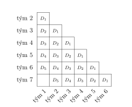

---
keywords:
- kombinatorika
is_finished: True
difficulty: 3
time: 40
---

# Round robin

Představte si, že pořádáte školní turnaj ve stolním 
tenise, šachu, e-sportu nebo třeba futsale. Chcete, 
aby byl co nejspravedlivější – aby každý hráč měl 
možnost utkat se se všemi ostatními. Právě k tomu 
slouží systém každý s každým, známý také jako round 
robin.

Jeho hlavní výhodou je férovost: výsledné pořadí závisí 
jen na výkonech hráčů nebo týmů, ne na náhodném 
losu soupeřů. Na druhou stranu, počet zápasů rychle 
roste s počtem účastníků – naplánovat takový turnaj 
může být docela výzva. A právě zde přichází ke slovu 
kombinatorika – matematika počítání možností.

## Futsalový turnaj

> **Úloha 1.** Na turnaj ve futsalu se přihlásilo 9 
> týmů. Je vedený systémem round robin, tzn. každý tým 
> hraje s každým jeden zápas. Tým za každou výhru v 
> zápase dostává 2 body, za remízu 1 bod a za prohru 0 
> bodů. O celkovém umístění týmu rozhodne závěrečný 
> součet bodů za všechny zápasy
>
> Kolik zápasů je nutné na turnaji odehrát? Kolika 
> způsoby je možné sestavit rozvrh turnaje, je-li k 
> dispozici jediné hřiště, na kterém se zápasy postupně 
> odehrávají?

\iffalse

*Řešení.* Celkový počet odehraných zápasů odpovídá 
počtu všech neuspořádaných dvojic vytvořených z devíti 
týmů. Jinými slovy odpovídá počtu všech dvoučlenných 
kombinací bez opakování vytvořených z devíti prvků. 
Těch je celkem
$$
\binom{9}{2} = 36.
$$
Pro určení počtu způsobů sestavení turnaje hledáme 
vlastně počet všech seřazení 36 zápasů, 
proto je všech možných rozvrhů turnaje celkem
$$
36! =371\,993\,326\,789\,901\,217\,467\,999\,448\,150\,835\,200\,000\,000 \doteq 3{,}72\cdot 10^{41}.
$$
Poznamenejme, že kdybychom shromáždili srovnatelný 
počet zrnek písku, z nichž každé bude mít objem 
řádově $10^{-13}\,\text{m}^3$, celá hromada by měla 
objem v řádech $10^{28}\,\text{m}^3$, což je 
přibližně desetinásobek objemu Slunce. Spíše než o 
hromadu by se proto jednalo o relativně hmotné 
vesmírné těleso.

\fi

> **Úloha 2.** Ukažte, že jestliže některý tým v 
> turnaji z předchozí úlohy získal celkem 13 bodů, pak 
> nutně patří mezi čtyři nejlepší týmy turnaje.

\iffalse

*Řešení.* Úlohu budeme řešit sporem. Připusťme, že by 5 
týmů získalo 13 nebo více bodů. Protože jsou v každém 
zápase mezi dva týmy rozděleny 2 body, je v celém 
turnaji rozděleno celkem $2\cdot 36 = 72$ bodů. Přitom 
je mezi 5 týmů rozděleno alespoň 65 bodů, mezi 
zbývající čtyři týmy tak musí být rozděleno nejvýše 7 
zbylých bodů. 

Ale tyto čtyři týmy navzájem mezi sebou odehrají celkem 
$\binom{4}{2}=6$ zápasů a musí si proto rozdělit celkem 
12 bodů, dohromady by se tedy muselo rozdělit alespoň 
77 bodů, což není možné, dostáváme tedy spor. 

Týmů s 13 nebo více body tak může být nejvýše čtyři.

\fi

## Férovejší soutěž

Na další ročník futsalového turnaje z předchozích úloh 
se tentokrát přihlásilo 7 týmů. Při sestavování rozvrhu 
turnaje si však organizátor dal novou podmínku, že 
žádný tým nesmí hrát ve dvou zápasech těsně za sebou, 
aby hráči nemuseli hrát unavení a turnaj byl férovější. 

Libor vymyslel algoritmus, jak požadovanou posloupnost 
zápasů sestavit. Vychází z následující tabulky.  

Její každé pole v $i$-tém řádku a $j$-tém sloupci 
odpovídá zápasu $(i+1)$-tého a $j$-tého týmu. Hledaná 
posloupnost zápasů bude odpovídat pořadí polí, která 
Libor postupně vybírá. Pro přehlednost budeme tato pole 
značit dle týmů, jejichž zápas reprezentuje, tj. $[1;2]$, 
$[3;5]$ atd. Dále označíme nejdelší diagonálu 
začínající polem $[1;2]$ a končící polem $[6;7]$ jako 
$D_1$, kratší diagonálu začínající polem $[1;3]$ a 
končící polem $[5;7]$ jako $D_2$ apod.

Liborův algoritmus vypadá následovně:
- jako první vybereme pole v prvním sloupci a posledním řádku, tj. $[1;7]$;
- dále vybíráme po řadě pole diagonály $D_1$ v sudých sloupcích zleva doprava;
- dále vybíráme po řadě zbylá pole diagonály $D_1$ v lichých sloupcích zleva doprava;
- dále vybíráme zleva doprava všechna pole diagonály $D_2$;
- dále vybíráme zleva doprava všechna pole diagonály $D_3$, následně $D_4$ atd.

Pro turnaj o sedmi týmech tak dostaneme následující 
pořadí zápasů

$$
[1;7],\quad[2;3],\quad[4;5],\quad[6;7],\quad[1;2],\quad[3;4],\quad[5;6],
$$
$$
[1;3],\quad[2;4],\quad[3;5],\quad[4;6],\quad[5;7],\quad[1;4],\quad[2;5],
$$
$$
[3;6],\quad[4;7],\quad[1;5],\quad[2;6],\quad[3;7],\quad[1;6],\quad[2;7].
$$

> **Úloha 3.** Vypište užitím Liborova algoritmu 
> posloupnost zápasů pro turnaj, kterého se účastní 9 
> týmů a ověřte, že v ní nedojde k výskytu stejného 
> týmu  ve dvou po sobě jdoucích zápasech.

\iffalse

*Řešení.* Užitím algoritmu dostáváme následující posloupnost 36 polí a je zřejmé, že každá dvě po sobě jdoucí pole mají všechny složky různé.
$$
[1;9],\quad [2;3],\quad [4;5],\quad [6;7],\quad [8;9],\quad [1;2],\quad [3;4],\quad [5;6],\quad [7;8],\quad [1;3],\quad [2;4],\quad [3;5],
$$
$$
[4;6],\quad [5;7],\quad [6;8],\quad [7;9],\quad [1;4],\quad [2;5],\quad [3;6],\quad [4;7],\quad [5;8],\quad [6;9],\quad [1;5],\quad [2;6],
$$
$$
[3;7],\quad [4;8],\quad [5;9],\quad [1;6],\quad [2;7],\quad [3;8],\quad [4;9],\quad [1;7],\quad [2;8],\quad [3;9],\quad [1;8],\quad [2;9].
$$

\fi

> **Úloha 4.** Platí Liborův algoritmus obecně pro 
> libovolný počet přihlášených týmů? Pokud ne, tak pro 
> které? A dokážete sestavit pro tyto případy 
> požadovanou posloupnost sami?

\iffalse

*Řešení.* Označme $n$ počet přihlášených týmů (z 
kontextu úlohy je přitom zřejmé, že $n>1$). Z Liborova 
algoritmu odvodíme následující posloupnost polí, kterou 
rozdělíme do několika navazujících sekcí dle jejich 
výskytu v tabulce (u diagonály $D_1$ přitom musíme 
rozlišit mezi paritou $n$):
$$
\begin{alignat*}{2}
&[1;n], &&\quad\text{(1. pole)}\\[3mm]
&[2;3],[4;5],\ldots , [n-1;n], &&\quad\text{(1. část diagonály } D_1\text{, liché } n) \\
&[1;2],[3;4],\ldots , [n-2;n-1], &&\quad\text{(2. část diagonály } D_1\text{, liché } n)\\[3mm]
&[2;3],[4;5],\ldots , [n-2;n-1], &&\quad\text{(1. část diagonály } D_1\text{, sudé } n) \\
&[1;2],[3;4],\ldots , [n-1;n], &&\quad\text{(2. část diagonály } D_1\text{, sudé } n)\\[3mm]
&[1;3],[2;4],\ldots , [n-2;n], &&\quad\text{(diagonála } D_2)\\
&[1;4],[2;5],\ldots , [n-3;n], &&\quad\text{(diagonála } D_3)\\
&\vdots &&\\
&[1;i+1],[2;i+2],\ldots , [n-i;n], &&\quad\text{(diagonála } D_i, \text{ kde } i\leq n-2)\\
&[1;i+2],[2;i+3],\ldots , [n-(i+1);n], &&\quad\text{(diagonála } D_{i+1})\\
&\vdots &&\\
&[1;n-1],[2;n]. &&\quad\text{(diagonála } D_{n-2})
\end{alignat*}
$$

Dvě po sobě jdoucí pole, které patří do stejné sekce, stejné číslo 
obsahovat nemohou. V obou částech diagonály $D_1$ můžeme totiž libovolná 
dvě po sobě jdoucí pole zapsat ve tvaru $[j,j+1]$ a $[j+2,j+3]$ a v 
libovolné diagonále $D_i$ pro $i>1$ mají zase libovolná dvě po sobě 
jdoucí pole tvar $[j,j+i]$ a $[j+1,j+i+1]$. Stačí proto ověřit, za 
jakých podmínek může poslední člen jedné sekce obsahovat stejné číslo 
jako první člen následující sekce. Tyto speciální případy pak posoudíme 
zvlášť.

**1. pole – 1. část diagonály $D_1$.** Pole $[2;3]$ navazuje nezávisle na paritě $n$ na pole $[1;n]$. Požadovaná podmínka různosti všech čtyř složek tak není splněna pro $n=2$ a $n=3$. 

**1. část – 2. část diagonály $D_1$.** Pro lichá $n$ navazuje pole $[1;2]$ na pole $[n-1;n]$, odkud dostáváme již řečené případy $n=2$ a~$n=3$. Pro sudá $n$ na sebe navazují pole $[n-2;n-1]$ a $[1;2]$, zde musíme navíc vyjmout případ $n=4$.  

**2. část diagonály $D_1$ – diagonála $D_2$.** Pro lichá $n$ na sebe navazují pole $[n-2;n-1]$ a $[1;3]$. Podmínka různosti složek tak není splněna pro $n\in\{2;3;4;5\}$. Jestliže je $n$ sudé, navazuje na sebe pole $[n-1;n]$ a pole $[1;3]$. Všechna dosud nevyjmutá čísla $n$ zkoumané podmínce vyhovují.

**Diagonála $D_i$ – diagonála $D_{i+1}$.** Pole $[1;i+2]$ navazuje na pole $[n-i;n]$. Dostáváme tak čtyři možné rovnosti, za kterých nebude daná podmínka splněna: 
$$
n-i = 1, \qquad n-i = i + 2, \qquad n = 1, \qquad n = i+2.
$$ 
Třetí z rovností jistě platit nemůže. První rovnost by znamenala, že 
$i=n-1$, ale $i$ může nabývat nejvýše hodnoty $n-2$. Pokud by platila 
čtvrtá rovnost, $i$ nabývá hodnoty právě $n-2$; diagonála $D_{n-2}$ je 
však poslední sekcí, kterou je posloupnost ukončena, jelikož žádná další
diagonála nenavazuje. Konečně druhou rovnost lze přepsat do tvaru 
$i = \frac{n-2}{2}$. Pokud je $n$ liché, nemůže platit; pro libovolné 
sudé $n$ však existuje dokonce jednoznačné $i$ takové, že platit bude. 
Algoritmus proto selže pro libovolné sudé $n$; např. pro $n=14$ je 
$i=6$, poslední člen diagonály $D_6$ je $[8;14]$ a první člen diagonály 
$D_7$ je $[1;8]$.

Liborův algoritmus tak bez výhrad funguje pro lichá $n$ s výjimkou 3 a 
5. Dodejme však, že zřejmě triviálně funguje také pro $n=2$ (dva týmy 
odehrají jediný zápas celého turnaje). Pro zbylá sudá $n$, $n=3$ a $n=5$ 
bychom se nyní měli pokusit najít požadované posloupnosti jinak. 
Konstatujme však nejdřív, že pro $n=3$ a $n=4$ je to nemožné, protože

* pro $n=3$ musíme seřadit tři pole $[1;2]$, $[1;3]$, $[2;3]$, ale každé 
takové seřazení nesplňuje zadanou podmínku;
* pro $n=4$ zvolíme bez újmy na obecnosti první pole $[1;2]$, následovat 
nutně musí pole $[3;4]$ a dále pak opět $[1;2]$, což není možné.

Pro ostatní $n$ již najít posloupnosti požadovaných vlastností umíme. 
Protože je jich (a algoritmů, kterými je můžeme nalézt) více, udejme 
alespoň některé příklady, které dostaneme úpravou původního Liborova 
algoritmu. Pro $n=5$ jej modifikujeme následovně:

* jako první vybereme pole v prvním sloupci a posledním řádku, tj. $[1;5]$;
* dále vybíráme po řadě pole diagonály $D_1$ v sudých sloupcích zleva doprava;
* dále vybíráme po řadě zbylá pole diagonály $D_1$ v lichých sloupcích zleva doprava;
* dále vybíráme zprava doleva všechna pole diagonály $D_3$;
* dále vybíráme zprava doleva všechna pole diagonály $D_2$.

Výsledná posloupnost je tvaru
$$
[1;5],\quad [2;3],\quad [4;5],\quad [1;2],\quad [3;4],\quad [2;5],\quad [1;4],\quad [3;5],\quad [2;4],\quad [1,3].
$$

Pro sudá $n$ různá od 2 a 4 spočítáme číslo $k=\frac{n-2}{2}$. (Právě 
toto číslo totiž bylo v diskuzi obecného případu "problematické".) 
Následovně aplikujeme Liborův algoritmus s tím rozdílem, že při výběru 
polí zaměníme pořadí diagonál $D_{k+1}$ a $D_{k+2}$. S ohledem na to, že 
je zbytek algoritmu stejný, zkontrolujme pouze rozdílná napojení 
dotčených sekcí.

**Diagonála $D_k$ – diagonála $D_{k+2}$.** Na pole $[n-k;n]$ navazuje 
pole $[1;k+3]$. Dosazením za $k$, úpravou a porovnáním možných shodných 
složek dostáváme čtyři rovnosti
$$
\frac{n+2}{2} = 1, \qquad \frac{n+2}{2} = \frac{n+4}{2}, \qquad n = 1, \qquad n = \frac{n+4}{2}.
$$
Druhá a třetí z rovností platit nemůže a první (resp. čtvrtá) rovnost je 
splněna právě tehdy, když $n=0$ (resp. $n=4$), což také neplatí.

**Diagonála $D_{k+2}$ – diagonála $D_{k+1}$.** Na pole $[n-(k+2);n]$ 
navazuje pole $[1;k+2]$. Dosazením a úpravou odvodíme opět čtyři 
rovnosti, jejichž platnost by porušila zadanou podmínku:
$$
\frac{n-2}{2} = 1, \qquad \frac{n-2}{2} = \frac{n+2}{2}, \qquad n = 1, \qquad n = \frac{n+2}{2}.
$$
Žádná z uvedených rovností však platit nemůže, protože $n$ nemůže být 4, 
1 ani 2.

**Diagonála $D_{k+1}$ – diagonála $D_{k+3}$.** Na pole $[n-(k+1);n]$ 
navazuje pole $[1;k+4]$. Obdobně jako v předchozích dvou případech 
můžeme odvodit čtveřici rovností
$$
\frac{n}{2} = 1, \qquad \frac{n}{2} = \frac{n+6}{2}, \qquad n = 1, \qquad n = \frac{n+6}{2}.
$$
První tři z uvedených rovností platit nemohou již z dříve uvedených 
důvodů. Čtvrtá rovnost platí pro $n=6$; pro toto číslo však neexistuje 
diagonála $D_{k+3}$, neboť $k+3 = \frac{6-2}{2} + 3 = 5$. (Připomeňme, 
že pro $n=6$ jsou definovány pouze diagonály $D_1$–$D_4$.) Algoritmus 
pro $n=6$ tak končí výběrem členů diagonály $D_{k+1}=D_3$.

Upravený algoritmus tak pro sudá $n$ různá od 2 a 4 sestrojí požadovanou 
posloupnost polí. Jediná přirozená $n>1$, pro která žádná posloupnost 
zadaných vlastností neexistuje, jsou proto 3 a 4.

\fi
