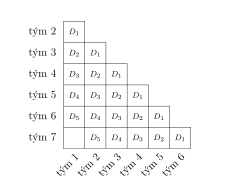

---
keywords:
- kombinatoryka, prawdopodobieństwo, statystyka
- kombinatoryka
is_finished: true
---

# Round Robin: sprawiedliwy system turniejowy

Wyobraź sobie, że organizujesz szkolny turniej tenisa stołowego, szachów, e-sportu lub futsalu. Chcesz, aby był on jak najbardziej sprawiedliwy - tak, aby każdy gracz miał szansę zmierzyć się ze wszystkimi innymi. Do tego właśnie służy system round robin.

Jego główną zaletą jest uczciwość: końcowy ranking zależy wyłącznie od wyników graczy lub drużyn, a nie od losowania przeciwników. Z drugiej strony, liczba meczów szybko rośnie wraz z liczbą uczestników - zaplanowanie takiego turnieju może być sporym wyzwaniem. I tu do gry wkracza kombinatoryka - matematyka liczenia możliwości.

## Turniej Futsalu

> **Zadanie 1.** Dziewięć drużyn zarejestrowało się do turnieju futsalowego. Będzie on rozgrywany w formacie round robin, co oznacza, że każda drużyna rozegra jeden mecz z każdą inną. Za każde zwycięstwo drużyna otrzymuje 2 punkty, za remis 1 punkt, a za porażkę 0 punktów. Ostateczny ranking jest ustalany na podstawie łącznej liczby punktów zdobytych we wszystkich meczach.
>
> Ile meczów należy rozegrać w turnieju?
Na ile różnych sposobów można ułożyć harmonogram turnieju, zakładając, że dostępne jest tylko jedno boisko, a mecze są rozgrywane jeden po drugim?

\iffalse

*Rozwiązanie.* Całkowita liczba rozegranych meczów odpowiada liczbie wszystkich nieuporządkowanych par, które można utworzyć z dziewięciu drużyn. Innymi słowy, jest to liczba dwuelementowych kombinacji bez powtórzeń ze zbioru dziewięciu elementów. Daje to łączną liczbę
$$
\binom{9}{2} = 36.
$$
Aby określić liczbę możliwych harmonogramów turnieju, zasadniczo liczymy wszystkie różne kolejności 36 meczów. Dlatego całkowita liczba możliwych harmonogramów meczów wynosi
$$
36! =371{\,}993{\,}326{\,}789{\,}901{\,}217{\,}467{\,}999{\,}448{\,}150{\,}835{\,}200{\,}000{\,}000 \doteq 3{,}72\cdot 10^{41}.
$$
Zauważmy, że gdybyśmy zebrali porównywalną liczbę ziaren piasku, z których każde miałoby objętość około $10^{-13}\,\text{m}^3$, cała kupka miałaby objętość rzędu $10^{28}\,\text{m}^3$, czyli mniej więcej dziesięciokrotnie większą niż objętość Słońca. Zamiast stosu byłoby to stosunkowo masywne ciało niebieskie.

\fi

> **Zadanie 2.** Wykaż, że jeśli jakakolwiek drużyna w turnieju opisanym w poprzednim problemie zdobyła łącznie 13 punktów, to musi być wśród czterech najlepszych drużyn w turnieju.

\iffalse

*Rozwiązanie.* Użyjemy dowodu przez zaprzeczenie. Załóżmy, że pięć drużyn zdobyło po 13 lub więcej punktów. Ponieważ w każdym meczu obie drużyny rozdzielają po 2 punkty, łączna liczba punktów rozdzielonych w całym turnieju wynosi $2\cdot 36 = 72$. Wśród pięciu drużyn musiało zostać rozdzielonych co najmniej $5\cdot 13 = 65$ punktów. Pozostaje więc co najwyżej 7 punktów dla pozostałych czterech drużyn.

Jednak te cztery drużyny grają między sobą mecze $\binom{4}{2}=6$, a zatem muszą podzielić między siebie 12 punktów. Łączna liczba punktów musiałaby więc wynosić co najmniej 77, co jest niemożliwe. Doszliśmy do sprzeczności.

Dlatego mogą być co najwyżej cztery drużyny z 13 lub więcej punktami.

\fi

## Bardziej sprawiedliwy turniej

Tym razem do kolejnej edycji futsalowego turnieju opisywanego w poprzednich problemach zgłosiło się siedem drużyn. Przygotowując harmonogram turnieju, organizator wprowadził nowy warunek: żadna drużyna nie może zagrać w dwóch meczach back-to-back. W ten sposób zawodnicy unikają gry na zmęczeniu, a turniej staje się bardziej sprawiedliwy.

Libor wymyślił algorytm generowania sekwencji dopasowań, które spełniają ten wymóg. Jego pomysł opiera się na poniższej tabeli:

Każda komórka w $i$-tym wierszu i $j$-tej kolumnie odpowiada meczowi pomiędzy drużyną $(i+1)$ i drużyną $j$.
Pożądana sekwencja dopasowania będzie zgodna z kolejnością, w jakiej Libor wybiera te komórki.
Dla przejrzystości będziemy oznaczać komórki zgodnie z drużynami zaangażowanymi w każdy mecz, takimi jak $[1;2]$, $[3;5]$ i tak dalej. 
Następnie zdefiniujemy najdłuższą przekątną zaczynającą się w $[1;2]$ i kończącą się w $[6;7]$ jako $D_1$, krótszą przekątną zaczynającą się w $[1;3]$ i kończącą się w $[5;7]$ jako $D_2$ i tak dalej.

Algorytm Libor działa w następujący sposób:
- Najpierw wybieramy komórkę w pierwszej kolumnie i ostatnim wierszu, czyli $[1;7]$;
- Następnie przechodzimy przez wszystkie komórki przekątnej $D_1$, które leżą w parzystych kolumnach, od lewej do prawej;
- Następnie przejdź przez pozostałe komórki przekątnej $D_1$, które leżą w kolumnach nieparzystych, ponownie od lewej do prawej;
- Następnie przejść przez wszystkie komórki przekątnej $D_2$ od lewej do prawej;
- Następnie zrób to samo dla przekątnej $D_3$, potem $D_4$ i tak dalej.

W przypadku turnieju z siedmioma drużynami daje to następującą sekwencję meczów:

$$
[1;7],\quad[2;3],\quad[4;5],\quad[6;7],\quad[1;2],\quad[3;4],\quad[5;6],
$$
$$
[1;3],\quad[2;4],\quad[3;5],\quad[4;6],\quad[5;7],\quad[1;4],\quad[2;5],
$$
$$
[3;6],\quad[4;7],\quad[1;5],\quad[2;6],\quad[3;7],\quad[1;6],\quad[2;7].
$$

> **Zadanie 3.** Korzystając z algorytmu Libora, wypisz sekwencję meczów dla turnieju z 9 drużynami i sprawdź, czy żadna drużyna nie występuje w dwóch kolejnych meczach.

\iffalse

*Rozwiązanie.* Korzystając z algorytmu, otrzymujemy następującą sekwencję 36 meczów. Oczywiste jest, że żadne dwa kolejne mecze nie mają wspólnej drużyny - wszystkie numery drużyn w sąsiednich parach są różne.

$$
[1;9],\quad [2;3],\quad [4;5],\quad [6;7],\quad [8;9],\quad [1;2],\quad [3;4],\quad [5;6],\quad [7;8],\quad [1;3],\quad [2;4],\quad [3;5],
$$
$$
[4;6],\quad [5;7],\quad [6;8],\quad [7;9],\quad [1;4],\quad [2;5],\quad [3;6],\quad [4;7],\quad [5;8],\quad [6;9],\quad [1;5],\quad [2;6],
$$
$$
[3;7],\quad [4;8],\quad [5;9],\quad [1;6],\quad [2;7],\quad [3;8],\quad [4;9],\quad [1;7],\quad [2;8],\quad [3;9],\quad [1;8],\quad [2;9].
$$

\fi

> **Zadanie 4.** Czy algorytm Libora działa dla dowolnej liczby uczestniczących zespołów? Jeśli nie, to dla jakich wartości $n$ działa? I czy możesz skonstruować wymaganą sekwencję dla tych przypadków?

\iffalse

*Rozwiązanie.* Niech $n$ będzie liczbą uczestniczących drużyn (z kontekstu problemu wynika, że $n > 1$). Z algorytmu Libora wyprowadzamy następującą sekwencję komórek, podzieloną na kilka kolejnych sekcji w oparciu o ich pozycje w tabeli. Dla przekątnej $D_1$, musimy rozróżnić parzyste i nieparzyste $n$:

$$
\begin{alignat*}{2}
&[1;n], &&\quad\text{(1. komórka)}\\[3mm]
&[2;3],[4;5],\ldots , [n-1;n], &&\quad\text{(1. część przekątnej } D_1\text{, nieparzyste } n) \\
&[1;2],[3;4],\ldots , [n-2;n-1], &&\quad\text{(2. część przekątnej } D_1\text{, nieparzyste } n)\\[3mm]
&[2;3],[4;5],\ldots , [n-2;n-1], &&\quad\text{(1. część przekątnej } D_1\text{, parzyste } n) \\
&[1;2],[3;4],\ldots , [n-1;n], &&\quad\text{(2. część przekątnej } D_1\text{, parzyste } n)\\[3mm]
&[1;3],[2;4],\ldots , [n-2;n], &&\quad\text{(przekątna } D_2)\\
&[1;4],[2;5],\ldots , [n-3;n], &&\quad\text{(przekątna } D_3)\\
&\vdots &&\\
&[1;i+1],[2;i+2],\ldots , [n-i;n], &&\quad\text{(przekątna } D_i, \text{ gdzie
 } i\leq n-2)\\
&[1;i+2],[2;i+3],\ldots , [n-(i+1);n], &&\quad\text{(przekątna } D_{i+1})\\
&\vdots &&\\
&[1;n-1],[2;n]. &&\quad\text{(przekątna } D_{n-2})
\end{alignat*}
$$

Dwie kolejne komórki należące do tej samej sekcji nie mogą zawierać tej samej liczby.
W obu częściach przekątnej $D_1$ dowolne dwie kolejne komórki można zapisać w postaci $[j,j+1]$ i $[j+2,j+3]$,
a w dowolnej przekątnej $D_i$ dla $i > 1$ dowolne dwie kolejne komórki mają postać $[j,j+i]$ i $[j+1,j+i+1]$.
Wystarczy zatem sprawdzić, w jakich warunkach ostatnia komórka jednej sekcji może dzielić liczbę z pierwszą komórką kolejnej sekcji. Te szczególne przypadki muszą być następnie rozpatrywane indywidualnie.

**1. komórka - 1. część przekątnej $D_1$.** Komórka $[2;3]$ następuje bezpośrednio po $[1;n]$ niezależnie od tego, czy $n$ jest parzyste czy nieparzyste. Wymagany warunek, aby wszystkie cztery liczby (z dwóch kolejnych komórek) były różne, nie jest zatem spełniony dla $n=2$ i $n=3$.

**1. część - 2. część przekątnej $D_1$.** Dla nieparzystych $n$, komórka $[1;2]$ następuje po $[n-1;n]$, co ponownie prowadzi do wspomnianych już przypadków $n=2$ i $n=3$. Dla parzystych $n$, przejście następuje z $[n-2;n-1]$ do $[1;2]$, co również nie spełnia warunku, gdy $n = 4$.

**Druga część przekątnej $D_1$ – $D_2$.** Dla nieparzystych $n$ przejście następuje z $[n-2;n-1]$ do $[1;3]$. Warunek rozłączności wszystkich składowych jest naruszony dla $n\in\{2;3;4;5\}$. Jeśli $n$ jest parzyste, przejście następuje z $[n-1;n]$ do $[1;3]$. Wszystkie niewykluczone do tej pory wartości $n$ spełniają wymagany warunek.

**Przekątna $D_i$ – przekątna $D_{i+1}$.** Komórka $[1;i+2]$ następuje po komórce $[n-i;n]$. Daje to cztery możliwe równości, w których wymagany warunek odrębności wszystkich składników jest naruszony:
$$
n-i = 1, \qquad n-i = i + 2, \qquad n = 1, \qquad n = i+2.
$$ 
Trzecia równość jest oczywiście niemożliwa. 
Pierwsza równość implikowałaby $i=n-1$, ale $i$ może przyjąć co najwyżej wartość $n-2$.
Jeśli zachodzi czwarta równość, to $i = n-2$; jednak przekątna $D_{n-2}$ jest ostatnią sekcją, a sekwencja kończy się na niej - nie ma następnej przekątnej.
Wreszcie, drugą równość można przepisać jako $i = \frac{n-2}{2}$. 
Jeśli $n$ jest nieparzyste, to równość ta nie może zachodzić. Ale dla każdego parzystego $n$ istnieje unikalna wartość $i$, która ją spełnia.
Dlatego algorytm zawodzi dla każdej parzystej wartości $n$; na przykład dla $n = 14$, mamy $i = 6$, ostatnim elementem przekątnej $D_6$ jest $[8;14]$, a pierwszym elementem przekątnej $D_7$ jest $[1;8]$.

Podsumowując, algorytm Libora działa bez żadnych problemów dla nieparzystych wartości $n$, z wyjątkiem $n = 3$ i $n = 5$. Trywialnie działa on również dla $n = 2$, ponieważ dwie drużyny rozgrywają tylko jeden mecz. 
Dla pozostałych wartości - parzystych $n$ oraz przypadków $n = 3$ i $n = 5$ - musimy teraz spróbować skonstruować wymagane sekwencje w inny sposób.
Zauważmy najpierw, że dla $n = 3$ i $n = 4$ jest to niemożliwe:

* Dla $n = 3$, musimy uporządkować trzy dopasowania $[1;2]$, $[1;3]$, $[2;3]$, ale każde takie uporządkowanie narusza warunek.
* Dla $n = 4$, możemy, bez utraty ogólności, wybrać pierwsze dopasowanie jako $[1;2]$. Kolejnym dopasowaniem musi być $[3;4]$, a następnie ponownie $[1;2]$, co jest niedozwolone.

Dla wszystkich innych wartości $n$ jesteśmy w stanie skonstruować sekwencje o pożądanych właściwościach. 
Ponieważ istnieje wiele takich sekwencji (i wiele algorytmów do ich generowania), podajmy przynajmniej kilka przykładów uzyskanych poprzez modyfikację oryginalnego algorytmu Libor. Dla $n = 5$, modyfikujemy algorytm w następujący sposób:

* Najpierw wybierz komórkę w pierwszej kolumnie i ostatnim wierszu, czyli $[1;5]$;
* Następnie przejdź przez wszystkie komórki przekątnej $D_1$ w parzystych kolumnach od lewej do prawej;
* Następnie przejdź przez pozostałe komórki przekątnej $D_1$ w nieparzystych kolumnach od lewej do prawej;
* Następnie przejdź przez wszystkie komórki przekątnej $D_3$ od prawej do lewej;
* Na koniec przejdź przez wszystkie komórki przekątnej $D_2$ od prawej do lewej.
Wynikowa sekwencja to:
$$
[1;5],\quad [2;3],\quad [4;5],\quad [1;2],\quad [3;4],\quad [2;5],\quad [1;4],\quad [3;5],\quad [2;4],\quad [1;3].
$$

Dla parzystych $n$ innych niż 2 i 4 obliczamy liczbę $k=\frac{n-2}{2}$. (Liczba ta była źródłem problemów w powyższej dyskusji przypadków ogólnych).
Następnie stosujemy algorytm Libora z jedną kluczową modyfikacją: zamieniamy kolejność przekątnych $D_{k+1}$ i $D_{k+2}$ przy wyborze ich komórek.
Ponieważ reszta algorytmu pozostaje niezmieniona, wystarczy sprawdzić tylko przejścia między tymi konkretnymi przekątnymi.

**Przekątna $D_k$ – przekątna $D_{k+2}$.** Po komórce $[n-k;n]$ następuje komórka $[1;k+3]$.
Podstawiając za $k$, upraszczając i sprawdzając możliwe powtórzenia otrzymujemy następujące cztery równości:
$$
\frac{n+2}{2} = 1, \qquad \frac{n+2}{2} = \frac{n+4}{2}, \qquad n = 1, \qquad n = \frac{n+4}{2}.
$$

Druga i trzecia równość nie mogą być spełnione. Pierwsza (i równoważnie czwarta) jest spełniona tylko wtedy, gdy $n = 0$ (lub $n = 4$), co jest nieprawidłowe w naszym kontekście.

**Przekątna $D_{k+2}$ – przekątna $D_{k+1}$.** Po komórce $[n-(k+2);n]$ 
następuje komórka $[1;k+2]$. Ponownie wyprowadzamy cztery równości, które naruszałyby warunek, gdyby był prawdziwy:
$$
\frac{n-2}{2} = 1, \qquad \frac{n-2}{2} = \frac{n+2}{2}, \qquad n = 1, \qquad n = \frac{n+2}{2}.
$$
Żadna z tych równości nie może zachodzić, ponieważ $n$ nie może być równe 4, 1 lub 2.

**Przekątna $D_{k+1}$ – przekątna $D_{k+3}$.** Po komórce $[n-(k+1);n]$ 
następuje komórka $[1;k+4]$. Tak jak poprzednio, otrzymujemy następujące cztery równości:
$$
\frac{n}{2} = 1, \qquad \frac{n}{2} = \frac{n+6}{2}, \qquad n = 1, \qquad n = \frac{n+6}{2}.
$$
Pierwsze trzy równości są już wykluczone na podstawie wcześniejszych argumentów. 
Czwarta równość zachodzi, gdy $n = 6$; jednak dla tej wartości przekątna $D_{k+3}$ nie istnieje, ponieważ $k+3 = \frac{6-2}{2} + 3 = 5$. (Przypomnijmy, że dla $n = 6$ zdefiniowane są tylko przekątne od $D_1$ do $D_4$.) Zatem dla $n = 6$ algorytm kończy się po wybraniu elementów przekątnej $D_{k+1} = D_3$.

Zmodyfikowany algorytm z powodzeniem konstruuje zatem ciąg o pożądanych własnościach dla wszystkich parzystych wartości $n$ z wyjątkiem $n = 2$ i $n = 4$. Jedynymi liczbami naturalnymi $n > 1$, dla których taki ciąg nie istnieje, są $n = 3$ i $n = 4$.

\fi
