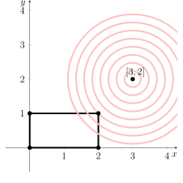
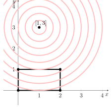

---
keywords:
- analytic geometry
- quadratic equation
- systems of equations
- equation of a circle
is_finished: true
---

# Yield Optimization

When making investment decisions, it is not enough to rely on simple linear models — the market is dynamic and full of uncertainty. 
Building an optimal investment portfolio therefore requires an approach that takes into account not only the expected return, but also the risk and other constraints, such as available financial resources or diversification requirements.
The returns of individual assets cannot be determined precisely in advance — their behavior is influenced by many factors, which is why models based on quadratic functions are needed.
This approach — now known as modern portfolio theory — laid the foundation for a new perspective on investing. For their fundamental contributions to this field, Harry Markowitz, William Sharpe, and Merton Miller were awarded the Nobel Prize in 1990.

These problems thus lead to so-called quadratic programming tasks, a branch of mathematical optimization that focuses on finding extrema (typically minima or maxima) of a quadratic function over a set of points defined by linear equations and inequalities.

## The Influencer's Path to Success

An aspiring influencer hopes to grow their follower count on Instagram and TikTok through post promotion and paid advertising. 
According to available data, investing 10,000 CZK in Instagram promotion is expected to gain 1,000 new followers, and the same investment in TikTok ads is expected to bring in 1,000 new followers on that platform.
Thanks to a special offer, the influencer can spend at most 20,000 CZK on Instagram promotion and 10,000 CZK on TikTok advertising.

> **Exercise 1.** How much should the influencer spend on promotion and advertising on each social media platform in order to come as close as possible to gaining 3,000 followers on Instagram and 2,000 followers on TikTok?

\iffalse

*Solution.* Let $x$ represent the amount invested in Instagram promotion in tens of thousands of CZK, and let $y$ represent the investment in TikTok advertising. Then the optimal value of the total cost must satisfy the constraints

$$
0\leq x \leq 2 \qquad\text{and}\qquad 0\leq y\leq 1,
$$

i.e. the solution lies within a rectangle. On the same coordinate system, we can also plot the point that represents the target number of followers. If $x$ denotes the number of Instagram followers in thousands and $y$ the number of TikTok followers in thousands, then this target point has coordinates $[3,2]$.

We are looking for a point inside the given rectangle that is as close as possible to the point $[3,2]$.

The distance of any point $[x,y]$ from the point $[3,2]$ is given by the formula

$$
v(x,y)=\sqrt{(x-3)^2+(y-2)^2}.
$$

Since the square root is an increasing function, i.e. if $0\leq a<b$ then necessarily $\sqrt{a}<\sqrt{b}$, minimizing $\sqrt{(x-3)^2+(y-2)^2}$ is equivalent to minimizing $(x-3)^2+(y-2)^2$.

For any $c > 0$, the equation 
$$
  (x-3)^2+(y-2)^2=c
$$
represents a circle centered at the point $[3,2]$ with radius $\sqrt{c}$. Our task is to find the circle with the smallest possible radius that still intersects the given rectangle. The situation is illustrated in the following figure, which gives us a hint at the solution.

From the figure, we can see that the solution appears to be the point $[2,1]$. But is this really correct? The image shows that the resulting circle touches the rectangle exactly at its top right corner. This means that the intersection of the circle with the line forming the top edge of the rectangle must be the same as its intersection with the line forming the right edge. In other words, the following systems of equations must have at least one solution in common:

$$
\begin{align*}
(x-3)^2+(y-2)^2&=c\\  
y&=1
\end{align*}
$$
and
$$
\begin{align*}
  (x-3)^2+(y-2)^2&=c\\ 
  x&=2
\end{align*}
$$

We cannot solve each system separately, because that would result in a quadratic equation with two unknowns. However, by substituting $x=2$ and $y=1$, we obtain the following pair of equations:

$$
\begin{align*}
  (x-3)^2+1&=c\\ 
  1+(y-2)^2&=c,
\end{align*}
$$
which implies that 
$$
  (x-3)^2+1=1+(y-2)^2
$$
or
$$
  (x-3)^2=(y-2)^2,
$$
which gives, after taking the square root,
$$
|x-3|=|y-2|.
$$
This equation is clearly satisfied for the point $[2,1]$. We can therefore conclude that the influencer will come closest to their goal by investing the maximum amount 20,000 CZK for Instagram promotion and 10,000 CZK for TikTok advertising.

\fi

> **Exercise 2.** How does the solution to Exercise 1 change if the target is 1,000 followers on Instagram and 3,000 on TikTok?

\iffalse

*Solution.* In this case, we are minimizing the distance from the point $[1,3]$. The situation is illustrated below.

The solution will lie on the line $y=1$, which leads us to the system

$$
\begin{align*}
(x-1)^2+(y-3)^2&=c\\ 
y&=1.
\end{align*}
$$

This is a system consisting of one quadratic and one linear equation in three variables, which we can easily reduce to a quadratic equation in two variables:

$$
(x-1)^2+4=c.
$$

From the figure above, we can see that the desired circle with the smallest possible radius only touches the rectangle. 
That means the number $c$ must be such that the quadratic equation has only one solution (if it has none, the radius is too small and the circle does not intersect the rectangle; if it has two distinct solutions, then there must exist a circle with a slightly smaller radius that still intersects the rectangle). The solution to the quadratic equation is

$$
x_{1,2}=\pm\sqrt{c-4}+1.
$$

There will be exactly one solution (i.e., both solutions coincide) only if $c = 4$. In that case, $x = 1$, meaning the solution is the point $[1,1]$. This time, the influencer only needs to spend 10,000 CZK on Instagram promotion and 10,000 CZK on TikTok advertising.

\fi
