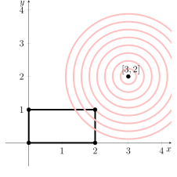

---
keywords:
- równanie kwadratowe
- układy równań
- równanie okręgu
is_finished: True
---

# Optymalizacja wydajności

Przy podejmowaniu decyzji inwestycyjnych nie wystarczy polegać na prostych modelach liniowych - rynek jest dynamiczny i pełen niepewności. 
Zbudowanie optymalnego portfela inwestycyjnego wymaga zatem podejścia uwzględniającego nie tylko oczekiwaną stopę zwrotu, ale także ryzyko i inne ograniczenia, takie jak dostępne zasoby finansowe czy wymagania dotyczące dywersyfikacji.
Zwrotów z poszczególnych aktywów nie da się z góry precyzyjnie określić - na ich zachowanie wpływa wiele czynników, dlatego potrzebne są modele oparte na funkcjach kwadratowych.
Podejście to - znane obecnie jako nowoczesna teoria portfelowa - położyło podwaliny pod nowe spojrzenie na inwestowanie. Za swój fundamentalny wkład w tę dziedzinę Harry Markowitz, William Sharpe i Merton Miller otrzymali w 1990 roku Nagrodę Nobla.

Problemy te prowadzą zatem do tak zwanych zadań programowania kwadratowego, gałęzi optymalizacji matematycznej, która koncentruje się na znajdowaniu ekstremów (zazwyczaj minimów lub maksimów) funkcji kwadratowej w zbiorze punktów zdefiniowanych przez równania i nierówności liniowe.

## Droga influencera do sukcesu

Aspirujący influencer ma nadzieję na zwiększenie liczby obserwujących na Instagramie i TikTok poprzez promocję postów i płatne reklamy. 
Według dostępnych danych, inwestując 10 000 CZK w promocję na Instagramie, można zyskać 1000 nowych obserwujących, a ta sama inwestycja w reklamy na TikTok ma przynieść 1000 nowych obserwujących na tej platformie.
Dzięki specjalnej ofercie influencer może wydać maksymalnie 20 000 CZK na promocję na Instagramie i 10 000 CZK na reklamę na TikTok.

> **Zadanie 1.** Ile influencer powinien wydać na promocję i reklamę na każdej platformie mediów społecznościowych, aby zbliżyć się jak najbardziej do zdobycia 3000 obserwujących na Instagramie i 2000 obserwujących na TikTok?

\iffalse

*Rozwiązanie.* Niech $x$ reprezentuje kwotę zainwestowaną w promocję na Instagramie w dziesiątkach tysięcy CZK, a $y$ reprezentuje inwestycję w reklamę na TikTok. Wówczas optymalna wartość kosztu całkowitego musi spełniać następujące warunki

$$
0\leq x \leq 2 \qquad\text{and}\qquad 0\leq y\leq 1,
$$

tzn. rozwiązanie leży wewnątrz prostokąta. Na tym samym układzie współrzędnych możemy również wykreślić punkt reprezentujący docelową liczbę obserwujących. Jeśli $x$ oznacza liczbę obserwujących na Instagramie w tysiącach, a $y$ liczbę obserwujących na TikTok w tysiącach, to punkt docelowy ma współrzędne $[3,2]$.

Szukamy punktu wewnątrz danego prostokąta, który jest jak najbliżej punktu $[3,2]$.

Odległość dowolnego punktu $[x,y]$ od punktu $[3,2]$ jest określona wzorem

$$
v(x,y)=\sqrt{(x-3)^2+(y-2)^2}.
$$

Ponieważ pierwiastek kwadratowy jest funkcją rosnącą, tzn. jeśli $0\leq a<b$ to koniecznie $\sqrt{a}<\sqrt{b}$, minimalizacja $\sqrt{(x-3)^2+(y-2)^2}$ jest równoważna minimalizacji $(x-3)^2+(y-2)^2$.

Dla dowolnego $c > 0$, równanie
$$
  (x-3)^2+(y-2)^2=c
$$
reprezentuje okrąg o środku w punkcie $[3,2]$ i promieniu $\sqrt{c}$. Naszym zadaniem jest znalezienie okręgu o najmniejszym możliwym promieniu, który nadal przecina dany prostokąt. Sytuację ilustruje poniższy rysunek, który daje nam wskazówkę co do rozwiązania.

Z rysunku wynika, że rozwiązaniem jest punkt $[2,1]$. Ale czy tak jest naprawdę? Rysunek pokazuje, że wynikowy okrąg dotyka prostokąta dokładnie w jego prawym górnym rogu. Oznacza to, że punkt przecięcia okręgu z linią tworzącą górną krawędź prostokąta musi być taki sam, jak punkt przecięcia okręgu z linią tworzącą prawą krawędź prostokąta. Innymi słowy, poniższe układy równań muszą mieć co najmniej jedno wspólne rozwiązanie:

$$
\begin{align*}
(x-3)^2+(y-2)^2&=c\\  
y&=1
\end{align*}
$$
i
$$
\begin{align*}
  (x-3)^2+(y-2)^2&=c\\ 
  x&=2
\end{align*}
$$

Nie możemy rozwiązać każdego układu osobno, ponieważ spowodowałoby to powstanie równania kwadratowego z dwiema niewiadomymi. Jednak podstawiając $x=2$ i $y=1$, otrzymujemy następującą parę równań:

$$
\begin{align*}
  (x-3)^2+1&=c\\ 
  1+(y-2)^2&=c,
\end{align*}
$$
co oznacza, że
$$
  (x-3)^2+1=1+(y-2)^2
$$
lub
$$
  (x-3)^2=(y-2)^2,
$$
co daje, po wzięciu pierwiastka kwadratowego,
$$
|x-3|=|y-2|.
$$
Równanie to jest wyraźnie spełnione dla punktu $[2,1]$. Możemy zatem stwierdzić, że influencer będzie najbliżej swojego celu, inwestując maksymalną kwotę 20 000 CZK w promocję na Instagramie i 10 000 CZK w reklamę na TikTok.

\fi

> **Zadanie 2.** Jak zmienia się rozwiązanie zadania 1, jeśli celem jest 1000 obserwujących na Instagramie i 3000 na TikTok?

\iffalse

*Rozwiązanie.* W tym przypadku minimalizujemy odległość od punktu $[1,3]$. Sytuacja została zilustrowana poniżej.

Rozwiązanie będzie leżało na linii $y=1$, co prowadzi nas do układu

$$
\begin{align*}
(x-1)^2+(y-3)^2&=c\\ 
y&=1.
\end{align*}
$$

Jest to układ składający się z jednego równania kwadratowego i jednego równania liniowego w trzech zmiennych, który możemy łatwo zredukować do równania kwadratowego w dwóch zmiennych:

$$
(x-1)^2+4=c.
$$

Z powyższego rysunku widzimy, że pożądany okrąg o najmniejszym możliwym promieniu tylko dotyka prostokąta. 
Oznacza to, że liczba $c$ musi być taka, aby równanie kwadratowe miało tylko jedno rozwiązanie (jeśli nie ma żadnego, promień jest zbyt mały i okrąg nie przecina prostokąta; jeśli ma dwa różne rozwiązania, musi istnieć okrąg o nieco mniejszym promieniu, który nadal przecina prostokąt). Rozwiązaniem równania kwadratowego jest

$$
x_{1,2}=\pm\sqrt{c-4}+1.
$$

Rozwiązanie będzie dokładnie jedno (tzn. oba rozwiązania będą zbieżne) tylko wtedy, gdy $c = 4$. W takim przypadku $x = 1$, co oznacza, że rozwiązaniem jest punkt $[1,1]$. Tym razem influencer musi wydać tylko 10 000 CZK na promocję na Instagramie i 10 000 CZK na reklamę na TikTok.

\fi
