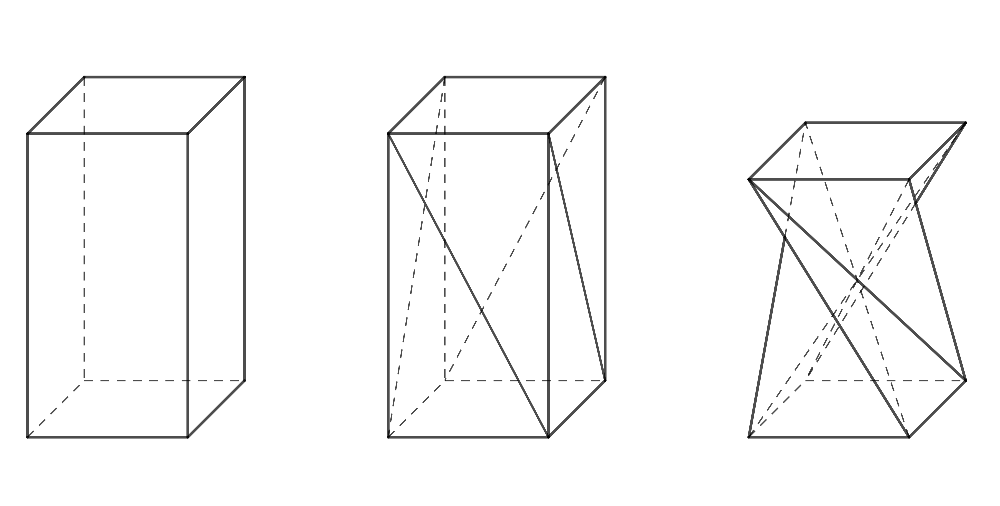
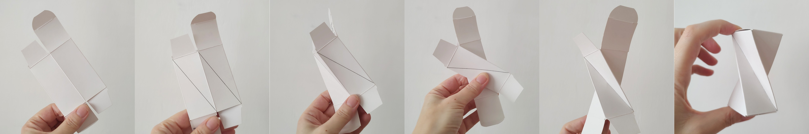
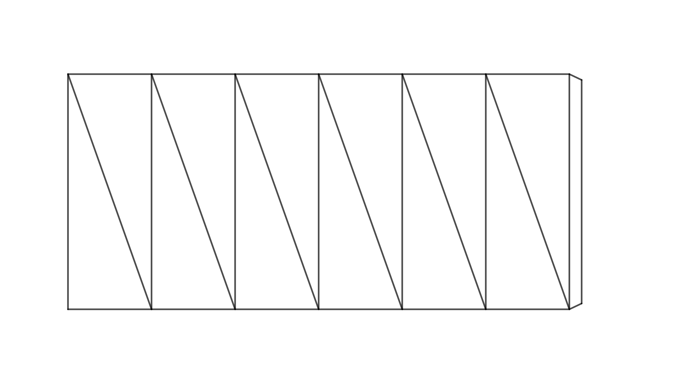
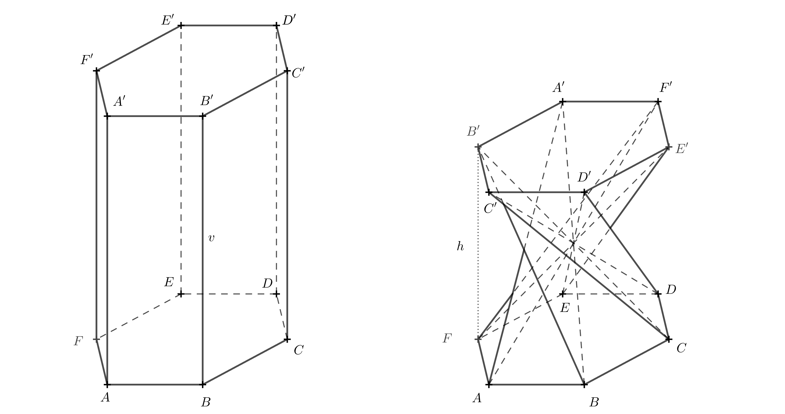
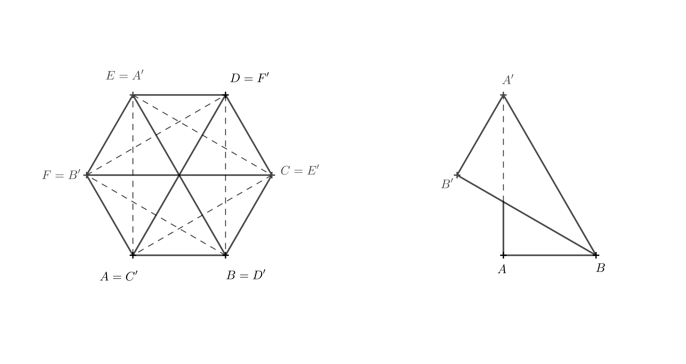
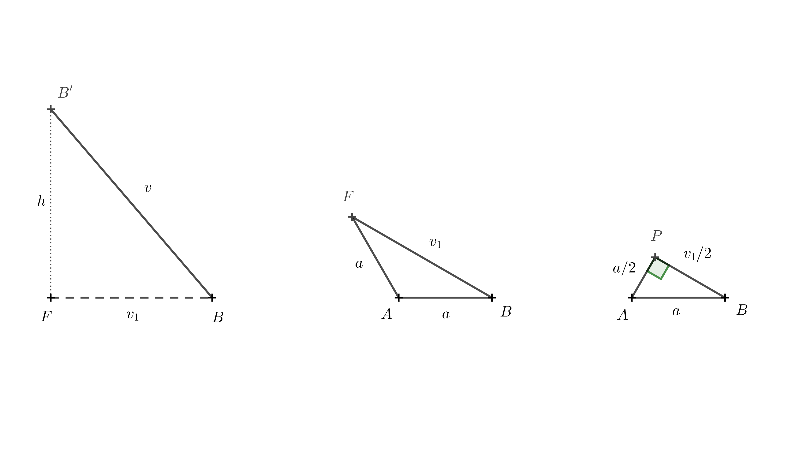
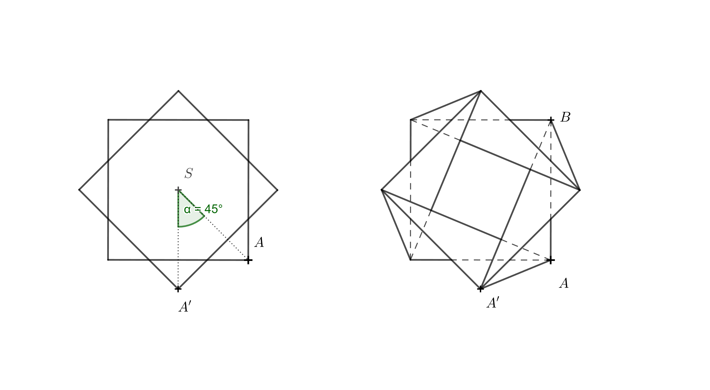
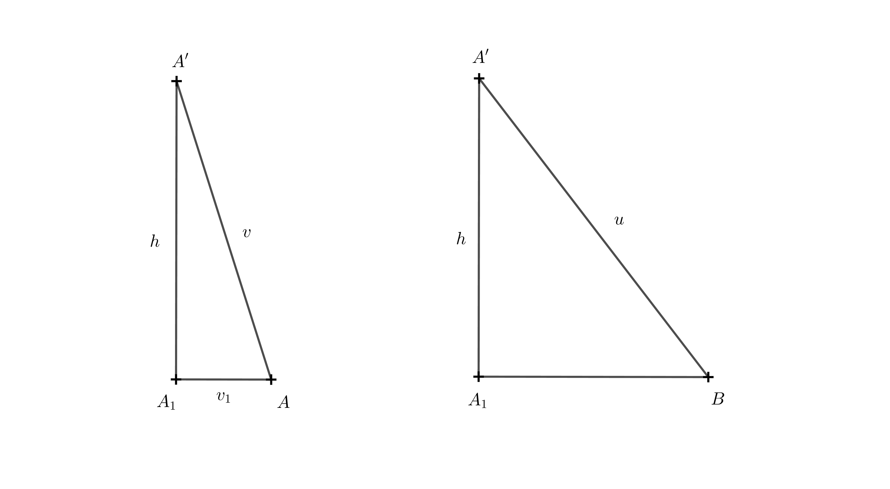
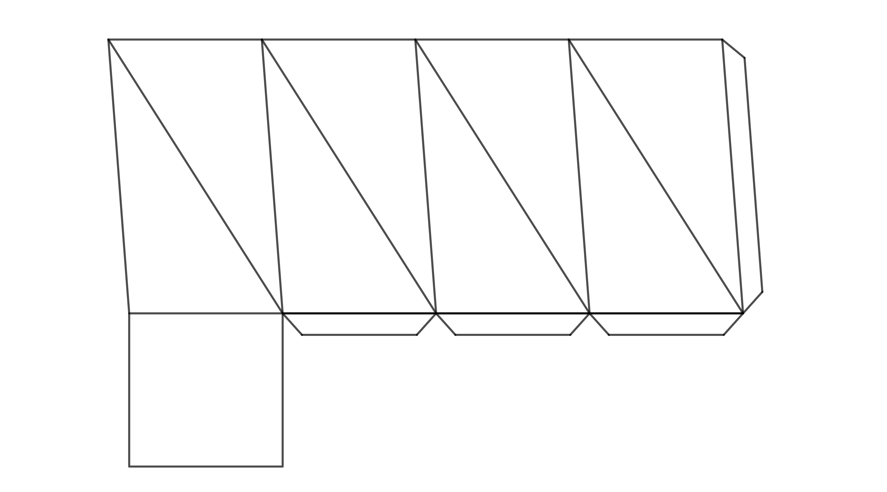

# Twisted prism

## Jak vytvořit twisted prism z kolmého čtyřbokého hranolu

 V designu skládacího nábytku se objevuje tvar, který je zajímavý z geometrického hlediska. Lze ho vytvořit z kolmého pravidelného čtyřbokého hranolu rozdělením každé boční stěny na 2 trojúhelníky pomocí jedné z úhlopříček a pootočením horní podstavy o $90°$ tak, jak na obrázku (současně dochází ke změně výšky hranolu). Je to vlastně speciální případ pootočeného či překrouceného hranolu (v angličtině twisted prism).

 

Zkuste si ho tento tvar vytvořit třeba z krabičky od sirupu nebo očních kapek. Je ovšem třeba, aby horní a dolní podstava byly čtvercové a daly se nějakým způsobem odklopit nebo rozložit. K vytvoření tohoto tvaru je třeba trochu praxe a zručnosti, protože ono pootočení o $90°$ nelze provést v praxi tak jednoduše.  

Postup:

* Odklopíme víčka krabičky a krabičku složíme do roviny (dvě boční stěny nahoře, dvě boční stěny dole).
* Všechny boční stěny rozdělíme úhlopříčkami v jednom směru tak jak je to na obrázku. Snažíme se při tom v papíru vytvořit rýhy.  
* Všechny vzniklé rýhy prolomíme mírně směrem dovnitř.
* Provedeme překřížení. To docílíme například tak, že spodní část přidržíme lehce jednou rukou, vrchní dolní část vezmeme, nadzvedneme a přesuneme směrem doleva.
* Nyní z roviny rozložíme krabičku opět do prostoru. Tento krok chce trochu cviku. Můžete ho provést například tak, že jednou rukou přidržte místo, kde nad sebou leží všechny zvýrazněné úhloříčky (stiskněte proti sobě dvěma prsty) zatímco druhou rukou se snažíte rozložit horní nebo dolní část do prostoru.
* Pokud se Vám předchozí krok podařil, zbývá už jen zavřít víčka krabičky a máte hotovo. Gratuluji!

   

Řekněme, že si chceme vytvořit židličku tohoto tvaru a najdeme několik vhodných kartonových krabic. Mají stejnou podstavu o délce hrany $40$ cm, ale různé výšky. Pro sezení máme odzkoušené, že nám vyhovuje výška židle $50$ cm. 

> **Úloha 1.** Jaká výška krabice by byla ideální pro výrobu židličky tvaru >čtyřbokého "twisted prism" o výšce $50$ cm? Hrana dolní podstavy je $a=40$ cm. 

*Řešení.* Původní boční hrana hranolu o délce $v$, výška židličky $h$ a hrana dolní podstavy $a$ tvoří pravoúhlý trojůhelník (viz obrázek). 

Podle Pythagorovy věty tedy platí 

$$
v = \sqrt{h^2 + a^2} = \sqrt{50^2 + 40^2} \doteq 64\,\text{cm}
$$. 

Kartonová krabice by v ideálním případě měla být vysoká $64$ cm.

## Další možnosti

Teď někoho možná napadá, šlo by obdobný tvar vytvořit i z kolmých hranolů jejichž podstava by byl jiný pravidelný $n$-úhelník? Odpověď zní ano, ale pokud bychom chtěli při jeho vytváření postupovat tak jak je uvedeno v postupu výše, pak by to šlo pouze pro sudá $n$ (pro lichá n by nebylo možné složení do roviny, jak je popsáno na začátku postupu). 

Vypočítejme totéž, co v prvním případě pro pravidelný kolmý šestiboký hranol, ale tentokrát obecně. Rozmyslete si nejdříve, o kolik stupňů v tomto případě horní podstava orotuje (tím současně opět dochází i ke změně výšky hranolu). Pokud prostorová představivost selhává vytvořte si jednoduchý model. Stačí pracovat se sítí pláště hranolu. Na následujícím obrázku je taková síť již připravená ke slepení (ideální je tvrdší papír). 

Před slepením vytvořte ohyby ve hranách a úhlopříčkách (ve hranách směrem nahoru, v úhlopříčkách směrem dolů). Po slepení složte do tvaru, který je na následujícím obrázku vlevo. Poté rozložte do prostoru, viz obrázek na pravo.

obrázek zatím chybí

> **Úloha 2.** Jak závisí výška $h$ šestibokého twisted prism (který vznikne z pravidelného kolmého šestibokého hranolu) na výšce původního hranolu $v$ a hraně $a$ dolní podstavy?

*Řešení.* K výpočtu je třeba znát úhel o který jedna podstava orotuje vzhledem k druhé. Ten lze určit z modelu popsaného výše. Následující prostorový obrázek sice úhel rotace prozrazuje, ale může být pro někoho nepřehledný. 

Jednodušší možná bude představit si, jak vypadá šestiboký twisted prism vzniklý z kolmého šestibokého hranolu při pohledu shora. Horní podstavu budeme brát nyní jako průhlednou. Hrany, které byly původně úhlopříčkami se protínají v jednom bodě a dělí šestiúhelník na 6 rovnostranných trojúhelníků (následující obrázek nalevo). Zaměříme se na jednu z těchto úhlopříček, třeba ve stěně $ABB'A'$ a označíme si příslušné body (viz obrázek napravo). Nyní je už jasné, že horní podstava orotovala o $120°$ vzhledem ke spodní podstavě. Díky tomu víme, že hrana $BB'$ leží nad hranou $BF$, $BF$ je vlastně kolmým průmětem hrany $BB'$. Délka hrany $BB'$ je $v$, proto délku $BF$ označíme $v_1$ 

$F,B,B'$ tvoří pravoúhlý trojúhelník. Pomocí Pythagorovy věty můžeme vyjádřit

$$
h = \sqrt{v^2 - (v_1)^2}
$$

Naším úkolem je vyjáhřit $h$ v závislosti na $v$ a $a$, zbývá tedy z trojúhelníku $ABF$ vyjádřit $v_1$ pomocí $a$. To můžeme udělat pomocí sinové či cosinové věty. Všechny vnitřní úhly trojůhelníka se dají jednoduše odvodit z předchozího obrázku nalevo, protože všechny vnitřní úhly rovnostranných trojúhelníků jsou 60°. 

Postupovat můžeme ale opět pomocí Pythagorovy věty. K vytvoření pravoúulého tojúhelníka stačí bodem $A$ vést výšku na stranu $AF$. Patu této výšky označíme $P$. Délka této výšky musí být $a/2$, protože trojúhelník $ABP$ je vlastně polovina rovnostranného trojúhelníku o straně $a$. Platí

$$
\frac{v_1}{2} = \sqrt{a^2 - (\frac{a}{2})^2} = \sqrt{\frac{3}{4}a^2} = \frac{a}{2}\sqrt{3}
$$

odkud dostáváme 

$$
v_1 = a\sqrt{3}
$$

Toto vyjádření nyní můžeme dosadit do vztahu pro  $h$, pak

$$
h = \sqrt{v^2 - (a\sqrt{3})^2} = \sqrt{v^2 - 3a^2}
$$

To už je hledané vyjádření výšky šestibokého twisted prism pomocí $v$ a $a$.

> **Úloha 3.** Jaká je omezující podmínka pro vznik modelů z předchozích dvou úloh?

*Řešení.* V první úloze musí být $v$ větší než $a$. Pokud by platila rovnost $v=a$, pak by $h=0$. Výška twisted prism by tedy byla nulová a hranol by šel složit do roviny, úhlopříčky původního hranolu by se ale stále protínaly v jednom bodě. Pokud by pro původní hranol platilo $v < a$, hranol by bylo možné složit do roviny, ale úhlopříčky by se neprotínaly v jednom bodě. 

Ve druhé úloze by obdobně muselo platit $v > |AE|$, tedy $v > \sqrt{3}a$. Pro $v=\sqrt{3}a$ by twisted prism mělo opět nulovou výšku a bylo složitelné do roviny.

## Jak postupovat pro liché $n$?

Už bylo zmíněno, že pro liché $n$ nelze postupovat tak jak dosud. Rozdíl je ale pouze v tom, že po vytvoření sítě pláště není vhodné lepit spoj v boční hraně předtím než než vytvoříme chtěný tvar. Postup je opačný, nejdříve síť upravíme do tvaru twisted prism a teprve poté slepíme boční hranu.

## Jak postupovat pro jiný úhel otočení?

Co kdybychom chtěli vyrobit tvar podobný tomu z prvního příkladu, ale použít ho jako vázičku na suché květiny nebo stojan na tužky? Nevyhovuje nám v tom případě, že se 4 hrany twisted prism (bývalé úhlopříčky stěn kolmého hranolu) uprostřed hranolu protínají. Naopak chceme, aby uvnitř vznikl volný prostor. Proto potřebujeme zmenšit úhel rotace jedné podstavy vzhledem k druhé. 

> **Úloha 4.** Sestrojte síť vázy tvaru twisted prism, jestliže je dána výška vázy $h$ cm, hrana čtvercové podstavy $a$ a úhel rotace horní hrany vázy oproti dolní podstavě je $\alpha=45°$. Tentokrát nic nepočítejte, pouze rýsujte. Délky $h$ a $a$ si vhodně zvolte.

*Řešení.* Pro vytvoření sítě potřebujeme znát délku hrany $AA'$ a délku hrany $BA'$. Nakresleme si nejdříve pohled shora na dolní podstavu a horní okraj pootočený o $45°$, a poté všechny hrany (viz obrázek). Kreslit všechny hrany není třeba, pro konstrukci je důležitá spojnice $AA'$ a $BA'$. Je třeba si také uvědomit, že při pohledu shora pro kolmý průmět $A_1$ bodu $A'$ platí $A_1=A'$.    

$|AA'|$ můžeme získat jako přeponu v pravoúhlém trojúhelníku $AA'A_1$, délku $AA_1$ odměříme z předchozího obrázku a výšku $h$ si máme zvolit. Obdobně $|BA'|$ je přeponou v trojúhelníku $BA'A_1$.

Nyní máme vše potřebné, pro sestrojení sítě čtyřbokého twisted prism.

